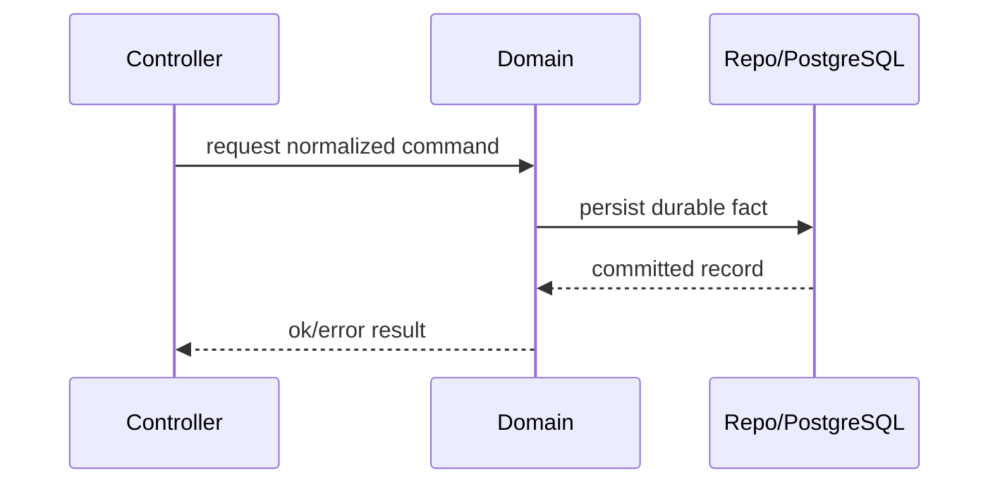

# BullX Design Docs

## Purpose

A BullX design doc tells a coding agent two things: the system that exists now, and the system to build. The committed doc is the implementation source of truth, not a debate transcript, roadmap, or tutorial.

The primary reader is a coding agent. The secondary reader is a senior engineer who reviews or maintains the design. Optimize for both: an agent must be able to execute without inventing architecture, and a human reviewer must be able to audit the decision and its surfaces quickly.

Use this skill when the deliverable is a new or revised design doc. Do not invoke it to read, summarize, or answer questions about an existing doc; read the file directly.

Write a full design doc when the design is ambiguous, cross-cutting, expensive to reverse, or likely to require senior review. For narrow fixes or obvious changes, prefer a mini design doc or an inline plan.

## Workflow

1. Read the user draft, notes, or scope first. Preserve explicit decisions unless they contradict `AGENTS.md` or the request.
2. Read repo-root `AGENTS.md`, then inspect the modules, schemas, migrations, routes, tests, and docs the user names.
3. Search for existing utilities, patterns, contracts, and design docs before proposing new entities or abstractions.
4. Decide whether the task needs a full design doc, a mini design doc, a review, or a focused edit. Keep output proportional to ambiguity and implementation risk.
5. Identify the smallest coherent scope by answering, in order:
   - What system exists now?
   - What system should exist after this change?
   - What invariant must remain true?
   - What is intentionally out of scope?
   - What command verifies the implementation?
6. Draft from summary toward lower-level detail. Put the decision and its reason in the first paragraph.
7. Use `references/design-doc-template.md` as a menu, not a checklist. Delete every section that carries no information.
8. Add an `Implementation` section when the doc drives execution. State ordered steps, the files each step owns, a local acceptance check per step, and a verification command (default `bun precommit`).
9. Run an editing pass with `references/writing-rules.md` before returning a shareable document.
10. If the user asked for a review rather than a rewrite, report omissions, contradictions, and harmful ambiguities before any style edits.
11. If implementation invalidates a design assumption before shipping, update the doc. After shipping, prefer a linked follow-up note over silently rewriting history.

## Document shape

The committed doc records current intended design. Drop anything that does not serve a coding agent who needs to know the current system and the target system.

Do not include:

- alternatives, rejected options, or comparisons against designs that were not chosen;
- status, owner, author, contact, or proposal-stage metadata;
- timelines, future-roadmap sections, release schedules, or speculative phase lists;
- abstract goal lists when the summary already states the decision;
- meta-writing about the drafting process;
- placeholder prose, empty headings, or TODO theater.

Keep:

- the decision and its reason, near the top;
- the existing-system surfaces the design touches;
- the target system, in implementation-facing terms;
- concrete module, file, schema, process, API, and test names when known or safely inferred;
- diagrams only when they reduce ambiguity;
- open questions only for behavior-changing ambiguity.

## BullX-specific constraints

Use BullX vocabulary and boundaries:

- Use `Installation`, not SaaS-style `Tenant`, unless a design doc explicitly introduces a different boundary.
- Use `Principal`, `Agent`, `Signal`, `Admission`, `Work`, `Mission`, `Capability`, `Intent`, `Governance`, `Effect`, `Outcome`, and `Brain` per repo guidance.
- Do not recreate deleted legacy subsystems or compatibility shims without an explicit design source.
- Do not encode long-term table design, queue topology, adapter inventory, or runtime process models as implemented facts unless the design doc is defining them.
- PostgreSQL is durable truth. Process-local state must be described as ephemeral and reconstructible unless the design explicitly changes that invariant.
- Generate UUIDv7 primary keys through `BullX.Ext.gen_uuid_v7/0` or `BullX.Ecto.UUIDv7`, not database-side random UUID defaults.

## First-principles filter

Before adding detail, apply this filter:

- No new entity, table, process, abstraction, dependency, or public contract without a concrete responsibility.
- Reuse or delete before inventing.
- Edge-case handling should match ROI and the stated guarantee. More handling is not automatically better.
- A weaker explicit guarantee is better than a stronger guarantee the implementation cannot maintain.
- If no OTP failure boundary changes, do not propose supervision-tree changes.
- If a tradeoff is already settled, evaluate consistency inside it instead of relitigating it.

## Error and failure behavior

When the design changes error handling, validation, APIs, background jobs, external effects, or operator recovery, make the failure behavior explicit:

- Identify what fails, who observes the failure, and what durable record or log captures it.
- Avoid silent failure paths.
- Preserve root-cause information for operators without leaking secrets or private data.
- State retry, idempotency, rollback, and manual recovery only when the design changes them.

## Diagrams

Use diagrams only when they reduce ambiguity. Sequence diagrams help for controller/domain/storage paths, signal admission, governance/effect flow, external capability execution, and restart/reconstruction behavior. Prefer Mermaid in text docs.

Example:

Keep diagrams structural. Do not add decorative diagrams or diagrams that merely restate adjacent prose.

## Quality bar

A finished design doc lets a coding agent implement without inventing architecture, and lets a human reviewer see the chosen scope, public contracts, data and runtime changes, failure behavior, and verification path quickly.

Reject or revise content that is:

- alternatives, rejected options, or proposal-stage scaffolding;
- generic senior-engineer advice;
- schedule planning instead of design intent;
- meta-writing about the drafting process;
- broad architecture not required by the task;
- compatibility scaffolding without a caller;
- unbounded future-proofing;
- generic risks-and-mitigations that name no BullX-specific failure mode;
- empty headings, TODO theater, or placeholder prose.
