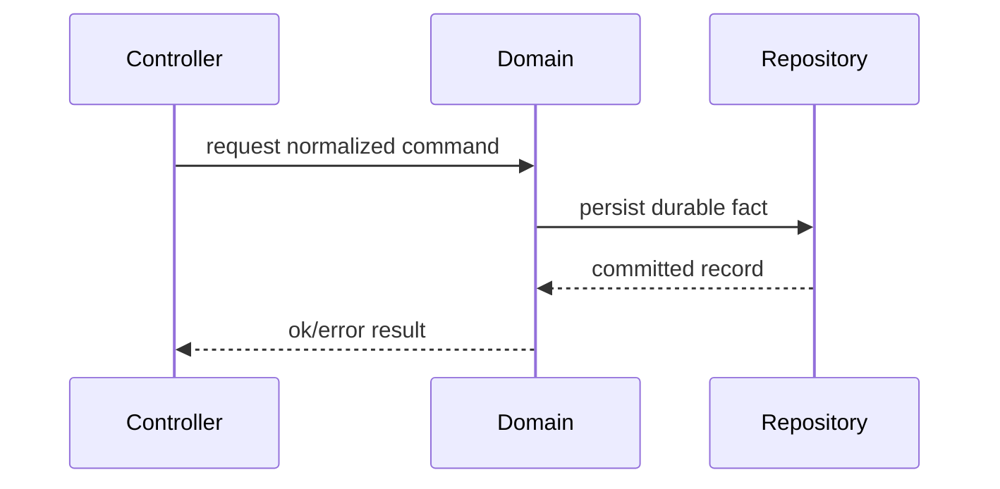

# Design Docs

## Purpose

A design doc tells a coding agent what system to build and what constraints must remain true. A shareable doc is the implementation source of truth, not a debate transcript, roadmap, or tutorial.

The primary reader is a coding agent. The secondary reader is a senior engineer who reviews or maintains the design. Optimize for both: an agent must be able to execute without inventing architecture, and a human reviewer must be able to audit the decision and its surfaces quickly.

Use this skill when the deliverable is a new or revised design doc. Do not invoke it to read, summarize, or answer questions about an existing doc; read the file directly.

Write a full design doc when the design is ambiguous, cross-cutting, expensive to reverse, or likely to require senior review. For narrow fixes or obvious changes, prefer a mini design doc or an inline plan.

DO NOT USE THIS SKILL TO SIMPLY READ, INSPECT, SUMMARIZE, COMPARE, OR ANSWER QUESTIONS ABOUT EXISTING DESIGN DOCS. READ THOSE FILES DIRECTLY. And do not use it to write or revise non-design-doc deliverables or design doc drafts.

## Workflow

1. Read the user draft, notes, or scope first. Preserve explicit decisions unless they contradict `AGENTS.md` or the request.
2. Read repo-root `AGENTS.md`, then inspect the modules, schemas, migrations, routes, tests, and docs the user names.
3. Search for existing utilities, patterns, contracts, and design docs before proposing new entities or abstractions.
4. Decide whether the task needs a full design doc, a mini design doc, a review, or a focused edit. Keep output proportional to ambiguity and implementation risk.
5. Identify the smallest coherent scope by answering, in order:
   - What input does the system receive?
   - What fact or state does it own?
   - What output or handoff does it produce?
   - What invariant must remain true?
   - What command verifies the implementation, if implementation is in scope?
6. Draft from summary toward lower-level detail. Put the decision and its reason in the first paragraph.
7. Use `references/design-doc-template.md` as a menu, not a checklist. Delete every section that carries no information.
8. Add an `Implementation` section only when the doc directly drives code changes. Describe dependency order, owned files, local acceptance checks, and verification commands. Do not turn dependency order into a product phase plan.
9. Run an editing pass with `references/writing-rules.md` before returning a shareable document.
10. If the user asked for a review rather than a rewrite, report omissions, contradictions, and harmful ambiguities before any style edits.
11. If implementation invalidates a design assumption before shipping, update the doc. After shipping, prefer a linked follow-up note over silently rewriting history.

## Document shape

The committed doc records current intended design. Drop anything that does not serve a coding agent who needs to build or maintain that design.

Do not include:

- alternatives, rejected options, or comparisons against designs that were not chosen;
- status, owner, author, contact, or proposal-stage metadata;
- timelines, future-roadmap sections, release schedules, or speculative phase lists;
- implementation phases or "V1/V2" framing unless the product itself has explicit versioned behavior;
- abstract goal lists when the summary already states the decision;
- meta-writing about the drafting process;
- placeholder prose, empty headings, or TODO theater.

Keep:

- the decision and its reason, near the top;
- the input, owned facts or state, output, and handoff points;
- the implementation-facing surfaces the design actually touches;
- concrete module, file, schema, process, API, and test names when known or safely inferred;
- diagrams only when they reduce ambiguity;
- open questions only for behavior-changing ambiguity.

## Project Constraints

Use the project vocabulary and boundaries already present in the user request, repository guidance, and named source documents.

- Do not import domain vocabulary from unrelated docs, old branches, prior drafts, or memory unless the user explicitly asks for that continuity.
- Do not introduce new product concepts, registries, lifecycle states, governance layers, observability layers, audit trails, or ownership models for completeness.
- Do not recreate deleted legacy subsystems or compatibility shims without an explicit design source.
- Do not encode long-term table design, queue topology, adapter inventory, or runtime process models as implemented facts unless the design doc is defining them.
- Treat repository guidance about durable truth, process-local state, IDs, and storage as constraints when it exists; do not invent those constraints in a neutral doc.

## First-principles filter

Before adding detail, apply this filter:

- No new entity, table, process, abstraction, dependency, or public contract without a concrete responsibility.
- Reuse or delete before inventing.
- Edge-case handling should match ROI and the stated guarantee. More handling is not automatically better.
- A weaker explicit guarantee is better than a stronger guarantee the implementation cannot maintain.
- If no runtime failure boundary changes, do not propose process or supervision changes.
- If a tradeoff is already settled, evaluate consistency inside it instead of relitigating it.

## Error and Failure Behavior

Describe failure behavior only when the design changes validation, retries, external effects, persistence, or user-visible recovery.

- Identify what fails and what the caller or user sees.
- Avoid silent failure paths.
- State retry, idempotency, rollback, or manual recovery only when the design changes them.
- Do not add operator workflows, logs, metrics, observability, audit records, or forensic detail unless they are product requirements or required by the changed behavior.

## Diagrams

Use diagrams only when they reduce ambiguity. Sequence diagrams help for request/domain/storage paths, external calls, state transitions, and restart or reconstruction behavior. Prefer Mermaid in text docs.

Example:

Keep diagrams structural. Do not add decorative diagrams or diagrams that merely restate adjacent prose.

## Quality bar

A finished design doc lets a coding agent implement without inventing architecture, and lets a human reviewer see the chosen scope, touched contracts, data or runtime changes, and verification path quickly.

Reject or revise content that is:

- alternatives, rejected options, or proposal-stage scaffolding;
- generic senior-engineer advice;
- schedule planning instead of design intent;
- phase planning instead of dependency order;
- meta-writing about the drafting process;
- broad architecture not required by the task;
- compatibility scaffolding without a caller;
- unbounded future-proofing;
- observability, audit, governance, or operator material without a product requirement;
- generic risks-and-mitigations that name no specific changed behavior;
- empty headings, TODO theater, or placeholder prose.
