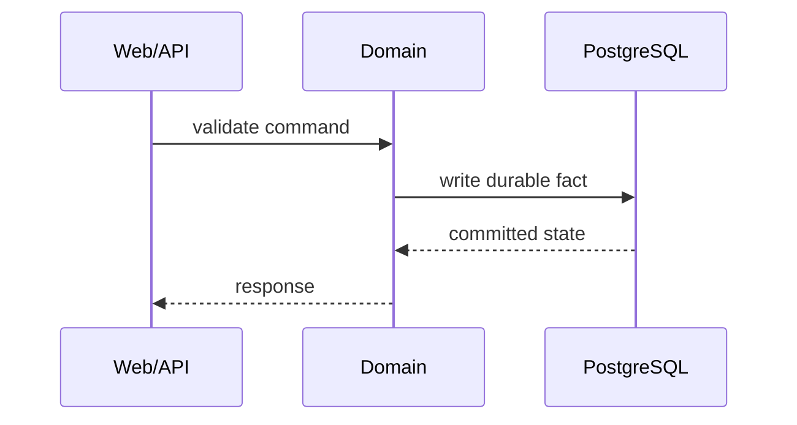

# BullX Design Doc Template

Use this as a starting structure. Remove sections that do not carry information for the current design.

## Title

Use the feature, subsystem, or invariant name. Avoid vague titles such as "Implementation Plan".

## Summary

State the design decision, the reason for the decision, and the implementation surface in one short paragraph. Busy readers should understand whether they need to keep reading. Do not build suspense; put the conclusion first.

## Prerequisites

- State assumed knowledge beyond senior Elixir/Rust/React competence when it changes how the reader should interpret the design.
- Link or name prerequisite docs instead of restating them.
- If implementation will be driven from this document, point readers to `Implementation Handoff`.

## Scope

- State what this document covers.
- State only realistic non-scope items. Do not list things no reader would expect this document to cover.
- If useful, state the appetite as a scope or complexity budget. Treat appetite as a constraint on the solution, not as a schedule commitment or estimate.
- State how constrained the solution space is when existing code, APIs, data, operations, or product decisions materially limit the design.

## Context

Use this section only when background changes implementation decisions or review scope. If included, state the current problem, existing code/doc context, and the user-visible or operator-visible goal without turning the document into a proposal transcript.

## Goals

- List concrete technical outcomes.
- State the user story or operational story the design supports.
- Identify the durable fact, runtime behavior, or public contract being introduced or changed.

## Non-Goals

- Exclude plausible work that is intentionally out of scope.
- Name no-gos that would otherwise pull the design into unnecessary complexity.
- Call out settled tradeoffs that should not be relitigated during implementation.

## Existing System

- Name relevant modules, schemas, migrations, routes, components, packages, tests, and docs.
- Identify reusable utilities and patterns.
- Identify dead or obsolete code that should be deleted.

## Design

Start with an overview, then describe the chosen design in implementation-facing terms:

- domain concepts and responsibilities;
- public APIs and module boundaries;
- persistence changes and constraints;
- process/runtime behavior and failure boundaries;
- web/API/UI surfaces;
- external integrations or capability boundaries;
- i18n, config, telemetry, or OpenAPI changes if relevant.

Use diagrams when they clarify flow:

Prefer text, tables, dependency graphs, and sequence diagrams. Use rough visual sketches only when text cannot communicate an interaction or UI affordance clearly. Do not add high-fidelity mockups, screenshots, or prototypes by default; they can over-specify choices that should remain open during implementation.

## Alternatives Considered

Include this section for every full design doc. Compare alternatives that a reasonable reviewer would expect, including reuse, doing nothing, or the locally obvious competing design when relevant. Compare each alternative against the goals, non-goals, operational cost, implementation cost, and BullX invariants. Delete this section only for a mini design doc or inline plan with no meaningful design choice.

## Data And Persistence

- List new or changed tables, columns, indexes, constraints, enum types, ranges, JSONB payloads, and migrations.
- State where UUIDv7 IDs are generated.
- State transaction boundaries and consistency guarantees.
- State what is reconstructible and what is durable truth.

## Runtime And Operations

- Identify OTP processes, supervision changes, queues, background jobs, or NIF boundaries only when the design actually changes them.
- State restart/reconstruction behavior.
- State observability, telemetry, logs, and operator recovery paths.

## Error And Failure Behavior

- State how the design reports validation failures, API errors, background job failures, external provider failures, and operator-facing failures.
- Avoid generic "server error" behavior when the design can preserve useful cause information.
- State where error codes, logs, audit records, or retry metadata live when relevant.
- State which failures are retried, ignored, surfaced to a Principal, or require manual recovery.

## Security, Privacy, Governance, Accessibility

Keep only relevant subsections:

- authorization and Principal responsibility;
- risky outbound effects and Governance requirements;
- secret handling and external credentials;
- audit records and retention;
- privacy-sensitive data handling;
- accessibility requirements for user-facing UI.

## Implementation Handoff

Use this section when the document should also work as a `PLANS.md`-style artifact for Codex or a human implementer. Delete the section for a pure design record.

### Goal

State the concrete implementation outcome. If the summary already states it clearly, reference the summary instead of repeating it.

### Context Pointers

- List relevant files, modules, migrations, docs, tests, examples, errors, and external systems.
- Link to `AGENTS.md` or subsystem rules instead of restating durable repository guidance.
- State assumptions that prevent implementation from inventing missing architecture.

### Constraints

- Name architecture, safety, security, privacy, governance, performance, i18n, or compatibility constraints that bound the implementation.
- Name forbidden shortcuts, such as compatibility shims without callers or database-side UUID defaults.

### Tasks

For each task, prefer the following shape:

- Task: Start with an imperative verb.
- Owns: Name files, modules, or subsystem surfaces.
- Depends on: Name prerequisite tasks or state `None`.
- Acceptance: State the local behavior or artifact that proves the task is complete.
- Verify: Name the command, test, review action, or inspection needed.

### Done When

- List observable behavior, tests, migrations, docs, and review checks that prove completion.
- Name exact commands when known. Default to `bun precommit` for BullX unless a narrower command is sufficient.
- State when implementation should stop and ask a targeted question because an ambiguity changes behavior, persistence, security, or failure handling.

## Acceptance Criteria

Use this section for design-level acceptance. Use `Implementation Handoff > Done When` for execution-completion checks.

- List behavior that must be true after implementation.
- Name tests or commands expected to verify the result.
- Include migration, rollback, or data integrity checks when relevant.

## Risks And Tradeoffs

Report omissions, contradictions, harmful ambiguities, rabbit holes, and deliberate tradeoffs. A rabbit hole is a detail likely to consume disproportionate design or implementation effort unless the doc bounds it. For deliberate tradeoffs, explain the chosen guarantee and why it is acceptable for BullX now.

## Open Questions

Include only questions that change behavior, public contracts, persistence, or failure handling. Remove this section if there are no such questions.

## Maintenance

Use this section only when the document needs an explicit update path.

- State when implementation must update the doc because code invalidates a design assumption.
- Link follow-up design notes when shipped behavior diverges from the original decision.
