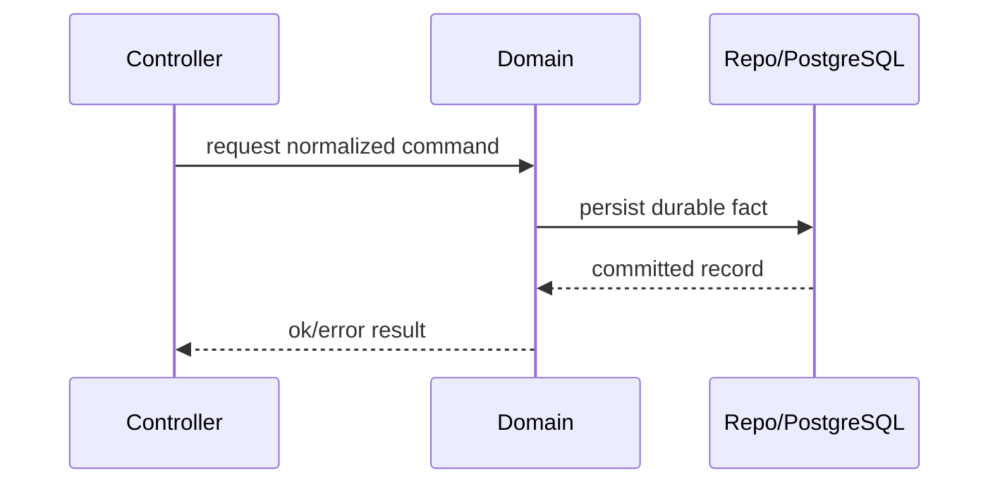

# BullX Design Docs

## Purpose

Produce shareable BullX design docs for Coding Agents and human senior engineers. A committed BullX design doc records current intended design, not a proposal status, roadmap, tutorial, or transcript of the drafting process.

Design docs are useful when the design is ambiguous, cross-cutting, expensive to reverse, or likely to require senior review. If the requested change is obvious and narrow, prefer a mini design doc or inline plan unless the user explicitly asks for a full document.

The document should make the selected software design easier to review, implement, and maintain. It should expose the problem, the chosen high-level implementation strategy, the tradeoffs, and the reason the design is worth writing down.

Codex may be one reader, but never the only reader. A BullX design doc may include implementation handoff detail, but the committed artifact must still read as a design record for humans.

## Workflow

1. Read the user draft or notes first. Preserve explicit decisions unless they contradict the requested scope or `AGENTS.md`.
2. Decide whether the task needs a full design doc, a mini design doc, a review, or a focused edit. Keep the output proportional to the ambiguity and implementation risk.
3. Read the repo-root `AGENTS.md` before writing, then inspect any files, modules, tests, migrations, or existing docs named by the user.
4. Search for existing utilities, patterns, public contracts, schemas, runtime boundaries, and design docs before proposing new entities or abstractions.
5. Identify the smallest coherent scope:
   - What problem or feature is actually being designed?
   - Does a baseline story change the design, or can it be omitted?
   - What appetite or complexity budget constrains the solution?
   - How constrained is the solution space by existing code, APIs, data, operations, or product decisions?
   - What can be deleted or reused?
   - What code path, process, schema, Signal, Intent, Effect, or public contract changes?
   - What invariant must remain true?
   - What rabbit holes and no-gos must be named to keep scope tractable?
   - What command will verify the implementation?
6. Do not add status, owner, author, contact, or proposal/current-state metadata. In this repository, committed design docs have one status: current intended design.
7. Draft from summary and scope toward lower-level implementation detail. Put the key decision and reason near the top.
8. Include alternatives considered for full design docs. At minimum, address plausible alternatives such as reuse, doing nothing, or the locally obvious competing design.
9. Add an implementation handoff when the doc will guide Coding Agents or human implementers. Use explicit goal, context pointers, constraints, ordered tasks, done-when criteria, and verification commands.
10. Edit with `references/writing-rules.md` when polishing prose, reviewing a draft, or producing a shareable document.
11. Delete unused sections, placeholders, meta-writing, abandoned alternatives, and explanations a competent senior Elixir/Rust/React engineer would already know.
12. If implementation invalidates a design assumption before shipping, update the design doc. After shipping, prefer a linked follow-up note over silently rewriting history.
13. If the user asked for a review rather than a rewrite, report omissions, contradictions, and harmful ambiguities before style edits.

## Document Shape

Use `references/design-doc-template.md` when creating a new doc or when the existing draft has no usable structure. Treat it as a menu, not a mandatory checklist. Use `references/writing-rules.md` for the editing pass.

Keep the final doc focused on the current design intent:

- Include technical goals, non-goals, architectural changes, implementation outline, task breakdown, acceptance criteria, and relevant operational/security/privacy/accessibility considerations.
- Include concrete module, file, schema, process, API, and test expectations when they are known or can be inferred safely from the codebase.
- Include enough context to make the decision understandable after six months of code changes. Link or name supporting docs instead of restating them.
- When the document should guide implementation, include an `Implementation Handoff` section that works as a bounded execution plan rather than a conversational prompt.
- Use dependency graphs, flow diagrams, or sequence diagrams when they make interactions clearer. Prefer Mermaid for text docs.
- If Shape Up ideas help, translate them into the existing design-doc structure instead of adding a separate pitch template: baseline in `Context`, appetite in `Scope`, no-gos in `Non-Goals`, and rabbit holes in `Risks And Tradeoffs`.
- Prefer current-state and implementation-facing language. Avoid timelines, future-roadmap sections, release schedules, speculative "phase 2" lists, and vague "future work" unless the user explicitly asks.
- Keep open questions only for behavior-changing ambiguities. Do not use open questions as a dumping ground for nice-to-have uncertainty.

## Implementation Handoff

When a design doc doubles as a `PLANS.md`-style execution artifact, make the handoff useful for both Codex and humans:

- State `Goal`, `Context Pointers`, `Constraints`, `Tasks`, and `Done When` explicitly.
- Name the repo paths, docs, examples, errors, migrations, modules, routes, tests, and commands that matter.
- Keep durable repository rules in `AGENTS.md`; reference those rules instead of duplicating them.
- Break implementation into ordered, reviewable tasks with dependencies, file ownership, and per-task acceptance checks.
- Mark tasks as design-time work items, not live status. Do not use fake progress states such as "in progress" in committed design docs.
- Specify verification commands and expected evidence. For BullX, default to `bun precommit` unless a narrower command is justified.
- Identify where Codex should stop and ask a targeted question because the ambiguity changes behavior, persistence, security, or failure handling.
- Avoid instructing Codex to produce preambles, status chatter, or an upfront conversational plan during rollout. The design doc is the plan; the implementation agent should execute, verify, and summarize outcomes.

## BullX-Specific Constraints

Use BullX vocabulary and boundaries:

- Use `Installation`, not SaaS-style `Tenant`, unless a design doc explicitly introduces a different boundary.
- Use `Principal`, `Agent`, `Signal`, `Admission`, `Work`, `Mission`, `Capability`, `Intent`, `Governance`, `Effect`, `Outcome`, and `Brain` according to the repo guidance.
- Do not recreate deleted legacy business subsystems or compatibility shims without an explicit design source.
- Do not encode long-term table design, queue topology, adapter inventory, or runtime process models as implemented facts unless the design doc is specifically defining them.
- PostgreSQL is durable truth. Process-local state must be described as ephemeral and reconstructible unless the design explicitly changes that invariant.
- If a UUID primary key is involved, specify BullX-side UUIDv7 generation through `BullX.Ext.gen_uuid_v7/0` / `BullX.Ecto.UUIDv7`, not database-side random UUID defaults.

## First-Principles Filter

Before adding detail, apply this filter:

- No new entity, table, process, abstraction, dependency, or public contract without a concrete responsibility.
- Reuse or delete before inventing.
- Edge-case handling should match ROI and the stated guarantee. More handling is not automatically better.
- A weaker explicit guarantee is better than a stronger guarantee the implementation cannot maintain.
- If no OTP failure boundary changes, do not propose supervision tree changes.
- If a tradeoff is already settled, evaluate consistency inside that tradeoff instead of relitigating it.

## Error And Failure Behavior

When the design changes error handling, validation, APIs, background jobs, external effects, or operator recovery, make the failure behavior explicit:

- Identify what fails, who observes the failure, and what durable fact or log records it.
- Avoid silent failure paths.
- Preserve root-cause information for operators without leaking secrets or private data.
- Specify user-facing or developer-facing error messages when wording affects behavior.
- State retry, idempotency, rollback, and manual recovery behavior only when the design actually changes them.

## Diagrams

Use diagrams only when they reduce ambiguity. Sequence diagrams are useful for controller/domain/storage paths, signal admission, governance/effect flow, external capability execution, and restart/reconstruction behavior.

Example shape:

Keep diagrams structural. Do not add decorative diagrams or diagrams that merely restate adjacent prose.

## Editing Pass

Before returning a shareable document, run a reduction pass with `references/writing-rules.md`. Keep only sections that support the stated scope, make the first paragraph carry the decision, and remove wording that belongs in a prompt transcript rather than a design record.

## Quality Bar

The finished design doc should let a Coding Agent implement without inventing architecture. It should also let a human reviewer see the chosen scope, public contracts, data/runtime changes, risks, and verification path quickly.

Reject or revise content that is:

- generic senior-engineer advice;
- schedule planning instead of design intent;
- meta-writing about the drafting process;
- broad architecture not required by the task;
- compatibility scaffolding without a caller;
- unbounded future-proofing;
- generic "risks and mitigations" that do not name a BullX-specific failure mode;
- empty headings, TODO theater, or placeholder prose.
