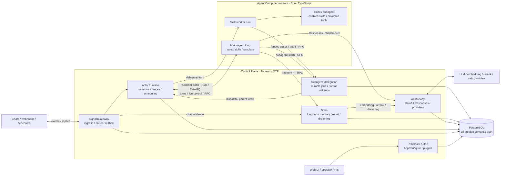

# Ankole - 共有 AI 同僚のためのオープン AgentOS

[](LICENSE)


[](https://deepwiki.com/AgentBull/ankole)

[English](./README.md) | [简体中文](./README.zh-Hans.md)

[他と違うところ](#ankole-が他と違うところ) · [プロダクト形態](#プロダクト形態) · [Actor Runtime](#actor-runtime) · [アーキテクチャ](#アーキテクチャ) · [現状](#現状) · [開発](#開発)

**Ankole は、共有 AI 同僚を動かすための、セルフホスト可能な AgentOS です。** 1 つの installation、複数の agent、実際の責任 — 自分が管理する infrastructure の上で。

AI の仕事を個人用チャット欄から出し、仕事が実際に起きている場所へ置きます。チャンネル、リポジトリ、スケジュール、ダッシュボード、社内システム、長期プロジェクトの文脈がその場所です。Ankole agent は、自分の identity、memory、permission、tool、workspace、responsibility boundary を持ち、**進行中の work を所有**でき、一回限りのメッセージへの回答にとどまりません。

[Claude Tag](https://claude.com/product/tag) は分かりやすい公開参照です。Slack thread で AI を tag し、共有文脈を読ませ、組織の tools を使わせ、channel context を記憶し、時間のかかる work を follow up させる。Ankole はその pattern をより open で広い形にします。**Slack だけでも、Claude だけでも、1 つの agent だけでも、vendor-owned context でもありません。**

Ankole が向いているのは、答えだけでなく責任者が必要な仕事です。よい Ankole role には見える結果があります。Code が merge される、report が shipped される、customer issue が handled される、alert が triaged される、market change が noticed される、backlog が worked down される、といった結果です。

## Ankole が他と違うところ

- **デフォルトで共有、個人チャットではない。** Agent は team-visible な channel や provider context に参加し、複数の人間が同じ work を observe、steer、continue できます。
- **永続 ID、prompt の慣習ではない。** 人間と agent は Principal で、permission grants と audit trail を持ち、authorization は runtime の関心事です。
- **長時間の actor session、request/response ではない。** Session は wake、signal 受信、checkpoint、stream progress、hibernate、context を保ったまま recover します。
- **運用者所有の文脈、vendor-hosted ではない。** Memory、configuration、credentials、audit は自ホスト環境の自分の infrastructure にあります。
- **Live 制御と durable な真実の両立、どちらかではない。** ZeroMQ RuntimeFabric が actor/worker/RPC の live トラフィックを運び、PostgreSQL は replay、fence、final commit の source であり続けます。

## Ankole が加えるもの

- **複数の入力元。** IM、webhook、scheduled reminder、internal system、将来の provider adapter は normalized signal input になります。
- **複数の agent。** 1 つの Ankole 環境で、異なる mission、access、tools、memory、outbound identity を持つ複数の agent を動かせます。
- **Session actors.** 長期実行単位は `actor_id = {agent_id, session_id}` です。Session は context、workspace state、steering、cancel、recovery が交わる場所です。
- **自分の文脈。** Conversation、model turn、summary、signal projection、decision、correction、将来の domain record は自分の infrastructure に残ります。
- **運用者による制御。** Access、configuration、plugin activation、actor lease、outbox side effect、audit surface は Ankole を運用する側が管理します。

## プロダクト形態

Ankole は、次のような workflow を自然にするためのものです。

- **coding agent** が issue を監視し、bug を再現し、code を変更し、draft PR を開き、人間の decision が必要な点を報告する。
- **customer-success agent** が shared group chat を観察し、重要な facts を記録し、work state を更新し、必要な時だけ private escalation する。
- **research agent** が market、policy、competitor、internal notes を監視し、重要な変化があった時に follow up する。
- **QA agent** が test backlog を進め、evidence を集め、context 付きの failure を review に渡す。
- **operations agent** が alert を監視し、runbook を準備し、risk の高い action の前に approval を求める。

共通する形は「この質問に答える」ではなく、**「この seat を持ち、利用可能な context を使い、結果で評価される」**です。

## Actor Runtime

Ankole は、長時間の AI work のための actor-oriented runtime です。各 active session は addressable virtual actor です。Wake、message receive、checkpoint、stream progress、hibernate、recover、continue ができ、agent を単なる HTTP request や queue job として扱いません。

Runtime は 5 つの technical bets に基づきます。

- **Virtual Actors for AI work.** Session は address、state、mailbox、lifecycle、recovery path を持つ work identity であり、散らばった background work ではありません。
- **OTP Supervision Trees as failure domains.** 1 つの agent が hang、timeout、crash しても、Ankole はその branch を isolate または restart し、環境全体の failure に広げません。
- **ZeroMQ Activation Fabric for live control.** Wakeup、steering、checkpoint、streaming、backpressure は low-latency routing layer を通り、agent が作業中でも誘導や介入ができます。
- **Agent Computer as execution substrate.** LLM loop、tools、MCP servers、files、terminal state、streaming output は、workspace に近い Bun + TypeScript computer 内で動きます。
- **Durable Ledger for recovery and audit.** Mailbox、turn、reminder、decision、committed side effects は process より長く残ります。Streaming は progress であり、commit された work が truth です。

ユーザーと運用者にとっての約束は単純です。Agent は数時間から数日働き続け、実行中に新しい input を受け取り、独立して fail し、context を保ったまま recover し、side effect を説明可能にします。Runtime の詳しい考え方は [なぜ OTP はより良いマルチエージェント・オーケストレーションのランタイムなのか](https://ding.ee/ja-JP/why-otp-is-a-better-runtime-for-multi-agent-orchestration/) にまとめています。

これが Ankole の技術的な賭けです。Actor model は long-lived work identity と lifecycle を支え、OTP は failure semantics を支え、ZeroMQ は live activation を支え、Agent Computer は local execution を支えます。Ankole は chatbot backend というより、AI work のための distributed operating system に近いものです。

## アーキテクチャ


```mermaid
flowchart LR
  subgraph CP["Control Plane · Phoenix / OTP"]
    direction TB
    Platform["Principal / AuthZ<br/>AppConfigure / plugins"]
    SG["SignalsGateway<br/>ingress / mirror / outbox"]
    AR["ActorRuntime<br/>sessions / fences / scheduling"]
    AI["AIGateway<br/>stateful Responses / providers"]
    Brain["Brain<br/>long-term memory / recall / dreaming"]
    Delegation["Subagent Delegation<br/>durable jobs / parent wakeups"]

    SG --> AR
    SG -->|"chat evidence"| Brain
    Brain -->|"embedding / rerank / dreaming"| AI
    Delegation -->|"dispatch / parent wake"| AR
  end

  subgraph AC["Agent Computer workers · Bun / TypeScript"]
    direction TB
    Main["Main-agent loop<br/>tools / skills / sandbox"]
    Task["Task-worker turn"]
    Codex["Codex subagent<br/>enabled skills / projected tools"]
    Task --> Codex
  end

  Channels["Chats / webhooks / schedules"] <-->|"events / replies"| SG
  Console["Web UI / operator APIs"] --> Platform
  AR <-->|"RuntimeFabric · Rust / ZeroMQ<br/>turns / live control / RPC"| Main
  Main -->|"Responses · WebSocket"| AI
  Main -->|"memory_* · RPC"| Brain
  Main -->|"subagent(start) · RPC"| Delegation
  AR -->|"delegated turn"| Task
  Task -->|"fenced status / audit · RPC"| Delegation
  AI <--> Models["LLM / embedding / rerank / web providers"]

  Platform --> PG[("PostgreSQL<br/>all durable semantic truth")]
  SG --> PG
  AR --> PG
  AI --> PG
  Brain --> PG
  Delegation --> PG
```

全体像：

- **Control Plane** は durable domain state、actor orchestration、provider routing、identity、authorization、configuration、operator surfaces を担います。
- **SignalsGateway と ActorRuntime** は provider event を durable work に変換し、fence 付き session turn を schedule し、provider-visible な final reply を commit します。
- **AIGateway** は provider credential と stateful Responses log を所有します。Worker は upstream credential を受け取らず、WebSocket 経由で利用します。
- **Brain** は curated knowledge、chat recall、dreaming、human oversight を統合した long-term memory subsystem です。Main agent と subagent は conversation-scoped な `memory_*` tools から利用し、PostgreSQL が source of truth であり続けます。
- **Agent Computer** は隔離 worker 内で main-agent loop と local tools を実行します。RuntimeFabric は共有 Rust/ZeroMQ data plane 上で live turn、control、RPC を運びます。
- **Subagent Delegation** は長時間の background work を PostgreSQL に永続化し、隔離された task-worker turn を dispatch し、waiting または terminal transition で parent session を wake します。現在の task worker は Codex で、parent turn で有効な skills を native mount し、allowlist 内の tools だけを project します。
- **Rust Kernel** は Elixir と Bun の process 内にロードされ、shared transport、crypto、authorization evaluation、codec、AI data-plane primitives を提供します。Durable domain state は所有しません。
- **PostgreSQL** は event、conversation、long-term memory、delegation、fence、audit、final commit の唯一の durable semantic truth です。

## 現状

Ankole は、完全なセルフホスト可能な AgentOS であり、production で稼働しています。Control plane、Agent Computer、kernel、運用 console が end to end で動きます。

- **多数の model provider。** OpenAI、Azure OpenAI、Claude、Google AI Studio、OpenRouter、その他の OpenAI-compatible endpoint が第一級で、compaction、stateful conversation、reasoning-effort 制御、provider ごとの usage 取り扱いを伴います。
- **本物の IM 連携。** Lark/Feishu と Slack は第一級 provider として統合され、lifecycle、transport、main flow、real-LLM の end-to-end までカバーします。
- **Brain。** curated knowledge、chat recall、dreaming（オフライン統合）、human review、recovery が 1 つの subsystem にまとまり、PostgreSQL の全文検索と vector 検索で支えられます。
- **長時間 actor runtime。** Session は wake、checkpoint、stream progress、hibernate、context を保った recover が可能。steering と cancel は request/response ではなく live-control 操作です。
- **運用 console。** Agents、providers、model profiles、identity、signals、workers、worker 環境、brain entries、delegations はすべて組み込み web console から管理できます。
- **実条件向けテスト。** Unit suite に加え、Lark と Slack の main flow、transport、lifecycle、real-LLM、scheduling、worker computer、chaos recovery、concurrency/performance の専用 end-to-end suite。

Ankole の public API には現時点で互換性契約がなく、リリース間で breaking change が発生します。

| 領域 | 状態 |
| --- | --- |
| Control plane | `app/control_plane` の Phoenix/OTP application。durable state、configuration、actor orchestration、Principal/AuthZ、AIGateway、Brain、SignalsGateway、運用 API を担います。 |
| Agent Computer | `app/agent_computer` の Bun/TypeScript worker runtime。隔離された Linux worker image 内で agent loop と local tools を実行します。standalone CLI ではありません。 |
| Kernel | `app/kernel` の Rust crate。Elixir (Rustler) と Bun (N-API) が読み込み、crypto、identifier、AuthZ evaluation、ZeroMQ transport を担います。 |
| Frontend | `app/webapps` の Vite + React console、auth、setup surfaces。Phoenix static shell に build されます。 |
| ローカルサービス | PostgreSQL は devkit Docker Compose で提供されます。 |
| 設計ドキュメント | アーキテクチャと runtime 設計ドキュメントは `docs/design-docs` にあります。 |
| Production readiness | production で稼働中。durable パス、live control、運用 surface は完成しており、public API には現時点で互換性契約はありません。 |

## 現在のリポジトリ

このリポジトリは、現在アクティブな Ankole control-plane and runtime workspace です。

- `app/control_plane` - Principal/AuthZ、AppConfigure、setup、console、plugin registry、I18n、SignalsGateway、actor runtime、RuntimeFabric、PostgreSQL-owned durable state を担う Phoenix/OTP control plane。
- `app/kernel` - Elixir と Bun が読み込む shared Rust foundation。crypto、identifier、phone/JWT helpers、AuthZ evaluation、protobuf envelopes、ZeroMQ RuntimeFabric transport を担います。
- `app/agent_computer` - local LLM loop、provider adapters、tools、skill loading、files、terminal state、worker daemon を担う Bun + TypeScript Agent Computer worker。
- `app/webapps` - auth、setup、console surfaces を提供し、Phoenix static shell に build される Vite + React frontend applications。
- `app/library` - built-in agent skills と `MISSION.md`、`SOUL.md` などの starter templates。
- `app/locales` - control plane と browser surfaces が共有する TOML translation catalogs。
- `libs/uikit` - Ankole webapps で共有する UI primitives。
- `libs/feishu_openapi` - local Lark/Feishu OpenAPI client library。
- `internals/plugins` - repo 内で管理する private first-party provider/plugin code。ただし public plugin boundary としては見せません。
- `tools/devkit` - local services、app database helpers、code generation、analysis のための workspace automation。
- `docs/design-docs` - principal identity、authorization、configuration、I18n、plugins、RuntimeFabric、SignalsGateway、provider adapters の現在の design docs。

RuntimeFabric は control-plane から worker への live fabric です。ZeroMQ 上で actor traffic、bounded RPC、worker-file frames を運び、PostgreSQL が durable replay、fences、reconciliation、final commits の source of truth であり続けます。SignalsGateway は provider ingress layer です。外部 chat、webhook、provider event は actor event になりますが、external source facts を execution state と混同しません。

## 開発

Ankole は workspace scripts に Bun を使い、control plane に Elixir/Phoenix を使います。

```shell
bun install

# Local support services and workspace helpers
bun kit --help
bun services:start
bun services:status

# Control plane
bun control-plane:setup
bun control-plane:dev
bun control-plane:test

# Agent Computer container image and tests
docker build -f app/agent_computer/Dockerfile -t ankole-agent-computer:0.1.0 .
bun run agent-computer:test
bun run agent-computer:type-check

# Other Bun packages
bun run webapps:build
bun run feishu-openapi:test
```

Agent Computer is a Linux container runtime. Strong bubblewrap command isolation
requires Docker `--cap-add SYS_ADMIN`, `--security-opt seccomp=unconfined`, and
`--security-opt systempaths=unconfined` unless you provide an equivalent custom
seccomp/profile setup. In Kubernetes, put the equivalent
`capabilities.add: ["SYS_ADMIN"]`, `seccompProfile`, and `procMount: Unmasked`
on the Agent Computer container `securityContext`. If strong bubblewrap is
unavailable, the worker may downgrade to weak bubblewrap by bind-mounting the
container `/proc` into bwrap and emits a startup warning. It does not run
model-facing commands without sandboxing.

Workspace が速く動いている間は、package-local validation を優先します。

```shell
bun run --filter @ankole/control-plane test
bun run agent-computer:test
bun run --filter @ankole/agent-computer type-check
bun run --filter @ankole/webapps type-check
bun run --filter @ankole/feishu-openapi test
```

Control plane が起動した後、worker bootstrap helper がローカル RuntimeFabric endpoint に対して外部 Agent Computer worker を起動する Docker コマンドを描画します。

```shell
cd app/control_plane
mix ankole.actor_runtime.worker_bootstrap --endpoint tcp://127.0.0.1:6010 --worker-id worker-a
```

Production bootstrap configuration は `DATABASE_URL`、`SECRET_KEY_BASE` のような標準 infrastructure 名を使います。Runtime application configuration は process-local environment variables ではなく、Ankole の PostgreSQL-backed AppConfigure surface に属します。
