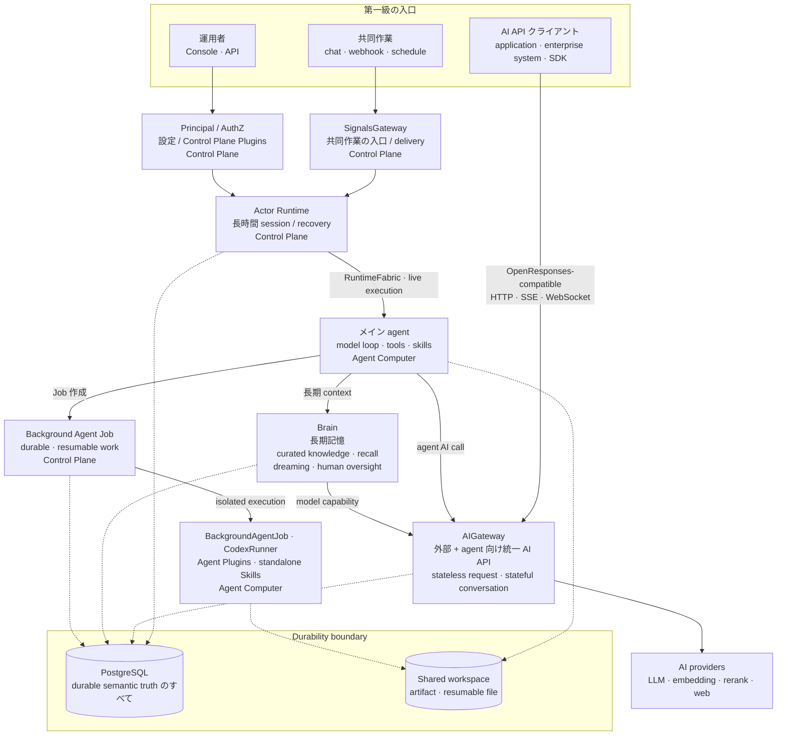

# Ankole - 自分の OKR を持つ AI 同僚のためのオープン AgentOS

[](LICENSE)


[](https://deepwiki.com/AgentBull/ankole)

[English](./README.md) | [简体中文](./README.zh-Hans.md)

[他と違うところ](#ankole-が他と違うところ) · [プロダクト形態](#プロダクト形態) · [Actor Runtime](#actor-runtime) · [アーキテクチャ](#アーキテクチャ) · [現状](#現状) · [開発](#開発)

**Ankole は、自分の AI 同僚チームを自社サーバー上に組成するための、セルフホスト可能な AgentOS です。** 受け取るのは指示ではなく目標です。チームのチャンネルで仕事を引き受け、自ら分解し、実行し、納品し、結果で評価されます。

AI の仕事を個人用チャット欄から出し、仕事が実際に起きている場所へ置きます。チャンネル、リポジトリ、スケジュール、ダッシュボード、社内システム、長期プロジェクトの文脈がその場所です。Ankole agent は、自分の identity、memory、permission、tool、workspace、responsibility boundary を持ち、**進行中の work を所有**でき、一回限りのメッセージへの回答にとどまりません。

[Claude Tag](https://claude.com/product/tag) は分かりやすい公開参照です。Slack thread で AI を tag し、共有文脈を読ませ、組織の tools を使わせ、channel context を記憶し、時間のかかる work を follow up させる。Ankole はその pattern をより open で広い形にします。**Slack だけでも、Claude だけでも、1 つの agent だけでも、vendor-owned context でもありません。**

Ankole が向いているのは、答えだけでなく責任者が必要な仕事です。Ankole が担えるポストには三つの共通点があります。完全にリモートで完結すること、成果物が明確であること、そして事後に数値で判定できることです。

## Ankole が他と違うところ

アシスタントが答える問いは「それは私をどう助けるか」。同僚が答える問いは「この仕事は既定で誰の担当か」。Ankole が変えるのはモデルの大きさではなく、agent の組織内での位置です。

- **それはチャンネルに属し、連れてきた個人には属さない。** 記憶は仕事の場に帰属し、権限はチャンネル単位で与えられ、行動は全員に見え、結論はチームの共有事実になります — そのすべてが vendor のテナントではなく、自分のサーバー上にあります。
- **ポストは責任の枠であり、スキルの束ではない。** できることと担うことは別で、skill を積むことと責任を負うことも別です。Ankole が提供するのは、能力をポストに変える層 — 固有の identity、組織としての授権、監査証跡、エスカレーション経路、評価指標です。
- **仕事のループの内側に住み、一部分に手を伸ばすだけではない。** 現場を見て、軽重を判断し、約束し、前に進め、結果を追い、例外を処理し、組織に説明する。SaaS は結果を記録し、RPA は動作を実行し、チャットボットは冒頭の問答を扱う — Ankole の agent はループ全体を担います。
- **秩序を記録するだけでなく、秩序を生成する。** チャンネルで自然言語のまま生まれた約束、リスク、基準、締切を、その場で追跡可能・実行可能・退役可能な組織の現実に変えます。
- **日々のループは既定でそれが担い、人は要所で介入する。** 承認、例外、問責の場面には人間がいます。成果物、判断、commit 済みの操作は durable ledger に残り、産出は「事後に採点できる」ことを前提に設計されています。

生成された秩序を保つのは memory です。多くの agent の記憶は追記のみのログで、古い基準と新しい規則が対等に並び、時系列も上書き関係もありません。Ankole の記憶は裁定します。新しい規則が座を引き継ぎ、古い基準は有効期間ごと退役する。同種の訂正は一本にまとまる。矛盾する結論は時刻・出所・確信度で順位がつく。予測した事柄は、結果が出たら突き合わせる。すべては一つの目的、モデルの予測と実際の観測との差を縮めることに従います。

## Ankole が加えるもの

- **長時間の仕事は background で走る。** Background job、スケジュール、あとで確認。数時間走る仕事も、終われば agent が元のチャンネルに戻って報告し、途中で失敗した工程は明示して再試行します。
- **その部屋がすでに知っていること。** 決まりごと、誰が何を好むか、前回その案が通らなかった理由 — 誰も agent に伝えようと思わなかった情報が、チャンネルの共有記憶になります。
- **世界モデルを作る記憶。** Brain は会話を精選された知識へ蒸留し、帰納も演繹も行い、古くなった項目を退役させ、外界の変化を直接取り込みます。誰かがチャンネルで話題にする必要はありません。
- **Deep Research と playbook。** Fan-out 検索、多層検証、対立仮説の検討によって、引用付きのレポートを出します。うまく回った種類の仕事は playbook として固定され、次回はそれに従います。
- **本物のブラウザを使える。** Runtime が実際の Chromium session を保持し、agent は `ankole-browser` 経由で操作します。描画後のページの読み取り、クリック、入力、スクリーンショット、再現可能な Playwright script、そして工程をまたぐログイン状態の維持。
- **自己進化する skill。** Agent は学んだことを overlay の提案として書き、人間が承認すると次の session から適用されます。黙って自分を書き換えることはありません。
- **複数の agent、一つのプライベートデプロイインスタンス。** それぞれが固有の mission、権限、tools、memory、対外 identity を持ちます。主 agent は境界の明確な仕事を job agent に渡し、自身は待ち続けません。
- **企業 identity と IM への接続。** Lark、Slack、DingTalk、Teams、Google Workspace は一等の adapter で、identity は既存の IdP から来ます。IM、webhook、スケジュール、社内システムはすべて正規化された signal input として届きます。

## プロダクト形態

Ankole が担えるポストは、完全にリモートで完結し、成果物が明確で、事後に数値で判定できます。六つの業界からの例であり、網羅的な一覧ではありません。

| ポスト | 成果物 | 評価指標 |
|---|---|---|
| セカンダリー市場アナリスト | 個別銘柄・セクター分析、シナリオ、エントリー条件 | 事後検証での的中率と超過収益 |
| クラウドコスト最適化エンジニア | コスト按分、適正化案、移行経路 | 業務量あたりのクラウド支出 |
| スマートコントラクト監査 | 再現可能な PoC 付き監査報告 | 重大脆弱性の見逃し件数 |
| 薬事申請担当 | 申請資料一式と照会事項への回答 | 一発承認率と照会回数 |
| 特許エンジニア | 先行技術調査、発明提案書、請求項ドラフト | 登録率と拒絶後の不服審判 |
| 越境 EC 運用アナリスト | 広告・在庫の週次レポート、選品リスト | TACoS と欠品日数 |

共通する形は「この質問に答える」ではなく、**「このポストを守り、手元の context を活かし、結果で応える」**です。

## Actor Runtime

Ankole は、長時間の AI work のための actor-oriented runtime です。各 active session は addressable virtual actor です。Wake、message receive、checkpoint、stream progress、hibernate、recover、continue ができ、agent を単なる HTTP request や queue job として扱いません。

Runtime は 5 つの technical bets に基づきます。

- **Virtual Actors for AI work.** Session は address、state、mailbox、lifecycle、recovery path を持つ work identity であり、散らばった background work ではありません。
- **OTP Supervision Trees as failure domains.** 1 つの agent が hang、timeout、crash しても、Ankole はその branch を isolate または restart し、環境全体の failure に広げません。
- **ZeroMQ Activation Fabric for live control.** Wakeup、steering、checkpoint、streaming、backpressure は low-latency routing layer を通り、agent が作業中でも誘導や介入ができます。
- **Agent Computer as execution substrate.** LLM loop、tools、MCP servers、files、terminal state、streaming output は、workspace に近い Bun + TypeScript computer 内で動きます。
- **Durable Ledger for recovery and audit.** Mailbox、turn、reminder、decision、committed side effects は process より長く残ります。Streaming は progress であり、commit された work が truth です。

ユーザーと運用者にとっての約束は単純です。Agent は数時間から数日働き続け、実行中に新しい input を受け取り、独立して fail し、context を保ったまま recover し、side effect を説明可能にします。Runtime の詳しい考え方は [なぜ OTP はより良いマルチエージェント・オーケストレーションのランタイムなのか](https://ding.ee/ja-JP/why-otp-is-a-better-runtime-for-multi-agent-orchestration/) にまとめています。

これが Ankole の技術的な賭けです。Actor model は long-lived work identity と lifecycle を支え、OTP は failure semantics を支え、ZeroMQ は live activation を支え、Agent Computer は local execution を支えます。Ankole は chatbot backend というより、AI work のための distributed operating system に近いものです。

## アーキテクチャ


```mermaid
flowchart TB
  subgraph Entry["第一級の入口"]
    direction LR
    Work["共同作業<br/>chat · webhook · schedule"]
    Clients["AI API クライアント<br/>application · enterprise system · SDK"]
    Ops["運用者<br/>Console · API"]
  end

  SG["SignalsGateway<br/>共同作業の入口 / delivery<br/>Control Plane"]
  Platform["Principal / AuthZ<br/>設定 / Control Plane Plugins<br/>Control Plane"]
  Runtime["Actor Runtime<br/>長時間 session / recovery<br/>Control Plane"]
  Main["メイン agent<br/>model loop · tools · skills<br/>Agent Computer"]
  Brain["Brain<br/>長期記憶<br/>curated knowledge · recall<br/>dreaming · human oversight"]
  Delegate["Background Agent Job<br/>durable · resumable work<br/>Control Plane"]
  AI["AIGateway<br/>外部 + agent 向け統一 AI API<br/>stateless request · stateful conversation"]
  Task["BackgroundAgentJob · CodexRunner<br/>Agent Plugins · standalone Skills<br/>Agent Computer"]
  Providers["AI providers<br/>LLM · embedding · rerank · web"]

  subgraph Storage["Durability boundary"]
    direction LR
    PG[("PostgreSQL<br/>durable semantic truth のすべて")]
    Workspace[("Shared workspace<br/>artifact · resumable file")]
  end

  Work --> SG --> Runtime
  Ops --> Platform --> Runtime
  Runtime -->|"RuntimeFabric · live execution"| Main
  Clients -->|"OpenResponses-compatible<br/>HTTP · SSE · WebSocket"| AI
  Main -->|"agent AI call"| AI
  Main -->|"長期 context"| Brain
  Brain -->|"model capability"| AI
  Main -->|"Job 作成"| Delegate
  Delegate -->|"isolated execution"| Task
  AI --> Providers

  Runtime -.-> PG
  AI -.-> PG
  Brain -.-> PG
  Delegate -.-> PG
  Main -.-> Workspace
  Task -.-> Workspace
```

全体像：

- **3 つの first-class entry surface。** Shared work は SignalsGateway から入り、application と enterprise system は AIGateway を直接呼び出し、operator は Console と API を使います。AIGateway は worker 専用の内部 proxy ではありません。
- **AIGateway は統一された AI boundary。** OpenResponses-compatible な HTTP、SSE、WebSocket API が stateless request と Principal-scoped stateful conversation の両方を支えます。LLM、embedding、rerank、web search、web fetch は同じ provider routing surface で解決され、upstream credential は control plane の外に出ません。
- **Actor は durable work と execution resource を分離します。** Actor Runtime が long-running session と recovery semantics を所有し、replaceable な Agent Computer worker が model loop、tools、skills、sandbox を実行します。
- **Brain は long-term memory。** Curated current knowledge、source-chat recall、dreaming、human oversight を統合します。PostgreSQL row が truth であり、Markdown と injected context は projection です。
- **Background Agent Job は child process ではなく durable work。** Job は worker loss を越えて recover し、resume または user input 待ちができ、state transition で owner session を wake します。Job は optional な Workspace Template を 1 つだけ保持します。CodexRunner は実行ごとに Agent で現在 enabled なすべての Agent Plugin と、Background Agent Job を許可する enabled Skill を読み込み、意図的に狭い platform-tool projection を公開します。
- **Durability には 2 つの形があります。** PostgreSQL が semantic truth を所有し、shared workspace がその state から参照される artifact と resumable file を保持します。RuntimeFabric は live transport のみで、shared Rust kernel が process 内 transport と AI data-plane primitives を提供します。

## 現状

Ankole は、完全なセルフホスト可能な AgentOS であり、production で稼働しています。Control plane、Agent Computer、kernel、運用 console が end to end で動きます。

- **多数の model provider。** OpenAI、Azure OpenAI、Claude、Google AI Studio、OpenRouter、その他の OpenAI-compatible endpoint が第一級で、compaction、stateful conversation、reasoning-effort 制御、provider ごとの usage 取り扱いを伴います。
- **本物の IM 連携。** Lark/Feishu と Slack は第一級 provider として統合され、lifecycle、transport、main flow、real-LLM の end-to-end までカバーします。
- **Brain。** curated knowledge、chat recall、dreaming（オフライン統合）、human review、recovery が 1 つの subsystem にまとまり、PostgreSQL の全文検索と vector 検索で支えられます。
- **長時間 actor runtime。** Session は wake、checkpoint、stream progress、hibernate、context を保った recover が可能。steering と cancel は request/response ではなく live-control 操作です。
- **運用 console。** Agents、Agent Library の global defaults と Agent overrides、Control Plane Plugins、providers、model profiles、identity、signals、workers、worker 環境、brain entries、Background Agent Jobs は組み込み web console から管理できます。
- **実条件向けテスト。** Unit suite に加え、Lark と Slack の main flow、transport、lifecycle、real-LLM、scheduling、worker computer、chaos recovery、concurrency/performance の専用 end-to-end suite。

Ankole の public API には現時点で互換性契約がなく、リリース間で breaking change が発生します。

| 領域 | 状態 |
| --- | --- |
| Control plane | `app/control_plane` の Phoenix/OTP application。durable state、configuration、actor orchestration、Principal/AuthZ、AIGateway、Brain、SignalsGateway、運用 API を担います。 |
| Agent Computer | `app/agent_computer` の Bun/TypeScript worker runtime。隔離された Linux worker image 内で agent loop と local tools を実行します。standalone CLI ではありません。 |
| Kernel | `app/kernel` の Rust crate。Elixir (Rustler) と Bun (N-API) が読み込み、crypto、identifier、AuthZ evaluation、ZeroMQ transport を担います。 |
| Frontend | `app/webapps` の Vite + React console、auth、setup surfaces。Phoenix static shell に build されます。 |
| ローカルサービス | PostgreSQL は devkit Docker Compose で提供されます。 |
| 設計ドキュメント | アーキテクチャと runtime 設計ドキュメントは `docs/design-docs` にあります。 |
| Production readiness | production で稼働中。durable パス、live control、運用 surface は完成しており、public API には現時点で互換性契約はありません。 |

## 現在のリポジトリ

このリポジトリは、現在アクティブな Ankole control-plane and runtime workspace です。

- `app/control_plane` - Principal/AuthZ、AppConfigure、setup、console、Control Plane Plugin registry、I18n、SignalsGateway、actor runtime、RuntimeFabric、PostgreSQL-owned durable state を担う Phoenix/OTP control plane。
- `app/kernel` - Elixir と Bun が読み込む shared Rust foundation。crypto、identifier、phone/JWT helpers、AuthZ evaluation、protobuf envelopes、ZeroMQ RuntimeFabric transport を担います。
- `app/agent_computer` - local LLM loop、provider adapters、tools、skill loading、files、terminal state、worker daemon を担う Bun + TypeScript Agent Computer worker。
- `app/webapps` - auth、setup、console surfaces を提供し、Phoenix static shell に build される Vite + React frontend applications。
- `app/library` - built-in standalone Skills、first-party Agent Plugins、`MISSION.md`、`SOUL.md` などの starter templates。
- `app/locales` - control plane と browser surfaces が共有する TOML translation catalogs。
- `libs/uikit` - Ankole webapps で共有する UI primitives。
- `libs/feishu_openapi` - local Lark/Feishu OpenAPI client library。
- `internals/plugins` - private release に compile される first-party Control Plane Plugin code。
- `tools/devkit` - local services、app database helpers、code generation、analysis のための workspace automation。
- `docs/design-docs` - principal identity、authorization、configuration、I18n、plugins、RuntimeFabric、SignalsGateway、provider adapters の現在の design docs。

RuntimeFabric は control-plane から worker への live fabric です。ZeroMQ 上で actor traffic、bounded RPC、worker-file frames を運び、PostgreSQL が durable replay、fences、reconciliation、final commits の source of truth であり続けます。SignalsGateway は provider ingress layer です。外部 chat、webhook、provider event は actor event になりますが、external source facts を execution state と混同しません。

## 開発

Ankole は workspace scripts に Bun を使い、control plane に Elixir/Phoenix を使います。

初回のローカルセットアップでは、次の 1 つの prompt を coding agent にそのまま渡してください。

```text
https://github.com/AgentBull/ankole/blob/main/CONTRIBUTING.md を最初から最後まで読み、そのガイドに厳密に従って、現在の Ankole リポジトリで完全なローカル環境の構築と文書化された end-to-end 検証を案内してください。安全で可逆な手順と検証はあなたが実行し、アカウント、secret、OAuth、または破壊的操作の承認が必要な場合だけ停止して私を案内し、記載された成功条件をすべて満たすまで完了と報告しないでください。
```

```shell
bun install

# Local support services and workspace helpers
bun kit --help
bun services:start
bun services:status

# Control plane
bun control-plane:setup
bun control-plane:dev
bun control-plane:test

# Agent Computer container image and tests
docker build \
  --build-arg "BASE_IMAGE=$(tr -d '\n' < app/agent_computer/base-image.lock)" \
  -f app/agent_computer/Dockerfile -t ankole-agent-computer:0.1.0 .
bun run agent-computer:test
bun run agent-computer:type-check

# Other Bun packages
bun run webapps:build
bun run feishu-openapi:test
```

Agent Computer is a Linux container runtime. Strong bubblewrap command isolation
requires Docker `--cap-add SYS_ADMIN`, `--security-opt seccomp=unconfined`, and
`--security-opt systempaths=unconfined` unless you provide an equivalent custom
seccomp/profile setup. In Kubernetes, put the equivalent
`capabilities.add: ["SYS_ADMIN"]`, `seccompProfile`, and `procMount: Unmasked`
on the Agent Computer container `securityContext`. If strong bubblewrap is
unavailable, the worker may downgrade to weak bubblewrap by bind-mounting the
container `/proc` into bwrap and emits a startup warning. It does not run
model-facing commands without sandboxing.

Workspace が速く動いている間は、package-local validation を優先します。

```shell
bun run --filter @ankole/control-plane test
bun run agent-computer:test
bun run --filter @ankole/agent-computer type-check
bun run --filter @ankole/webapps type-check
bun run --filter @ankole/feishu-openapi test
```

Control plane が起動した後、worker bootstrap helper がローカル RuntimeFabric endpoint に対して外部 Agent Computer worker を起動する Docker コマンドを描画します。

```shell
cd app/control_plane
mix ankole.actor_runtime.worker_bootstrap --endpoint tcp://127.0.0.1:6010 --worker-id worker-a
```

Production bootstrap configuration は `DATABASE_URL`、`SECRET_KEY_BASE` のような標準 infrastructure 名を使います。Runtime application configuration は process-local environment variables ではなく、Ankole の PostgreSQL-backed AppConfigure surface に属します。
