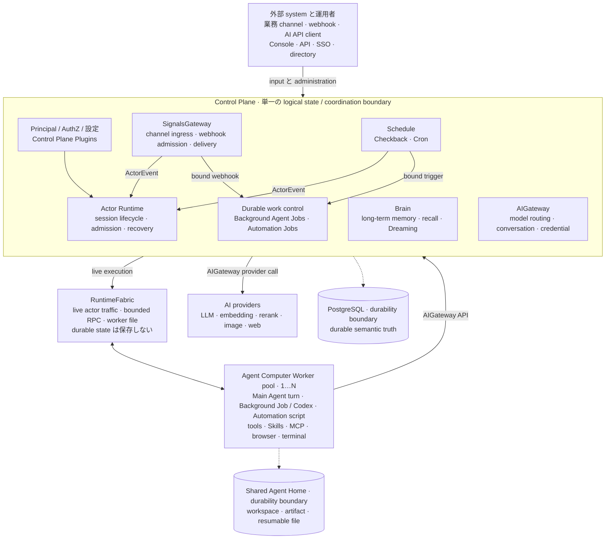

# Ankole — オープンソースの AI Workforce OS

[](LICENSE)


[](https://deepwiki.com/AgentBull/ankole)

[English](./README.md) | [简体中文](./README.zh-Hans.md)

[違い](#agent-の能力から自律的な労働力へ) · [業務機能](#ankole-に任せられる業務機能) · [Actor Runtime](#actor-runtime) · [アーキテクチャ](#アーキテクチャ) · [現状](#現状) · [開発](#開発)

**AI Agent を、業務機能を自律的に遂行し、成果で評価される労働力に変えます。**

多くの AI 製品は、model、assistant、または copilot を人に渡します。次の手順の判断、context の受け渡し、tool の実行、失敗への対応、納品は、依然として人の仕事です。

Ankole は実行 loop を Agent に渡します。業務機能、成果指標、権限、tools、context を定義すると、Agent が計画して実行し、承認や例外の境界で確認し、検査と採点ができる成果を納品します。

Ankole はオープンソースで、セルフホストできます。Identity、context、credential、artifact、監査記録、実行は、すべて自分が管理する infrastructure に残ります。

これは **Service as Software** です。Software は人が service を提供するための道具にとどまらず、service を直接実行します。Ankole は、高付加価値の knowledge work に必要な runtime を提供します。

## Agent の能力から自律的な労働力へ

Copilot は、人が仕事を終えるまでの効率を上げますが、実行 loop は人が持ち続けます。Ankole は既定の担当を変えます。Agent が、定義された業務機能の中で観察し、判断し、実行し、追跡し、納品します。

- **Chat persona ではなく、業務機能。** 各 Agent は、継続的な責任、納品物、業務 context、成果指標を持ちます。Identity は人を模倣するためではなく、権限と履歴を保持するためにあります。
- **活動量ではなく、成果。** 収益、risk、順位、承認率、単位 cost、または事前に定義した別の成果指標で仕事を評価します。
- **次の手順の提案ではなく、実行 loop。** Agent が計画、tool の使用、follow-up、recovery、納品を担います。人が各手順を操作する必要はありません。
- **境界のある権限。** Identity、AuthZ、監査記録、承認点、escalation path が、Agent にできることと、人の判断が必要な時点を定めます。
- **一回の request ではなく、長時間の仕事。** Session は数時間または数日動き、新しい情報を受け取り、失敗から復旧し、次の行動に必要な context を保持します。

自律的な仕事には、正しい現在の context が必要です。Ankole は、すべての古い message を同じ事実として扱わず、規則、判断、修正、成果を時刻と出所と共に記録します。

Brain は古い規則を退役させ、同種の修正を統合し、矛盾を裁定し、過去の予測を後の実績と比較します。各実行は、より正確な業務認識から始まります。

## 自律的な労働力を支えるもの

- **長い Job は background で動く。** 数時間動き、元の channel に戻り、失敗した手順を報告して再試行できます。Main Agent を待たせません。
- **共有 context が working memory になる。** 誰も Agent に直接話していなくても、規則、選好、却下された案を memory に取り込めます。
- **Memory は変化する世界を扱う。** Brain は知識を整理し、古い項目を退役させ、証拠から推論し、外部の変化を直接受け取ります。
- **Deep Research が playbook になる。** Fan-out retrieval、段階的な検証、競合仮説の分析で、出典付き report を作ります。成功した方法は次回を導きます。
- **実際の browser で実際の仕事をする。** Agent は page を読み、click、type、capture、Playwright script の実行、login session の維持ができます。
- **Skill は人の管理下で改善する。** Agent が更新を提案し、人が承認した後に、次の session から適用します。
- **1 つでも複数でも実行できる。** 各 Agent は独自の業務機能、権限、tools、memory、対外 identity を持てます。Multi-agent execution は任意です。
- **企業 identity と業務 channel を直接つなぐ。** Lark、Slack、DingTalk、Teams、Google Workspace、webhook、schedule、社内 system が同じ signal boundary から入ります。

## Ankole に任せられる業務機能

Ankole は、digital に完結し、検査できる成果物を出し、明確な成果指標を持つ仕事に適します。指標には ROI、risk-adjusted return、順位の変化、承認率、または別の business outcome を使えます。

| 業務機能 | 納品物 | 成果指標 |
|---|---|---|
| Performance marketing | Campaign 計画、入札、creative、予算調整 | Incremental ROAS と顧客獲得 cost |
| 業界調査と trading | 調査、仮説、portfolio action、review | 超過収益、Sharpe ratio、最大 drawdown |
| SEO | Keyword 計画、content brief、on-page 変更 | 検索順位の変化と有効な organic traffic |
| 薬事申請 | 申請資料一式と照会事項への回答 | 一発承認率と照会回数 |
| 特許申請 | 先行技術調査、請求項 draft、拒絶理由への応答 | 登録率と office-action 回数 |
| Smart contract audit | 再現可能な PoC 付き監査 report | 重大な見逃しと false-positive 率 |

単位は Agent 数ではなく、業務機能です。1 つの Agent が狭い機能を担うことも、複数の Agent が実行を分担することもできます。Multi-agent coordination は実装方法であり、製品価値ではありません。

共通する contract は、**業務機能を定義し、境界のある権限を与え、Agent に仕事を任せ、成果を評価すること**です。

## Actor Runtime

Ankole は、長時間の AI work のための actor-oriented runtime です。各 active session は addressable virtual actor です。Wake、message receive、checkpoint、stream progress、hibernate、recover、continue ができ、agent を単なる HTTP request や queue job として扱いません。

Runtime は 5 つの technical bets に基づきます。

- **Virtual Actors for AI work.** Session は address、state、mailbox、lifecycle、recovery path を持つ work identity であり、散らばった background work ではありません。
- **OTP Supervision Trees as failure domains.** 1 つの agent が hang、timeout、crash しても、Ankole はその branch を isolate または restart し、環境全体の failure に広げません。
- **ZeroMQ Activation Fabric for live control.** Wakeup、steering、checkpoint、streaming、backpressure は low-latency routing layer を通り、agent が作業中でも誘導や介入ができます。
- **Agent Computer as execution substrate.** LLM loop、tools、MCP servers、files、terminal state、streaming output は、workspace に近い Bun + TypeScript computer 内で動きます。
- **Durable Ledger for recovery and audit.** Mailbox、turn、reminder、decision、committed side effects は process より長く残ります。Streaming は progress であり、commit された work が truth です。

ユーザーと運用者にとっての約束は単純です。Agent は数時間から数日働き続け、実行中に新しい input を受け取り、独立して fail し、context を保ったまま recover し、side effect を説明可能にします。Runtime の詳しい考え方は [なぜ OTP はより良いマルチエージェント・オーケストレーションのランタイムなのか](https://ding.ee/ja-JP/why-otp-is-a-better-runtime-for-multi-agent-orchestration/) にまとめています。

これが Ankole の技術的な賭けです。Actor model は long-lived work identity と lifecycle を支え、OTP は failure semantics を支え、ZeroMQ は live activation を支え、Agent Computer は local execution を支えます。これにより、Ankole は chatbot backend ではなく AI Workforce OS として動作します。

## アーキテクチャ

この図は ownership と durability boundary を示します。すべての内部 call を並べたものではありません。


```mermaid
flowchart TB
  External["外部 system と運用者<br/>業務 channel · webhook · AI API client<br/>Console · API · SSO · directory"]

  subgraph Control["Control Plane · 単一の logical state / coordination boundary"]
    direction TB
    Platform["Principal / AuthZ / 設定<br/>Control Plane Plugins"]
    SG["SignalsGateway<br/>channel ingress · webhook admission · delivery"]
    Schedule["Schedule<br/>Checkback · Cron"]
    Runtime["Actor Runtime<br/>session lifecycle · admission · recovery"]
    Jobs["Durable work control<br/>Background Agent Jobs · Automation Jobs"]
    Brain["Brain<br/>long-term memory · recall · Dreaming"]
    AI["AIGateway<br/>model routing · conversation · credential"]
  end

  Fabric["RuntimeFabric<br/>live actor traffic · bounded RPC · worker file<br/>durable state は保存しない"]
  Workers["Agent Computer Worker pool · 1…N<br/>Main Agent turn · Background Job / Codex · Automation script<br/>tools · Skills · MCP · browser · terminal"]
  Providers["AI providers<br/>LLM · embedding · rerank · image · web"]

  PG[("PostgreSQL · durability boundary<br/>durable semantic truth")]
  Home[("Shared Agent Home · durability boundary<br/>workspace · artifact · resumable file")]

  External -->|"input と administration"| Control
  SG -->|"ActorEvent"| Runtime
  Schedule -->|"ActorEvent"| Runtime
  SG -->|"bound webhook"| Jobs
  Schedule -->|"bound trigger"| Jobs
  Platform --> Runtime
  Control -->|"live execution"| Fabric
  Fabric <--> Workers
  Workers -->|"AIGateway API"| Control
  Control -->|"AIGateway provider call"| Providers
  Control -.-> PG
  Workers -.-> Home
```

全体像：

- **1 つの Control Plane が state と coordination を所有します。** Principal/AuthZ、SignalsGateway、Schedule、Actor Runtime、Job lifecycle、Brain、AIGateway は Elixir/OTP で durable decision を行い、semantic fact を PostgreSQL に保存します。
- **Trigger owner は分かれています。** SignalsGateway は channel と webhook admission を所有し、Schedule は Checkback と Cron を所有します。Trigger は標準で Actor session を wake し、Automation Job と bind した場合は durable な Automation Job run を作成します。
- **Worker は replaceable な execution resource を提供します。** 1 台以上の Agent Computer Worker が Main Agent turn、Background Job/Codex turn、Automation script を実行します。RuntimeFabric は live actor traffic、bounded RPC、worker-file operation を運びますが、durable queue ではありません。
- **AIGateway は統一された AI boundary。** OpenResponses-compatible な HTTP、SSE、WebSocket API が stateless request と Principal-scoped stateful conversation の両方を支えます。LLM、embedding、rerank、web search、web fetch は同じ provider routing surface で解決され、upstream credential は control plane の外に出ません。
- **Brain は long-term memory。** Curated current knowledge、source-chat recall、dreaming、human oversight を統合します。PostgreSQL row が truth であり、Markdown と injected context は projection です。
- **2 種類の Job は異なる保証を持ちます。** Background Agent Job は resume と user input 待ちができる interactive な model work です。Automation Job は Agent が所有する deterministic script です。Trigger を消費するたびに durable run を作り、owner session に event を送信できます。
- **Durability には 2 つの形があります。** PostgreSQL が semantic truth を所有し、shared Agent Home が workspace、artifact、resumable file を保持します。RuntimeFabric と Worker process state は再構築できます。

## 現状

Ankole は、完全にセルフホストできる AI Workforce OS であり、production で稼働しています。Control plane、Agent Computer、kernel、運用 console が end to end で動きます。

- **多数の model provider。** OpenAI、Azure OpenAI、Claude、Google AI Studio、OpenRouter、その他の OpenAI-compatible endpoint が第一級で、compaction、stateful conversation、reasoning-effort 制御、provider ごとの usage 取り扱いを伴います。
- **本物の IM 連携。** Lark/Feishu と Slack は第一級 provider として統合され、lifecycle、transport、main flow、real-LLM の end-to-end までカバーします。
- **Brain。** curated knowledge、chat recall、dreaming（オフライン統合）、human review、recovery が 1 つの subsystem にまとまり、PostgreSQL の全文検索と vector 検索で支えられます。
- **長時間 actor runtime。** Session は wake、checkpoint、stream progress、hibernate、context を保った recover が可能。steering と cancel は request/response ではなく live-control 操作です。
- **運用 console。** Agents、Agent Library の global defaults と Agent overrides、Control Plane Plugins、providers、model profiles、identity、signals、workers、worker 環境、brain entries、Background Agent Jobs は組み込み web console から管理できます。
- **実条件向けテスト。** Unit suite に加え、Lark と Slack の main flow、transport、lifecycle、real-LLM、scheduling、worker computer、chaos recovery、concurrency/performance の専用 end-to-end suite。

Ankole の public API には現時点で互換性契約がなく、リリース間で breaking change が発生します。

| 領域 | 状態 |
| --- | --- |
| Control plane | `app/control_plane` の Phoenix/OTP application。durable state、configuration、actor orchestration、Principal/AuthZ、AIGateway、Brain、SignalsGateway、運用 API を担います。 |
| Agent Computer | `app/agent_computer` の Bun/TypeScript worker runtime。隔離された Linux worker image 内で agent loop と local tools を実行します。standalone CLI ではありません。 |
| Kernel | `app/kernel` の Rust crate。Elixir (Rustler) と Bun (N-API) が読み込み、crypto、identifier、AuthZ evaluation、ZeroMQ transport を担います。 |
| Frontend | `app/webapps` の Vite + React console、auth、setup surfaces。Phoenix static shell に build されます。 |
| ローカルサービス | PostgreSQL は devkit Docker Compose で提供されます。 |
| 設計ドキュメント | アーキテクチャと runtime 設計ドキュメントは `docs/design-docs` にあります。 |
| Production readiness | production で稼働中。durable パス、live control、運用 surface は完成しており、public API には現時点で互換性契約はありません。 |

## 現在のリポジトリ

このリポジトリは、現在アクティブな Ankole control-plane and runtime workspace です。

- `app/control_plane` - Principal/AuthZ、AppConfigure、setup、console、Control Plane Plugin registry、I18n、SignalsGateway、actor runtime、RuntimeFabric、PostgreSQL-owned durable state を担う Phoenix/OTP control plane。
- `app/kernel` - Elixir と Bun が読み込む shared Rust foundation。crypto、identifier、phone/JWT helpers、AuthZ evaluation、protobuf envelopes、ZeroMQ RuntimeFabric transport を担います。
- `app/agent_computer` - local LLM loop、provider adapters、tools、skill loading、files、terminal state、worker daemon を担う Bun + TypeScript Agent Computer worker。
- `app/webapps` - auth、setup、console surfaces を提供し、Phoenix static shell に build される Vite + React frontend applications。
- `app/library` - built-in standalone Skills、first-party Agent Plugins、`MISSION.md`、`SOUL.md` などの starter templates。
- `app/locales` - control plane と browser surfaces が共有する TOML translation catalogs。
- `libs/uikit` - Ankole webapps で共有する UI primitives。
- `libs/feishu_openapi` - local Lark/Feishu OpenAPI client library。
- `internals/plugins` - private release に compile される first-party Control Plane Plugin code。
- `tools/devkit` - local services、app database helpers、code generation、analysis のための workspace automation。
- `docs/design-docs` - principal identity、authorization、configuration、I18n、plugins、RuntimeFabric、SignalsGateway、provider adapters の現在の design docs。

RuntimeFabric は control-plane から worker への live fabric です。ZeroMQ 上で actor traffic、bounded RPC、worker-file frames を運び、PostgreSQL が durable replay、fences、reconciliation、final commits の source of truth であり続けます。SignalsGateway は provider ingress layer です。外部 chat、webhook、provider event は actor event になりますが、external source facts を execution state と混同しません。

## 開発

Ankole は workspace scripts に Bun を使い、control plane に Elixir/Phoenix を使います。

初回のローカルセットアップでは、次の 1 つの prompt を coding agent にそのまま渡してください。

```text
https://github.com/AgentBull/ankole/blob/main/CONTRIBUTING.md を最初から最後まで読み、そのガイドに厳密に従って、現在の Ankole リポジトリで完全なローカル環境の構築と文書化された end-to-end 検証を案内してください。安全で可逆な手順と検証はあなたが実行し、アカウント、secret、OAuth、または破壊的操作の承認が必要な場合だけ停止して私を案内し、記載された成功条件をすべて満たすまで完了と報告しないでください。
```

```shell
bun install

# Local support services and workspace helpers
bun kit --help
bun services:start
bun services:status

# Control plane
bun control-plane:setup
bun control-plane:dev
bun control-plane:test

# Agent Computer container image and tests
docker build \
  --build-arg "BASE_IMAGE=$(tr -d '\n' < app/agent_computer/base-image.lock)" \
  -f app/agent_computer/Dockerfile -t ankole-agent-computer:0.1.0 .
bun run agent-computer:test
bun run agent-computer:type-check

# Other Bun packages
bun run webapps:build
bun run feishu-openapi:test
```

Agent Computer is a Linux container runtime. Strong bubblewrap command isolation
requires Docker `--cap-add SYS_ADMIN`, `--security-opt seccomp=unconfined`, and
`--security-opt systempaths=unconfined` unless you provide an equivalent custom
seccomp/profile setup. In Kubernetes, put the equivalent
`capabilities.add: ["SYS_ADMIN"]`, `seccompProfile`, and `procMount: Unmasked`
on the Agent Computer container `securityContext`. If strong bubblewrap is
unavailable, the worker may downgrade to weak bubblewrap by bind-mounting the
container `/proc` into bwrap and emits a startup warning. It does not run
model-facing commands without sandboxing.

Workspace が速く動いている間は、package-local validation を優先します。

```shell
bun run --filter @ankole/control-plane test
bun run agent-computer:test
bun run --filter @ankole/agent-computer type-check
bun run --filter @ankole/webapps type-check
bun run --filter @ankole/feishu-openapi test
```

Control plane が起動した後、worker bootstrap helper がローカル RuntimeFabric endpoint に対して外部 Agent Computer worker を起動する Docker コマンドを描画します。

```shell
cd app/control_plane
mix ankole.actor_runtime.worker_bootstrap --endpoint tcp://127.0.0.1:6010 --worker-id worker-a
```

Production bootstrap configuration は `DATABASE_URL`、`SECRET_KEY_BASE` のような標準 infrastructure 名を使います。Runtime application configuration は process-local environment variables ではなく、Ankole の PostgreSQL-backed AppConfigure surface に属します。
