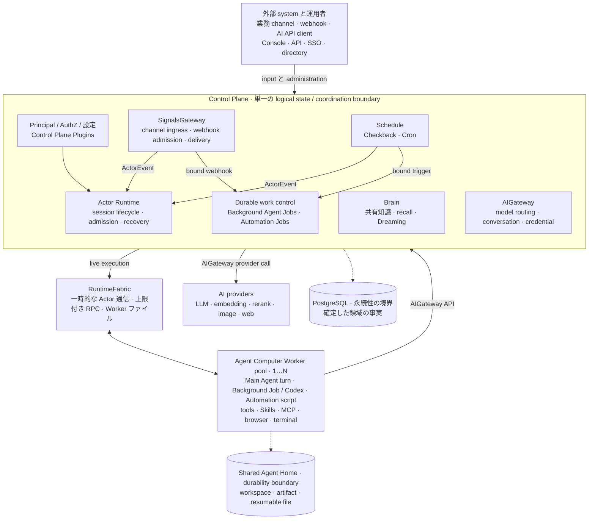

# Ankole、Company Brain を備えた企業向け Agent Harness

[](LICENSE)


[](https://deepwiki.com/AgentBull/ankole)

[English](./README.md) | [简体中文](./README.zh-Hans.md) | [한국어](./README.ko.md)

[Ankole を選ぶ理由](#ankole-を選ぶ理由) · [Company Brain](#company-brain) · [意思決定の仕事](#意思決定の仕事) · [企業向けランタイム](#企業向けランタイム) · [アーキテクチャ](#アーキテクチャ) · [現状](#現状) · [開発](#開発)

**Company Brain が、すべての Agent に社内知識を届け、判断を改善します。**

Ankole は、Company Brain を備えたオープンソースの Claude Code 代替製品です。企業向け Agent Harness が、社内知識、リアルタイムのシグナル、権限、ツール、実際の結果を、Agent の判断に必要なコンテキストとして構成します。

Company Brain は継続して動く Agent に共有知識を提供します。Harness は企業の権限規則を適用し、モデルの呼び出しを越えて仕事を継続します。

モデルが推論できる範囲は、与えられたコンテキストで決まります。Ankole は関連する事実と機能を選び、権限を適用し、障害後も仕事を継続し、結果を次の意思決定に引き継ぎます。

Ankole は、企業が管理する基盤で実行できます。ID、コンテキスト、認証情報、成果物、監査記録、実行内容は、その基盤内に残ります。

Harness は、モデルの各呼び出しに継続性、権限、永続状態、結果からのフィードバックを提供します。

## Ankole を選ぶ理由

多くの Agent stack は、モデル、Prompt、ツールを接続します。各呼び出しは、その時点で組み立てたコンテキストから始まります。Ankole は、呼び出し後も続く仕事に必要な会社の状態とランタイムを維持します。

- Harness は現在のコンテキストを構成し、機能を選び、権限を適用し、モデルの呼び出しを越えて状態を保持します。
- メッセージ、スケジュール、Webhook、市場の変化、社内イベントが、担当する Agent を起動します。
- 安定した ID、AuthZ、承認点、監査記録、配信状態が、各 Agent の権限を定めます。
- 修正、新しい証拠、期限切れの事実、実際の結果が、次の意思決定で使うコンテキストを更新します。

## Company Brain

Company Brain は、権限を持つすべての Agent に、同じ最新の社内知識を提供します。

Company Brain は、会話、登録したファイルと URL、Agent が明示的に記録した内容から学習します。各 Claim は、出所、時点、保有者、確信度、閲覧範囲を保持します。

- 判断は保有者に結び付き、出所はその出所が支える Claim に結び付きます。
- 新しい証拠は現在の見解を更新し、過去の判断に至った履歴も保持します。
- 矛盾する内容は、人が確認できる状態で残ります。
- Recall は、保護された知識がモデルに届く前に、Principal とグループの閲覧範囲を適用します。
- Dreaming は証拠を整理し、パターンを検出し、期限を迎えた予測を評価し、変更案を人の承認に送ります。

## 意思決定の仕事

Ankole は、仮説と結果を検証する意思決定に対応します。現在の例には、業界調査、商品選定、詳細なデータ分析、予測があります。

- Agent は、現在の規則、過去の判断、関連する証拠、利用できる権限、最近の変化を確認して仕事を始めます。
- Deep Research は証拠収集を独立した実行者に分け、競合する仮説を検証し、証拠の不足を記録し、出典付きのレポートを返します。
- ブラウザー、ターミナル、ファイル、モデル、外部システムにより、Agent は権限の範囲で調査と実行を行います。
- 予測、修正、実際の結果が、次の意思決定に使う証拠になります。

## 企業向けランタイム

Ankole は、各アクティブ Session をアドレス指定できる Virtual Actor として実行します。Actor は起動、メッセージ受信、チェックポイント、進捗配信、休止、復旧、処理の継続に対応します。

5 つの仕組みが、仕事の継続と監査を支えます。

- Virtual Actor は、各 Session にアドレス、メールボックス、ライフサイクル、復旧位置を与えます。
- OTP の監督ツリーは、停止、タイムアウト、クラッシュが発生した Session の分岐を隔離します。
- ZeroMQ は、起動、誘導、チェックポイント、ストリーム、バックプレッシャーを低遅延で伝えます。
- Agent Computer は、ワークスペースの近くでモデルループ、ツール、MCP サービス、ファイル、ターミナル、ストリーミング出力を実行します。
- PostgreSQL は、Mailbox、Turn、リマインダー、意思決定、確定した操作を保存し、復旧と監査に使います。

Agent は数時間から数日働き、実行中に入力を受け取り、障害を個別に処理し、コンテキストを保って復旧し、確定した操作を記録します。詳しい設計は[なぜ OTP はより良いマルチエージェント・オーケストレーションのランタイムなのか](https://ding.ee/ja-JP/why-otp-is-a-better-runtime-for-multi-agent-orchestration/)で説明します。

## アーキテクチャ

この図は、所有権と永続性の境界を示します。内部呼び出しは省略しています。


```mermaid
flowchart TB
  External["外部 system と運用者<br/>業務 channel · webhook · AI API client<br/>Console · API · SSO · directory"]

  subgraph Control["Control Plane · 単一の logical state / coordination boundary"]
    direction TB
    Platform["Principal / AuthZ / 設定<br/>Control Plane Plugins"]
    SG["SignalsGateway<br/>channel ingress · webhook admission · delivery"]
    Schedule["Schedule<br/>Checkback · Cron"]
    Runtime["Actor Runtime<br/>session lifecycle · admission · recovery"]
    Jobs["Durable work control<br/>Background Agent Jobs · Automation Jobs"]
    Brain["Brain<br/>共有知識 · recall · Dreaming"]
    AI["AIGateway<br/>model routing · conversation · credential"]
  end

  Fabric["RuntimeFabric<br/>一時的な Actor 通信 · 上限付き RPC · Worker ファイル"]
  Workers["Agent Computer Worker pool · 1…N<br/>Main Agent turn · Background Job / Codex · Automation script<br/>tools · Skills · MCP · browser · terminal"]
  Providers["AI providers<br/>LLM · embedding · rerank · image · web"]

  PG[("PostgreSQL · 永続性の境界<br/>確定した領域の事実")]
  Home[("Shared Agent Home · durability boundary<br/>workspace · artifact · resumable file")]

  External -->|"input と administration"| Control
  SG -->|"ActorEvent"| Runtime
  Schedule -->|"ActorEvent"| Runtime
  SG -->|"bound webhook"| Jobs
  Schedule -->|"bound trigger"| Jobs
  Platform --> Runtime
  Control -->|"live execution"| Fabric
  Fabric <--> Workers
  Workers -->|"AIGateway API"| Control
  Control -->|"AIGateway provider call"| Providers
  Control -.-> PG
  Workers -.-> Home
```

Elixir/OTP の Control Plane は、Principal/AuthZ、SignalsGateway、Schedule、Actor Runtime、Job のライフサイクル、Brain、AIGateway の永続的な判断を担当します。PostgreSQL は各領域で確定した事実を保存します。

- SignalsGateway はチャネルと Webhook の受け付けを担当します。Schedule は Checkback と Cron を担当します。
- Agent Computer Worker は、Main Agent Turn、Background Job、Codex Turn、Automation スクリプトを実行します。
- RuntimeFabric は、一時的な Actor 通信、上限付き RPC、Worker のファイル操作を伝えます。
- AIGateway は、LLM、Embedding、Rerank、Web Search、Web Fetch の要求を Control Plane の共通境界から処理します。
- Brain は共有の Page と Claim を保存します。読み取り時には、要求元 Principal の知識境界を適用します。
- Background Agent Job は対話型のモデル処理を実行します。Automation Job は Agent が所有する決定的なスクリプトを実行します。
- 共有 Agent Home は、ワークスペース、成果物、再開用ファイルを保存します。Worker のプロセス状態は再構築できます。

## 現状

Ankole は、企業が管理する基盤で運用できる完全な Agent Harness として本番稼働しています。Control Plane、Agent Computer、Kernel、運用コンソールを一つの環境に配置できます。

- OpenAI、Azure OpenAI、Claude、Google AI Studio、OpenRouter、その他の OpenAI 互換エンドポイントは、コンテキスト圧縮、状態を持つ会話、推論強度の制御、利用量の記録に対応します。
- Lark、Feishu、Slack の連携には、ライフサイクル、通信、主要フロー、実際の LLM 呼び出しを対象とする専用テストがあります。
- Brain は、範囲付きの開示、会話と Source からの学習、オフライン整理、運用者による確認、全文検索、ベクトル検索を提供します。
- Session は起動、チェックポイント、進捗配信、休止、コンテキストを保った復旧、実行中の誘導とキャンセルに対応します。
- 組み込みの運用コンソールは、Agent、Library 設定、Plugin、モデルプロバイダー、モデル、Identity、シグナル、Worker、Brain、Background Agent Job を管理します。
- 単体テストと専用のシステムテストは、スケジュール、Worker Computer、障害復旧、並行処理、性能を検証します。

パブリック API の互換性契約は現在策定中です。リリース間で互換性のない変更が発生する場合があります。

| 領域 | 状態 |
| --- | --- |
| Control plane | `app/control_plane` の Phoenix/OTP application。durable state、configuration、actor orchestration、Principal/AuthZ、AIGateway、Brain、SignalsGateway、運用 API を担います。 |
| Agent Computer | `app/agent_computer` の Bun/TypeScript Worker ランタイムです。隔離された Linux Worker イメージ内で Agent ループとローカルツールを実行します。Worker 実行環境として使用します。 |
| Kernel | `app/kernel` の Rust crate。Elixir (Rustler) と Bun (N-API) が読み込み、crypto、identifier、AuthZ evaluation、ZeroMQ transport を担います。 |
| Frontend | `app/webapps` の Vite + React console、auth、setup surfaces。Phoenix static shell に build されます。 |
| ローカルサービス | PostgreSQL は devkit Docker Compose で提供されます。 |
| 設計ドキュメント | アーキテクチャと runtime 設計ドキュメントは `docs/design-docs` にあります。 |
| 本番対応 | 本番環境で稼働しています。状態の永続化、リアルタイム制御、運用画面は完成しています。パブリック API の互換性契約は現在策定中です。 |

## 現在のリポジトリ

このリポジトリは、現在アクティブな Ankole control-plane and runtime workspace です。

- `app/control_plane` - Principal/AuthZ、AppConfigure、setup、console、Control Plane Plugin registry、I18n、SignalsGateway、actor runtime、RuntimeFabric、PostgreSQL-owned durable state を担う Phoenix/OTP control plane。
- `app/kernel` - Elixir と Bun が読み込む shared Rust foundation。crypto、identifier、phone/JWT helpers、AuthZ evaluation、protobuf envelopes、ZeroMQ RuntimeFabric transport を担います。
- `app/agent_computer` - local LLM loop、provider adapters、tools、skill loading、files、terminal state、worker daemon を担う Bun + TypeScript Agent Computer worker。
- `app/webapps` - auth、setup、console surfaces を提供し、Phoenix static shell に build される Vite + React frontend applications。
- `app/library` - built-in standalone Skills、first-party Agent Plugins、`MISSION.md`、`SOUL.md` などの starter templates。
- `app/locales` - control plane と browser surfaces が共有する TOML translation catalogs。
- `libs/uikit` - Ankole webapps で共有する UI primitives。
- `libs/feishu_openapi` - local Lark/Feishu OpenAPI client library。
- `internals/plugins` - private release に compile される first-party Control Plane Plugin code。
- `tools/devkit` - local services、app database helpers、code generation、analysis のための workspace automation。
- `docs/design-docs` - principal identity、authorization、configuration、I18n、plugins、RuntimeFabric、SignalsGateway、provider adapters の現在の design docs。

RuntimeFabric は control-plane から worker への live fabric です。ZeroMQ 上で actor traffic、bounded RPC、worker-file frames を運び、PostgreSQL が durable replay、fences、reconciliation、final commits の source of truth であり続けます。SignalsGateway は provider ingress layer です。外部 chat、webhook、provider event は actor event になりますが、external source facts を execution state と混同しません。

## 開発

Ankole は workspace scripts に Bun を使い、control plane に Elixir/Phoenix を使います。

初回のローカルセットアップでは、次の 1 つの prompt を coding agent にそのまま渡してください。

```text
https://github.com/AgentBull/ankole/blob/main/CONTRIBUTING.md を最初から最後まで読み、そのガイドに厳密に従って、現在の Ankole リポジトリで完全なローカル環境の構築と文書化された end-to-end 検証を案内してください。安全で可逆な手順と検証はあなたが実行し、アカウント、secret、OAuth、または破壊的操作の承認が必要な場合だけ停止して私を案内し、記載された成功条件をすべて満たすまで完了と報告しないでください。
```

```shell
bun install

# Local support services and workspace helpers
bun kit --help
bun services:start
bun services:status

# Control plane
bun control-plane:setup
bun control-plane:dev
bun control-plane:test

# Agent Computer container image and tests
bun run agent-computer:test
bun run agent-computer:type-check

# Other Bun packages
bun run webapps:build
bun run feishu-openapi:test
```

Agent Computer is a Linux container runtime. Strong bubblewrap command isolation
requires Docker `--cap-add SYS_ADMIN`, `--security-opt seccomp=unconfined`, and
`--security-opt systempaths=unconfined` unless you provide an equivalent custom
seccomp/profile setup. In Kubernetes, put the equivalent
`capabilities.add: ["SYS_ADMIN"]`, `seccompProfile`, and `procMount: Unmasked`
on the Agent Computer container `securityContext`. If strong bubblewrap is
unavailable, the worker may downgrade to weak bubblewrap by bind-mounting the
container `/proc` into bwrap and emits a startup warning. It does not run
model-facing commands without sandboxing.

変更したパッケージごとに検証します。

```shell
bun run --filter @ankole/control-plane test
bun run agent-computer:test
bun run --filter @ankole/agent-computer type-check
bun run --filter @ankole/webapps type-check
bun run --filter @ankole/feishu-openapi test
```

Control plane が起動した後、worker bootstrap helper がローカル RuntimeFabric endpoint に対して外部 Agent Computer worker を起動する Docker コマンドを描画します。

```shell
cd app/control_plane
mix ankole.actor_runtime.worker_bootstrap --endpoint tcp://127.0.0.1:6010 --worker-id worker-a
```

本番環境の初期設定では、`DATABASE_URL`、`SECRET_KEY_BASE` などの標準的なインフラ名を使います。実行時のアプリケーション設定は、Ankole の PostgreSQL にある AppConfigure レコードへ保存します。
