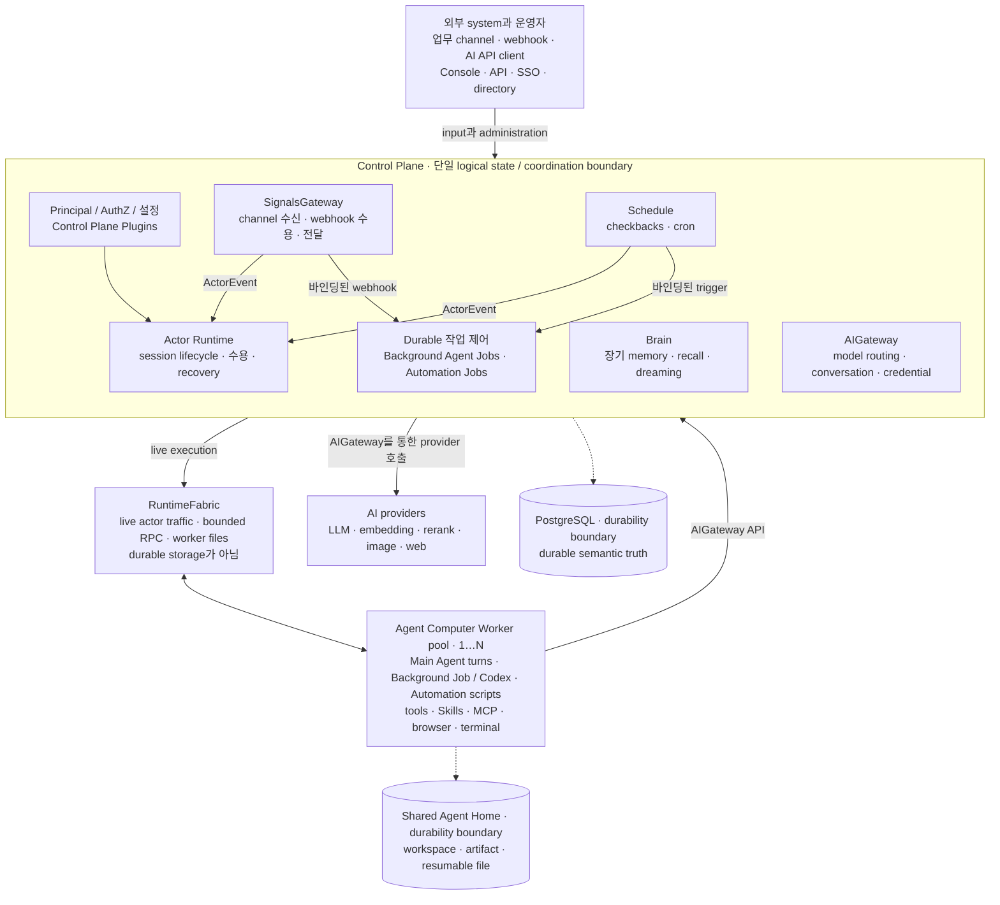

# Ankole — 오픈소스 AI Workforce OS

[](LICENSE)


[](https://deepwiki.com/AgentBull/ankole)

[English](./README.md) | [简体中文](./README.zh-Hans.md) | [日本語](./README.ja.md)

[왜 다른가](#agent-능력에서-자율적인-노동력으로) · [업무 기능](#ankole에-맡길-수-있는-업무-기능) · [Actor Runtime](#actor-runtime) · [아키텍처](#아키텍처) · [현재 상태](#현재-상태) · [개발](#개발)

**AI Agent를 업무 기능을 자율적으로 수행하고 성과로 평가받는 노동력으로 바꿉니다.**

대부분의 AI 제품은 사람에게 model, assistant 또는 copilot을 제공합니다. 다음 단계의 판단, context 전달, tool 호출, 실패 처리, 작업 완료는 여전히 사람의 몫입니다.

Ankole은 실행 loop를 Agent에게 넘깁니다. 업무 기능, 결과 지표, 권한, tools, context를 정의하면 Agent가 계획하고 실행하며, 승인이나 예외의 경계에서 확인을 요청하고, 검사하고 채점할 수 있는 결과를 납품합니다.

Ankole은 오픈소스이며 셀프호스팅할 수 있습니다. Identity, context, credential, artifact, audit 기록, 실행은 모두 사용자가 통제하는 infrastructure에 남습니다.

이것이 **service as software**입니다. Software는 사람이 service를 제공하는 것을 돕는 데 그치지 않고 service를 직접 수행합니다. Ankole은 고부가가치 knowledge work에서 이것을 가능하게 하는 runtime을 제공합니다.

## Agent 능력에서 자율적인 노동력으로

Copilot은 사람이 작업을 끝내는 데 필요한 노력을 줄여 주지만, 실행 loop는 사람이 계속 쥐고 있습니다. Ankole은 실행 loop의 기본 소유자를 바꿉니다. Agent가 정의된 업무 기능 안에서 관찰하고, 판단하고, 행동하고, 후속 조치를 취하고, 납품합니다.

- **Chat persona가 아니라 업무 기능.** 각 Agent는 지속적인 책임, 예상 납품물, 업무 context, 결과 지표를 가집니다. Identity는 사람을 흉내 내기 위한 것이 아니라 권한과 이력을 보유하기 위해 존재합니다.
- **활동이 아니라 성과.** 업무는 비즈니스에 중요한 숫자, 즉 수익, risk, 순위, 승인율, 단위 cost 또는 사전에 선언한 다른 결과로 측정됩니다.
- **다음 단계 제안이 아니라 실행 loop.** Agent가 계획, tool 사용, follow-up, recovery, 납품을 담당합니다. 사람이 모든 단계를 이끌 필요가 없습니다.
- **경계가 있는 권한.** Identity, AuthZ, audit 기록, 승인 지점, escalation path가 Agent가 할 수 있는 일과 사람이 판단해야 하는 시점을 정의합니다.
- **단일 request가 아니라 장시간 작업.** Session은 몇 시간 또는 며칠 동안 작동하고, 새로운 입력을 받고, 실패 후 복구하며, 다음 행동에 필요한 context를 유지할 수 있습니다.

자율적인 작업은 정확한 현재 context에 의존합니다. Ankole은 모든 과거 message를 동등한 사실로 취급하는 대신, 규칙, 결정, 수정, 결과를 시간과 출처와 함께 기록합니다.

Brain은 오래된 규칙을 퇴역시키고, 관련된 수정을 통합하며, 충돌을 판정하고, 과거 예측을 이후의 실제 결과와 비교합니다. 각 실행은 더 정확한 운영 인식에서 시작합니다.

## 자율적인 노동력을 가능하게 하는 것

- **긴 Job은 background에서 실행됩니다.** Job은 몇 시간 동안 실행되고, 원래 channel로 돌아와 실패한 단계를 보고하고, Main Agent를 막지 않고 재시도할 수 있습니다.
- **공유 context가 working memory가 됩니다.** 아무도 Agent에게 직접 말하지 않았더라도 규칙, 선호, 거부된 안이 memory에 들어올 수 있습니다.
- **Memory는 변화하는 세계를 다룹니다.** Brain은 지식을 큐레이션하고, 오래된 항목을 퇴역시키고, 증거를 바탕으로 추론하며, 외부 변화를 직접 받아들입니다.
- **Deep Research가 playbook이 됩니다.** Fan-out retrieval, 단계적 검증, 경쟁 가설 분석이 출처가 있는 report를 만듭니다. 성공한 방법은 다음 실행을 안내할 수 있습니다.
- **실제 browser가 실제 작업을 합니다.** Agent는 렌더링된 page를 읽고, click, type, evidence 캡처, Playwright script 실행을 할 수 있으며, 여러 단계에 걸쳐 로그인 session을 유지할 수 있습니다.
- **Skill은 사람의 통제 아래 개선됩니다.** Agent가 skill 업데이트를 제안할 수 있고, 사람이 승인한 후에야 이후 session에 적용됩니다.
- **Agent 하나 또는 여러 개를 실행합니다.** 각 Agent는 고유한 기능, 권한, tools, memory, 대외 identity를 가질 수 있습니다. Multi-agent 실행은 선택 사항입니다.
- **기업 identity와 업무 channel이 직접 연결됩니다.** Lark, Slack, DingTalk, Teams, Google Workspace, webhook, schedule, 내부 system이 하나의 signal boundary를 통해 들어옵니다.

## Ankole에 맡길 수 있는 업무 기능

Ankole은 디지털로 완결할 수 있고, 검사 가능한 납품물을 만들 수 있으며, 결과 지표가 있는 업무에 적합합니다. 지표로는 ROI, risk-adjusted return, 순위 변화, 승인율 또는 다른 business outcome을 사용할 수 있습니다.

| 업무 기능 | 납품물 | 측정 기준 |
|---|---|---|
| Performance marketing | Campaign 계획, 입찰, creative, 예산 조정 | Incremental ROAS와 고객 확보 cost |
| 업계 조사와 trading | 조사, 가설, portfolio 조치, review | 초과 수익, Sharpe ratio, 최대 drawdown |
| 검색 엔진 최적화 | Keyword 계획, content brief, on-page 변경 | 순위 변화와 유효 organic traffic |
| 규제 업무 | 제출 자료 일체와 결함 보완 답변 | 일차 승인율과 질의 라운드 수 |
| 특허 절차 | 선행 기술 조사, claim draft, office action 답변 | 등록율과 office action 라운드 수 |
| Smart contract audit | 재현 가능한 PoC가 포함된 감사 report | 치명적 누락과 false-positive 비율 |

단위는 Agent 수가 아니라 업무 기능입니다. 하나의 Agent가 좁은 기능을 담당할 수도 있고, 여러 Agent가 실행을 분담할 수도 있습니다. Multi-agent coordination은 구현 방식이지 제품의 약속이 아닙니다.

공통 contract는 **업무 기능을 정의하고, 경계가 있는 권한을 부여하며, Agent가 일하도록 맡기고, 결과를 평가하는 것**입니다.

## Actor Runtime

Ankole은 장시간 AI 작업을 위한 actor-oriented runtime입니다. 각 active session은 주소 지정이 가능한 virtual actor로, wake, message 수신, checkpoint, progress streaming, hibernate, recover, continue가 가능하며, agent를 단순한 HTTP request나 queue job으로 취급하지 않습니다.

Runtime은 다섯 가지 technical bet을 중심으로 만들어졌습니다.

- **Virtual Actors for AI work.** Session은 address, mailbox, lifecycle, recovery path를 가진 상태 보존형 작업 identity이지, 느슨한 background 작업이 아닙니다.
- **OTP Supervision Trees as failure domains.** 하나의 agent가 hang, timeout, crash 되어도 Ankole은 해당 branch를 isolate하거나 restart하여 배포 전체의 failure로 번지지 않게 할 수 있습니다.
- **ZeroMQ Activation Fabric for live control.** Wakeup, steering, checkpoint, streaming, backpressure는 agent가 작업 중에도 낮은 지연 시간의 routing layer를 통해 이동합니다.
- **Agent Computer as the execution substrate.** LLM loop, tools, files, terminal state, streaming output은 workspace와 가까운 Bun + TypeScript computer 안에서 실행됩니다.
- **Durable Ledger for recovery and audit.** Mailbox, turn, reminder, decision, committed side effect는 process보다 오래 유지됩니다. Streaming은 progress이고, commit된 작업이 truth입니다.

사용자와 운영자에게 약속은 단순합니다. Agent는 몇 시간 또는 며칠 동안 일하고, 실행 중에 새 입력을 받고, 독립적으로 실패하며, context를 유지한 채 복구하고, side effect를 설명 가능하게 유지합니다. Runtime에 대한 더 자세한 논거는 [OTP가 멀티 에이전트 오케스트레이션에 더 나은 runtime인 이유](https://ding.ee/en-US/why-otp-is-a-better-runtime-for-multi-agent-orchestration/)에 정리되어 있습니다.

이것이 Ankole의 기술적 선택입니다. 오래 지속되는 작업 identity에는 actor model, failure semantics에는 OTP, live activation에는 ZeroMQ, 로컬 실행에는 Agent Computer를 사용합니다. 이를 통해 Ankole은 chatbot backend가 아니라 AI Workforce OS로 작동합니다.

## 아키텍처

이 다이어그램은 ownership과 durability boundary를 보여 줍니다. 모든 내부 call을 나열한 것은 아닙니다.



전체적으로 보면:

- **하나의 control plane이 state와 coordination을 소유합니다.** Principal/AuthZ, SignalsGateway, Schedule, Actor Runtime, Job lifecycle, Brain, AIGateway는 Elixir/OTP에서 durable decision을 내리고, semantic fact는 PostgreSQL에 저장합니다.
- **Trigger owner는 분리되어 있습니다.** SignalsGateway는 channel과 webhook 수용을, Schedule은 checkback과 cron을 담당합니다. 각 trigger는 기본적으로 Actor session을 wake시키며, binding이 있으면 durable Automation Job run을 만듭니다.
- **Workers는 교체 가능한 실행을 제공합니다.** 하나 이상의 Agent Computer Worker 풀이 Main Agent turn, Background Job/Codex turn, Automation script를 실행합니다. RuntimeFabric은 live actor traffic, bounded RPC, worker-file operation을 전달하지만 durable queue는 아닙니다.
- **AIGateway는 통합 AI 경계입니다.** OpenResponses 호환 HTTP, SSE, WebSocket API가 stateless request와 Principal 범위의 stateful conversation을 지원합니다. LLM, embedding, rerank, web-search, web-fetch provider에 걸쳐 model을 라우팅하며, upstream credential은 control plane 안에 유지됩니다.
- **Brain은 long-term memory입니다.** 큐레이션된 현재 지식, source-chat recall, dreaming, human oversight를 결합합니다. PostgreSQL row가 truth이고, Markdown과 injected context는 projection입니다.
- **두 Job 유형은 서로 다른 약속을 합니다.** Background Agent Job은 다시 시작하고 입력을 기다릴 수 있는 interactive한 model 기반 작업입니다. Automation Job은 Agent가 소유한 deterministic script로, trigger를 소비할 때마다 durable run이 만들어지며 owner session에 event를 보낼 수 있습니다.
- **Durability에는 두 가지 형태가 있습니다.** PostgreSQL이 semantic truth를 소유하고, shared Agent Home 저장소가 workspace, artifact, resumable file을 보관합니다. RuntimeFabric과 Worker process state는 다시 구축할 수 있습니다.

## 현재 상태

Ankole은 production에서 가동 중인 완전한 셀프호스팅 AI Workforce OS입니다. Control plane, Agent Computer, kernel, 운영 console이 end to end로 작동합니다.

- **다양한 model provider.** OpenAI, Azure OpenAI, Claude, Google AI Studio, OpenRouter 및 기타 OpenAI 호환 endpoint가 일급으로 지원되며, compaction, stateful conversation, reasoning-effort 제어, provider별 usage 처리를 제공합니다.
- **실제 IM 통합.** Lark/Feishu와 Slack이 first-party provider로 통합되어 lifecycle, transport, main flow, real-LLM end-to-end 커버리지를 제공합니다.
- **Brain.** 큐레이션된 지식, chat recall, dreaming(오프라인 통합), human review, recovery가 하나의 subsystem에 있으며, PostgreSQL 전체 텍스트 및 vector 검색으로 뒷받침됩니다.
- **장시간 actor runtime.** Session은 wake, checkpoint, progress streaming, hibernate, context를 유지한 recovery가 가능합니다. Steering과 cancellation은 request/response가 아니라 live-control 작업입니다.
- **운영 console.** Agents, Agent Library 기본값과 override, Control Plane Plugins, providers, model profiles, identity, signals, workers, worker 환경, brain entries, Background Agent Jobs를 내장 web console에서 관리할 수 있습니다.
- **실전 조건을 위한 테스트.** Unit suite 외에도 Lark와 Slack의 main flow, transport, lifecycle, real-LLM, scheduling, worker computer, chaos recovery, concurrency/performance를 위한 전용 end-to-end suite가 있습니다.

Ankole의 public API에는 아직 호환성 계약이 없습니다. 릴리스 사이에 breaking change가 발생할 수 있습니다.

| 영역 | 상태 |
| --- | --- |
| Control plane | `app/control_plane`의 Phoenix/OTP application. durable state, configuration, actor orchestration, Principal/AuthZ, AIGateway, Brain, SignalsGateway, 운영 API를 담당합니다. |
| Agent Computer | `app/agent_computer`의 Bun/TypeScript worker runtime. 격리된 Linux worker image 안에서 agent loop와 로컬 tools를 실행합니다. standalone CLI가 아닙니다. |
| Kernel | `app/kernel`의 Rust crate. Elixir (Rustler)와 Bun (N-API)이 로드하여 crypto, identifier, AuthZ evaluation, ZeroMQ transport를 담당합니다. |
| Frontend | `app/webapps`의 Vite + React console, auth, setup 표면. Phoenix static shell로 빌드됩니다. |
| 로컬 서비스 | PostgreSQL은 devkit Docker Compose 설정으로 제공됩니다. |
| 설계 문서 | 아키텍처와 runtime 설계 문서는 `docs/design-docs` 아래에 있습니다. |
| Production 준비 | production에서 가동 중입니다. Durable 경로, live control, 운영 표면은 완성되었으며, public API에는 아직 호환성 계약이 없습니다. |

## 현재 리포지토리

이 리포지토리는 현재 활성화된 Ankole control-plane 및 runtime workspace입니다.

- `app/control_plane` - Principal/AuthZ, AppConfigure, setup, console, Control Plane Plugin registry, I18n, SignalsGateway, actor runtime, RuntimeFabric, PostgreSQL이 소유한 durable state를 담당하는 Phoenix/OTP control plane.
- `app/kernel` - Elixir와 Bun이 로드하는 공용 Rust foundation. crypto, identifier, phone/JWT helpers, AuthZ evaluation, protobuf envelopes, ZeroMQ RuntimeFabric transport를 담당합니다.
- `app/agent_computer` - 로컬 LLM loop, provider adapters, tools, skill loading, files, terminal state, worker daemon을 담당하는 Bun + TypeScript Agent Computer worker.
- `app/webapps` - auth, setup, console 표면을 위한 Vite + React frontend applications. Phoenix static shell로 빌드됩니다.
- `app/library` - 내장 standalone Skills, first-party Agent Plugins, `MISSION.md`, `SOUL.md` 같은 starter templates.
- `app/locales` - control plane과 browser 표면이 공유하는 TOML translation catalogs.
- `libs/uikit` - Ankole webapps에서 공유하는 UI primitives.
- `libs/feishu_openapi` - 로컬 Lark/Feishu OpenAPI client library.
- `libs/slack_openapi` - 로컬 Slack Web API, Socket Mode, OIDC client library.
- `internals/plugins` - private release로 컴파일되는 first-party Control Plane Plugin 코드.
- `tools/devkit` - 로컬 서비스, app database helpers, code generation, analysis를 위한 workspace automation.
- `docs/design-docs` - principal identity, authorization, configuration, I18n, plugins, RuntimeFabric, SignalsGateway, provider adapters에 대한 현재 설계 문서.

RuntimeFabric은 control plane에서 worker로의 live fabric입니다. ZeroMQ 위에서 actor traffic, bounded RPC, worker-file frames을 전달하며, PostgreSQL은 durable replay, fences, reconciliation, final commits의 source of truth로 남습니다. SignalsGateway는 provider-ingress 계층으로, 외부 chat, webhook, provider event를 actor event로 바꾸되 source fact를 execution state로 만들지 않습니다.

## 개발

Ankole은 workspace scripts에는 Bun을, control plane에는 Elixir/Phoenix를 기본으로 사용합니다.

처음 로컬 환경을 구성할 때는 다음 한 문단의 prompt를 coding agent에 그대로 붙여 넣으세요.

```text
https://github.com/AgentBull/ankole/blob/main/CONTRIBUTING.md를 끝까지 읽고, 그런 다음 안내에 따라 완전한 로컬 Ankole 설정과 문서화된 end-to-end 검증을 진행해 주세요. 해당 가이드를 진실의 원천으로 취급하고, 안전하고 되돌릴 수 있는 모든 단계를 직접 수행하고 검증하되, 사람의 계정, secret, OAuth 또는 파괴적인 승인 작업에서는 멈추고 확인을 받으세요. 명시된 성공 기준이 모두 통과할 때까지 완료를 선언하지 마세요.
```

```shell
bun install

# Local support services and workspace helpers
bun kit --help
bun services:start
bun services:status

# Control plane
bun control-plane:setup
bun control-plane:dev
bun control-plane:test

# Agent Computer container image and tests
bun agent-computer:test
bun agent-computer:type-check

# Other Bun packages
bun webapps:build
bun feishu-openapi:test
```

Agent Computer는 Linux container runtime으로 설계되었습니다. 강력한 bubblewrap 명령 격리를 위해서는 동등한 사용자 지정 seccomp/profile 설정을 제공하지 않는 한, Docker를 `--cap-add SYS_ADMIN`, `--security-opt seccomp=unconfined`, `--security-opt systempaths=unconfined`와 함께 실행하세요. Kubernetes에서는 동등한 `capabilities.add: ["SYS_ADMIN"]`, `seccompProfile`, `procMount: Unmasked`를 Agent Computer container의 `securityContext`에 지정하세요. 강력한 bubblewrap을 사용할 수 없으면 worker는 약한 bubblewrap(container의 `/proc`을 bwrap에 bind-mount)으로 낮춰지고 시작 시 warning을 출력합니다. 샌드박스가 없는 model-facing 명령으로 절대 대체되지 않습니다.

workspace가 빠르게 움직이는 동안에는 package-local 검증을 우선합니다.

```shell
bun run --filter @ankole/control-plane test
bun run agent-computer:test
bun run --filter @ankole/agent-computer type-check
bun run --filter @ankole/webapps type-check
bun run --filter @ankole/feishu-openapi test
```

Control plane이 실행되고 나면 worker bootstrap helper가 로컬 RuntimeFabric endpoint에 대해 외부 Agent Computer worker를 시작하는 데 사용하는 Docker 명령을 생성합니다.

```shell
cd app/control_plane
mix ankole.actor_runtime.worker_bootstrap --endpoint tcp://127.0.0.1:6010 --worker-id worker-a
```

Production bootstrap configuration은 `DATABASE_URL`, `SECRET_KEY_BASE` 같은 표준 infrastructure 이름을 사용합니다. Runtime application configuration은 process-local environment variables가 아니라 Ankole의 PostgreSQL 기반 AppConfigure 표면에 속합니다.

Brain은 `pg_search`가 미리 로드되고 `pg_search`와 `vector`가 모두 설치된 PostgreSQL 18을 요구합니다. Model profiles와 destructive 대 incremental database 절차는 [Brain 운영 가이드](docs/operations/Brain.md)에 문서화되어 있습니다. 전용 real-model 승인 경로는 `tools/e2e/run --brain-real-llm`이며, 기본 test gate나 `--all`에 포함되지 않습니다.