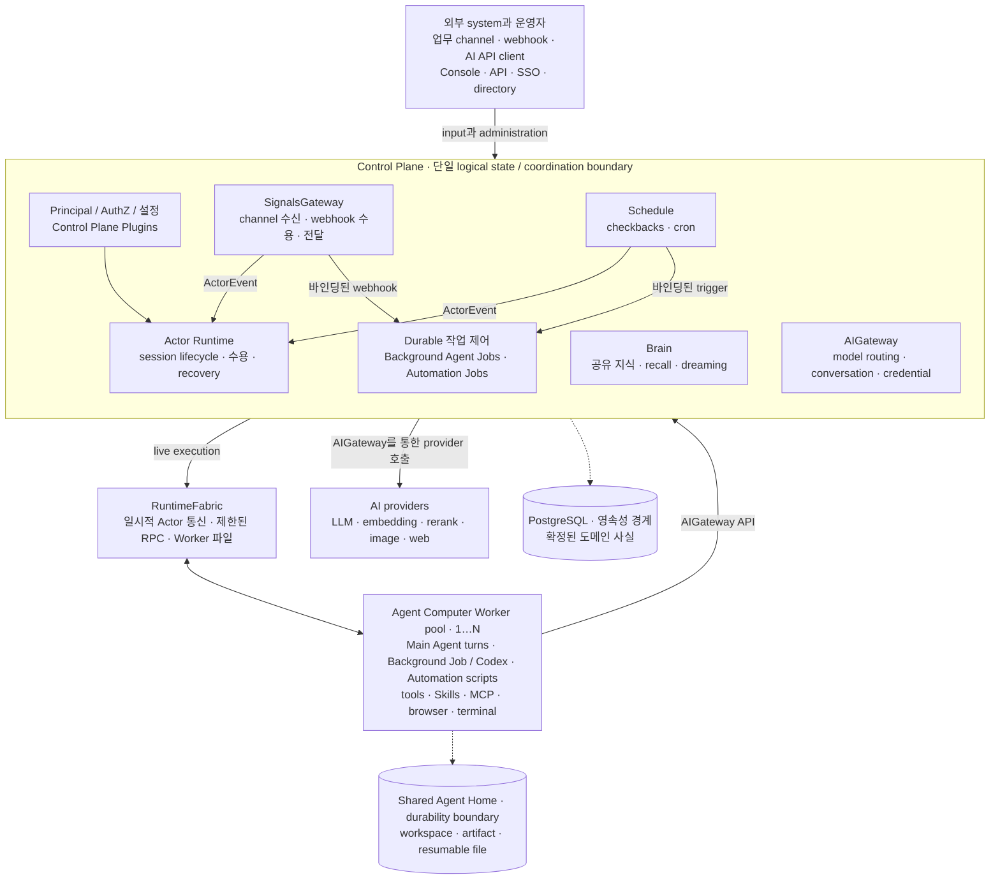

# Ankole, Company Brain을 갖춘 기업용 Agent Harness

[](LICENSE)


[](https://deepwiki.com/AgentBull/ankole)

[English](./README.md) | [简体中文](./README.zh-Hans.md) | [日本語](./README.ja.md)

[Ankole을 선택하는 이유](#ankole을-선택하는-이유) · [Company Brain](#company-brain) · [의사결정 업무](#의사결정-업무) · [기업용 런타임](#기업용-런타임) · [아키텍처](#아키텍처) · [현재 상태](#현재-상태) · [개발](#개발)

**Company Brain이 모든 Agent에 회사 지식을 제공하고 판단을 개선합니다.**

Ankole은 Company Brain을 갖춘 오픈 소스 Claude Code 대안입니다. 기업용 Agent Harness가 회사 지식, 실시간 신호, 권한, 도구, 실제 결과를 Agent의 판단에 필요한 컨텍스트로 구성합니다.

Company Brain은 지속해서 실행되는 Agent에 공유 지식을 제공합니다. Harness는 회사의 권한 규칙을 적용하고 모델 호출이 끝난 뒤에도 업무를 이어 갑니다.

모델의 추론 범위는 제공된 컨텍스트로 결정됩니다. Ankole은 관련 사실과 기능을 선택하고 권한을 적용합니다. 장애 후에도 작업을 이어 가며 결과를 다음 의사결정에 반영합니다.

Ankole은 회사가 관리하는 인프라에서 실행할 수 있습니다. ID, 컨텍스트, 자격 증명, 결과물, 감사 기록, 실행 내역은 해당 인프라에 남습니다.

Harness는 각 모델 호출에 연속성, 권한, 영속 상태, 결과 피드백을 제공합니다.

## Ankole을 선택하는 이유

시중의 많은 Agent 스택은 모델, 프롬프트, 도구를 연결합니다. 각 호출은 그때 구성한 컨텍스트에서 시작합니다. Ankole은 호출이 끝난 뒤에도 이어지는 업무에 필요한 회사 상태와 런타임을 유지합니다.

- Harness는 현재 컨텍스트를 구성하고 기능을 선택하며 권한을 적용합니다. 모델 호출이 끝난 뒤에도 상태를 보존합니다.
- 메시지, 일정, Webhook, 시장 변화, 내부 이벤트가 담당 Agent를 깨웁니다.
- 안정적인 ID, AuthZ, 승인 지점, 감사 기록, 전달 상태가 각 Agent의 권한을 정합니다.
- 수정, 새로운 증거, 만료된 사실, 실제 결과가 다음 의사결정의 컨텍스트를 갱신합니다.

## Company Brain

Company Brain은 권한이 있는 모든 Agent에 동일한 최신 회사 지식을 제공합니다.

Company Brain은 대화, 등록한 파일과 URL, Agent가 명시적으로 기록한 내용에서 학습합니다. 각 Claim은 출처, 시점, 보유자, 신뢰도, 공개 범위를 유지합니다.

- 판단은 보유자와 연결되고 출처는 해당 출처가 뒷받침하는 Claim과 연결됩니다.
- 새로운 증거는 현재 판단을 갱신하고 이전 판단에 이른 과정도 보존합니다.
- 충돌하는 내용은 사람이 검토할 수 있는 상태로 남습니다.
- Recall은 보호된 지식이 모델에 도달하기 전에 Principal과 그룹의 공개 범위를 적용합니다.
- Dreaming은 증거를 정리하고 패턴을 찾으며 평가 시점이 된 예측을 검증하고 변경안을 사람의 승인으로 보냅니다.

## 의사결정 업무

Ankole은 가설과 결과를 검증해야 하는 의사결정을 지원합니다. 현재 예시는 산업 연구, 상품 선정, 심층 데이터 분석, 예측입니다.

- Agent는 현재 규칙, 이전 결정, 관련 증거, 사용 가능한 권한, 최근 변화를 확인하고 업무를 시작합니다.
- Deep Research는 증거 수집을 독립된 실행자에게 나누고 경쟁 가설을 검증합니다. 증거 부족을 기록하고 출처가 있는 보고서를 반환합니다.
- 브라우저, 터미널, 파일, 모델, 외부 시스템을 통해 Agent는 권한 범위에서 조사하고 실행합니다.
- 예측, 수정, 실제 결과가 다음 의사결정의 증거가 됩니다.

## 기업용 런타임

Ankole은 각 활성 Session을 주소로 찾을 수 있는 Virtual Actor로 실행합니다. Actor는 시작, 메시지 수신, 체크포인트, 진행 상황 전송, 휴면, 복구, 작업 재개를 지원합니다.

다섯 가지 방식이 업무 연속성과 감사 기록을 유지합니다.

- Virtual Actor는 각 Session에 주소, 메일함, 수명 주기, 복구 위치를 부여합니다.
- OTP 감독 트리는 멈춤, 시간 초과, 비정상 종료가 발생한 Session 분기를 격리합니다.
- ZeroMQ는 시작, 실행 중 조정, 체크포인트, 스트림, 역압을 낮은 지연 시간으로 전달합니다.
- Agent Computer는 작업 공간 가까이에서 모델 루프, 도구, MCP 서비스, 파일, 터미널, 스트리밍 출력을 실행합니다.
- PostgreSQL은 Mailbox, Turn, 알림, 의사결정, 확정된 작업을 저장하고 복구와 감사에 사용합니다.

Agent는 몇 시간 또는 며칠 동안 일하고 실행 중에 새 입력을 받습니다. 장애를 개별적으로 처리하고 컨텍스트를 유지한 채 복구하며 확정된 작업을 기록합니다. 자세한 설계는 [OTP가 멀티 에이전트 오케스트레이션에 더 나은 런타임인 이유](https://ding.ee/en-US/why-otp-is-a-better-runtime-for-multi-agent-orchestration/)에서 설명합니다.

## 아키텍처

이 다이어그램은 소유권과 영속성 경계를 보여 줍니다. 내부 호출은 생략했습니다.



Elixir/OTP Control Plane은 Principal/AuthZ, SignalsGateway, Schedule, Actor Runtime, Job 수명 주기, Brain, AIGateway의 영속 결정을 담당합니다. PostgreSQL은 각 영역에서 확정된 사실을 저장합니다.

- SignalsGateway는 채널과 Webhook 접수를 담당합니다. Schedule은 Checkback과 Cron을 담당합니다.
- Agent Computer Worker는 Main Agent Turn, Background Job, Codex Turn, Automation 스크립트를 실행합니다.
- RuntimeFabric은 일시적인 Actor 통신, 제한된 RPC, Worker 파일 작업을 전달합니다.
- AIGateway는 LLM, Embedding, Rerank, Web Search, Web Fetch 요청을 Control Plane의 공통 경계에서 처리합니다.
- Brain은 공유 Page와 Claim을 저장합니다. 읽을 때 요청 Principal의 지식 경계를 적용합니다.
- Background Agent Job은 대화형 모델 작업을 실행합니다. Automation Job은 Agent가 소유한 결정적 스크립트를 실행합니다.
- 공유 Agent Home은 작업 공간, 결과물, 재개용 파일을 저장합니다. Worker 프로세스 상태는 다시 만들 수 있습니다.

## 현재 상태

Ankole은 회사가 관리하는 인프라에서 운영할 수 있는 완전한 Agent Harness로 프로덕션에서 실행 중입니다. Control Plane, Agent Computer, Kernel, 운영 콘솔을 한 환경에 배치할 수 있습니다.

- OpenAI, Azure OpenAI, Claude, Google AI Studio, OpenRouter, 기타 OpenAI 호환 엔드포인트는 컨텍스트 압축, 상태가 있는 대화, 추론 강도 제어, 사용량 기록을 지원합니다.
- Lark, Feishu, Slack 연동에는 수명 주기, 통신, 주요 흐름, 실제 LLM 호출을 검증하는 전용 테스트가 있습니다.
- Brain은 범위에 따른 공개, 대화와 Source 학습, 오프라인 정리, 운영자 검토, 전문 검색, 벡터 검색을 제공합니다.
- Session은 시작, 체크포인트, 진행 상황 전송, 휴면, 컨텍스트를 유지한 복구, 실행 중 조정과 취소를 지원합니다.
- 내장 운영 콘솔은 Agent, Library 설정, Plugin, 모델 제공자, 모델, Identity, 신호, Worker, Brain, Background Agent Job을 관리합니다.
- 단위 테스트와 전용 시스템 테스트는 일정, Worker Computer, 장애 복구, 동시 실행, 성능을 검증합니다.

공개 API의 호환성 계약은 현재 정의 중입니다. 릴리스 사이에 호환되지 않는 변경이 발생할 수 있습니다.

| 영역 | 상태 |
| --- | --- |
| Control plane | `app/control_plane`의 Phoenix/OTP application. durable state, configuration, actor orchestration, Principal/AuthZ, AIGateway, Brain, SignalsGateway, 운영 API를 담당합니다. |
| Agent Computer | `app/agent_computer`의 Bun/TypeScript Worker 런타임입니다. 격리된 Linux Worker 이미지에서 Agent 루프와 로컬 도구를 실행합니다. Worker 실행 환경으로 사용합니다. |
| Kernel | `app/kernel`의 Rust crate. Elixir (Rustler)와 Bun (N-API)이 로드하여 crypto, identifier, AuthZ evaluation, ZeroMQ transport를 담당합니다. |
| Frontend | `app/webapps`의 Vite + React console, auth, setup 표면. Phoenix static shell로 빌드됩니다. |
| 로컬 서비스 | PostgreSQL은 devkit Docker Compose 설정으로 제공됩니다. |
| 설계 문서 | 아키텍처와 runtime 설계 문서는 `docs/design-docs` 아래에 있습니다. |
| 프로덕션 준비 | 프로덕션에서 가동 중입니다. 상태 영속화, 실시간 제어, 운영 화면은 완성되었습니다. 공개 API의 호환성 계약은 현재 정의 중입니다. |

## 현재 리포지토리

이 리포지토리는 현재 활성화된 Ankole control-plane 및 runtime workspace입니다.

- `app/control_plane` - Principal/AuthZ, AppConfigure, setup, console, Control Plane Plugin registry, I18n, SignalsGateway, actor runtime, RuntimeFabric, PostgreSQL이 소유한 durable state를 담당하는 Phoenix/OTP control plane.
- `app/kernel` - Elixir와 Bun이 로드하는 공용 Rust foundation. crypto, identifier, phone/JWT helpers, AuthZ evaluation, protobuf envelopes, ZeroMQ RuntimeFabric transport를 담당합니다.
- `app/agent_computer` - 로컬 LLM loop, provider adapters, tools, skill loading, files, terminal state, worker daemon을 담당하는 Bun + TypeScript Agent Computer worker.
- `app/webapps` - auth, setup, console 표면을 위한 Vite + React frontend applications. Phoenix static shell로 빌드됩니다.
- `app/library` - 내장 standalone Skills, first-party Agent Plugins, `MISSION.md`, `SOUL.md` 같은 starter templates.
- `app/locales` - control plane과 browser 표면이 공유하는 TOML translation catalogs.
- `libs/uikit` - Ankole webapps에서 공유하는 UI primitives.
- `libs/feishu_openapi` - 로컬 Lark/Feishu OpenAPI client library.
- `libs/slack_openapi` - 로컬 Slack Web API, Socket Mode, OIDC client library.
- `internals/plugins` - private release로 컴파일되는 first-party Control Plane Plugin 코드.
- `tools/devkit` - 로컬 서비스, app database helpers, code generation, analysis를 위한 workspace automation.
- `docs/design-docs` - principal identity, authorization, configuration, I18n, plugins, RuntimeFabric, SignalsGateway, provider adapters에 대한 현재 설계 문서.

RuntimeFabric은 control plane에서 worker로의 live fabric입니다. ZeroMQ 위에서 actor traffic, bounded RPC, worker-file frames을 전달하며, PostgreSQL은 durable replay, fences, reconciliation, final commits의 source of truth로 남습니다. SignalsGateway는 provider-ingress 계층으로, 외부 chat, webhook, provider event를 actor event로 바꾸되 source fact를 execution state로 만들지 않습니다.

## 개발

Ankole은 workspace scripts에는 Bun을, control plane에는 Elixir/Phoenix를 기본으로 사용합니다.

처음 로컬 환경을 구성할 때는 다음 한 문단의 prompt를 coding agent에 그대로 붙여 넣으세요.

```text
https://github.com/AgentBull/ankole/blob/main/CONTRIBUTING.md를 끝까지 읽고, 그런 다음 안내에 따라 완전한 로컬 Ankole 설정과 문서화된 end-to-end 검증을 진행해 주세요. 해당 가이드를 진실의 원천으로 취급하고, 안전하고 되돌릴 수 있는 모든 단계를 직접 수행하고 검증하되, 사람의 계정, secret, OAuth 또는 파괴적인 승인 작업에서는 멈추고 확인을 받으세요. 명시된 성공 기준이 모두 통과할 때까지 완료를 선언하지 마세요.
```

```shell
bun install

# Local support services and workspace helpers
bun kit --help
bun services:start
bun services:status

# Control plane
bun control-plane:setup
bun control-plane:dev
bun control-plane:test

# Agent Computer container image and tests
bun agent-computer:test
bun agent-computer:type-check

# Other Bun packages
bun webapps:build
bun feishu-openapi:test
```

Agent Computer는 Linux container runtime으로 설계되었습니다. 강력한 bubblewrap 명령 격리를 위해서는 동등한 사용자 지정 seccomp/profile 설정을 제공하지 않는 한, Docker를 `--cap-add SYS_ADMIN`, `--security-opt seccomp=unconfined`, `--security-opt systempaths=unconfined`와 함께 실행하세요. Kubernetes에서는 동등한 `capabilities.add: ["SYS_ADMIN"]`, `seccompProfile`, `procMount: Unmasked`를 Agent Computer container의 `securityContext`에 지정하세요. 강력한 bubblewrap을 사용할 수 없으면 worker는 약한 bubblewrap(container의 `/proc`을 bwrap에 bind-mount)으로 낮춰지고 시작 시 warning을 출력합니다. 샌드박스가 없는 model-facing 명령으로 절대 대체되지 않습니다.

변경한 패키지별로 검증을 실행합니다.

```shell
bun run --filter @ankole/control-plane test
bun run agent-computer:test
bun run --filter @ankole/agent-computer type-check
bun run --filter @ankole/webapps type-check
bun run --filter @ankole/feishu-openapi test
```

Control plane이 실행되고 나면 worker bootstrap helper가 로컬 RuntimeFabric endpoint에 대해 외부 Agent Computer worker를 시작하는 데 사용하는 Docker 명령을 생성합니다.

```shell
cd app/control_plane
mix ankole.actor_runtime.worker_bootstrap --endpoint tcp://127.0.0.1:6010 --worker-id worker-a
```

프로덕션 초기 설정에는 `DATABASE_URL`, `SECRET_KEY_BASE` 같은 표준 인프라 이름을 사용합니다. 런타임 애플리케이션 설정은 Ankole의 PostgreSQL AppConfigure 레코드에 저장합니다.

Brain에는 `pg_search`를 미리 로드하고 `pg_search`, `vector`, `pg_trgm` 확장을 제공하는 PostgreSQL이 필요합니다. BrainV3 마이그레이션이 확장을 설치하고, `tools/devkit/postgres-for-ankole`가 필요한 이미지를 빌드합니다.
