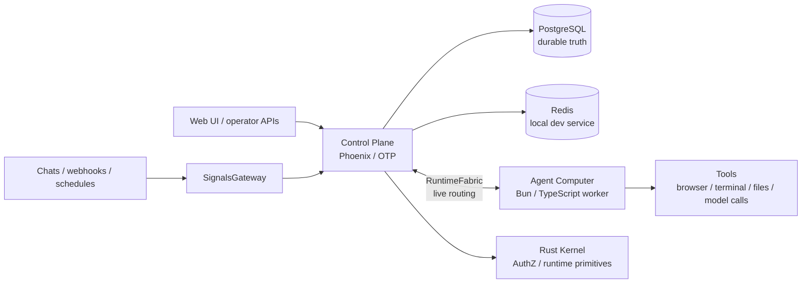

# Ankole - Open AgentOS for Shared AI Colleagues

[](LICENSE)


[简体中文](./README.zh-Hans.md) | [日本語](./README.ja.md)

**Ankole is a self-hosted AgentOS for shared AI colleagues.**

It moves AI work out of a private chat box and into the places where work already happens: channels, repositories, schedules, dashboards, internal systems, and long-running project context. An Ankole agent has its own identity, memory, permissions, tools, workspace, and responsibility boundary — so it can **own ongoing work**, not just answer a one-off message.

[Claude Tag](https://claude.com/product/tag) is a useful public reference point: tag an AI into a Slack thread, let it read the shared context, use organization tools, remember channel context, and follow up when work takes time. Ankole targets the broader open version of that pattern: not only Slack, not only Claude, not only one agent, and not vendor-owned context.

Ankole is for work that needs an owner, not just an answer. A good Ankole role has a visible result: code merged, a report shipped, a customer issue handled, an alert triaged, a market change noticed, or a backlog worked down.

## How Ankole is different

- **Shared by default, not private chat.** Agents join team-visible channels and provider contexts; multiple humans can observe, steer, and continue the same work.
- **Durable identity, not a prompt convention.** Humans and agents are Principals with permission grants and audit trails, so authorization is a runtime concern.
- **Long-running actor sessions, not request/response.** Sessions wake, receive signals, checkpoint, stream progress, hibernate, and recover with context.
- **Operator-owned context, not vendor-hosted.** Memory, configuration, credentials, and audit live in your infrastructure on a self-hosted installation.
- **Live control plus durable truth, not one or the other.** ZeroMQ RuntimeFabric carries live actor/worker/RPC traffic while PostgreSQL remains the source of replay, fences, and final commits.

## What Ankole Adds

- **Shared work, not private chat.** Agents can be brought into shared channels and provider contexts where multiple humans can observe, steer, and continue the work.
- **Durable identity.** Humans and agents are represented as Principals with external identities, groups, and permission grants.
- **Many sources.** IM, webhooks, scheduled reminders, internal systems, and future provider adapters all become normalized signal input.
- **Many agents.** One installation can host multiple agents with different missions, access, tools, memory, and outbound identities.
- **Session actors.** The long-running execution unit is `actor_id = {agent_id, session_id}`. A session is where context, workspace state, steering, cancellation, and recovery meet.
- **Owned context.** Conversations, model turns, summaries, signal projections, decisions, corrections, and future domain records live in your infrastructure.
- **Operator control.** Access, configuration, plugin activation, actor leases, outbox side effects, and audit surfaces belong to the installation operator.

## Product Shape

Ankole should make these workflows natural:

- A coding agent watches an issue, reproduces the bug, changes code, opens a draft PR, and reports what still needs a human decision.
- A customer-success agent observes a shared group chat, records the important facts, updates work state, and escalates privately only when needed.
- A research agent monitors markets, policy, competitors, and internal notes, then follows up when a change matters.
- A QA agent works through a test backlog, gathers evidence, and hands off failures with enough context for review.
- An operations agent watches alerts, prepares a runbook, and asks for approval before taking risky action.

The common pattern is not "answer this question." It is "hold this seat, use the available context, and be judged by the result."

## Actor Runtime

Ankole is an actor-oriented runtime for long-running AI work. Each active session is an addressable virtual actor: it can wake, receive messages, checkpoint, stream progress, hibernate, recover, and continue without pretending an agent is just an HTTP request or a queue job.

The runtime is built around five technical bets:

- **Virtual Actors for AI work.** A session is a stateful work identity with an address, mailbox, lifecycle, and recovery path, not loose background work.
- **OTP Supervision Trees as failure domains.** If one agent hangs, times out, or crashes, Ankole can isolate or restart that branch without turning it into a deployment-wide failure.
- **ZeroMQ Activation Fabric for live control.** Wakeups, steering, checkpoints, streaming, and backpressure move through a low-latency routing layer while the agent is still working.
- **Agent Computer as the execution substrate.** The LLM loop, tools, MCP servers, files, terminal state, and streaming output run inside a Bun + TypeScript computer close to the workspace.
- **Durable Ledger for recovery and audit.** Mailboxes, turns, reminders, decisions, and committed side effects outlive processes. Streaming is progress; committed work is truth.

For users and operators, the promise is simple: agents can work for hours or days, receive new input while running, fail independently, recover with context, and keep their side effects accountable. A longer version of the runtime argument is in [Why OTP Is a Better Runtime for Multi-Agent Orchestration](https://ding.ee/en-US/why-otp-is-a-better-runtime-for-multi-agent-orchestration/).

That is the technical bet: actor model for long-lived work identity, OTP for failure semantics, ZeroMQ for live activation, and Agent Computer for local execution. Ankole is closer to a distributed operating system for AI work than a chatbot backend.

## Architecture



At a high level:

- **SignalsGateway** accepts provider ingress and normalizes it into actor inputs.
- **Control Plane** owns durable state, actor orchestration, configuration, identity, and authorization.
- **RuntimeFabric** connects actors, workers, and RPC lanes for live execution over ZeroMQ while PostgreSQL remains the durable source of replay, fences, reconciliation, and final commits.
- **Agent Computer** executes turns and tools in an isolated worker container.
- **PostgreSQL** remains the durable record for accepted inputs, state, fences, and final commits.

## Current Status

Ankole is an early engineering distribution, not a polished end-user product or hosted SaaS.

| Area | Status |
| --- | --- |
| Control plane | Phoenix/OTP application under `app/control_plane`. Owns durable state, configuration, actor orchestration, Principal/AuthZ, and APIs. |
| Agent Computer | Bun/TypeScript worker runtime under `app/agent_computer`. Runs the agent loop and local tools inside an isolated Linux worker image; not a standalone CLI. |
| Kernel | Rust crate under `app/kernel`, loaded by Elixir (Rustler) and Bun (N-API) for crypto, identifiers, AuthZ evaluation, and ZeroMQ transport. |
| Frontend | Vite + React surfaces under `app/webapps`, built into the Phoenix static shell. |
| Local services | PostgreSQL and Redis are provided through the devkit Docker Compose setup. |
| Design docs | Architecture and runtime design documents live under `docs/design-docs`. |
| Public API stability | Internal APIs are still evolving. Expect breaking changes between releases. |

## Current Repository

This repository is the active Ankole control-plane and runtime workspace. It is still an engineering distribution, not a polished end-user release.

- `app/control_plane` - Phoenix/OTP control plane for Principal/AuthZ, AppConfigure, setup, console, plugin registry, I18n, SignalsGateway, actor runtime, RuntimeFabric, and PostgreSQL-owned durable state.
- `app/kernel` - shared Rust foundation loaded by Elixir and Bun for crypto, identifiers, phone/JWT helpers, AuthZ evaluation, protobuf envelopes, and ZeroMQ RuntimeFabric transport.
- `app/agent_computer` - Bun + TypeScript Agent Computer worker for the local LLM loop, provider adapters, tools, skill loading, files, terminal state, and worker daemon.
- `app/webapps` - Vite + React frontend applications for auth, setup, and console surfaces, built into the Phoenix static shell.
- `app/library` - built-in agent skills and starter templates such as `MISSION.md` and `SOUL.md`.
- `app/locales` - shared TOML translation catalogs consumed by the control plane and browser surfaces.
- `libs/uikit` - shared UI primitives for Ankole webapps.
- `libs/feishu_openapi` - local Lark/Feishu OpenAPI client library.
- `internals/plugins` - private first-party provider/plugin code that is kept with the repo but not presented as the public plugin boundary.
- `tools/devkit` - workspace automation for local services, app database helpers, code generation, and analysis.
- `docs/design-docs` - current design documents for principal identity, authorization, configuration, I18n, plugins, RuntimeFabric, SignalsGateway, and provider adapters.

RuntimeFabric is the live control-plane-to-worker fabric. It carries actor traffic, bounded RPC, and worker-file frames over ZeroMQ while PostgreSQL remains the source of durable replay, fences, reconciliation, and final commits. SignalsGateway is the provider-ingress layer: external chats, webhooks, and provider events become actor input without turning source facts into execution state.

## Development

Ankole defaults to Bun for workspace scripts and Elixir/Phoenix for the control plane.

```shell
bun install

# Local support services and workspace helpers
bun run kit --help
bun run services:start
bun run services:status

# Control plane
bun run control-plane:setup
bun run control-plane:dev
bun run control-plane:test

# Agent Computer container image and tests
docker build -f app/agent_computer/Dockerfile -t ankole-agent-computer:0.1.0 .
bun run agent-computer:test
bun run agent-computer:type-check

# Other Bun packages
bun run webapps:build
bun run feishu-openapi:test
```

Agent Computer is designed to run as a Linux container runtime. For strong
bubblewrap command isolation, run Docker with `--cap-add SYS_ADMIN`,
`--security-opt seccomp=unconfined`, and
`--security-opt systempaths=unconfined` unless you provide an equivalent custom
seccomp/profile setup. In Kubernetes, put the equivalent
`capabilities.add: ["SYS_ADMIN"]`, `seccompProfile`, and `procMount: Unmasked`
on the Agent Computer container `securityContext`. If strong bubblewrap is
unavailable, the worker may downgrade to weak bubblewrap (container `/proc`
bind-mounted into bwrap) and emits a startup warning. It never falls back to
unsandboxed model-facing commands.

Package-local validation is preferred while the workspace is moving quickly:

```shell
bun run --filter @ankole/control-plane test
bun run agent-computer:test
bun run --filter @ankole/agent-computer type-check
bun run --filter @ankole/webapps type-check
bun run --filter @ankole/feishu-openapi test
```

Once the control plane is running, the worker bootstrap helper renders the Docker command used to start an external Agent Computer worker against the local RuntimeFabric endpoint:

```shell
cd app/control_plane
mix ankole.actor_runtime.worker_bootstrap --endpoint tcp://127.0.0.1:6010 --worker-id worker-a
```

Production bootstrap configuration uses standard infrastructure names such as `DATABASE_URL`, `SECRET_KEY_BASE`, and `REDIS_URL`. Runtime application configuration belongs in Ankole's PostgreSQL-backed AppConfigure surface rather than process-local environment variables.
