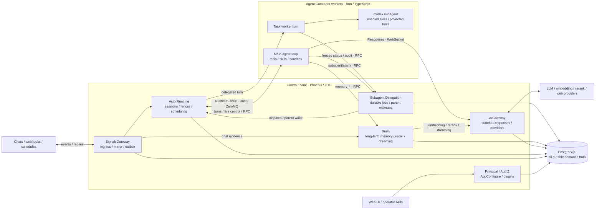

# Ankole - Open AgentOS for Shared AI Colleagues

[](LICENSE)


[](https://deepwiki.com/AgentBull/ankole)

[简体中文](./README.zh-Hans.md) | [日本語](./README.ja.md)

[How it's different](#how-ankole-is-different) · [Product shape](#product-shape) · [Actor runtime](#actor-runtime) · [Architecture](#architecture) · [Current status](#current-status) · [Development](#development)

**Ankole is a self-hosted AgentOS for shared AI colleagues.** One installation, many agents, real responsibilities — on infrastructure you control.

It moves AI work out of a private chat box and into the places where work already happens: channels, repositories, schedules, dashboards, internal systems, and long-running project context. An Ankole agent has its own identity, memory, permissions, tools, workspace, and responsibility boundary — so it can **own ongoing work**, not just answer a one-off message.

[Claude Tag](https://claude.com/product/tag) is a useful public reference point: tag an AI into a Slack thread, let it read the shared context, use organization tools, remember channel context, and follow up when work takes time. Ankole targets the broader open version of that pattern: **not only Slack, not only Claude, not only one agent, and not vendor-owned context.**

Ankole is for work that needs an owner, not just an answer. A good Ankole role has a visible result: code merged, a report shipped, a customer issue handled, an alert triaged, a market change noticed, or a backlog worked down.

## How Ankole is different

- **Shared by default, not private chat.** Agents join team-visible channels and provider contexts; multiple humans can observe, steer, and continue the same work.
- **Durable identity, not a prompt convention.** Humans and agents are Principals with permission grants and audit trails, so authorization is a runtime concern.
- **Long-running actor sessions, not request/response.** Sessions wake, receive signals, checkpoint, stream progress, hibernate, and recover with context.
- **Operator-owned context, not vendor-hosted.** Memory, configuration, credentials, and audit live in your infrastructure on a self-hosted installation.
- **Live control plus durable truth, not one or the other.** ZeroMQ RuntimeFabric carries live actor/worker/RPC traffic while PostgreSQL remains the source of replay, fences, and final commits.

## What Ankole Adds

- **Many sources.** IM, webhooks, scheduled reminders, internal systems, and future provider adapters all become normalized signal input.
- **Many agents.** One installation can host multiple agents with different missions, access, tools, memory, and outbound identities.
- **Session actors.** The long-running execution unit is `actor_id = {agent_id, session_id}`. A session is where context, workspace state, steering, cancellation, and recovery meet.
- **Owned context.** Conversations, model turns, summaries, signal projections, decisions, corrections, and future domain records live in your infrastructure.
- **Operator control.** Access, configuration, plugin activation, actor leases, outbox side effects, and audit surfaces belong to the installation operator.

## Product Shape

Ankole should make these workflows natural:

- A **coding agent** watches an issue, reproduces the bug, changes code, opens a draft PR, and reports what still needs a human decision.
- A **customer-success agent** observes a shared group chat, records the important facts, updates work state, and escalates privately only when needed.
- A **research agent** monitors markets, policy, competitors, and internal notes, then follows up when a change matters.
- A **QA agent** works through a test backlog, gathers evidence, and hands off failures with enough context for review.
- An **operations agent** watches alerts, prepares a runbook, and asks for approval before taking risky action.

The common pattern is not "answer this question." It is **"hold this seat, use the available context, and be judged by the result."**

## Actor Runtime

Ankole is an actor-oriented runtime for long-running AI work. Each active session is an addressable virtual actor: it can wake, receive messages, checkpoint, stream progress, hibernate, recover, and continue without pretending an agent is just an HTTP request or a queue job.

The runtime is built around five technical bets:

- **Virtual Actors for AI work.** A session is a stateful work identity with an address, mailbox, lifecycle, and recovery path, not loose background work.
- **OTP Supervision Trees as failure domains.** If one agent hangs, times out, or crashes, Ankole can isolate or restart that branch without turning it into a deployment-wide failure.
- **ZeroMQ Activation Fabric for live control.** Wakeups, steering, checkpoints, streaming, and backpressure move through a low-latency routing layer while the agent is still working.
- **Agent Computer as the execution substrate.** The LLM loop, tools, files, terminal state, and streaming output run inside a Bun + TypeScript computer close to the workspace.
- **Durable Ledger for recovery and audit.** Mailboxes, turns, reminders, decisions, and committed side effects outlive processes. Streaming is progress; committed work is truth.

For users and operators, the promise is simple: agents can work for hours or days, receive new input while running, fail independently, recover with context, and keep their side effects accountable. A longer version of the runtime argument is in [Why OTP Is a Better Runtime for Multi-Agent Orchestration](https://ding.ee/en-US/why-otp-is-a-better-runtime-for-multi-agent-orchestration/).

That is the technical bet: actor model for long-lived work identity, OTP for failure semantics, ZeroMQ for live activation, and Agent Computer for local execution. Ankole is closer to a distributed operating system for AI work than a chatbot backend.

## Architecture


```mermaid
flowchart LR
  subgraph CP["Control Plane · Phoenix / OTP"]
    direction TB
    Platform["Principal / AuthZ<br/>AppConfigure / plugins"]
    SG["SignalsGateway<br/>ingress / mirror / outbox"]
    AR["ActorRuntime<br/>sessions / fences / scheduling"]
    AI["AIGateway<br/>stateful Responses / providers"]
    Brain["Brain<br/>long-term memory / recall / dreaming"]
    Delegation["Subagent Delegation<br/>durable jobs / parent wakeups"]

    SG --> AR
    SG -->|"chat evidence"| Brain
    Brain -->|"embedding / rerank / dreaming"| AI
    Delegation -->|"dispatch / parent wake"| AR
  end

  subgraph AC["Agent Computer workers · Bun / TypeScript"]
    direction TB
    Main["Main-agent loop<br/>tools / skills / sandbox"]
    Task["Task-worker turn"]
    Codex["Codex subagent<br/>enabled skills / projected tools"]
    Task --> Codex
  end

  Channels["Chats / webhooks / schedules"] <-->|"events / replies"| SG
  Console["Web UI / operator APIs"] --> Platform
  AR <-->|"RuntimeFabric · Rust / ZeroMQ<br/>turns / live control / RPC"| Main
  Main -->|"Responses · WebSocket"| AI
  Main -->|"memory_* · RPC"| Brain
  Main -->|"subagent(start) · RPC"| Delegation
  AR -->|"delegated turn"| Task
  Task -->|"fenced status / audit · RPC"| Delegation
  AI <--> Models["LLM / embedding / rerank / web providers"]

  Platform --> PG[("PostgreSQL<br/>all durable semantic truth")]
  SG --> PG
  AR --> PG
  AI --> PG
  Brain --> PG
  Delegation --> PG
```

At a high level:

- **Control Plane** owns durable domain state, actor orchestration, provider routing, identity, authorization, configuration, and operator surfaces.
- **SignalsGateway and ActorRuntime** turn provider events into durable work, schedule fenced session turns, and commit provider-visible replies.
- **AIGateway** owns provider credentials and the stateful Responses log; workers reach it over WebSocket without receiving upstream credentials.
- **Brain** is the long-term memory subsystem for curated knowledge, chat recall, dreaming, and human oversight. Main agents and subagents use conversation-scoped `memory_*` tools while PostgreSQL remains the source of truth.
- **Agent Computer** runs the main-agent loop and local tools in isolated workers. RuntimeFabric carries live turns, control, and RPC over the shared Rust/ZeroMQ data plane.
- **Subagent Delegation** stores long-running background work in PostgreSQL, dispatches isolated task-worker turns, and wakes the parent session on waiting or terminal transitions. Codex is the current task worker, with enabled parent skills mounted natively and only an allowlisted tool projection.
- **Rust Kernel** is loaded in-process by Elixir and Bun for shared transport, crypto, authorization evaluation, codecs, and AI data-plane primitives; it is not a durable domain owner.
- **PostgreSQL** is the only durable semantic truth for events, conversations, memory, delegations, fences, audit, and final commits.

## Current Status

Ankole is a complete, self-hostable AgentOS in production. The control plane, Agent Computer, kernel, and operator console run end to end.

- **Many model providers.** OpenAI, Azure OpenAI, Claude, Google AI Studio, OpenRouter, and other OpenAI-compatible endpoints are first-class, with compaction, stateful conversations, reasoning-effort control, and per-provider usage handling.
- **Real IM integration.** Lark/Feishu and Slack are integrated as first-party providers with lifecycle, transport, main-flow, and real-LLM end-to-end coverage.
- **Brain.** Curated knowledge, chat recall, dreaming (offline consolidation), human review, and recovery live in one subsystem backed by PostgreSQL full-text and vector search.
- **Long-running actor runtime.** Sessions wake, checkpoint, stream progress, hibernate, and recover with context; steering and cancellation are live-control operations, not request/response.
- **Operator console.** Agents, providers, model profiles, identity, signals, workers, worker environments, brain entries, and delegations are all managed from a built-in web console.
- **Tested for real conditions.** Unit suites plus dedicated end-to-end suites for Lark and Slack main flows, transport, lifecycle, real-LLM, scheduling, worker computer, chaos recovery, and concurrency/performance.

Ankole's public APIs do not yet carry a compatibility contract; expect breaking changes between releases.

| Area | Status |
| --- | --- |
| Control plane | Phoenix/OTP application under `app/control_plane`. Owns durable state, configuration, actor orchestration, Principal/AuthZ, AIGateway, Brain, SignalsGateway, and operator APIs. |
| Agent Computer | Bun/TypeScript worker runtime under `app/agent_computer`. Runs the agent loop and local tools inside an isolated Linux worker image; not a standalone CLI. |
| Kernel | Rust crate under `app/kernel`, loaded by Elixir (Rustler) and Bun (N-API) for crypto, identifiers, AuthZ evaluation, and ZeroMQ transport. |
| Frontend | Vite + React console, auth, and setup surfaces under `app/webapps`, built into the Phoenix static shell. |
| Local services | PostgreSQL is provided through the devkit Docker Compose setup. |
| Design docs | Architecture and runtime design documents live under `docs/design-docs`. |
| Production readiness | Running in production. The durable path, live control, and operator surfaces are complete; the public API has no compatibility contract yet. |

## Current Repository

This repository is the active Ankole control-plane and runtime workspace.

- `app/control_plane` - Phoenix/OTP control plane for Principal/AuthZ, AppConfigure, setup, console, plugin registry, I18n, SignalsGateway, actor runtime, RuntimeFabric, and PostgreSQL-owned durable state.
- `app/kernel` - shared Rust foundation loaded by Elixir and Bun for crypto, identifiers, phone/JWT helpers, AuthZ evaluation, protobuf envelopes, and ZeroMQ RuntimeFabric transport.
- `app/agent_computer` - Bun + TypeScript Agent Computer worker for the local LLM loop, provider adapters, tools, skill loading, files, terminal state, and worker daemon.
- `app/webapps` - Vite + React frontend applications for auth, setup, and console surfaces, built into the Phoenix static shell.
- `app/library` - built-in agent skills and starter templates such as `MISSION.md` and `SOUL.md`.
- `app/locales` - shared TOML translation catalogs consumed by the control plane and browser surfaces.
- `libs/uikit` - shared UI primitives for Ankole webapps.
- `libs/feishu_openapi` - local Lark/Feishu OpenAPI client library.
- `libs/slack_openapi` - local Slack Web API, Socket Mode, and OIDC client library.
- `internals/plugins` - private first-party provider/plugin code that is kept with the repo but not presented as the public plugin boundary.
- `tools/devkit` - workspace automation for local services, app database helpers, code generation, and analysis.
- `docs/design-docs` - current design documents for principal identity, authorization, configuration, I18n, plugins, RuntimeFabric, SignalsGateway, and provider adapters.

RuntimeFabric is the live control-plane-to-worker fabric. It carries actor traffic, bounded RPC, and worker-file frames over ZeroMQ while PostgreSQL remains the source of durable replay, fences, reconciliation, and final commits. SignalsGateway is the provider-ingress layer: external chats, webhooks, and provider events become actor events without turning source facts into execution state.

## Development

Ankole defaults to Bun for workspace scripts and Elixir/Phoenix for the control plane.

```shell
bun install

# Local support services and workspace helpers
bun kit --help
bun services:start
bun services:status

# Control plane
bun control-plane:setup
bun control-plane:dev
bun control-plane:test

# Agent Computer container image and tests
docker build -f app/agent_computer/Dockerfile -t ankole-agent-computer:0.1.0 .
bun agent-computer:test
bun agent-computer:type-check

# Other Bun packages
bun webapps:build
bun feishu-openapi:test
```

Agent Computer is designed to run as a Linux container runtime. For strong
bubblewrap command isolation, run Docker with `--cap-add SYS_ADMIN`,
`--security-opt seccomp=unconfined`, and
`--security-opt systempaths=unconfined` unless you provide an equivalent custom
seccomp/profile setup. In Kubernetes, put the equivalent
`capabilities.add: ["SYS_ADMIN"]`, `seccompProfile`, and `procMount: Unmasked`
on the Agent Computer container `securityContext`. If strong bubblewrap is
unavailable, the worker may downgrade to weak bubblewrap (container `/proc`
bind-mounted into bwrap) and emits a startup warning. It never falls back to
unsandboxed model-facing commands.

Package-local validation is preferred while the workspace is moving quickly:

```shell
bun run --filter @ankole/control-plane test
bun run agent-computer:test
bun run --filter @ankole/agent-computer type-check
bun run --filter @ankole/webapps type-check
bun run --filter @ankole/feishu-openapi test
```

Once the control plane is running, the worker bootstrap helper renders the Docker command used to start an external Agent Computer worker against the local RuntimeFabric endpoint:

```shell
cd app/control_plane
mix ankole.actor_runtime.worker_bootstrap --endpoint tcp://127.0.0.1:6010 --worker-id worker-a
```

Production bootstrap configuration uses standard infrastructure names such as `DATABASE_URL` and `SECRET_KEY_BASE`. Runtime application configuration belongs in Ankole's PostgreSQL-backed AppConfigure surface rather than process-local environment variables.

Brain requires PostgreSQL 18 with `pg_search` preloaded and both `pg_search`
and `vector` installed. Model profiles and the destructive-vs-incremental
database procedure are documented in the
[Brain operations guide](docs/operations/Brain.md). Its dedicated real-model
acceptance path is `tools/e2e/run --brain-real-llm`; it is not part of the
default test gate or `--all`.
