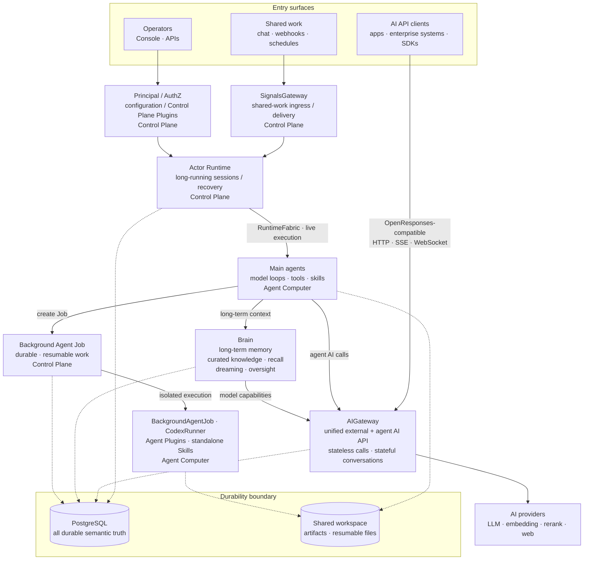

# Ankole - Open AgentOS for AI Colleagues With Their Own OKRs

[](LICENSE)


[](https://deepwiki.com/AgentBull/ankole)

[简体中文](./README.zh-Hans.md) | [日本語](./README.ja.md)

[How it's different](#how-ankole-is-different) · [Product shape](#product-shape) · [Actor runtime](#actor-runtime) · [Architecture](#architecture) · [Current status](#current-status) · [Development](#development)

**Ankole is a self-hosted AgentOS for building your own AI colleagues.** They take an objective, not a script: they pick up a job in your team's channel, break it down, run it, deliver it, and you judge them on the result.

It moves AI work out of a private chat box and into the places where work already happens: channels, repositories, schedules, dashboards, internal systems, and long-running project context. An Ankole agent has its own identity, memory, permissions, tools, workspace, and responsibility boundary — so it can **own ongoing work**, not just answer a one-off message.

[Claude Tag](https://claude.com/product/tag) is a useful public reference point: tag an AI into a Slack thread, let it read the shared context, use organization tools, remember channel context, and follow up when work takes time. Ankole targets the broader open version of that pattern: **not only Slack, not only Claude, not only one agent, and not vendor-owned context.**

Ankole is for work that needs an owner, not just an answer. A seat it can hold is remote from end to end, has a named deliverable, and has a number that settles it afterwards.

## How Ankole is different

An assistant answers "how does it help me". A colleague answers "who owns this work by default". What Ankole changes is the agent's position in the organization, not the size of the model.

- **It belongs to the channel, not to whoever brought it.** Its memory belongs to the venue, its permissions are granted per channel, its actions are visible to everyone, and its conclusions become the team's shared facts — all of it on your own servers, not in a vendor's tenant.
- **A seat is a slot of responsibility, not a bundle of skills.** Being able to do the job is not the same as owning it, and loading skills is not the same as carrying responsibility. Ankole supplies the layer that turns ability into a seat: its own identity, organizational authorization, an audit trail, escalation paths, and a metric to answer to.
- **It lives inside the loop of work, not reaching into one segment.** See the scene, weigh what matters, commit, push, track the result, handle the exception, answer to the organization. SaaS records the outcome, RPA performs the motions, chatbots handle the opening question — an Ankole agent owns the loop.
- **It does not just record order — it generates it.** When commitments, risks, standards, and deadlines form in natural language in a channel, it turns them into tracked, executable, retirable organizational reality on the spot.
- **The daily loop is its by default; people step in at the edges.** Humans stay present for approvals, exceptions, and accountability. Deliverables, decisions, and committed actions sit in a durable ledger, and its output is built to be scored afterwards.

That generated order is only as good as the memory that holds it. Most agents keep an append-only store in which an old rule and its replacement are equals, with no timeline and nothing superseding anything. Ankole's memory adjudicates: a new rule takes the seat and the old one retires with the period it governed, kindred corrections merge, contradictions are ranked by time, source, and confidence, and a prediction is checked against how things actually went — all of it shrinking the gap between what the model expects and what it observes.

## What Ankole Adds

- **Long jobs run in the background.** Background jobs, schedules, and check back later. A job can run for hours; when it finishes, the agent returns to the same channel and says plainly which step failed and was retried.
- **What the room already knows.** House rules, who prefers what, why an option did not survive last time — things nobody thought to tell an agent — settle into the channel's shared memory.
- **Memory that models the world.** Brain distils talk into curated knowledge, induces and deduces over it, retires what has gone stale, and takes in changes from the outside world directly, with nobody having to mention them in a channel first.
- **Deep research, and playbooks.** Fan-out retrieval, layered checks, and competing-hypothesis analysis produce a cited report. Once a kind of job runs well it becomes a playbook and the next one follows it.
- **A browser it can really use.** The runtime owns a real Chromium session driven through `ankole-browser`: rendered pages, clicks, typing, screenshots, repeatable Playwright scripts, and a signed-in session across steps.
- **Skills that improve themselves.** An agent proposes a change to its own skills as an overlay; a human approves it and it applies from the next session. It never rewrites itself behind your back.
- **Many agents, one deployment instance.** Each has its own mission, access, tools, memory, and outbound identity. A main agent hands bounded work to job agents without blocking on them.
- **Enterprise identity and IM.** Lark, Slack, DingTalk, Teams, and Google Workspace are first-party adapters, and identity comes from the IdP you already run. IM, webhooks, schedules, and internal systems all arrive as one normalized signal input.

## Product Shape

A seat Ankole can hold is remote from end to end, produces a named artifact, and can be settled afterwards with a number. Six examples across six industries, not a catalogue:

| Seat | Deliverable | Graded on |
|---|---|---|
| Equity research analyst | Company and sector notes, scenario trees, entry conditions | Hit rate and excess return once the call is scored |
| Cloud cost engineer | Spend attribution, right-sizing plans, migration paths | Cloud spend per unit of work |
| Smart contract auditor | Audit report with reproducible proofs of concept | Criticals missed |
| Regulatory affairs specialist | Submission dossiers and deficiency responses | First-pass approval rate and rounds of questions |
| Patent engineer | Prior-art searches, invention disclosures, claim drafts | Grant rate and appeals after rejection |
| Marketplace operations analyst | Ad and restock weeklies, product shortlists | TACoS and days out of stock |

The common shape is not "answer this question." It is **hold this seat, use the context you have, and answer for the result.**

## Actor Runtime

Ankole is an actor-oriented runtime for long-running AI work. Each active session is an addressable virtual actor: it can wake, receive messages, checkpoint, stream progress, hibernate, recover, and continue without pretending an agent is just an HTTP request or a queue job.

The runtime is built around five technical bets:

- **Virtual Actors for AI work.** A session is a stateful work identity with an address, mailbox, lifecycle, and recovery path, not loose background work.
- **OTP Supervision Trees as failure domains.** If one agent hangs, times out, or crashes, Ankole can isolate or restart that branch without turning it into a deployment-wide failure.
- **ZeroMQ Activation Fabric for live control.** Wakeups, steering, checkpoints, streaming, and backpressure move through a low-latency routing layer while the agent is still working.
- **Agent Computer as the execution substrate.** The LLM loop, tools, files, terminal state, and streaming output run inside a Bun + TypeScript computer close to the workspace.
- **Durable Ledger for recovery and audit.** Mailboxes, turns, reminders, decisions, and committed side effects outlive processes. Streaming is progress; committed work is truth.

For users and operators, the promise is simple: agents can work for hours or days, receive new input while running, fail independently, recover with context, and keep their side effects accountable. A longer version of the runtime argument is in [Why OTP Is a Better Runtime for Multi-Agent Orchestration](https://ding.ee/en-US/why-otp-is-a-better-runtime-for-multi-agent-orchestration/).

That is the technical bet: actor model for long-lived work identity, OTP for failure semantics, ZeroMQ for live activation, and Agent Computer for local execution. Ankole is closer to a distributed operating system for AI work than a chatbot backend.

## Architecture


```mermaid
flowchart TB
  subgraph Entry["Entry surfaces"]
    direction LR
    Work["Shared work<br/>chat · webhooks · schedules"]
    Clients["AI API clients<br/>apps · enterprise systems · SDKs"]
    Ops["Operators<br/>Console · APIs"]
  end

  SG["SignalsGateway<br/>shared-work ingress / delivery<br/>Control Plane"]
  Platform["Principal / AuthZ<br/>configuration / Control Plane Plugins<br/>Control Plane"]
  Runtime["Actor Runtime<br/>long-running sessions / recovery<br/>Control Plane"]
  Main["Main agents<br/>model loops · tools · skills<br/>Agent Computer"]
  Brain["Brain<br/>long-term memory<br/>curated knowledge · recall<br/>dreaming · oversight"]
  Delegate["Background Agent Job<br/>durable · resumable work<br/>Control Plane"]
  AI["AIGateway<br/>unified external + agent AI API<br/>stateless calls · stateful conversations"]
  Task["BackgroundAgentJob · CodexRunner<br/>Agent Plugins · standalone Skills<br/>Agent Computer"]
  Providers["AI providers<br/>LLM · embedding · rerank · web"]

  subgraph Storage["Durability boundary"]
    direction LR
    PG[("PostgreSQL<br/>all durable semantic truth")]
    Workspace[("Shared workspace<br/>artifacts · resumable files")]
  end

  Work --> SG --> Runtime
  Ops --> Platform --> Runtime
  Runtime -->|"RuntimeFabric · live execution"| Main
  Clients -->|"OpenResponses-compatible<br/>HTTP · SSE · WebSocket"| AI
  Main -->|"agent AI calls"| AI
  Main -->|"long-term context"| Brain
  Brain -->|"model capabilities"| AI
  Main -->|"create Job"| Delegate
  Delegate -->|"isolated execution"| Task
  AI --> Providers

  Runtime -.-> PG
  AI -.-> PG
  Brain -.-> PG
  Delegate -.-> PG
  Main -.-> Workspace
  Task -.-> Workspace
```

At a high level:

- **Three first-class entry surfaces.** Shared work enters through SignalsGateway, applications and enterprise systems call AIGateway directly, and operators use the Console and APIs. AIGateway is not merely an internal worker proxy.
- **AIGateway is the unified AI boundary.** Its OpenResponses-compatible HTTP, SSE, and WebSocket API supports stateless requests and Principal-scoped stateful conversations. It resolves models across LLM, embedding, rerank, web-search, and web-fetch providers while upstream credentials remain in the control plane.
- **Actors separate durable work from execution.** Actor Runtime owns long-running session and recovery semantics; replaceable Agent Computer workers run model loops, tools, skills, and sandboxes.
- **Brain is long-term memory.** It combines curated current knowledge, source-chat recall, dreaming, and human oversight. PostgreSQL rows are truth; Markdown and injected context are projections.
- **Background Agent Jobs are durable work, not child processes.** A Job survives worker loss, can resume or wait for input, and wakes its owner when it changes state. It stores one optional workspace template; on each run, CodexRunner loads every Agent Plugin currently enabled for the Agent and each enabled Skill that permits Background Agent Jobs, then exposes a deliberately narrow platform-tool projection.
- **Durability has two forms.** PostgreSQL owns semantic truth; the shared workspace holds artifacts and resumable files referenced by that state. RuntimeFabric is live transport only, with the shared Rust kernel providing in-process transport and AI data-plane primitives.

## Current Status

Ankole is a complete, self-hostable AgentOS in production. The control plane, Agent Computer, kernel, and operator console run end to end.

- **Many model providers.** OpenAI, Azure OpenAI, Claude, Google AI Studio, OpenRouter, and other OpenAI-compatible endpoints are first-class, with compaction, stateful conversations, reasoning-effort control, and per-provider usage handling.
- **Real IM integration.** Lark/Feishu and Slack are integrated as first-party providers with lifecycle, transport, main-flow, and real-LLM end-to-end coverage.
- **Brain.** Curated knowledge, chat recall, dreaming (offline consolidation), human review, and recovery live in one subsystem backed by PostgreSQL full-text and vector search.
- **Long-running actor runtime.** Sessions wake, checkpoint, stream progress, hibernate, and recover with context; steering and cancellation are live-control operations, not request/response.
- **Operator console.** Agents, Agent Library defaults and overrides, Control Plane Plugins, providers, model profiles, identity, signals, workers, worker environments, brain entries, and Background Agent Jobs are managed from a built-in web console.
- **Tested for real conditions.** Unit suites plus dedicated end-to-end suites for Lark and Slack main flows, transport, lifecycle, real-LLM, scheduling, worker computer, chaos recovery, and concurrency/performance.

Ankole's public APIs do not yet carry a compatibility contract; expect breaking changes between releases.

| Area | Status |
| --- | --- |
| Control plane | Phoenix/OTP application under `app/control_plane`. Owns durable state, configuration, actor orchestration, Principal/AuthZ, AIGateway, Brain, SignalsGateway, and operator APIs. |
| Agent Computer | Bun/TypeScript worker runtime under `app/agent_computer`. Runs the agent loop and local tools inside an isolated Linux worker image; not a standalone CLI. |
| Kernel | Rust crate under `app/kernel`, loaded by Elixir (Rustler) and Bun (N-API) for crypto, identifiers, AuthZ evaluation, and ZeroMQ transport. |
| Frontend | Vite + React console, auth, and setup surfaces under `app/webapps`, built into the Phoenix static shell. |
| Local services | PostgreSQL is provided through the devkit Docker Compose setup. |
| Design docs | Architecture and runtime design documents live under `docs/design-docs`. |
| Production readiness | Running in production. The durable path, live control, and operator surfaces are complete; the public API has no compatibility contract yet. |

## Current Repository

This repository is the active Ankole control-plane and runtime workspace.

- `app/control_plane` - Phoenix/OTP control plane for Principal/AuthZ, AppConfigure, setup, console, the Control Plane Plugin registry, I18n, SignalsGateway, actor runtime, RuntimeFabric, and PostgreSQL-owned durable state.
- `app/kernel` - shared Rust foundation loaded by Elixir and Bun for crypto, identifiers, phone/JWT helpers, AuthZ evaluation, protobuf envelopes, and ZeroMQ RuntimeFabric transport.
- `app/agent_computer` - Bun + TypeScript Agent Computer worker for the local LLM loop, provider adapters, tools, skill loading, files, terminal state, and worker daemon.
- `app/webapps` - Vite + React frontend applications for auth, setup, and console surfaces, built into the Phoenix static shell.
- `app/library` - built-in standalone Skills, first-party Agent Plugins, and starter templates such as `MISSION.md` and `SOUL.md`.
- `app/locales` - shared TOML translation catalogs consumed by the control plane and browser surfaces.
- `libs/uikit` - shared UI primitives for Ankole webapps.
- `libs/feishu_openapi` - local Lark/Feishu OpenAPI client library.
- `libs/slack_openapi` - local Slack Web API, Socket Mode, and OIDC client library.
- `internals/plugins` - private first-party Control Plane Plugin code compiled into private releases.
- `tools/devkit` - workspace automation for local services, app database helpers, code generation, and analysis.
- `docs/design-docs` - current design documents for principal identity, authorization, configuration, I18n, plugins, RuntimeFabric, SignalsGateway, and provider adapters.

RuntimeFabric is the live control-plane-to-worker fabric. It carries actor traffic, bounded RPC, and worker-file frames over ZeroMQ while PostgreSQL remains the source of durable replay, fences, reconciliation, and final commits. SignalsGateway is the provider-ingress layer: external chats, webhooks, and provider events become actor events without turning source facts into execution state.

## Development

Ankole defaults to Bun for workspace scripts and Elixir/Phoenix for the control plane.

For a first local setup, copy this single prompt into a coding agent:

```text
Read https://github.com/AgentBull/ankole/blob/main/CONTRIBUTING.md in full, then guide me through a complete local Ankole setup and its documented end-to-end verification. Treat that guide as the source of truth, perform and verify every safe reversible step you can, pause for human account, secret, OAuth, or destructive-approval actions, and do not claim completion until its stated success criteria pass.
```

```shell
bun install

# Local support services and workspace helpers
bun kit --help
bun services:start
bun services:status

# Control plane
bun control-plane:setup
bun control-plane:dev
bun control-plane:test

# Agent Computer container image and tests
docker build \
  --build-arg "BASE_IMAGE=$(tr -d '\n' < app/agent_computer/base-image.lock)" \
  -f app/agent_computer/Dockerfile -t ankole-agent-computer:0.1.0 .
bun agent-computer:test
bun agent-computer:type-check

# Other Bun packages
bun webapps:build
bun feishu-openapi:test
```

Agent Computer is designed to run as a Linux container runtime. For strong
bubblewrap command isolation, run Docker with `--cap-add SYS_ADMIN`,
`--security-opt seccomp=unconfined`, and
`--security-opt systempaths=unconfined` unless you provide an equivalent custom
seccomp/profile setup. In Kubernetes, put the equivalent
`capabilities.add: ["SYS_ADMIN"]`, `seccompProfile`, and `procMount: Unmasked`
on the Agent Computer container `securityContext`. If strong bubblewrap is
unavailable, the worker may downgrade to weak bubblewrap (container `/proc`
bind-mounted into bwrap) and emits a startup warning. It never falls back to
unsandboxed model-facing commands.

Package-local validation is preferred while the workspace is moving quickly:

```shell
bun run --filter @ankole/control-plane test
bun run agent-computer:test
bun run --filter @ankole/agent-computer type-check
bun run --filter @ankole/webapps type-check
bun run --filter @ankole/feishu-openapi test
```

Once the control plane is running, the worker bootstrap helper renders the Docker command used to start an external Agent Computer worker against the local RuntimeFabric endpoint:

```shell
cd app/control_plane
mix ankole.actor_runtime.worker_bootstrap --endpoint tcp://127.0.0.1:6010 --worker-id worker-a
```

Production bootstrap configuration uses standard infrastructure names such as `DATABASE_URL` and `SECRET_KEY_BASE`. Runtime application configuration belongs in Ankole's PostgreSQL-backed AppConfigure surface rather than process-local environment variables.

Brain requires PostgreSQL 18 with `pg_search` preloaded and both `pg_search`
and `vector` installed. Model profiles and the destructive-vs-incremental
database procedure are documented in the
[Brain operations guide](docs/operations/Brain.md). Its dedicated real-model
acceptance path is `tools/e2e/run --brain-real-llm`; it is not part of the
default test gate or `--all`.
