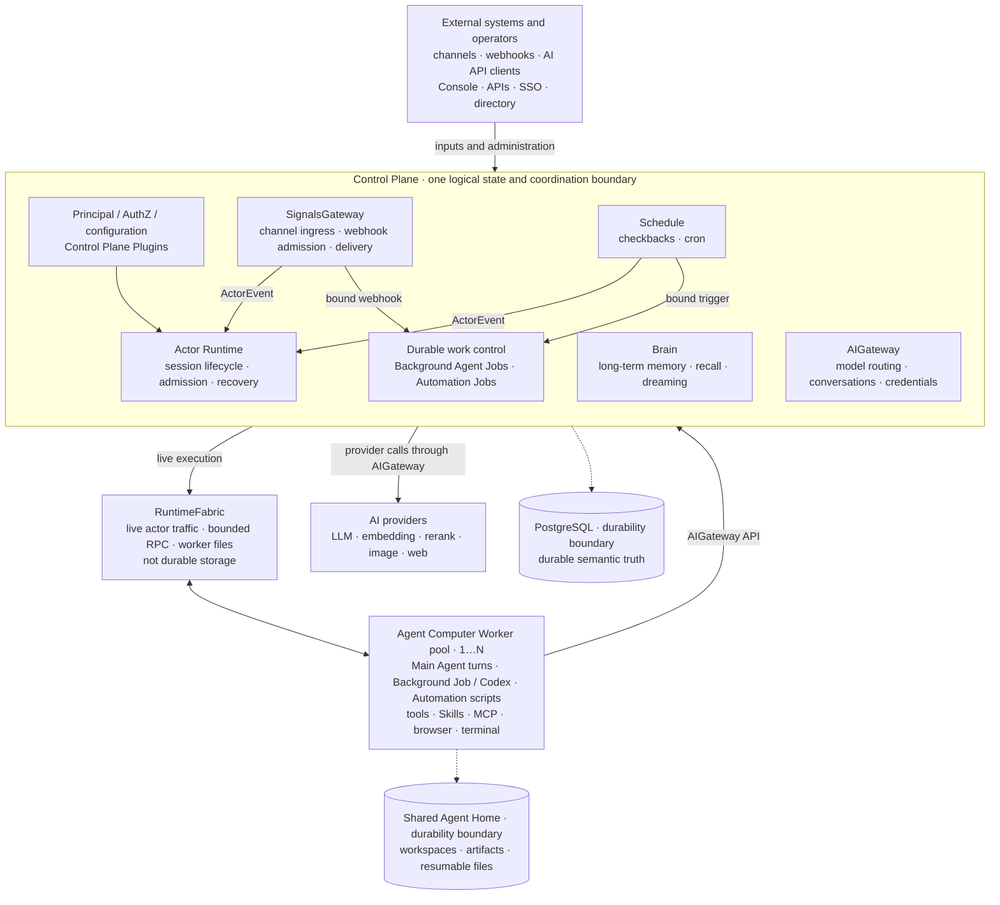

# Ankole — The Open-Source AI Workforce OS

[](LICENSE)


[](https://deepwiki.com/AgentBull/ankole)

[简体中文](./README.zh-Hans.md) | [日本語](./README.ja.md)

[Why it is different](#from-ai-capability-to-autonomous-labor) · [Business functions](#business-functions) · [Actor runtime](#actor-runtime) · [Architecture](#architecture) · [Current status](#current-status) · [Development](#development)

**Turn AI agents into autonomous labor that performs business functions and is measured by outcomes.**

Most AI products give a person a model, an assistant, or a copilot. The person still decides each next step, moves context, calls tools, handles failures, and completes the work.

Ankole gives the execution loop to the Agent. You define the business function, outcome measure, authority, tools, and context.

The Agent plans and executes the work, asks at approval or exception boundaries, and delivers a result that you can inspect and score.

Ankole is open source and self-hosted. Identities, context, credentials, artifacts, audit records, and execution stay on infrastructure that you control.

This is **service as software**: software does not only help a person provide a service; it performs the service. Ankole provides the runtime that makes this possible for high-value knowledge work.

## From AI Capability to Autonomous Labor

A copilot reduces the effort needed to do work. The human still drives. Ankole changes the default owner of the execution loop: the Agent observes, decides, acts, follows up, and delivers within a defined business function.

- **A business function, not a chat persona.** Each Agent has an ongoing responsibility, expected deliverables, operating context, and result measure. Its identity exists to hold authority and history, not to imitate a person.
- **Outcomes, not activity.** Work is measured by the number that matters to the business: return, risk, ranking, approval rate, cost per unit, or another declared result.
- **An execution loop, not next-step suggestions.** The Agent owns planning, tool use, follow-up, recovery, and delivery. People do not have to drive every step.
- **Authority with boundaries.** Identity, AuthZ, audit records, approval points, and escalation paths define what the Agent can do and when a person must decide.
- **Long-running work, not one request.** Sessions can work for hours or days, receive new input, recover after failure, and retain the context needed for the next action.

Autonomous work depends on current context. Ankole records rules, decisions, corrections, and outcomes with time and source, instead of treating every old message as equally true.

Brain retires stale rules, merges related corrections, ranks conflicts, and compares predictions with later results. Each run starts from a more accurate operating picture.

## What Makes Autonomous Labor Possible

- **Long jobs run in the background.** A Job can run for hours, return to the same channel, report a failed step, and retry without blocking the main Agent.
- **Shared context becomes working memory.** Rules, preferences, and rejected options can enter memory even when nobody addressed the Agent.
- **Memory models a changing world.** Brain curates knowledge, retires stale entries, reasons over evidence, and receives external changes directly.
- **Deep Research becomes a playbook.** Fan-out retrieval, layered checks, and competing hypotheses produce a cited report. A successful method can guide the next run.
- **A real browser does real work.** The Agent can read rendered pages, click, type, capture evidence, run Playwright scripts, and keep a signed-in session across steps.
- **Skills improve under human control.** An Agent can propose a skill update. A person approves it before the change applies to later sessions.
- **Run one Agent or many.** Each Agent can have its own function, authority, tools, memory, and outbound identity. Multi-agent execution is optional.
- **Enterprise identity and work channels connect directly.** Lark, Slack, DingTalk, Teams, Google Workspace, webhooks, schedules, and internal systems enter through one signal boundary.

## Business Functions

Ankole fits work that can be done digitally, produces inspectable deliverables, and has a result measure. The measure can be ROI, risk-adjusted return, ranking movement, approval rate, or another business outcome.

| Business function | Delivered work | Measured by |
|---|---|---|
| Performance marketing | Campaign plans, bids, creatives, and budget shifts | Incremental ROAS and customer acquisition cost |
| Industry research and trading | Research, hypotheses, portfolio actions, and reviews | Excess return, Sharpe ratio, and maximum drawdown |
| Search engine optimization | Keyword plans, content briefs, and on-page changes | Ranking movement and qualified organic traffic |
| Regulatory affairs | Submission dossiers and deficiency responses | First-pass approval rate and rounds of questions |
| Patent prosecution | Prior-art searches, claim drafts, and office-action responses | Grant rate and office-action rounds |
| Smart contract audit | Reports with reproducible proofs of concept | Critical misses and false-positive rate |

The unit is a business function, not an Agent count. One Agent can own a narrow function, or several can share its execution. Multi-agent coordination is an implementation choice, not the product promise.

The common contract is: **define the function, grant bounded authority, let the Agent work, and score the outcome.**

## Actor Runtime

Ankole is an actor-oriented runtime for long-running AI work. Each active session is an addressable virtual actor: it can wake, receive messages, checkpoint, stream progress, hibernate, recover, and continue without pretending an agent is just an HTTP request or a queue job.

The runtime is built around five technical bets:

- **Virtual Actors for AI work.** A session is a stateful work identity with an address, mailbox, lifecycle, and recovery path, not loose background work.
- **OTP Supervision Trees as failure domains.** If one agent hangs, times out, or crashes, Ankole can isolate or restart that branch without turning it into a deployment-wide failure.
- **ZeroMQ Activation Fabric for live control.** Wakeups, steering, checkpoints, streaming, and backpressure move through a low-latency routing layer while the agent is still working.
- **Agent Computer as the execution substrate.** The LLM loop, tools, files, terminal state, and streaming output run inside a Bun + TypeScript computer close to the workspace.
- **Durable Ledger for recovery and audit.** Mailboxes, turns, reminders, decisions, and committed side effects outlive processes. Streaming is progress; committed work is truth.

For users and operators, the promise is simple: agents can work for hours or days, receive new input while running, fail independently, recover with context, and keep their side effects accountable. A longer version of the runtime argument is in [Why OTP Is a Better Runtime for Multi-Agent Orchestration](https://ding.ee/en-US/why-otp-is-a-better-runtime-for-multi-agent-orchestration/).

That is the technical bet: actor model for long-lived work identity, OTP for failure semantics, ZeroMQ for live activation, and Agent Computer for local execution. It lets Ankole operate as an AI Workforce OS instead of a chatbot backend.

## Architecture

This diagram shows ownership and durability boundaries. It does not show every internal call.


```mermaid
flowchart TB
  External["External systems and operators<br/>channels · webhooks · AI API clients<br/>Console · APIs · SSO · directory"]

  subgraph Control["Control Plane · one logical state and coordination boundary"]
    direction TB
    Platform["Principal / AuthZ / configuration<br/>Control Plane Plugins"]
    SG["SignalsGateway<br/>channel ingress · webhook admission · delivery"]
    Schedule["Schedule<br/>checkbacks · cron"]
    Runtime["Actor Runtime<br/>session lifecycle · admission · recovery"]
    Jobs["Durable work control<br/>Background Agent Jobs · Automation Jobs"]
    Brain["Brain<br/>long-term memory · recall · dreaming"]
    AI["AIGateway<br/>model routing · conversations · credentials"]
  end

  Fabric["RuntimeFabric<br/>live actor traffic · bounded RPC · worker files<br/>not durable storage"]
  Workers["Agent Computer Worker pool · 1…N<br/>Main Agent turns · Background Job / Codex · Automation scripts<br/>tools · Skills · MCP · browser · terminal"]
  Providers["AI providers<br/>LLM · embedding · rerank · image · web"]

  PG[("PostgreSQL · durability boundary<br/>durable semantic truth")]
  Home[("Shared Agent Home · durability boundary<br/>workspaces · artifacts · resumable files")]

  External -->|"inputs and administration"| Control
  SG -->|"ActorEvent"| Runtime
  Schedule -->|"ActorEvent"| Runtime
  SG -->|"bound webhook"| Jobs
  Schedule -->|"bound trigger"| Jobs
  Platform --> Runtime
  Control -->|"live execution"| Fabric
  Fabric <--> Workers
  Workers -->|"AIGateway API"| Control
  Control -->|"provider calls through AIGateway"| Providers
  Control -.-> PG
  Workers -.-> Home
```

At a high level:

- **One control plane owns state and coordination.** Principal/AuthZ, SignalsGateway, Schedule, Actor Runtime, Job lifecycles, Brain, and AIGateway make durable decisions in Elixir/OTP. PostgreSQL stores their semantic facts.
- **Trigger owners stay separate.** SignalsGateway owns channel and webhook admission. Schedule owns checkbacks and cron. Each trigger wakes an Actor session by default or creates a durable Automation Job run when it has a binding.
- **Workers provide replaceable execution.** A pool of one or more Agent Computer Workers runs Main Agent turns, Background Job/Codex turns, and Automation scripts. RuntimeFabric carries live actor traffic, bounded RPC, and worker-file operations; it is not a durable queue.
- **AIGateway is the unified AI boundary.** Its OpenResponses-compatible HTTP, SSE, and WebSocket API supports stateless requests and Principal-scoped stateful conversations. It resolves models across LLM, embedding, rerank, web-search, and web-fetch providers while upstream credentials remain in the control plane.
- **Brain is long-term memory.** It combines curated current knowledge, source-chat recall, dreaming, and human oversight. PostgreSQL rows are truth; Markdown and injected context are projections.
- **The two Job types make different promises.** A Background Agent Job is interactive, model-driven work that can resume and wait for input. An Automation Job is an Agent-owned deterministic script; each trigger consumption is a durable run that can emit an event to its owner session.
- **Durability has two forms.** PostgreSQL owns semantic truth. Shared Agent Home storage holds workspaces, artifacts, and resumable files. RuntimeFabric and Worker process state are rebuildable.

## Current Status

Ankole is a complete, self-hostable AI Workforce OS in production. The control plane, Agent Computer, kernel, and operator console run end to end.

- **Many model providers.** OpenAI, Azure OpenAI, Claude, Google AI Studio, OpenRouter, and other OpenAI-compatible endpoints are first-class, with compaction, stateful conversations, reasoning-effort control, and per-provider usage handling.
- **Real IM integration.** Lark/Feishu and Slack are integrated as first-party providers with lifecycle, transport, main-flow, and real-LLM end-to-end coverage.
- **Brain.** Curated knowledge, chat recall, dreaming (offline consolidation), human review, and recovery live in one subsystem backed by PostgreSQL full-text and vector search.
- **Long-running actor runtime.** Sessions wake, checkpoint, stream progress, hibernate, and recover with context; steering and cancellation are live-control operations, not request/response.
- **Operator console.** Agents, Agent Library defaults and overrides, Control Plane Plugins, providers, model profiles, identity, signals, workers, worker environments, brain entries, and Background Agent Jobs are managed from a built-in web console.
- **Tested for real conditions.** Unit suites plus dedicated end-to-end suites for Lark and Slack main flows, transport, lifecycle, real-LLM, scheduling, worker computer, chaos recovery, and concurrency/performance.

Ankole's public APIs do not yet carry a compatibility contract; expect breaking changes between releases.

| Area | Status |
| --- | --- |
| Control plane | Phoenix/OTP application under `app/control_plane`. Owns durable state, configuration, actor orchestration, Principal/AuthZ, AIGateway, Brain, SignalsGateway, and operator APIs. |
| Agent Computer | Bun/TypeScript worker runtime under `app/agent_computer`. Runs the agent loop and local tools inside an isolated Linux worker image; not a standalone CLI. |
| Kernel | Rust crate under `app/kernel`, loaded by Elixir (Rustler) and Bun (N-API) for crypto, identifiers, AuthZ evaluation, and ZeroMQ transport. |
| Frontend | Vite + React console, auth, and setup surfaces under `app/webapps`, built into the Phoenix static shell. |
| Local services | PostgreSQL is provided through the devkit Docker Compose setup. |
| Design docs | Architecture and runtime design documents live under `docs/design-docs`. |
| Production readiness | Running in production. The durable path, live control, and operator surfaces are complete; the public API has no compatibility contract yet. |

## Current Repository

This repository is the active Ankole control-plane and runtime workspace.

- `app/control_plane` - Phoenix/OTP control plane for Principal/AuthZ, AppConfigure, setup, console, the Control Plane Plugin registry, I18n, SignalsGateway, actor runtime, RuntimeFabric, and PostgreSQL-owned durable state.
- `app/kernel` - shared Rust foundation loaded by Elixir and Bun for crypto, identifiers, phone/JWT helpers, AuthZ evaluation, protobuf envelopes, and ZeroMQ RuntimeFabric transport.
- `app/agent_computer` - Bun + TypeScript Agent Computer worker for the local LLM loop, provider adapters, tools, skill loading, files, terminal state, and worker daemon.
- `app/webapps` - Vite + React frontend applications for auth, setup, and console surfaces, built into the Phoenix static shell.
- `app/library` - built-in standalone Skills, first-party Agent Plugins, and starter templates such as `MISSION.md` and `SOUL.md`.
- `app/locales` - shared TOML translation catalogs consumed by the control plane and browser surfaces.
- `libs/uikit` - shared UI primitives for Ankole webapps.
- `libs/feishu_openapi` - local Lark/Feishu OpenAPI client library.
- `libs/slack_openapi` - local Slack Web API, Socket Mode, and OIDC client library.
- `internals/plugins` - private first-party Control Plane Plugin code compiled into private releases.
- `tools/devkit` - workspace automation for local services, app database helpers, code generation, and analysis.
- `docs/design-docs` - current design documents for principal identity, authorization, configuration, I18n, plugins, RuntimeFabric, SignalsGateway, and provider adapters.

RuntimeFabric is the live control-plane-to-worker fabric. It carries actor traffic, bounded RPC, and worker-file frames over ZeroMQ while PostgreSQL remains the source of durable replay, fences, reconciliation, and final commits. SignalsGateway is the provider-ingress layer: external chats, webhooks, and provider events become actor events without turning source facts into execution state.

## Development

Ankole defaults to Bun for workspace scripts and Elixir/Phoenix for the control plane.

For a first local setup, copy this single prompt into a coding agent:

```text
Read https://github.com/AgentBull/ankole/blob/main/CONTRIBUTING.md in full, then guide me through a complete local Ankole setup and its documented end-to-end verification. Treat that guide as the source of truth, perform and verify every safe reversible step you can, pause for human account, secret, OAuth, or destructive-approval actions, and do not claim completion until its stated success criteria pass.
```

```shell
bun install

# Local support services and workspace helpers
bun kit --help
bun services:start
bun services:status

# Control plane
bun control-plane:setup
bun control-plane:dev
bun control-plane:test

# Agent Computer container image and tests
docker build \
  --build-arg "BASE_IMAGE=$(tr -d '\n' < app/agent_computer/base-image.lock)" \
  -f app/agent_computer/Dockerfile -t ankole-agent-computer:0.1.0 .
bun agent-computer:test
bun agent-computer:type-check

# Other Bun packages
bun webapps:build
bun feishu-openapi:test
```

Agent Computer is designed to run as a Linux container runtime. For strong
bubblewrap command isolation, run Docker with `--cap-add SYS_ADMIN`,
`--security-opt seccomp=unconfined`, and
`--security-opt systempaths=unconfined` unless you provide an equivalent custom
seccomp/profile setup. In Kubernetes, put the equivalent
`capabilities.add: ["SYS_ADMIN"]`, `seccompProfile`, and `procMount: Unmasked`
on the Agent Computer container `securityContext`. If strong bubblewrap is
unavailable, the worker may downgrade to weak bubblewrap (container `/proc`
bind-mounted into bwrap) and emits a startup warning. It never falls back to
unsandboxed model-facing commands.

Package-local validation is preferred while the workspace is moving quickly:

```shell
bun run --filter @ankole/control-plane test
bun run agent-computer:test
bun run --filter @ankole/agent-computer type-check
bun run --filter @ankole/webapps type-check
bun run --filter @ankole/feishu-openapi test
```

Once the control plane is running, the worker bootstrap helper renders the Docker command used to start an external Agent Computer worker against the local RuntimeFabric endpoint:

```shell
cd app/control_plane
mix ankole.actor_runtime.worker_bootstrap --endpoint tcp://127.0.0.1:6010 --worker-id worker-a
```

Production bootstrap configuration uses standard infrastructure names such as `DATABASE_URL` and `SECRET_KEY_BASE`. Runtime application configuration belongs in Ankole's PostgreSQL-backed AppConfigure surface rather than process-local environment variables.

Brain requires PostgreSQL 18 with `pg_search` preloaded and both `pg_search`
and `vector` installed. Model profiles and the destructive-vs-incremental
database procedure are documented in the
[Brain operations guide](docs/operations/Brain.md). Its dedicated real-model
acceptance path is `tools/e2e/run --brain-real-llm`; it is not part of the
default test gate or `--all`.
