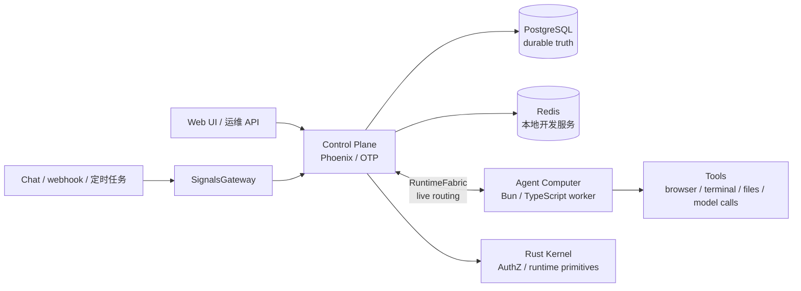

# Ankole - 面向共享 AI 同事的开源 AgentOS

[](LICENSE)


[English](./README.md) | [日本語](./README.ja.md)

**Ankole 是一个自托管的 AgentOS，用来运行共享 AI 同事。**

它把 AI 工作从私人聊天框里移出来，放进工作本来发生的地方：频道、代码仓库、日程、仪表盘、内部系统和长期项目上下文。一个 Ankole agent 拥有自己的身份、记忆、权限、工具、工作空间和责任边界——因此它能**持有正在进行的任务**，而不只是回答一条一次性消息。

[Claude Tag](https://claude.com/product/tag) 是一个容易理解的公开参照：在 Slack thread 里 tag 一个 AI，让它读取共享上下文、使用组织工具、记住 channel context，并在工作需要时间时主动跟进。Ankole 面向的是这个模式更开放、更泛化的版本：不只 Slack，不只 Claude，不只一个 agent，也不把上下文交给某个厂商托管。

Ankole 适合的是需要负责人承担的工作，而不只是需要一个回答的问题。一个适合 Ankole 的岗位应该有可见结果：代码合并、报告交付、客户问题处理、告警分流、市场变化被发现，或者 backlog 被推进。

## Ankole 与其它方案的区别

- **默认共享，而不是私人聊天。** Agent 进入团队可见的 channel 和 provider context；多个人可以观察、steer，并接着推进同一件事。
- **持久身份，而不是 prompt 约定。** 人类和 agent 都是 Principal，有权限授权和审计轨迹，因此 authorization 是 runtime 关注点。
- **长时 actor session，而不是 request/response。** Session 可以 wake、接收 signal、checkpoint、stream progress、hibernate，并带着上下文恢复。
- **部署者掌控上下文，而不是厂商托管。** 记忆、配置、凭证和审计都在你自己的基础设施里，是自托管部署。
- **Live 控制加上 durable 事实，而不是二选一。** ZeroMQ RuntimeFabric 承载 actor/worker/RPC 的 live 流量，PostgreSQL 仍然是 replay、fence 和 final commit 的来源。

## Ankole 增加了什么

- **共享工作，而不是私人聊天。** Agent 可以进入共享 channel 和 provider context，多个人可以观察、steer，并接着推进同一件事。
- **持久身份。** 人类和 agent 都是 Principal，有外部身份、组和权限授权。
- **多种来源。** IM、webhook、定时提醒、内部系统和未来 provider adapter 都会被归一化为 signal input。
- **多个 agent。** 一套 Ankole 部署可以托管多个 agent，它们有不同的 mission、访问权限、工具、记忆和出站身份。
- **Session actor。** 长期执行单元是 `actor_id = {agent_id, session_id}`。Session 是上下文、workspace state、steering、cancel 和恢复交汇的地方。
- **自己的上下文。** Conversation、model turn、summary、signal projection、决策、纠正和未来 domain record 都留在你的基础设施里。
- **部署者控制。** 访问控制、配置、plugin activation、actor lease、outbox side effect 和 audit surface 都由部署和运维 Ankole 的人掌握。

## 产品形态

Ankole 应该让这些工作流变得自然：

- coding agent 关注 issue、复现 bug、修改代码、打开 draft PR，并报告哪些地方还需要人类决策；
- customer-success agent 观察共享群聊，记录重要事实，更新 work state，只在需要时私下升级；
- research agent 监控市场、政策、竞品和内部 notes，并在变化真正重要时跟进；
- QA agent 推进测试 backlog，收集证据，并把带上下文的 failure 交给人复核；
- operations agent 观察 alert、准备 runbook，并在采取高风险动作前请求批准。

共同模式不是“回答这个问题”，而是“持有这个岗位、使用可用上下文、并由结果接受评价”。

## Actor 运行时

Ankole 是一个面向长时 AI 工作的 actor-oriented runtime。每个 active session 都是一个可寻址的 virtual actor：它可以 wake、接收消息、checkpoint、stream progress、hibernate、recover、continue，而不是被简化成一个 HTTP request 或 queue job。

Runtime 建立在五个技术判断上：

- **Virtual Actors for AI work。** 一个 session 是有地址、有状态、有 mailbox、有生命周期和恢复路径的工作身份，不是散落在后台的一段任务。
- **OTP Supervision Trees as failure domains。** 一个 agent 卡住、超时或崩溃时，Ankole 可以隔离或重启那一支，而不是让它拖垮整套部署。
- **ZeroMQ Activation Fabric for live control。** Wakeup、steering、checkpoint、streaming 和 backpressure 通过低延迟 routing layer 流动，让 agent 正在工作时也能被引导和接管。
- **Agent Computer as execution substrate。** LLM loop、tools、MCP server、文件、terminal state 和 streaming output 跑在靠近 workspace 的 Bun + TypeScript 计算环境里。
- **Durable Ledger for recovery and audit。** Mailbox、turn、reminder、decision 和已提交 side effect 比进程活得更久。Streaming 是进度；已提交的工作才是事实。

对用户和运维者来说，承诺很直接：agent 可以工作几小时甚至几天，可以在运行中接收新输入，可以独立失败，可以带着上下文恢复，并且 side effect 有明确账本。更完整的 runtime 论证见：[为什么 OTP 是更好的多智能体编排运行时](https://ding.ee/zh-Hans-CN/why-otp-is-a-better-runtime-for-multi-agent-orchestration/)。

这就是 Ankole 的技术判断：actor model 负责长时工作的身份和生命周期，OTP 负责故障语义，ZeroMQ 负责 live activation，Agent Computer 负责本地执行。Ankole 更接近一个面向 AI 工作的分布式操作系统，而不是聊天机器人后端。

## 架构



整体上：

- **SignalsGateway** 接收 provider ingress，归一化为 actor input。
- **Control Plane** 拥有 durable state、actor 编排、配置、身份和授权。
- **RuntimeFabric** 通过 ZeroMQ 连接 actor、worker 和 RPC lane，承担 live 执行；PostgreSQL 仍然是 durable replay、fence、reconciliation 和 final commit 的来源。
- **Agent Computer** 在隔离的 worker 容器中执行 turn 和 tools。
- **PostgreSQL** 仍然是已接受 input、state、fence 和 final commit 的 durable 记录。

## 当前状态

Ankole 是早期工程发行版，不是打磨完成的终端用户产品或托管 SaaS。

| 领域 | 状态 |
| --- | --- |
| Control plane | `app/control_plane` 下的 Phoenix/OTP 应用，拥有 durable state、配置、actor 编排、Principal/AuthZ 和 API。 |
| Agent Computer | `app/agent_computer` 下的 Bun/TypeScript worker runtime，在隔离的 Linux worker 镜像内运行 agent loop 和本地 tools；不是独立 CLI。 |
| Kernel | `app/kernel` 下的 Rust crate，由 Elixir (Rustler) 和 Bun (N-API) 加载，承载 crypto、identifier、AuthZ evaluator 和 ZeroMQ transport。 |
| Frontend | `app/webapps` 下的 Vite + React surfaces，构建进 Phoenix static shell。 |
| 本地服务 | PostgreSQL 和 Redis 由 devkit Docker Compose 提供。 |
| 设计文档 | 架构和 runtime 设计文档位于 `docs/design-docs`。 |
| 公共 API 稳定性 | 内部 API 仍在演进，版本之间会有 breaking change。 |

## 当前仓库

这个仓库是 Ankole 当前活跃的 control-plane 和 runtime workspace，仍是工程发行形态，还不是打磨完成的终端用户发行版。

- `app/control_plane` - Phoenix/OTP control plane，承载 Principal/AuthZ、AppConfigure、setup、console、plugin registry、I18n、SignalsGateway、actor runtime、RuntimeFabric 和 PostgreSQL 持久语义状态。
- `app/kernel` - 被 Elixir 和 Bun 共同加载的 Rust foundation，承载 crypto、identifier、phone/JWT helper、AuthZ evaluator、protobuf envelope 和 ZeroMQ RuntimeFabric transport。
- `app/agent_computer` - Bun + TypeScript Agent Computer worker，承载本地 LLM loop、provider adapters、tools、skill loading、文件、terminal state 和 worker daemon。
- `app/webapps` - Vite + React frontend applications，提供 auth、setup、console surfaces，并构建进 Phoenix static shell。
- `app/library` - 内置 agent skills 和 `MISSION.md`、`SOUL.md` 等 starter templates。
- `app/locales` - control plane 和 browser surfaces 共用的 TOML translation catalogs。
- `libs/uikit` - Ankole webapps 共用的 UI primitives。
- `libs/feishu_openapi` - 本地 Lark/Feishu OpenAPI client library。
- `internals/plugins` - 随仓库维护的私有第一方 provider/plugin code，但不作为公开 plugin boundary 呈现。
- `tools/devkit` - local services、app database helpers、code generation 和 analysis 的 workspace automation。
- `docs/design-docs` - Principal identity、authorization、configuration、I18n、plugins、RuntimeFabric、SignalsGateway 和 provider adapters 的当前设计文档。

RuntimeFabric 是 control-plane 到 worker 的 live fabric。它通过 ZeroMQ 承载 actor traffic、bounded RPC 和 worker-file frames；PostgreSQL 仍然负责 durable replay、fence、reconciliation 和 final commit。SignalsGateway 是 provider ingress layer：外部 chat、webhook 和 provider event 会变成 actor input，但不会把外部来源事实误写成 execution state。

## 开发

Ankole 默认使用 Bun 运行 workspace scripts，使用 Elixir/Phoenix 承载 control plane。

```shell
bun install

# 本地依赖服务和 workspace helper
bun run kit --help
bun run services:start
bun run services:status

# Control plane
bun run control-plane:setup
bun run control-plane:dev
bun run control-plane:test

# Agent Computer container image 和测试
docker build -f app/agent_computer/Dockerfile -t ankole-agent-computer:0.1.0 .
bun run agent-computer:test
bun run agent-computer:type-check

# 其它 Bun packages
bun run webapps:build
bun run feishu-openapi:test
```

Agent Computer 是 Linux container runtime。强 bubblewrap command isolation
需要 Docker 带 `--cap-add SYS_ADMIN`、`--security-opt seccomp=unconfined` 和
`--security-opt systempaths=unconfined`，除非你提供等价的自定义 seccomp/profile
配置。Kubernetes 的等价配置放在 Agent Computer container 的 `securityContext`：
`capabilities.add: ["SYS_ADMIN"]`、对应 `seccompProfile` 和 `procMount: Unmasked`。
如果强 bubblewrap 不可用，worker 可以降级到弱 bubblewrap（把容器已有 `/proc`
bind 进 bwrap），并在启动时打 warning。它不会把 model-facing command fallback
到无 sandbox 执行。

仓库仍在快速移动时，优先使用 package-local validation：

```shell
bun run --filter @ankole/control-plane test
bun run agent-computer:test
bun run --filter @ankole/agent-computer type-check
bun run --filter @ankole/webapps type-check
bun run --filter @ankole/feishu-openapi test
```

Control plane 运行起来后，可以用 worker bootstrap helper 渲染出启动外部 Agent Computer worker 的 Docker 命令，指向本地 RuntimeFabric endpoint：

```shell
cd app/control_plane
mix ankole.actor_runtime.worker_bootstrap --endpoint tcp://127.0.0.1:6010 --worker-id worker-a
```

生产 bootstrap config 使用 `DATABASE_URL`、`SECRET_KEY_BASE`、`REDIS_URL` 这样的通用基础设施名称。运行时应用配置属于 Ankole 的 PostgreSQL-backed AppConfigure 表面，而不是 process-local environment variables。
