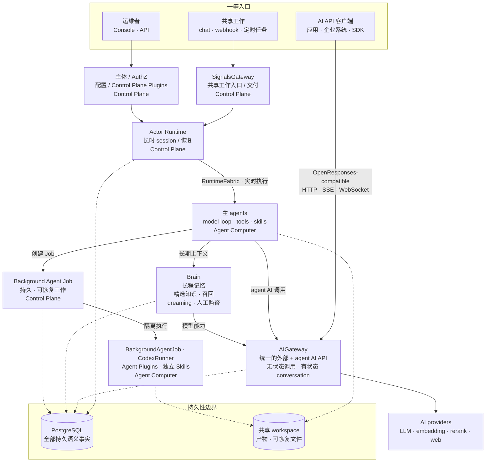

# Ankole - 让 AI 同事有自己 OKR 的开源 AgentOS

[](LICENSE)


[](https://deepwiki.com/AgentBull/ankole)

[English](./README.md) | [日本語](./README.ja.md)

[与其它方案的区别](#ankole-与其它方案的区别) · [产品形态](#产品形态) · [Actor 运行时](#actor-运行时) · [架构](#架构) · [当前状态](#当前状态) · [开发](#开发)

**Ankole 是一套自托管的 AgentOS，让你在自己的服务器上组建 AI 同事团队。** 它们领的是目标，不是指令：在团队群里承接任务，自主拆解、执行、交付，最终用结果说话。

它把 AI 工作从私人聊天框里移出来，放进工作本来发生的地方：频道、代码仓库、日程、仪表盘、内部系统和长期项目上下文。一个 Ankole agent 拥有自己的身份、记忆、权限、工具、工作空间和责任边界——因此它能**持有正在进行的任务**，而不只是回答一条一次性消息。

[Claude Tag](https://claude.com/product/tag) 是一个容易理解的公开参照：在 Slack thread 里 tag 一个 AI，让它读取共享上下文、使用组织工具、记住 channel context，并在工作需要时间时主动跟进。Ankole 面向的是这个模式更开放、更泛化的版本：**不只 Slack，不只 Claude，不只一个 agent，也不把上下文交给某个厂商托管。**

Ankole 适合的是需要有人负责的工作，而不只是需要一个回答的问题。它能坐的岗位有三个共同点：可以远程完成、有明确交付物、事后能用数据评判。

## Ankole 与其它方案的区别

助手回答的问题是「它怎么帮我」；同事回答的是「这段工作默认由谁负责」。Ankole 改变的是 agent 在组织里的位置，而不是模型的大小。

- **它属于这个群，不属于带它进群的人。** 记忆归工作场域，权限按频道授予，行为对所有人可见，结论沉淀为团队的共同事实——而这一切都在你自己的服务器上，不在厂商的租户里。
- **岗位是责任槽，不是能力包。** 会做不等于该做，装上技能不等于承担责任。Ankole 提供的是把能力变成岗位的那层结构：独立身份、组织授权、审计轨迹、升级路径和考核口径。
- **它住进劳动的闭环，而不是只够到其中一段。** 看见现场、判断轻重、形成承诺、推进行动、追踪结果、处理例外、对组织有交代——SaaS 记录结果，RPA 执行动作，问答机器人处理开头，Ankole 的 agent 负责整个闭环。
- **它不只记录秩序，还生成秩序。** 群里用自然语言形成的承诺、风险、口径和截止日期，当场变成可追踪、可执行、会退役的组织现实。
- **日常闭环默认由它负责，人在关键处介入。** 请示、审批、异常、问责时人类在场；交付物、决策和已提交的操作都记在持久账本里，产出按「事后能被打分」设计。

生成的秩序靠记忆维护。多数 agent 的记忆是只增不减的日志：旧口径和新规则并排躺着，没有时间线，也没有谁取代谁。Ankole 的记忆会裁决——新规则接位，旧口径连同生效时段一起退役；同类纠正并成一条；矛盾的结论按时间、来源和置信度分出高下；预测过的事，结果出来还要回头对账。这些动作服从同一个目标：缩小模型预测与真实观测之间的落差。

## Ankole 增加了什么

- **长任务在后台运行。** 后台任务、定时任务、稍后回来查看。一个任务可以连续运行数小时，完成后 agent 回到原来的群里通知你；中途哪一步出错，它会说明原因并重试。
- **群聊里的隐性知识。** 谁定下的规则、谁偏好什么、上次那个方案为什么没通过——这些从来没有人专门告诉过它的信息，会沉淀为这个群的共享记忆。
- **会建立世界模型的记忆。** Brain 把对话蒸馏为精选知识，既归纳也演绎，淘汰过期条目，并把外部世界的变化直接纳入认知——不必等谁在群里提起。
- **Deep Research 与 playbook。** 扇出检索、分层验证、对立假设检验，交付带引证的报告。一类任务跑通之后固化为 playbook，下次直接沿用。
- **真的会用浏览器。** 运行时持有一个真实的 Chromium 会话，agent 通过 `ankole-browser` 驱动：读取渲染后的页面、点击、输入、截图、执行可复现的 Playwright 脚本，登录状态跨步骤保持。
- **技能自己进化。** agent 把踩过的坑写成 overlay 提案，经人工批准后在下一个会话生效。它不会擅自修改自己，改动内容全程可查。
- **多个 agent，一套私有化部署实例。** 每个 agent 有各自的使命、权限、工具、记忆和对外身份；主 agent 把边界清晰的任务派发给 job agent，自身不必阻塞等待。
- **对接企业身份与 IM。** 飞书、Slack、钉钉、Teams、Google Workspace 都是一等适配器，身份来自你现有的 IdP。IM、webhook、定时任务和内部系统统一归一化为 signal input。

## 产品形态

Ankole 能坐的岗位：可以远程完成、有明确交付物、事后能用数据评判。下面六个跨六个行业，是示例而非完整清单。

| 岗位 | 交付物 | 拿什么考核 |
|---|---|---|
| 二级市场研究员 | 个股与行业研究、情景推演、交易触发条件 | 事后复盘的命中率与超额 |
| 云成本优化师 | 成本归因、配置右调方案、迁移路径 | 单位业务量的云支出 |
| 智能合约审计员 | 审计报告与可复现的 PoC | 高危漏洞的漏报数 |
| 药品注册专员 | 注册资料包与发补答复 | 一次通过率与发补轮次 |
| 专利工程师 | 检索报告、交底书、权利要求书 | 授权率与驳回复审次数 |
| 跨境电商运营分析师 | 投放与补货周报、选品清单 | TACoS 与断货天数 |

共同点不是「回答这个问题」，而是**守住这个岗位、用好掌握的上下文、用结果说话**。

## Actor 运行时

Ankole 是一个面向长时 AI 工作的 actor-oriented runtime。每个 active session 都是一个可寻址的 virtual actor：它可以 wake、接收消息、checkpoint、stream progress、hibernate、recover、continue，而不是被简化成一个 HTTP request 或 queue job。

Runtime 建立在五个技术判断上：

- **Virtual Actors for AI work。** 一个 session 是有地址、有状态、有 mailbox、有生命周期和恢复路径的工作身份，不是散落在后台的一段任务。
- **OTP Supervision Trees as failure domains。** 一个 Agent 卡住、超时或崩溃时，Ankole 可以隔离或重启对应分支，不会拖垮整个实例。
- **ZeroMQ Activation Fabric for live control。** Wakeup、steering、checkpoint、streaming 和 backpressure 通过低延迟 routing layer 流动，让 agent 正在工作时也能被引导和接管。
- **Agent Computer as execution substrate。** LLM loop、tools、MCP server、文件、terminal state 和 streaming output 跑在靠近 workspace 的 Bun + TypeScript 计算环境里。
- **Durable Ledger for recovery and audit。** Mailbox、turn、reminder、decision 和已提交 side effect 比进程活得更久。Streaming 是进度；已提交的工作才是事实。

对用户和运维者来说，承诺很直接：agent 可以工作几小时甚至几天，可以在运行中接收新输入，可以独立失败，可以带着上下文恢复，并且 side effect 有明确账本。更完整的 runtime 论证见：[为什么 OTP 是更好的多智能体编排运行时](https://ding.ee/zh-Hans-CN/why-otp-is-a-better-runtime-for-multi-agent-orchestration/)。

这就是 Ankole 的技术判断：actor model 负责长时工作的身份和生命周期，OTP 负责故障语义，ZeroMQ 负责 live activation，Agent Computer 负责本地执行。Ankole 更接近一个面向 AI 工作的分布式操作系统，而不是聊天机器人后端。

## 架构


```mermaid
flowchart TB
  subgraph Entry["一等入口"]
    direction LR
    Work["共享工作<br/>chat · webhook · 定时任务"]
    Clients["AI API 客户端<br/>应用 · 企业系统 · SDK"]
    Ops["运维者<br/>Console · API"]
  end

  SG["SignalsGateway<br/>共享工作入口 / 交付<br/>Control Plane"]
  Platform["主体 / AuthZ<br/>配置 / Control Plane Plugins<br/>Control Plane"]
  Runtime["Actor Runtime<br/>长时 session / 恢复<br/>Control Plane"]
  Main["主 agents<br/>model loop · tools · skills<br/>Agent Computer"]
  Brain["Brain<br/>长程记忆<br/>精选知识 · 召回<br/>dreaming · 人工监督"]
  Delegate["Background Agent Job<br/>持久 · 可恢复工作<br/>Control Plane"]
  AI["AIGateway<br/>统一的外部 + agent AI API<br/>无状态调用 · 有状态 conversation"]
  Task["BackgroundAgentJob · CodexRunner<br/>Agent Plugins · 独立 Skills<br/>Agent Computer"]
  Providers["AI providers<br/>LLM · embedding · rerank · web"]

  subgraph Storage["持久性边界"]
    direction LR
    PG[("PostgreSQL<br/>全部持久语义事实")]
    Workspace[("共享 workspace<br/>产物 · 可恢复文件")]
  end

  Work --> SG --> Runtime
  Ops --> Platform --> Runtime
  Runtime -->|"RuntimeFabric · 实时执行"| Main
  Clients -->|"OpenResponses-compatible<br/>HTTP · SSE · WebSocket"| AI
  Main -->|"agent AI 调用"| AI
  Main -->|"长期上下文"| Brain
  Brain -->|"模型能力"| AI
  Main -->|"创建 Job"| Delegate
  Delegate -->|"隔离执行"| Task
  AI --> Providers

  Runtime -.-> PG
  AI -.-> PG
  Brain -.-> PG
  Delegate -.-> PG
  Main -.-> Workspace
  Task -.-> Workspace
```

整体上：

- **三个一等入口。** 共享工作从 SignalsGateway 进入，应用和企业系统直接调用 AIGateway，运维者通过 Console 和 API 管理系统。AIGateway 不是只给 worker 使用的内部代理。
- **AIGateway 是统一 AI 边界。** 它提供兼容 OpenResponses 的 HTTP、SSE 和 WebSocket API，同时支持无状态请求和按主体隔离的有状态会话。LLM、Embedding、Rerank、Web Search 和 Web Fetch 都通过同一个 Provider 路由面解析，上游凭证始终留在控制面。
- **Actor 把持久工作与执行资源分开。** Actor Runtime 拥有长时 session 与恢复语义；可替换的 Agent Computer worker 负责 model loop、tools、skills 和 sandbox。
- **Brain 是长期记忆。** 它统一当前知识、原始聊天召回、dreaming 和人工监督。PostgreSQL 关系行才是事实，Markdown 和注入上下文都只是投影。
- **后台 Agent 任务是持久工作，不是一个子进程。** Job 能跨 worker 故障恢复，可以继续、等待输入，并在状态变化时唤醒 owner 会话。它只保存一个可选的 Workspace Template；CodexRunner 每次运行都加载 Agent 当前启用的全部 Agent Plugin，以及允许 Background Agent Job 使用的已启用 Skill，并只投影刻意收窄的平台 tools。
- **持久性分成两类。** PostgreSQL 拥有语义事实；共享 workspace 保存被这些状态引用的产物和可恢复文件。RuntimeFabric 只负责实时传输，共享 Rust kernel 在进程内提供 transport 和 AI data-plane primitives。

## 当前状态

Ankole 是一个完整、可自托管的 AgentOS，已在生产环境中运行。Control plane、Agent Computer、kernel 和运维 console 端到端可用。

- **多家模型 provider。** OpenAI、Azure OpenAI、Claude、Google AI Studio、OpenRouter 以及其它 OpenAI-compatible endpoint 都是一等公民，配套 compaction、有状态 conversation、reasoning-effort 控制和按 provider 的 usage 处理。
- **真实 IM 集成。** Lark/Feishu 和 Slack 作为第一方 provider 集成，覆盖 lifecycle、transport、main flow 和真实 LLM 的端到端测试。
- **Brain。** curated knowledge、chat recall、dreaming（离线沉淀）、人工复核和 recovery 统一在一个子系统里，后端是 PostgreSQL 全文检索加向量检索。
- **长时 actor runtime。** Session 可以 wake、checkpoint、stream progress、hibernate、带上下文 recover；steering 和 cancel 是 live-control 操作，不是 request/response。
- **运维 console。** Agents、Agent Library 全局默认与逐 Agent 覆盖、Control Plane Plugins、providers、model profiles、identity、signals、workers、worker 环境、Brain 条目和后台 Agent 任务都可以从内置 web console 管理。
- **面向真实条件测试。** Unit 套件加上 Lark 和 Slack 的 main flow、transport、lifecycle、真实 LLM、调度、worker computer、chaos 恢复和并发/性能的专门端到端套件。

Ankole 的公共 API 目前没有兼容性承诺，版本之间会有 breaking change。

| 领域 | 状态 |
| --- | --- |
| Control plane | `app/control_plane` 下的 Phoenix/OTP 应用，负责持久状态、配置、Actor 编排、主体与 AuthZ、AIGateway、Brain、SignalsGateway 和运维 API。 |
| Agent Computer | `app/agent_computer` 下的 Bun/TypeScript worker runtime，在隔离的 Linux worker 镜像内运行 agent loop 和本地 tools；不是独立 CLI。 |
| Kernel | `app/kernel` 下的 Rust crate，由 Elixir (Rustler) 和 Bun (N-API) 加载，承载 crypto、identifier、AuthZ evaluator 和 ZeroMQ transport。 |
| Frontend | `app/webapps` 下的 Vite + React console、auth 和 setup surfaces，构建进 Phoenix static shell。 |
| 本地服务 | PostgreSQL 由 devkit Docker Compose 提供。 |
| 设计文档 | 架构和 runtime 设计文档位于 `docs/design-docs`。 |
| 生产就绪度 | 已在生产中运行。durable 路径、live control 和运维 surface 已完整；公共 API 目前还没有兼容性承诺。 |

## 当前仓库

这个仓库是 Ankole 当前活跃的 control-plane 和 runtime workspace。

- `app/control_plane` - Phoenix/OTP 控制面，承载主体与 AuthZ、AppConfigure、Setup、Console、Control Plane Plugin Registry、I18n、SignalsGateway、Actor Runtime、RuntimeFabric 和 PostgreSQL 持久语义状态。
- `app/kernel` - 被 Elixir 和 Bun 共同加载的 Rust foundation，承载 crypto、identifier、phone/JWT helper、AuthZ evaluator、protobuf envelope 和 ZeroMQ RuntimeFabric transport。
- `app/agent_computer` - Bun + TypeScript Agent Computer worker，承载本地 LLM loop、provider adapters、tools、skill loading、文件、terminal state 和 worker daemon。
- `app/webapps` - Vite + React frontend applications，提供 auth、setup、console surfaces，并构建进 Phoenix static shell。
- `app/library` - 内置独立 Skills、第一方 Agent Plugins 和 `MISSION.md`、`SOUL.md` 等 starter templates。
- `app/locales` - control plane 和 browser surfaces 共用的 TOML translation catalogs。
- `libs/uikit` - Ankole webapps 共用的 UI primitives。
- `libs/feishu_openapi` - 本地 Lark/Feishu OpenAPI client library。
- `libs/slack_openapi` - 本地 Slack Web API、Socket Mode 与 OIDC client library。
- `internals/plugins` - 随仓库维护、编译进私有 release 的第一方 Control Plane Plugin code。
- `tools/devkit` - local services、app database helpers、code generation 和 analysis 的 workspace automation。
- `docs/design-docs` - 主体身份、授权、配置、I18n、插件、RuntimeFabric、SignalsGateway 和 Provider 适配器的当前设计文档。

RuntimeFabric 是 control-plane 到 worker 的 live fabric。它通过 ZeroMQ 承载 actor traffic、bounded RPC 和 worker-file frames；PostgreSQL 仍然负责 durable replay、fence、reconciliation 和 final commit。SignalsGateway 是 provider ingress layer：外部 chat、webhook 和 provider event 会变成 actor event，但不会把外部来源事实误写成 execution state。

## 开发

Ankole 默认使用 Bun 运行 workspace scripts，使用 Elixir/Phoenix 承载 control plane。

首次搭建本地环境时，把下面这一条 prompt 直接交给 coding agent：

```text
请完整阅读 https://github.com/AgentBull/ankole/blob/main/CONTRIBUTING.md，然后在当前 Ankole 仓库中严格依照该指南，带我完成完整的本地环境搭建及文档规定的端到端验收。把该指南作为事实来源；你能安全、可逆地执行和验证的步骤都由你完成；遇到账号、密钥、OAuth 或破坏性操作授权时暂停并指导我；在全部成功标准通过前不要宣称搭建完成。
```

```shell
bun install

# 本地依赖服务和 workspace helper
bun kit --help
bun services:start
bun services:status

# Control plane
bun control-plane:setup
bun control-plane:dev
bun control-plane:test

# Agent Computer container image 和测试
docker build \
  --build-arg "BASE_IMAGE=$(tr -d '\n' < app/agent_computer/base-image.lock)" \
  -f app/agent_computer/Dockerfile -t ankole-agent-computer:0.1.0 .
bun agent-computer:test
bun agent-computer:type-check

# 其它 Bun packages
bun webapps:build
bun feishu-openapi:test
```

Agent Computer 是 Linux container runtime。强 bubblewrap command isolation
需要 Docker 带 `--cap-add SYS_ADMIN`、`--security-opt seccomp=unconfined` 和
`--security-opt systempaths=unconfined`，除非你提供等价的自定义 seccomp/profile
配置。Kubernetes 的等价配置放在 Agent Computer container 的 `securityContext`：
`capabilities.add: ["SYS_ADMIN"]`、对应 `seccompProfile` 和 `procMount: Unmasked`。
如果强 bubblewrap 不可用，worker 可以降级到弱 bubblewrap（把容器已有 `/proc`
bind 进 bwrap），并在启动时打 warning。它不会把 model-facing command fallback
到无 sandbox 执行。

仓库仍在快速移动时，优先使用 package-local validation：

```shell
bun run --filter @ankole/control-plane test
bun run agent-computer:test
bun run --filter @ankole/agent-computer type-check
bun run --filter @ankole/webapps type-check
bun run --filter @ankole/feishu-openapi test
```

Control plane 运行起来后，可以用 worker bootstrap helper 渲染出启动外部 Agent Computer worker 的 Docker 命令，指向本地 RuntimeFabric endpoint：

```shell
cd app/control_plane
mix ankole.actor_runtime.worker_bootstrap --endpoint tcp://127.0.0.1:6010 --worker-id worker-a
```

生产 bootstrap config 使用 `DATABASE_URL`、`SECRET_KEY_BASE` 这样的通用基础设施名称。运行时应用配置属于 Ankole 的 PostgreSQL-backed AppConfigure 表面，而不是 process-local environment variables。

Brain 要求 PostgreSQL 18、启动时 preload `pg_search`，并安装 `pg_search` 与
`vector`。模型 profile、破坏性重建与增量迁移的边界见
[Brain 部署与运维手册](docs/operations/Brain.zh-Hans.md)。专用真实模型验收命令是
`tools/e2e/run --brain-real-llm`；它不进入默认 test gate，也不进入 `--all`。
