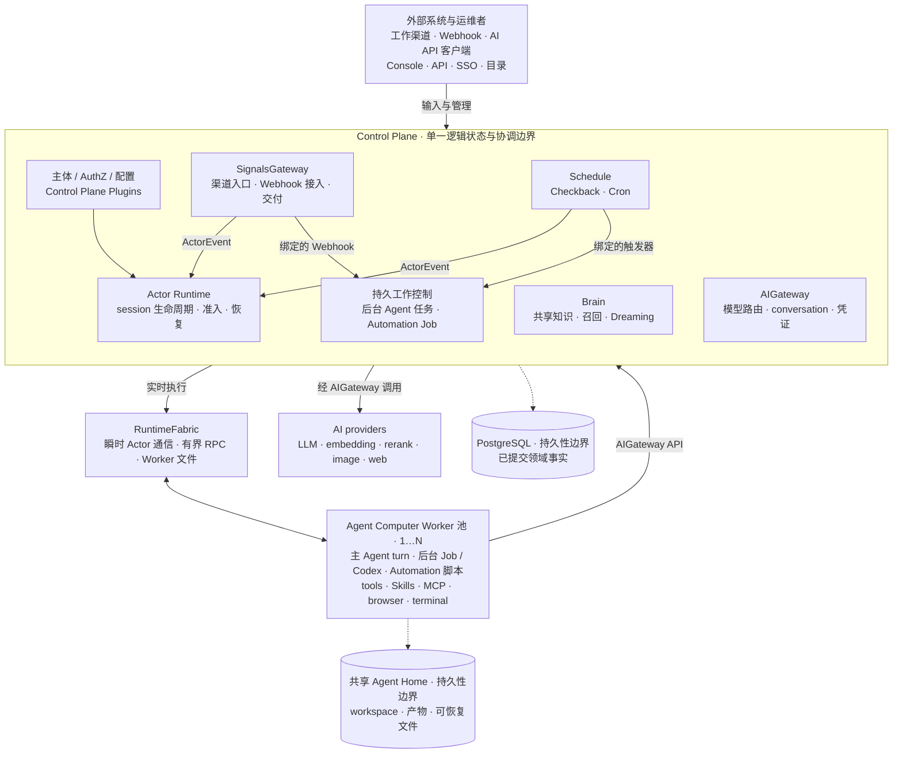

# Ankole：配备公司大脑的企业级 Agent Harness

[](LICENSE)


[](https://deepwiki.com/AgentBull/ankole)

[English](./README.md) | [日本語](./README.ja.md) | [한국어](./README.ko.md)

[为什么选择 Ankole](#为什么选择-ankole) · [公司大脑](#公司大脑) · [决策工作](#决策工作) · [企业级运行时](#企业级运行时) · [架构](#架构) · [当前状态](#当前状态) · [开发](#开发)

**给公司一个大脑，让每个 Agent 作出更好的判断。**

Ankole 是配备公司大脑的开源 Claude Code 替代方案，也是一套面向企业的 Agent Harness。它根据当前任务组织企业知识、实时信号、权限和工具，为 Agent 提供决策上下文，并让每项判断附带证据。实际结果会更新后续决策。

公司大脑为持续运行的 Agent 提供共享知识。Harness 执行企业权限规则，并让任务在多次模型调用之间持续运行。

模型只能根据收到的上下文推理。Ankole 选择与当前任务相关的事实和能力，执行权限规则，在故障后恢复任务，并记录结果供后续决策使用。

Ankole 部署在企业控制的基础设施中。身份、上下文、凭证、产物、审计记录和执行过程均由企业保管。

Harness 为每次模型调用提供贯穿任务的上下文、权限、持久状态和结果反馈。

## 为什么选择 Ankole

大多数 Agent 技术栈止于连接模型、提示词和工具。每次调用都从临时组装的上下文开始。Ankole 的企业状态和运行时跨模型调用持续存在。

- Harness 组装当前上下文、选择可用能力、执行权限规则，并在模型调用之间保存状态。
- 消息、计划任务、Webhook、市场变化和内部事件都能唤醒负责该工作的 Agent。
- 稳定身份、AuthZ、审批节点、审计记录和投递状态共同限定每个 Agent 可以执行的操作。
- 人工纠正、新证据、失效事实和实际结果会更新后续决策所用的上下文。

## 公司大脑

公司大脑让每个获授权的 Agent 使用同一份当前有效的企业知识。

公司大脑从对话、已登记的文件和 URL，以及 Agent 主动写入的内容中学习。每条断言都记录来源、时间、持有者、置信度和可见范围。

- 每项判断都记录持有者；每项证据都关联到所支持的断言。
- 新证据会更新当前判断，同时保留先前判断的历史。
- 系统保留相互冲突的断言，并提交人工复核。
- Brain 召回知识前，先按 Principal 和权限组检查可见范围，再将受保护的知识交给模型。
- Dreaming 组织证据、发现规律、检验到期预测，并将变更建议提交人工审批。

## 决策工作

Ankole 适用于需要检验假设并跟踪结果的决策工作。典型场景包括行业研究、电商选品、深度数据分析和趋势预测。

- Agent 从当前规则、过去的决策、相关证据、可用权限和近期变化开始工作。
- Deep Research 将证据收集分配给多个使用独立上下文的 Agent，检验竞争假设，记录证据缺口，并交付带引证的报告。
- Agent 使用浏览器、终端、文件、模型和外部系统开展调查并执行获准操作。
- 预测、人工纠正和实际结果会成为后续决策的证据。

## 企业级运行时

Ankole 将每个活跃会话作为可寻址的 Virtual Actor 运行。运行时唤醒 Actor 后，Actor 可以接收消息、保存检查点、流式报告进度、休眠，并在恢复后继续执行。

以下五项机制支持长任务恢复，并保留审计依据：

- Virtual Actor 为每个会话提供地址、信箱、生命周期和恢复点。
- OTP 监督树将故障隔离在卡住、超时或崩溃的会话分支内。
- ZeroMQ 以低延迟传递唤醒、引导、检查点、流式输出和背压。
- Agent Computer 运行模型循环、工具、MCP 服务、文件、终端状态和流式输出，并直接访问工作区。
- PostgreSQL 保存信箱、回合、提醒、决策和已提交操作，作为恢复与审计依据。

Agent 可以连续工作数小时或数天，并在运行中接收输入。运行时可以独立恢复失败的执行分支，并保留上下文和已提交操作。详细论证见 [为什么 OTP 是更好的多智能体编排运行时](https://ding.ee/zh-Hans-CN/why-otp-is-a-better-runtime-for-multi-agent-orchestration/)。

## 架构

下图显示所有权和持久化边界。图中省略内部调用。


```mermaid
flowchart TB
  External["外部系统与运维者<br/>工作渠道 · Webhook · AI API 客户端<br/>Console · API · SSO · 目录"]

  subgraph Control["Control Plane · 单一逻辑状态与协调边界"]
    direction TB
    Platform["主体 / AuthZ / 配置<br/>Control Plane Plugins"]
    SG["SignalsGateway<br/>渠道入口 · Webhook 接入 · 交付"]
    Schedule["Schedule<br/>Checkback · Cron"]
    Runtime["Actor Runtime<br/>session 生命周期 · 准入 · 恢复"]
    Jobs["持久工作控制<br/>后台 Agent 任务 · Automation Job"]
    Brain["Brain<br/>共享知识 · 召回 · Dreaming"]
    AI["AIGateway<br/>模型路由 · conversation · 凭证"]
  end

  Fabric["RuntimeFabric<br/>瞬时 Actor 通信 · 有界 RPC · Worker 文件"]
  Workers["Agent Computer Worker 池 · 1…N<br/>主 Agent turn · 后台 Job / Codex · Automation 脚本<br/>tools · Skills · MCP · browser · terminal"]
  Providers["AI providers<br/>LLM · embedding · rerank · image · web"]

  PG[("PostgreSQL · 持久性边界<br/>已提交领域事实")]
  Home[("共享 Agent Home · 持久性边界<br/>workspace · 产物 · 可恢复文件")]

  External -->|"输入与管理"| Control
  SG -->|"ActorEvent"| Runtime
  Schedule -->|"ActorEvent"| Runtime
  SG -->|"绑定的 Webhook"| Jobs
  Schedule -->|"绑定的触发器"| Jobs
  Platform --> Runtime
  Control -->|"实时执行"| Fabric
  Fabric <--> Workers
  Workers -->|"AIGateway API"| Control
  Control -->|"经 AIGateway 调用"| Providers
  Control -.-> PG
  Workers -.-> Home
```

Elixir/OTP 控制面管理主体与 AuthZ、SignalsGateway、Schedule、Actor Runtime、Job、Brain 和 AIGateway 的持久状态，并负责提交决策结果。PostgreSQL 保存各领域已提交的事实。

- SignalsGateway 负责渠道与 Webhook 接入。Schedule 负责 Checkback 和 Cron。
- Agent Computer Worker 运行主 Agent 回合、后台 Job、Codex 回合和 Automation 脚本。
- RuntimeFabric 承载瞬时 Actor 流量、有界 RPC 和 Worker 文件操作。
- AIGateway 通过统一的控制面边界路由 LLM、Embedding、Rerank、Web Search 和 Web Fetch 请求。
- Brain 保存共享页面与断言，并在每次读取时应用请求主体的知识边界。
- 后台 Agent 任务运行交互式模型工作。Automation Job 运行由 Agent 拥有的确定性脚本。
- 共享 Agent Home 保存工作区、产物和可恢复文件。Worker 进程状态可以重建。

## 当前状态

Ankole 已作为完整的企业级 Agent Harness 在生产环境中运行。企业可以在自己的基础设施上托管控制面、Agent Computer、Kernel 和运维控制台。

- OpenAI、Azure OpenAI、Claude、Google AI Studio、OpenRouter 和其他 OpenAI API 兼容端点支持上下文压缩、有状态会话、推理强度控制和用量记录。
- 飞书、Lark 和 Slack 集成都经过生命周期、传输和主流程测试，其中包含真实 LLM 调用。
- Brain 支持按权限范围披露、从对话与 Source 学习、离线整理、运维复核、全文检索和向量检索。
- 运行时可以唤醒会话、保存检查点、流式报告进度、休眠、从保留的上下文恢复，并接受实时引导或取消。
- 内置运维控制台可以管理 Agent、Agent Library 设置、插件、模型提供商、模型、身份、信号、Worker、Brain 知识和后台 Agent 任务。
- 单元测试和专门的系统测试覆盖调度、Agent Computer、故障恢复、并发和性能。

公共 API 的兼容性契约仍在制定。版本之间可能出现破坏性变更。

| 领域 | 状态 |
| --- | --- |
| 控制面 | `app/control_plane` 下的 Phoenix/OTP 应用，负责持久状态、配置、Actor 编排、主体与 AuthZ、AIGateway、Brain、SignalsGateway 和运维 API。 |
| Agent Computer | `app/agent_computer` 下的 Bun/TypeScript Worker 运行时，在隔离的 Linux Worker 镜像内运行 Agent 循环和本地工具，为 Agent 提供执行环境。 |
| Kernel | `app/kernel` 下的 Rust crate，由 Elixir（Rustler）和 Bun（N-API）加载，承载加密、标识符、AuthZ 求值器和 ZeroMQ 传输。 |
| 前端 | `app/webapps` 下的 Vite + React 控制台、登录和安装界面，构建进 Phoenix 静态外壳。 |
| 本地服务 | PostgreSQL 由 devkit 的 Docker Compose 提供。 |
| 设计文档 | 架构和运行时设计文档位于 `docs/design-docs`。 |
| 生产就绪度 | 已在生产中运行，具备状态持久化、实时控制和运维界面。公共 API 的兼容性契约仍在制定。 |

## 当前仓库

本仓库是 Ankole 当前使用的控制面和运行时工作区。

- `app/control_plane`：Phoenix/OTP 控制面，负责主体与 AuthZ、AppConfigure、Setup、Console、Control Plane Plugin Registry、I18n、SignalsGateway、Actor Runtime、RuntimeFabric，以及由 PostgreSQL 保存的持久状态。
- `app/kernel`：Elixir 和 Bun 共用的 Rust 基础库，负责加密、标识符、电话与 JWT 辅助函数、AuthZ 求值、Protobuf 封装和 ZeroMQ RuntimeFabric 传输。
- `app/agent_computer`：基于 Bun 和 TypeScript 的 Agent Computer Worker，负责本地 LLM 循环、模型提供商适配器、工具、Skill 加载、文件、终端状态和 Worker 守护进程。
- `app/webapps`：基于 Vite 和 React 的前端应用，提供身份验证、安装和控制台界面，并构建到 Phoenix 静态外壳中。
- `app/library`：内置 Skill、第一方 Agent Plugin，以及 `MISSION.md`、`SOUL.md` 等初始模板。
- `app/locales`：控制面和浏览器界面共用的 TOML 翻译目录。
- `libs/uikit`：Ankole Web 应用共用的 UI 基础组件。
- `libs/feishu_openapi`：本地 Lark/飞书 OpenAPI 客户端库。
- `libs/slack_openapi`：本地 Slack Web API、Socket Mode 和 OIDC 客户端库。
- `internals/plugins`：随仓库维护并编译到私有版本中的第一方 Control Plane Plugin 代码。
- `tools/devkit`：用于本地服务、应用数据库操作、代码生成和分析的工作区自动化工具。
- `docs/design-docs`：主体身份、授权、配置、I18n、插件、RuntimeFabric、SignalsGateway 和模型提供商适配器的当前设计文档。

RuntimeFabric 是控制面与 Worker 之间的实时通信层。它通过 ZeroMQ 传输 Actor 流量、有界 RPC 和 Worker 文件帧。PostgreSQL 负责持久状态重放、执行权校验、对账和最终提交。SignalsGateway 接收外部消息，将聊天、Webhook 和提供商事件转换为 Actor 事件，同时区分外部来源事实和内部执行状态。

## 开发

Ankole 使用 Bun 运行工作区脚本，使用 Elixir/Phoenix 承载控制面。

首次搭建本地环境时，将以下提示词发送给编程 Agent：

```text
请完整阅读 https://github.com/AgentBull/ankole/blob/main/CONTRIBUTING.md，然后在当前 Ankole 仓库中严格依照该指南，带我完成完整的本地环境搭建及文档规定的端到端验收。把该指南作为事实来源；你能安全、可逆地执行和验证的步骤都由你完成；遇到账号、密钥、OAuth 或破坏性操作授权时暂停并指导我；在全部成功标准通过前不要宣称搭建完成。
```

```shell
bun install

# 本地依赖服务和工作区工具
bun kit --help
bun services:start
bun services:status

# 控制面
bun control-plane:setup
bun control-plane:dev
bun control-plane:test

# Agent Computer 容器镜像和测试
bun agent-computer:test
bun agent-computer:type-check

# 其他 Bun 包
bun webapps:build
bun feishu-openapi:test
```

Agent Computer 是 Linux 容器运行时。如需启用强 `bubblewrap` 命令隔离，请配置以下权限：

- Docker：添加 `--cap-add SYS_ADMIN`、`--security-opt seccomp=unconfined` 和 `--security-opt systempaths=unconfined`，或使用等效的自定义 seccomp 配置文件。
- Kubernetes：在 Agent Computer 容器的 `securityContext` 中设置 `capabilities.add: ["SYS_ADMIN"]`、对应的 `seccompProfile` 和 `procMount: Unmasked`。

如果强 `bubblewrap` 隔离不可用，Worker 会降级为弱 `bubblewrap` 模式。弱 `bubblewrap` 模式将容器现有的 `/proc` 挂载到 `bwrap`。Worker 会在启动时记录警告，并且不会在无沙箱环境中执行模型生成的命令。

对每个受影响的包运行检查：

```shell
bun run --filter @ankole/control-plane test
bun run agent-computer:test
bun run --filter @ankole/agent-computer type-check
bun run --filter @ankole/webapps type-check
bun run --filter @ankole/feishu-openapi test
```

控制面启动后，运行以下命令生成 Worker 启动指令。生成的指令用于启动外部 Agent Computer Worker，并连接本地 RuntimeFabric 端点：

```shell
cd app/control_plane
mix ankole.actor_runtime.worker_bootstrap --endpoint tcp://127.0.0.1:6010 --worker-id worker-a
```

生产环境通过 `DATABASE_URL`、`SECRET_KEY_BASE` 等通用环境变量提供启动配置。运行时应用配置存入 PostgreSQL 中的 Ankole AppConfigure 记录。

Brain 要求 PostgreSQL 预加载 `pg_search`，并提供 `pg_search`、`vector` 和 `pg_trgm` 扩展。BrainV3 数据库迁移会自动安装这些扩展。`tools/devkit/postgres-for-ankole` 构建满足要求的镜像。
