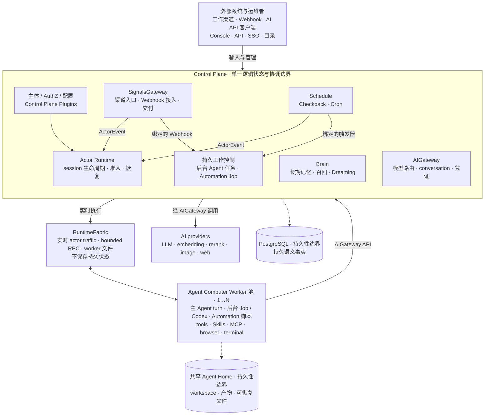

# Ankole —— 开源 AI Workforce OS

[](LICENSE)


[](https://deepwiki.com/AgentBull/ankole)

[English](./README.md) | [日本語](./README.ja.md) | [한국어](./README.ko.md)

[为什么不同](#从-agent-能力到自主劳动力) · [业务职能](#可交给-ankole-的业务职能) · [Actor 运行时](#actor-运行时) · [架构](#架构) · [当前状态](#当前状态) · [开发](#开发)

**让 AI Agent 成为自主劳动力：承担岗位职能并接受考核。**

大多数 AI 产品把模型、助手或 Copilot 交给人，完整工作流程仍由人负责：判断下一步、传递上下文、调用工具、处理失败、完成交付。

Ankole 把完整的执行流程交给 Agent。你定义业务职能、结果指标、权限、工具和工作上下文；Agent 自主规划并执行，在审批或异常边界请示，最终交出可检查、可评分的结果。

Ankole 开源且支持自托管。身份、上下文、凭证、产物、审计记录和执行过程，都留在你控制的基础设施中。

这就是 **Service as Software**：软件不再只帮助人提供服务，而是直接完成服务。Ankole 为高价值知识工作提供实现这种转变的运行时。

## 从 Agent 能力到自主劳动力

Copilot 提高人完成工作的效率，但执行闭环仍在人手里。Ankole 改变的是闭环的默认所有者：Agent 在明确的业务职能内观察、判断、行动、跟进和交付。

- **业务职能，不是聊天人设。** 每个 Agent 都有持续承担的职能、明确交付物、工作上下文和结果指标。身份用于承载授权与历史，不是模仿一个人。
- **考核结果，不考核忙碌。** 工作由真正影响业务的数字衡量，例如收益、风险、排名、通过率、单位成本，或其它事先声明的结果指标。
- **自主跑完整流程，不是下一步建议。** Agent 负责规划、工具调用、跟进、恢复和交付，人不必逐步驱动。
- **授权有明确边界。** 身份、AuthZ、审计记录、审批点和升级路径共同定义 Agent 能做什么，以及何时必须由人决策。
- **长时工作，不是一次请求。** 会话可以连续运行数小时或数天，接收新信息，从故障中恢复，并保留下一步行动所需的上下文。

自主工作依赖准确的当前上下文。Ankole 按时间和来源记录规则、决策、纠正与结果，而不是把所有旧消息都当成同样有效的事实。

Brain 会淘汰过时规则、合并同类纠正、裁决矛盾，并用后来的真实结果检验过去的预测。每次执行都从更准确的工作认知开始。

## 自主劳动力所需的基础设施

- **长任务在后台运行。** 一个 Job 可以连续运行数小时，完成后回到原频道；中途失败时说明步骤并重试，不阻塞主 Agent。
- **共享上下文成为工作记忆。** 即使没人专门对 Agent 说话，规则、偏好和被否决的方案也能积累进记忆。
- **记忆跟随世界变化。** Brain 策展知识、淘汰过期条目、基于证据推理，并直接接收外部变化。
- **Deep Research 沉淀成 playbook。** 扇出检索、分层验证和对立假设检验产出带引证的报告；跑通的方法可以指导下一次执行。
- **真实浏览器完成真实工作。** Agent 能读取页面、点击、输入、截图、运行 Playwright 脚本，并跨步骤保持登录状态。
- **技能在人类控制下改进。** Agent 可以提出 skill 更新，经人批准后才对后续会话生效。
- **可以运行一个或多个 Agent。** 每个 Agent 可拥有独立职能、授权、工具、记忆和对外身份；多 Agent 执行不是必需条件。
- **直接连接企业身份与工作渠道。** 飞书、Slack、钉钉、Teams、Google Workspace、Webhook、计划任务和内部系统通过同一信号边界进入。

## 可交给 Ankole 的业务职能

Ankole 适合可以数字化完成、能产出可检查交付物、并有明确结果指标的工作。指标可以是 ROI、风险调整后收益、排名变化、通过率，或其它业务结果。

| 业务职能 | 交付工作 | 结果指标 |
|---|---|---|
| 效果广告投放 | 投放计划、出价、素材与预算调整 | 增量 ROAS 与获客成本 |
| 行业研究与交易 | 研究、假设、组合操作与复盘 | 超额收益、夏普比率与最大回撤 |
| SEO 优化 | 关键词规划、内容简报与页面调整 | 关键词排名变化与有效自然流量 |
| 药品注册 | 注册资料包与发补答复 | 一次通过率与发补轮次 |
| 专利申报 | 先行技术检索、权利要求书与审查意见答复 | 授权率与审查轮次 |
| 智能合约审计 | 审计报告与可复现的 PoC | 高危漏洞漏报数与误报率 |

计量单位是业务职能，不是 Agent 数量。一个 Agent 可以承担一项窄职能，也可以由多个 Agent 共同执行。多 Agent 协作只是实现方式，不是产品价值。

共同契约是：**定义职能，授予有边界的权限，让 Agent 自主工作，再用结果考核。**

## Actor 运行时

Ankole 是一个面向长时 AI 工作的 actor 风格运行时。每个活跃会话都是一个可寻址的 virtual actor：它可以被唤醒、接收消息、做检查点、流式汇报进度、休眠、恢复、继续，而不是被简化成一次 HTTP 请求或一个队列任务。

运行时建立在五个技术判断上：

- **用 Virtual Actor 承载 AI 工作。** 一个 session 是有地址、有状态、有 mailbox、有生命周期和恢复路径的工作身份，不是散落在后台的一段任务。
- **用 OTP 监督树划分故障域。** 一个 Agent 卡住、超时或崩溃时，Ankole 可以隔离或重启对应分支，不会拖垮整个实例。
- **用 ZeroMQ Activation Fabric 做实时控制。** 唤醒、引导、检查点、流式传输和背压通过低延迟的路由层流动，让 agent 正在工作时也能被引导和接管。
- **用 Agent Computer 作为执行基座。** 模型循环、工具、MCP server、文件、终端状态和流式输出跑在靠近 workspace 的 Bun + TypeScript 计算环境里。
- **用持久账本做恢复与审计。** 信箱、回合、提醒、决策和已提交的副作用比进程活得更久。流式只是进度；已提交的工作才是事实。

对用户和运维者来说，承诺很直接：agent 可以工作几小时甚至几天，可以在运行中接收新输入，可以独立失败，可以带着上下文恢复，并且副作用有明确账本。更完整的运行时论证见：[为什么 OTP 是更好的多智能体编排运行时](https://ding.ee/zh-Hans-CN/why-otp-is-a-better-runtime-for-multi-agent-orchestration/)。

这就是 Ankole 的技术判断：actor 模型负责长时工作的身份和生命周期，OTP 负责故障语义，ZeroMQ 负责实时激活，Agent Computer 负责本地执行。它让 Ankole 成为 AI Workforce OS，而不是聊天机器人后端。

## 架构

这张图只表达所有权和持久化边界，不罗列每一次内部调用。


```mermaid
flowchart TB
  External["外部系统与运维者<br/>工作渠道 · Webhook · AI API 客户端<br/>Console · API · SSO · 目录"]

  subgraph Control["Control Plane · 单一逻辑状态与协调边界"]
    direction TB
    Platform["主体 / AuthZ / 配置<br/>Control Plane Plugins"]
    SG["SignalsGateway<br/>渠道入口 · Webhook 接入 · 交付"]
    Schedule["Schedule<br/>Checkback · Cron"]
    Runtime["Actor Runtime<br/>session 生命周期 · 准入 · 恢复"]
    Jobs["持久工作控制<br/>后台 Agent 任务 · Automation Job"]
    Brain["Brain<br/>长期记忆 · 召回 · Dreaming"]
    AI["AIGateway<br/>模型路由 · conversation · 凭证"]
  end

  Fabric["RuntimeFabric<br/>实时 actor traffic · bounded RPC · worker 文件<br/>不保存持久状态"]
  Workers["Agent Computer Worker 池 · 1…N<br/>主 Agent turn · 后台 Job / Codex · Automation 脚本<br/>tools · Skills · MCP · browser · terminal"]
  Providers["AI providers<br/>LLM · embedding · rerank · image · web"]

  PG[("PostgreSQL · 持久性边界<br/>持久语义事实")]
  Home[("共享 Agent Home · 持久性边界<br/>workspace · 产物 · 可恢复文件")]

  External -->|"输入与管理"| Control
  SG -->|"ActorEvent"| Runtime
  Schedule -->|"ActorEvent"| Runtime
  SG -->|"绑定的 Webhook"| Jobs
  Schedule -->|"绑定的触发器"| Jobs
  Platform --> Runtime
  Control -->|"实时执行"| Fabric
  Fabric <--> Workers
  Workers -->|"AIGateway API"| Control
  Control -->|"经 AIGateway 调用"| Providers
  Control -.-> PG
  Workers -.-> Home
```

整体上：

- **一套控制面拥有状态和协调权。** 主体与 AuthZ、SignalsGateway、Schedule、Actor Runtime、Job 生命周期、Brain 和 AIGateway 都在 Elixir/OTP 中作出持久决策，语义事实写入 PostgreSQL。
- **触发器的所有者彼此分开。** SignalsGateway 负责渠道与 Webhook 接入，Schedule 负责 Checkback 和 Cron。触发器默认唤醒 Actor session；绑定 Automation Job 后，则创建一条持久的 Automation Job run。
- **Worker 提供可替换的执行资源。** 一台或多台 Agent Computer Worker 运行主 Agent turn、后台 Job/Codex turn 和 Automation 脚本。RuntimeFabric 承载实时 actor 流量、有界 RPC 和 worker 文件操作，但不是持久队列。
- **AIGateway 是统一 AI 边界。** 它提供兼容 OpenResponses 的 HTTP、SSE 和 WebSocket API，同时支持无状态请求和按主体隔离的有状态会话。LLM、Embedding、Rerank、Web Search 和 Web Fetch 都通过同一个 Provider 路由面解析，上游凭证始终留在控制面。
- **Brain 是长期记忆。** 它统一当前知识、原始聊天召回、dreaming 和人工监督。PostgreSQL 关系行才是事实，Markdown 和注入上下文都只是投影。
- **两类 Job 提供不同保证。** 后台 Agent 任务是可恢复、可等待输入的交互式模型工作；Automation Job 是 Agent 拥有的确定性脚本，每次消费触发器都会形成一条持久的运行记录，并可向归属 session 发出事件。
- **持久性分成两类。** PostgreSQL 拥有语义事实；共享 Agent Home 保存工作区、产物和可恢复文件。RuntimeFabric 和 Worker 进程状态都可以重建。

## 当前状态

Ankole 是一个完整、可自托管的 AI Workforce OS，已在生产环境中运行。控制面、Agent Computer、kernel 和运维控制台端到端可用。

- **多家模型提供商。** OpenAI、Azure OpenAI、Claude、Google AI Studio、OpenRouter 以及其它兼容 OpenAI 的端点都是一等公民，配套上下文压缩、有状态会话、reasoning-effort 控制和按提供商计的用量处理。
- **真实 IM 集成。** 飞书/Lark 和 Slack 作为第一方提供商集成，覆盖生命周期、传输、主流程和真实 LLM 的端到端测试。
- **Brain。** 策展知识、聊天召回、dreaming（离线整理）、人工复核和恢复统一在一个子系统里，后端是 PostgreSQL 全文检索加向量检索。
- **长时 actor 运行时。** 会话可以被唤醒、做检查点、流式汇报进度、休眠、带上下文恢复；引导（steering）和取消是实时控制操作，不是请求/响应。
- **运维控制台。** Agent、Agent Library 全局默认与逐 Agent 覆盖、Control Plane Plugin、模型提供商、模型档案、身份、信号、Worker、Worker 环境、Brain 条目和后台 Agent 任务都可以从内置 Web 控制台管理。
- **面向真实条件测试。** 单元套件之外，还有覆盖飞书与 Slack 的主流程、传输、生命周期、真实 LLM、调度、worker computer、混沌恢复和并发/性能的专门端到端套件。

Ankole 的公共 API 目前没有兼容性承诺，版本之间会有破坏性变更。

| 领域 | 状态 |
| --- | --- |
| 控制面 | `app/control_plane` 下的 Phoenix/OTP 应用，负责持久状态、配置、Actor 编排、主体与 AuthZ、AIGateway、Brain、SignalsGateway 和运维 API。 |
| Agent Computer | `app/agent_computer` 下的 Bun/TypeScript Worker 运行时，在隔离的 Linux Worker 镜像内运行 agent 循环和本地工具；不是独立 CLI。 |
| Kernel | `app/kernel` 下的 Rust crate，由 Elixir (Rustler) 和 Bun (N-API) 加载，承载加密、标识符、AuthZ 求值器和 ZeroMQ 传输。 |
| Frontend | `app/webapps` 下的 Vite + React 控制台、登录和安装界面，构建进 Phoenix 静态外壳。 |
| 本地服务 | PostgreSQL 由 devkit Docker Compose 提供。 |
| 设计文档 | 架构和 runtime 设计文档位于 `docs/design-docs`。 |
| 生产就绪度 | 已在生产中运行。持久路径、实时控制和运维界面已完整；公共 API 目前还没有兼容性承诺。 |

## 当前仓库

这个仓库是 Ankole 当前活跃的控制面和运行时工作区。

- `app/control_plane` - Phoenix/OTP 控制面，承载主体与 AuthZ、AppConfigure、Setup、Console、Control Plane Plugin Registry、I18n、SignalsGateway、Actor Runtime、RuntimeFabric 和 PostgreSQL 持久语义状态。
- `app/kernel` - 被 Elixir 和 Bun 共同加载的 Rust foundation，承载 crypto、identifier、phone/JWT helper、AuthZ evaluator、protobuf envelope 和 ZeroMQ RuntimeFabric transport。
- `app/agent_computer` - Bun + TypeScript Agent Computer worker，承载本地 LLM loop、provider adapters、tools、skill loading、文件、terminal state 和 worker daemon。
- `app/webapps` - Vite + React frontend applications，提供 auth、setup、console surfaces，并构建进 Phoenix static shell。
- `app/library` - 内置独立 Skills、第一方 Agent Plugins 和 `MISSION.md`、`SOUL.md` 等 starter templates。
- `app/locales` - control plane 和 browser surfaces 共用的 TOML translation catalogs。
- `libs/uikit` - Ankole webapps 共用的 UI 原语。
- `libs/feishu_openapi` - 本地 Lark/Feishu OpenAPI client library。
- `libs/slack_openapi` - 本地 Slack Web API、Socket Mode 与 OIDC client library。
- `internals/plugins` - 随仓库维护、编译进私有 release 的第一方 Control Plane Plugin 代码。
- `tools/devkit` - 本地服务、应用数据库辅助、代码生成和分析的工作区自动化。
- `docs/design-docs` - 主体身份、授权、配置、I18n、插件、RuntimeFabric、SignalsGateway 和 Provider 适配器的当前设计文档。

RuntimeFabric 是控制面到 Worker 的实时网络。它通过 ZeroMQ 承载 actor 流量、有界 RPC 和 worker 文件帧；PostgreSQL 仍然负责持久重放、隔离栏、对账和最终提交。SignalsGateway 是提供商入口层：外部聊天、webhook 和提供商事件会变成 actor 事件，但不会把外部来源事实误写成执行状态。

## 开发

Ankole 默认用 Bun 运行工作区脚本，用 Elixir/Phoenix 承载控制面。

首次搭建本地环境时，把下面这一条 prompt 直接交给 coding agent：

```text
请完整阅读 https://github.com/AgentBull/ankole/blob/main/CONTRIBUTING.md，然后在当前 Ankole 仓库中严格依照该指南，带我完成完整的本地环境搭建及文档规定的端到端验收。把该指南作为事实来源；你能安全、可逆地执行和验证的步骤都由你完成；遇到账号、密钥、OAuth 或破坏性操作授权时暂停并指导我；在全部成功标准通过前不要宣称搭建完成。
```

```shell
bun install

# 本地依赖服务和 workspace helper
bun kit --help
bun services:start
bun services:status

# Control plane
bun control-plane:setup
bun control-plane:dev
bun control-plane:test

# Agent Computer container image 和测试
bun agent-computer:test
bun agent-computer:type-check

# 其它 Bun packages
bun webapps:build
bun feishu-openapi:test
```

Agent Computer 是 Linux 容器运行时。强 bubblewrap 命令隔离需要 Docker 带 `--cap-add SYS_ADMIN`、`--security-opt seccomp=unconfined` 和
`--security-opt systempaths=unconfined`，除非你提供等价的自定义 seccomp/profile
配置。Kubernetes 的等价配置放在 Agent Computer 容器的 `securityContext`：
`capabilities.add: ["SYS_ADMIN"]`、对应的 `seccompProfile` 和 `procMount: Unmasked`。
如果强 bubblewrap 不可用，worker 可以降级到弱 bubblewrap（把容器已有的 `/proc`
bind 进 bwrap），并在启动时记录一条 warning。它不会把面向模型的命令回退到无沙箱
执行。

仓库仍在快速变化时，优先使用包内验证：

```shell
bun run --filter @ankole/control-plane test
bun run agent-computer:test
bun run --filter @ankole/agent-computer type-check
bun run --filter @ankole/webapps type-check
bun run --filter @ankole/feishu-openapi test
```

控制面运行起来后，可以用 Worker 引导辅助命令生成启动外部 Agent Computer Worker 的 Docker 命令，指向本地 RuntimeFabric 端点：

```shell
cd app/control_plane
mix ankole.actor_runtime.worker_bootstrap --endpoint tcp://127.0.0.1:6010 --worker-id worker-a
```

生产引导配置使用 `DATABASE_URL`、`SECRET_KEY_BASE` 这样的通用基础设施名称。运行时应用配置属于 Ankole 的 PostgreSQL-backed AppConfigure 表面，而不是进程本地的环境变量。

Brain 要求 PostgreSQL 18、启动时预加载 `pg_search`，并安装 `pg_search` 与
`vector`。模型 profile、破坏性重建与增量迁移的边界见
[Brain 部署与运维手册](docs/operations/Brain.zh-Hans.md)。专用真实模型验收命令是
`tools/e2e/run --brain-real-llm`；它不进入默认 test gate，也不进入 `--all`。
