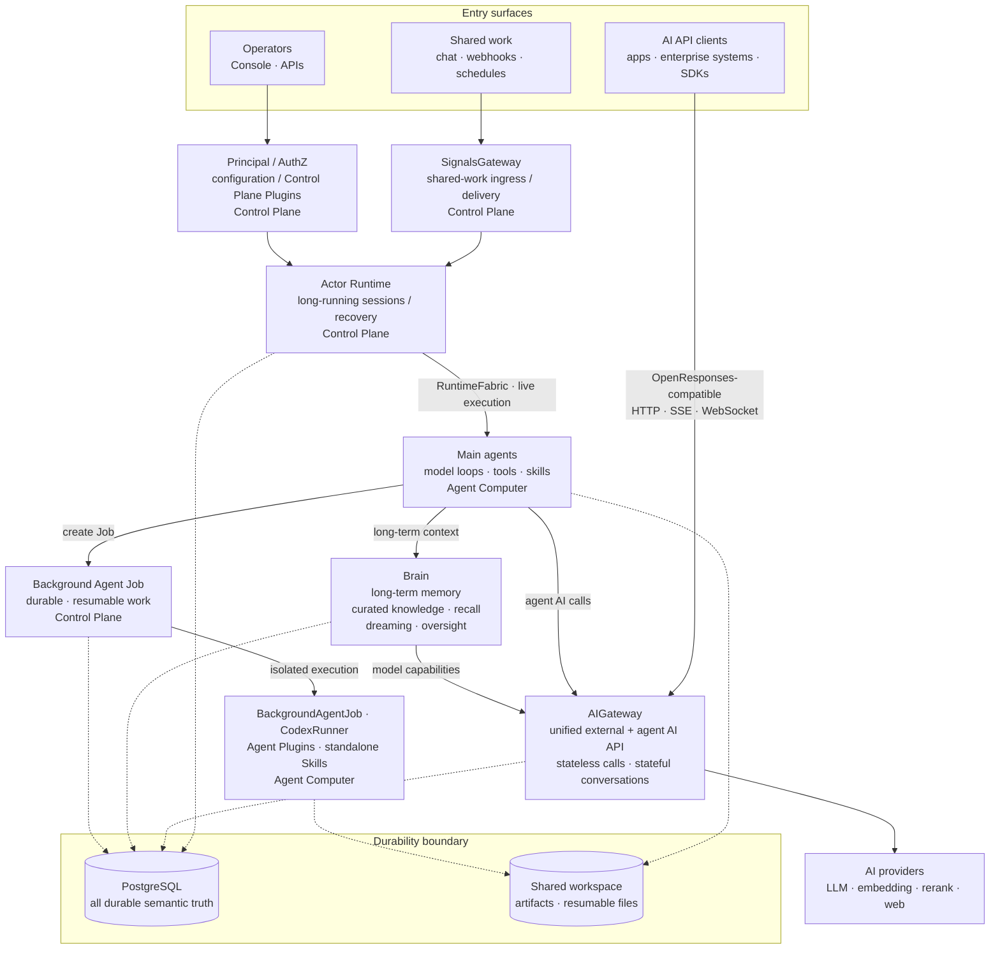

Ankole is an actor-oriented runtime for long-running AI work. Each active session is an addressable virtual actor: it can wake, receive messages, checkpoint, stream progress, hibernate, recover, and continue without pretending an agent is just an HTTP request or a queue job.

The long-running execution unit is `actor_id = {agent_id, session_id}`. A session is where context, workspace state, steering, cancellation, and recovery meet.

## Five technical bets

The runtime is built around five technical bets:

- **Virtual Actors for AI work.** A session is a stateful work identity with an address, mailbox, lifecycle, and recovery path, not loose background work.
- **OTP Supervision Trees as failure domains.** If one agent hangs, times out, or crashes, Ankole can isolate or restart that branch without turning it into a deployment-wide failure.
- **ZeroMQ Activation Fabric for live control.** Wakeups, steering, checkpoints, streaming, and backpressure move through a low-latency routing layer while the agent is still working.
- **Agent Computer as the execution substrate.** The LLM loop, tools, files, terminal state, and streaming output run inside a Bun + TypeScript computer close to the workspace.
- **Durable Ledger for recovery and audit.** Mailboxes, turns, reminders, decisions, and committed side effects outlive processes. Streaming is progress; committed work is truth.

For users and operators, the promise is simple: agents can work for hours or days, receive new input while running, fail independently, recover with context, and keep their side effects accountable.

## Component overview

At a high level:

- **Three first-class entry surfaces.** Shared work enters through SignalsGateway, applications and enterprise systems call AIGateway directly, and operators use the Console and APIs. AIGateway is not merely an internal worker proxy.
- **AIGateway is the unified AI boundary.** Its OpenResponses-compatible HTTP, SSE, and WebSocket API supports stateless requests and Principal-scoped stateful conversations. It resolves models across LLM, embedding, rerank, web-search, and web-fetch providers while upstream credentials remain in the control plane.
- **Actors separate durable work from execution.** Actor Runtime owns long-running session and recovery semantics; replaceable Agent Computer workers run model loops, tools, skills, and sandboxes.
- **Brain is long-term memory.** It combines curated current knowledge, source-chat recall, dreaming, and human oversight. PostgreSQL rows are truth; Markdown and injected context are projections.
- **Background Agent Jobs are durable work, not child processes.** A Job survives worker loss, can resume or wait for input, and wakes its owner when it changes state.
- **Principal/AuthZ is the permission boundary.** Humans and agents are Principals with permission grants and audit trails, so authorization is a runtime concern, not a prompt convention.

## The durability boundary

Durability has two forms. PostgreSQL owns semantic truth: durable replay, fences, reconciliation, and final commits. The shared workspace holds artifacts and resumable files referenced by that state. RuntimeFabric — the live control-plane-to-worker fabric over ZeroMQ, with the shared Rust kernel providing in-process transport and AI data-plane primitives — is live transport only.

SignalsGateway is the provider-ingress layer: external chats, webhooks, and provider events become actor events without turning source facts into execution state.

That is the technical bet: actor model for long-lived work identity, OTP for failure semantics, ZeroMQ for live activation, and Agent Computer for local execution. Ankole is closer to a distributed operating system for AI work than a chatbot backend. A longer version of the runtime argument is in [Why OTP Is a Better Runtime for Multi-Agent Orchestration](https://ding.ee/en-US/why-otp-is-a-better-runtime-for-multi-agent-orchestration/).
