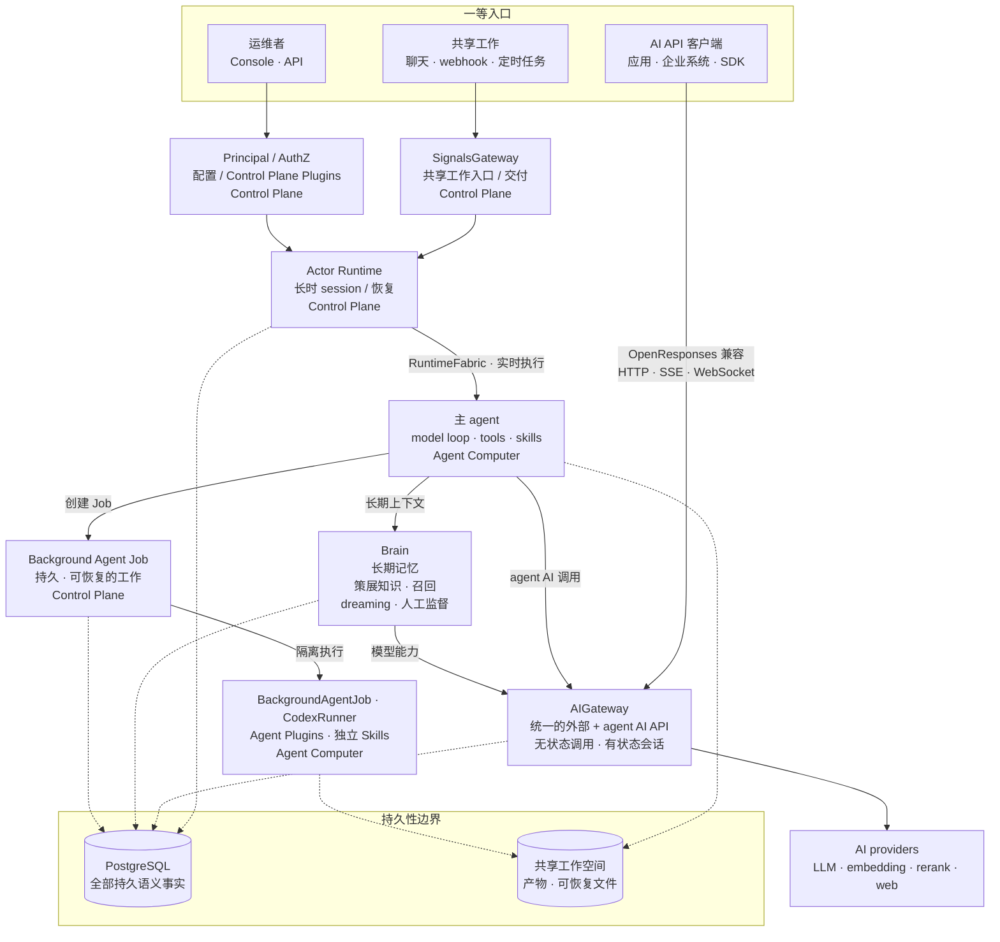

Ankole 是一个面向长时 AI 工作的 actor 运行时。每个活跃 session 都是一个可寻址的虚拟 actor：它能被唤醒、接收消息、做检查点、流出进度、休眠、恢复并继续——而不必假装一个 agent 只是一个 HTTP 请求或一个队列任务。

长时执行单元是 `actor_id = {agent_id, session_id}`。上下文、工作空间状态、引导、取消和恢复都在 session 这里交汇。

## 五个技术判断

运行时建立在五个判断上，每一个都有它存在的理由：

- **用虚拟 actor 承载 AI 工作。** 一个 session 是一个有状态的工作身份，有地址、邮箱、生命周期和恢复路径，而不是散落在后台的一段任务。
- **用 OTP 监督树划分故障域。** 某个 agent 卡住、超时或崩溃时，Ankole 会隔离或重启那一条分支，而不是让一次失败变成全部署的灾难。
- **用 ZeroMQ Activation Fabric 做实时控制。** 唤醒、引导、检查点、流式输出和背压，都通过一层低延迟的路由层流动，而且是在 agent 还在工作的时候。
- **用 Agent Computer 做执行底座。** LLM 循环、工具、文件、终端状态和流式输出，都跑在贴近工作空间的 Bun + TypeScript 计算环境里。
- **用持久账本支撑恢复与审计。** 邮箱、回合、提醒、决策和已提交的副作用，都比进程活得更久。流式输出是进度，已提交的工作才是事实。

对用户和运维者来说，承诺可以收成一句话：agent 可以工作几小时甚至几天，可以在运行中接收新输入，可以独立失败，可以带着上下文恢复，并且它的副作用有据可查。

## 组件总览

从上往下读，几件事会很显眼：

- **三个一等入口。** 共享工作从 SignalsGateway 进入，应用和企业系统直接调用 AIGateway，运维者通过 Console 和 API 介入。AIGateway 不只是一个给 worker 用的内部代理。
- **AIGateway 是统一的 AI 边界。** 它提供 OpenResponses 兼容的 HTTP、SSE 和 WebSocket API，既支持无状态请求，也支持 Principal 范围内的有状态会话。LLM、embedding、rerank、web search、web fetch 都通过同一个 provider 路由面解析，上游凭证始终留在控制面。
- **Actor 把持久工作和执行资源分开。** Actor Runtime 拥有长时 session 和恢复语义；可替换的 Agent Computer worker 负责跑模型循环、工具、技能和沙箱。
- **Brain 是长期记忆。** 它把当前知识、原始聊天召回、dreaming 和人工监督合在一起。PostgreSQL 里的行才是事实，Markdown 和注入的上下文都只是投影。
- **后台 Agent 任务是持久工作，不是子进程。** 一个 Job 能在 worker 丢失后存活，可以继续、可以等待输入，并在状态变化时唤醒它的 owner 会话。
- **Principal/AuthZ 是权限边界。** 人和 agent 都是 Principal，带着权限授权和审计轨迹，所以授权是运行时的事，而不是写在 prompt 里的约定。

## 持久性边界

持久性有两种形态。PostgreSQL 拥有语义事实——可持久回放、隔离、对账和最终提交。共享工作空间保存被这些状态引用的产物和可恢复文件。RuntimeFabric——建立在 ZeroMQ 之上的、控制面到 worker 的实时 fabric，共享的 Rust kernel 在进程内提供传输和 AI 数据面原语——只负责实时传输，仅此而已。

SignalsGateway 是 provider 入口层：外部的聊天、webhook 和 provider 事件会变成 actor 事件，但不会把来源事实错写成执行状态。

把判断说清楚：actor 模型负责长时工作的身份和生命周期，OTP 负责故障语义，ZeroMQ 负责实时激活，Agent Computer 负责本地执行。Ankole 更接近一个面向 AI 工作的分布式操作系统，而不是聊天机器人后端。更完整的运行时论证见[为什么 OTP 是更好的多智能体编排运行时](https://ding.ee/zh-Hans-CN/why-otp-is-a-better-runtime-for-multi-agent-orchestration/)。
