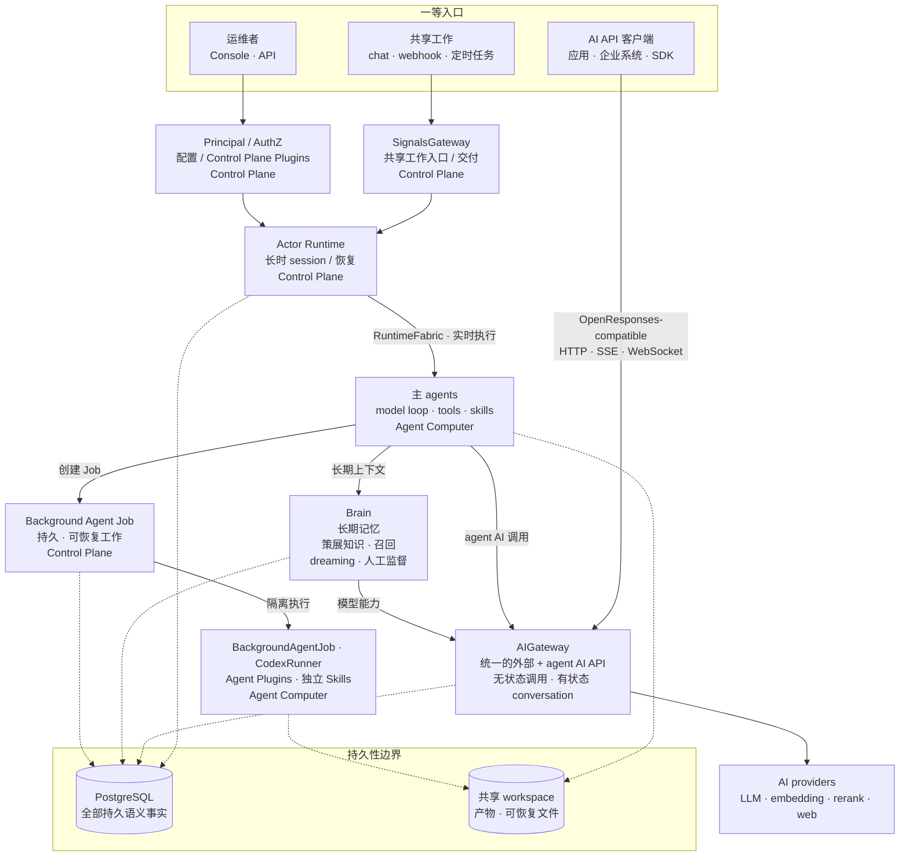

Ankole 是一个面向长时 AI 工作的 actor-oriented runtime。每个 active session 都是一个可寻址的 virtual actor：它可以 wake、接收消息、checkpoint、stream progress、hibernate、recover、continue，而不是被简化成一个 HTTP request 或 queue job。

长期执行单元是 `actor_id = {agent_id, session_id}`。Session 是上下文、workspace state、steering、cancel 和恢复交汇的地方。

## 五个技术判断

Runtime 建立在五个技术判断上：

- **Virtual Actors for AI work。** 一个 session 是有地址、有状态、有 mailbox、有生命周期和恢复路径的工作身份，不是散落在后台的一段任务。
- **OTP Supervision Trees as failure domains。** 一个 agent 卡住、超时或崩溃时，Ankole 可以隔离或重启那一支，而不是让它拖垮整套部署。
- **ZeroMQ Activation Fabric for live control。** Wakeup、steering、checkpoint、streaming 和 backpressure 通过低延迟 routing layer 流动，让 agent 正在工作时也能被引导和接管。
- **Agent Computer as execution substrate。** LLM loop、tools、MCP server、文件、terminal state 和 streaming output 跑在靠近 workspace 的 Bun + TypeScript 计算环境里。
- **Durable Ledger for recovery and audit。** Mailbox、turn、reminder、decision 和已提交 side effect 比进程活得更久。Streaming 是进度；已提交的工作才是事实。

对用户和运维者来说，承诺很直接：agent 可以工作几小时甚至几天，可以在运行中接收新输入，可以独立失败，可以带着上下文恢复，并且 side effect 有明确账本。

## 组件总览

整体上：

- **三个一等入口。** 共享工作从 SignalsGateway 进入，应用和企业系统直接调用 AIGateway，运维者通过 Console 和 API 管理系统。AIGateway 不是只给 worker 使用的内部代理。
- **AIGateway 是统一 AI 边界。** 它提供 OpenResponses-compatible HTTP、SSE 和 WebSocket API，同时支持无状态请求与 Principal-scoped 有状态 conversation；LLM、embedding、rerank、web search、web fetch 都通过同一个 provider 路由面解析，上游凭证始终留在 control plane。
- **Actor 把持久工作与执行资源分开。** Actor Runtime 拥有长时 session 与恢复语义；可替换的 Agent Computer worker 负责 model loop、tools、skills 和 sandbox。
- **Brain 是长期记忆。** 它统一当前知识、原始聊天召回、dreaming 和人工监督。PostgreSQL 关系行才是事实，Markdown 和注入上下文都只是投影。
- **后台 Agent 任务是持久工作，不是一个子进程。** Job 能跨 worker 故障恢复，可以继续、等待输入，并在状态变化时唤醒 owner 会话。
- **Principal/AuthZ 是权限边界。** 人类和 agent 都是 Principal，有权限授权和审计轨迹，因此 authorization 是 runtime 关注点，而不是 prompt 约定。

## 持久性边界

持久性分成两类。PostgreSQL 拥有语义事实：durable replay、fence、reconciliation 和 final commit。共享 workspace 保存被这些状态引用的产物和可恢复文件。RuntimeFabric——基于 ZeroMQ 的 control-plane 到 worker 的 live fabric，共享 Rust kernel 在进程内提供 transport 和 AI data-plane primitives——只负责实时传输。

SignalsGateway 是 provider ingress layer：外部 chat、webhook 和 provider event 会变成 actor event，但不会把外部来源事实误写成 execution state。

这就是 Ankole 的技术判断：actor model 负责长时工作的身份和生命周期，OTP 负责故障语义，ZeroMQ 负责 live activation，Agent Computer 负责本地执行。Ankole 更接近一个面向 AI 工作的分布式操作系统，而不是聊天机器人后端。更完整的 runtime 论证见：[为什么 OTP 是更好的多智能体编排运行时](https://ding.ee/zh-Hans-CN/why-otp-is-a-better-runtime-for-multi-agent-orchestration/)。
