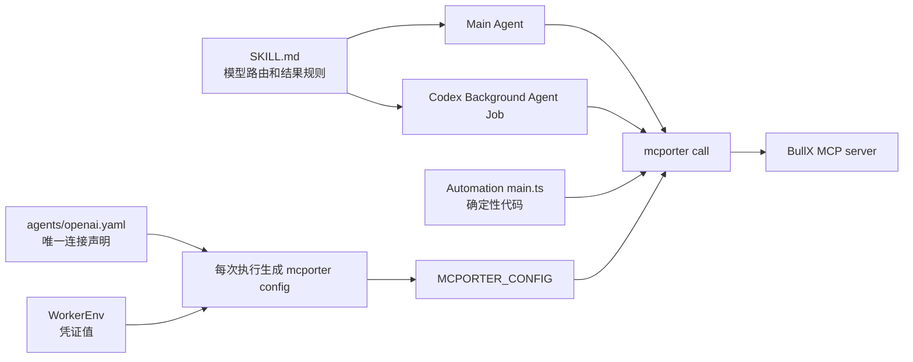

# BullX Financial Data 的 Skill-first MCP 执行方案

状态：**已实现；mcporter 0.13.0 已通过 `2026-07-28` 协议连接真实 BullX；不是规范性合同**
日期：2026-08-04

范围说明：本文只决定 BullX Financial Data 的 Skill-first 路径。现行平台合同见
[MCP-Backed Skills](MCPBackedSkills.md)。

实现后的运行合同已收敛到 [MCP-Backed Skills](MCPBackedSkills.md)。本文保留背景、方案比较、删除前原生
基线、实施范围和改变决定的条件，供同事评审这次迁移为何成立以及实现是否忠实。

## 1. 决定摘要

BullX Financial Data 采用 **Skill-first、MCP-behind-CLI**：

- `SKILL.md` 是唯一模型可见的能力、路由和结果解释契约。
- `agents/openai.yaml` 是唯一机器可读的 MCP 连接声明。
- `mcporter` 是 Main Agent、Codex Background Agent Job 和 Automation Job 共同使用的 MCP 客户端。
- MCP server 继续拥有实时工具 schema 和数据结果，但它的工具目录不再直接注册为模型 tools。
- Main Agent 和 Codex 先加载 Skill，再按 Skill 的指引调用 mcporter。
- Automation Job 没有模型回合，因此不“激活 Skill”；它只复用该 Skill 声明的底层 MCP 数据能力。

这不是“移除 MCP”。MCP 仍是线协议，变化只发生在模型暴露面：从“启用 Skill 即注册整台
MCP server”改为“模型只看到 Skill，Skill 按需通过 mcporter 调用 MCP”。

本提案首先保证三种运行环境都能读取 BullX 数据。当前 Skill 中的模拟账户创建和再平衡仍受
服务端独立的 `market_simulator:write` scope、明确用户请求和现有非幂等恢复规则约束。本提案不把
Automation Job 的写操作作为验收目标，也不把 mcporter 配置误称为安全边界。

评审需要确认四个决定：

1. Skill 是否应成为 BullX 唯一的模型路由中心。
2. 是否接受 Main Agent 和 Codex 不再获得原生 MCP function tools。
3. 是否接受三种运行环境通过同一份临时 mcporter 配置执行调用。
4. 是否接受只读 BullX 数据的较窄执行保证，并把原生 structured-output 校验、PTC 和 tool-level
   UI 视为非目标。

## 2. 背景

### 2.1 BullX 不是一组通用横向工具

[bullx-financial-data](../../internals/skills/bullx-financial-data/SKILL.md) 覆盖 A 股标的解析、交易日历、
日线和分钟线、实时行情、因子、筛选、财务、股东、合规、公告、行业、主题、指数、基金、宏观
和模拟账户。正确调用依赖大量领域判断：

- 最新 N 根日线和显式日期区间使用不同工具。
- 股票、指数和基金使用不同标的空间。
- 分页、截断、`data_as_of`、warnings 和口径字段会改变答案能否成立。
- 模拟账户读取与写入使用不同 scope，写入还是非幂等操作。

这些规则没有全部写进 MCP schema。Skill 明确保存了业务路由和结果解释知识，但目前没有证据证明
模型遵循 Skill 的选择正确率高于现行 Tool Search。实施前必须用同一组真实任务测量这个假设。

### 2.2 迁移前实现解决过真实问题

迁移前方案不是错误实现。它解决了此前全量 schema 常驻、长工具名、Main/Codex 不一致以及原生
结构化工具调用等问题：

- Main Agent 把 MCP child tools 投影成 `defer_loading: true` 的 Responses namespace functions。
- AIGateway 用 Tool Search 选择少量 child tools。
- Codex Background Agent Job 把同一声明写入 `.codex/config.toml`，使用 Codex 原生 MCP 和
  Tool Search。
- Agent Computer 保留输入输出 schema、结果大小、secret redaction、caller 和并行语义。

这些能力由迁移前的代码和规范版本定义。本提案重新评估的是模型暴露边界，而不是否认这些工作
解决过的问题。

### 2.3 Automation Job 让迁移前边界不再闭合

[Automation Job](AutomationJobs.md) 是确定性 Bun 程序，不运行 LLM turn。它在每次 attempt
中取得执行时最新的 Agent WorkerEnv，在 Agent Home 内运行 `main.ts`，并通过 stdout、stderr、
run status 和 `emitEvent` 观测结果。

当前镜像已经固定安装 mcporter 0.13.0，Automation Job 的 CLI 帮助也告诉模型：MCP 数据可以经
mcporter 访问。但仓库没有任何代码生成帮助文本声称存在的 `~/.mcporter/mcporter.json`。与此同时，
现行 MCP 规范又明确禁止 MCP CLI 和第二份声明文件。

所以迁移前实际存在三种不同状态：

| 运行环境 | 迁移前 MCP 路径 | 迁移前缺口 |
| --- | --- | --- |
| Main Agent | Agent Computer 原生 MCP SDK，加 AIGateway Tool Search | Skill 未激活前已读取 catalog |
| Codex Background Agent Job | Codex 原生 `mcp_servers` 和 Tool Search | 与 Main 分别维护投影和兼容逻辑 |
| Automation Job | 文档声称使用 mcporter | mcporter 配置没有机器所有者，路径未闭合 |

## 3. 当前问题

### 3.1 迁移前延迟加载已经解决上下文成本，但 Skill 不是访问前置条件

迁移前 Main Agent 在 `text_turn.ts` 组装工具时先调用 `createMCPTools`，随后才加入 `skill_view`。该函数读取
适用 Skill 的 MCP 声明和 catalog，并把 child tools 放入内部搜索面。`defer_loading` 已经阻止完整
schema 进入模型上下文，也解决了长工具名直接暴露的问题；MCP 连接也只按执行需要建立，并非常驻。

剩余差异是所有权，不是已证实的 token 问题：模型可以不先读取 BullX Skill，直接经 Tool Search
发现 child tool。Skill + mcporter 把 Skill 变成模型路由前置条件，但这是否提高选择正确率仍是待验证
假设。

### 3.2 Skill 和 Tool Search 是两个竞争的路由中心

迁移前 Skill 维护“什么请求使用什么 BullX tool”，MCP catalog 同时向 Tool Search 提供工具名称、
描述、schema 字段和初始化说明。两处都在回答同一个问题：模型应该选哪个工具。

当两者一致时，这只是重复；当 server 描述、Skill 规则或模型搜索结果发生漂移时，模型会获得两套
不同答案。当前生产证据只证明过目录暴露和工具名问题，没有证明工具选择是主要错误，也没有证明
Skill 路由优于 Tool Search。因此，本提案把路由中心合一视为架构简化；质量收益必须通过新旧基线
比较证明。

### 3.3 三种运行环境没有共享一个执行适配层

迁移前 Main Agent 和 Codex 分别依赖 Agent Computer 与 Codex 的原生 MCP client。Automation Job 则只能
通过 CLI。继续沿现状补 Automation，意味着同一 Skill 要维护三套调用、过滤、timeout 和失败语义。
这正是本次要消除的冗余。

## 4. 调研范围和外部契约

本提案核对了以下上游契约和当前锁定版本，而不是只根据 README 推断：

- [MCP Tools 规范](https://modelcontextprotocol.io/specification/2026-07-28/server/tools)：MCP 定义
  `tools/list`、`tools/call`、输入输出 schema 和 annotations；它不要求客户端把每个 tool 直接注册
  给模型。
- [MCP 2025-11-25 Streamable HTTP 规范](https://modelcontextprotocol.io/specification/2025-11-25/basic/transports)：
  client 可选打开独立 SSE GET；不提供 receive stream 的 server 必须返回 HTTP 405。
- [Agent Skills 规范](https://agentskills.io/specification)：模型先看到 name 和 description，激活后
  才读取完整 `SKILL.md`，scripts 和 references 再按需加载。
- [OpenAI Build Skills](https://learn.chatgpt.com/docs/build-skills)：Skill 可以携带 scripts、references
  和 `agents/openai.yaml` 依赖声明。
- [mcporter 0.13.0 的 Agent Skill 模式](https://github.com/openclaw/mcporter/blob/v0.13.0/docs/agent-skills.md)：
  上游明确推荐“一台 MCP server 或一个 workflow 对应一个小 Skill”，由 Skill 调用相关工具，反对
  一个通用 mcporter Skill 重新制造大目录问题。
- [mcporter 0.13.0 配置规则](https://github.com/openclaw/mcporter/blob/v0.13.0/docs/config.md)：
  `MCPORTER_CONFIG` 选择唯一配置文件，`imports: []` 关闭宿主配置导入，`bearerToken` 接受环境变量
  placeholder，`allowedTools` 和 `blockedTools` 可以限制发现和调用。
- mcporter 0.13.0 源码和 `docs/call-syntax.md`：`mcporter call` 支持 `--json -` 从 stdin 读取 JSON
  object，`--output json` 把成功和失败结果写成机器可读 JSON。

## 5. 方案比较

### 5.1 比较标准

本次不把 token 或单次调用延迟作为决定标准。`defer_loading` 已经避免完整 schema 进入模型上下文，
mcporter 还会增加一次进程启动。比较使用以下顺序：

1. Main、Background 和 Automation 是否共享同一能力声明和调用适配层。
2. 是否删除 Main 与 Codex 两套模型投影的 parity 维护成本，并让 Skill 成为唯一模型路由中心。
3. 新方案的工具选择和业务结果是否不劣于现行原生路径基线。
4. 凭证、失败、结果和副作用边界是否可以明确说明。
5. 实现是否容易删除、诊断和在六个月后修改。

### 5.2 原生 deferred MCP

| 优点 | 代价 |
| --- | --- |
| 模型得到正式 function schema 和 tool call 轨迹 | `defer_loading` 已解决 schema 上下文成本，但 Skill 不是访问前置条件 |
| Agent Computer 可验证 output schema、限制结果、清理 secrets | Main 与 Codex 分别维护投影和兼容逻辑 |
| MCP annotations 可决定 direct、programmatic 和并行执行 | Tool Search 与 Skill 同时拥有路由知识 |
| Main 与 Codex 有专用 MCP 活动记录 | Automation 仍需第三条执行路径 |
| 适合通用、横向、由模型临时组合的工具 | 对 BullX 这类强领域目录，搜索结果不等于业务选择正确 |

如果能力是少量通用横向工具，或产品需要 tool-level approval、PTC、原生 UI 和强 output-schema 校验，
原生 MCP 仍是更好的方案。

### 5.3 Skill + mcporter

| 优点 | 代价 |
| --- | --- |
| Skill 是唯一模型路由中心 | 模型看到的是 command/terminal 调用，不是原生 MCP tool call |
| Main、Codex 和 Automation 共享同一执行适配层 | 每次调用增加一个 mcporter 进程和 MCP 初始化 |
| Main、Codex 和 Automation 都能使用同一 CLI | 不再自动获得 Agent Computer 的 output-schema 校验和 MCP annotations |
| `agents/openai.yaml` 可继续作为唯一连接声明 | 专用 MCP 活动名称退化成 command 或 Automation run 日志 |
| Skill 可只查询选中工具的 schema | PTC 和原生并行调度不再适用 |

该方案的收益是减少模型投影、路由和运行环境之间的架构分叉。它不承诺降低 token，也不预先声称
Skill 的选择正确率更高。一次 CLI 启动是明确新增的成本，必须与维护面收敛和 Automation 路径闭合
一起评估。

### 5.4 最终选择

选择 Skill + mcporter。决定条件是：

- BullX 有大而专门的目录，且已有完整 Skill 路由规则。
- Main 与 Codex 当前维护两套模型投影，Automation 又缺少可执行路径。
- 当前目标是读取数据，不要求原生 tool UI 或 programmatic parallelism。
- Automation Job 必须在没有模型回合的情况下使用同一数据能力。
- 当前仓库追踪的非测试 Skill 声明中，BullX 是唯一 MCP dependency，没有需要兼容的第二种真实用法。

“Skill 路由优于 Tool Search”不是选择该架构的前提。新方案至少必须达到现行原生路径的选择正确率；
如果没有达到，应停止删除或恢复原生投影，而不是用架构整洁掩盖质量回退。

如果未来出现不可信 MCP server、必须由客户端验证的 output schema、强 tool-level approval 或大量
模型程序化并行调用，应重新评估该 server，而不是把这次选择扩展成“所有 MCP 都必须走 CLI”的教条。

## 6. 最终架构



### 6.1 两个 SSOT

保留两个不同性质的单一事实来源，不再让同一个事实出现第三份副本：

| 所有者 | 保存内容 | 不保存内容 |
| --- | --- | --- |
| `SKILL.md` | 使用时机、工具选择、分页、时效、warnings、写操作恢复规则 | endpoint、token 值、完整工具 schema |
| `agents/openai.yaml` | server 名、transport、endpoint、凭证变量名、tool filters | token 值、模型路由规则、调用 timeout、持久 mcporter 配置 |

MCP server 的实时 schema 仍是参数和结果形状的权威来源。常用参数规则可以写进 Skill，但不得复制整份
schema。catalog 变化时，Main 或 Codex 只查询已选中的工具 schema，不先枚举所有 server。

### 6.2 临时 mcporter 配置

Agent Computer 复用 `loadEnabledSkillMCPServers` 的声明读取、路径校验、冲突检测和确定性排序，增加一个
纯 materializer。它在每次执行开始时生成唯一的 `0600` JSON 文件，并把路径放入
`MCPORTER_CONFIG`。文件位于已挂进 bubblewrap 的 `/var/share`，执行结束后删除。

BullX 的生成结果等价于：

```json
{
  "imports": [],
  "mcpServers": {
    "bullx-financial-data": {
      "description": "BullX Financial Data MCP server",
      "baseUrl": "https://ai-terminal.yuma.host/api/v1/financial-data/mcp",
      "bearerToken": "${BULLX_FINANCIAL_DATA_MCP_API_KEY}",
      "protocolVersion": "2026-07-28"
    }
  }
}
```

规则如下：

- 必须设置 `imports: []`，避免 mcporter 自动导入 Agent Home、Codex、Claude、Cursor 或 VS Code 的
  配置。
- 必须设置 `MCPORTER_CONFIG`，禁止依赖 cwd 或 `~/.mcporter/mcporter.json` 的偶然内容。
- 文件只保存 WorkerEnv 变量 placeholder，不保存解析后的 secret。
- `streamable_http` 映射为 `baseUrl`、`bearerToken` placeholder 和可选的 `protocolVersion`。
  mcporter 在执行时解析变量并添加 `Bearer` authorization scheme。
- `stdio` 如仍保留支持，使用 `command: "/bin/sh"` 和 `args: ["-lc", <声明命令>]` 保持当前语义。
- 只有 `enabled_tools` 时生成 `allowedTools`；只有 `disabled_tools` 时生成 `blockedTools`；两者同时存在
  时生成 `enabled_tools - disabled_tools` 的最终 `allowedTools`，因为 mcporter 不允许两种字段同时存在。
- 不生成 daemon 配置，不共享常驻 MCP connection。
- 当前 BullX 调用显式使用 360 秒 timeout。`agents/openai.yaml` 不再声明按 server timeout；调用者按
  workflow 选择 `--timeout`，避免保留一个 mcporter config 无法表达的失真字段。

临时文件是声明的派生物，不是第二份配置来源。任何修改都从下一次执行重新读取
`agents/openai.yaml`。

### 6.3 统一调用格式

Skill 给 Main Agent 和 Codex 的稳定调用格式为：

```bash
mcporter call bullx-financial-data.<tool-name> \
  --json - \
  --output json \
  --timeout 360000 \
  < arguments.json
```

参数必须通过 JSON 文件或 stdin 传入，不能把用户文本插进 shell function-call 表达式。这样可以避免
引号和 shell injection 问题。stdout 只作为 JSON 读取，stderr 保留诊断，非零 exit 表示调用失败。

Main Agent 或 Codex 只有在以下情况才查询 schema：

- Skill 没有写明选中工具的必要参数；
- mcporter 报告参数无效；
- server 返回 `TOOL_NOT_FOUND` 或目录变化。

查询只针对已经选中的 server/tool。Automation Job 不在每次运行中动态发现或适配工具；schema
变化应让确定性脚本明确失败，由 run history 和 `wake_on_failure` 暴露。

首发不增加 Ankole 自己的 mcporter wrapper CLI。锁定版本已经提供 JSON stdin、JSON output、timeout
和 tool filters，再包一层只会制造第二种命令契约。如果后续轨迹证明原始 CLI 在 timeout、结果边界
或诊断格式上无法维持合同，再用观察到的失败决定是否增加薄 adapter。

## 7. 三种运行环境

### 7.1 Main Agent

turn 准备顺序改为：

1. 取得 Agent 当前 enabled Skills 和 WorkerEnv。
2. 读取适用于 Main Agent 的 Skill MCP declarations。
3. 生成 turn 唯一的 mcporter 配置并注入 command sandbox。
4. 不调用 `createMCPTools`，不连接 MCP server，不把 child tools 加入模型 tools。
5. 模型根据 Skill index 决定是否调用 `skill_view`。
6. Skill 被激活后，模型按 Skill 选择工具，并通过 command 调用 mcporter。
7. turn 结束时删除临时配置。

配置在 Skill 激活前存在，但这不是模型 catalog：它不会产生网络请求，也不会把 server/tool 名称加入
Tool Search。拥有通用 shell 的模型仍可以主动运行 `mcporter list`，所以这是一种暴露和知识边界，
不是 sandbox 权限边界。

### 7.2 Codex Background Agent Job

Background Agent Job 继续获得当前选择的完整 Skills。prepare 改为：

1. 使用当前 selected standalone Skills 和 Agent Plugin member Skills。
2. 生成 job execution 的 mcporter 配置。
3. 把 `MCPORTER_CONFIG` 与 WorkerEnv 注入 Codex bubblewrap。
4. 不再把 Skill MCP declarations 写入 `.codex/config.toml [mcp_servers]`。
5. Codex 根据同一份 Skill 通过 terminal 调用 mcporter。

这会删除 Main 与 Codex 两套模型可见 MCP projection 的强一致要求。两者共享的是 Skill、连接声明和
CLI 结果，而不是 function name 截断、namespace schema lowering 和 Tool Search 排名。

### 7.3 Automation Job

Automation Job 不加载 Skill instructions。Main Agent 或 Codex 在编写 `main.ts` 时使用 Skill 知识；
运行时脚本只执行已经选定的工具调用。

当前 `AutomationJobRunRequest` 没有 enabled Skills。实施使用两个现有事实：Control Plane 已能投影
`RuntimeSkillSummary`，Worker 已有 Agent-scoped builtin、internal 和 installed roots。具体顺序如下：

1. Control Plane 在派发每个 attempt 时调用现有 `Library.skills_for_system_prompt(agent_uid)`。
2. 抽取并复用现有 Skill map → `RuntimeSkillSummary` projection，把 summaries 作为 request 字段发送；
   不把完整 `SKILL.md` 或 MCP 声明塞进 RPC，也不增加新 catalog 形状。
3. Worker 用 request 中的 summaries 和 Agent-scoped roots 定位 Skill，再解析 `agents/openai.yaml`。
4. dependency locator 接受已解析的 Agent roots；model-facing overlay locator 继续单独要求 turn RPC。
5. Worker 生成 attempt 唯一的 mcporter 配置，把 `MCPORTER_CONFIG` 和最新 WorkerEnv 一起注入
   Automation bubblewrap。
6. `main.ts` 使用 `Bun.spawn` argv 和 stdin 调用 mcporter，解析 JSON，按需要静默完成或
   `emitEvent`。
7. attempt 结束时删除配置；summary、locator 或声明无效时，attempt 在启动用户脚本前明确失败。

该 Skill 集合在一个 attempt 内冻结。基础设施重派、下一次 cron fire 或下一次 webhook delivery 会
重新读取当前 enabled Skills、最新 WorkerEnv 和磁盘上的最新脚本。这与 Automation Job 已有的“执行时
最新事实”语义一致，不增加持久 snapshot 实体。

如果 BullX Skill 在下次 attempt 前被禁用，server 不再出现在生成配置中，脚本应以“server 未配置”
明确失败。平台不保留已禁用能力的隐式兼容副本。

`ankole-runtime` 仍只表达模型 Skill 对 Main 或 Background Agent Job 的可见性。Automation 不运行模型
Skill，因此不得仅为本方案增加 `automation_job` 枚举。MCP dependency resolution 是 Agent 级执行依赖，
不是第三种 Skill 激活模式。

Automation materializer 读取该 Agent 当前所有 enabled Skills 的 MCP dependencies，不按
`ankole-runtime` 过滤。该字段只控制模型是否能看到 Skill instructions；Automation 已经取得同一
Agent 的 WorkerEnv、网络和 CLI，所以把现有连接声明生成到临时配置不会扩张它的权限边界。

当前 installed Skill locator 要求 `ActorTurnRef`，但解析 `agents/openai.yaml` 实际只需要 Agent 已解析的
installed-skill root。实施时应把文件定位与 overlay RPC 分开：dependency locator 接受 Agent-scoped
root；只有 model-facing overlay 读取继续要求 turn。不要为 Automation 伪造 turn。

## 8. 凭证、写操作和安全边界

### 8.1 凭证

- `BULLX_FINANCIAL_DATA_MCP_API_KEY` 的值只来自执行时 WorkerEnv。
- `agents/openai.yaml` 和临时 mcporter 配置只保存变量名或 `${...}` placeholder。
- 不把 token 写入 Agent Home、Automation 目录、shell command、stdout、stderr 或 run history。
- 缺少变量时直接失败，并只报告变量名。

### 8.2 Automation 不是更低权限的主体

Automation Job 当前拥有 Agent 级 WorkerEnv、网络和 CLI。它与 Main Agent 使用同一个 BullX API key
身份。`allowedTools`、`blockedTools` 和 Skill 指引可以防止误调用，但不能阻止受信脚本直接使用网络或
原始凭证。

真正的写权限边界仍是 BullX 服务端的 `market_simulator:write` scope。默认数据工作应只授予 read
scope。如果未来要求“Automation 永远不能写，但 Main 可以写”，需要把 credential scope 或执行主体
分开；不能靠不同的 mcporter JSON 声称实现了隔离。该权限模型不在本提案范围。

### 8.3 有意缩窄的结果保证

移除原生 MCP client 后，Agent Computer 不再自动验证 BullX `outputSchema`，也不再根据 MCP
annotations 决定 programmatic caller 和并行执行。`agents/openai.yaml` 也不再提供按 server timeout，
timeout 由每次 mcporter 调用显式设置。它还不再对 MCP 结果执行 `mcp-tool.ts` 的 WorkerEnv secret
redaction；普通 command stdout 没有这层结果过滤。首发保留以下保证：

- mcporter 必须返回可解析 JSON，transport 或 protocol failure 必须是非零 exit。
- Main command、Codex terminal 和 Automation run 继续使用各自现有的有界 stdout/stderr。
- Skill 继续约束分页、每页数量、截断标记、warnings 和 partial result。
- server 仍必须执行输入校验和服务端权限检查。
- 模型与脚本都把 MCP 输出视为不可信外部数据。

这是针对受信、第一方、以读取为主的 BullX server 的较窄合同。它不是所有第三方 MCP server 的默认
安全等级。secret 值本来就在同一 sandbox 的 WorkerEnv 中，临时配置也只保存占位符；失去的 redaction
只是一层防止服务端意外回显 secret 后进入持久历史的纵深防御，所以本提案接受该损失，不另加机制。

## 9. 被否决的方案

### 9.1 Main 和 Codex 保留原生 MCP，只给 Automation 补 mcporter

这会永久保留三种执行路径和两套路由中心。Automation 能调用数据，但架构冗余没有解决。

### 9.2 持久写入 `~/.mcporter/mcporter.json`

该文件会成为 `agents/openai.yaml` 之外的第二声明源，可能在 Skill 禁用、endpoint 变更或 token 变量
重命名后继续生效。mcporter 还会在没有 `imports: []` 时读取宿主配置。执行时生成唯一配置更简单，也
更容易证明当前事实。

### 9.3 创建一个通用 mcporter Skill

通用 Skill 必须教模型枚举、理解和调用所有 server，重新制造大目录问题。mcporter 上游也明确反对
这种模式。BullX 应保留自己的领域 Skill。

### 9.4 生成并提交 BullX 专用 CLI

`mcporter generate-cli` 适合固定、重复的外部工作流，但生成物会复制当时的 tool schema，并引入重新
生成和漂移管理。BullX catalog 仍在变化，首发直接使用实时 mcporter schema。只有真实轨迹证明原始
调用语法持续造成失败时，才考虑专用 CLI。

### 9.5 mcporter daemon 或长连接

BullX 是远程 HTTP server，单次数据请求本身远重于一次 CLI 启动。daemon 会增加进程状态、清理、
credential rotation 和故障归属，没有当前证据支持。

### 9.6 给 Automation 增加 `automation_job` Skill runtime

Automation 没有模型，不会读 Skill instructions。增加该枚举会把“模型知识可见性”和“脚本可以使用的
Agent 依赖”混为一谈。

## 10. 实施范围

本实现按一个发布单元完成，但代码位于两个 Git 仓库：Ankole 主仓保存运行时、规范和公共文档，独立的
`internals/` 仓库保存 BullX Skill 和内部现状文档。因此需要两个协同 PR，并在同一对内部镜像中构建和
部署。分阶段让同一个模型同时看到原生 MCP tools 和 Skill+mcporter，会产生两套可调用面；只部署其中
一个仓库还会让 Skill 指令与运行时能力直接不匹配。

在删除现行路径前，必须先用第 11.5 节的真实任务采集 Main 与 Codex 原生路径选择正确率基线。基线
记录任务、实际选择的工具、第一次选择是否命中、最终业务结果是否正确和必要的参数错误；这项证据
必须随实施 PR 保留，使删除后的新旧对照仍可复核。

### 10.1 保留并改造

- 保留 `internals/skills/bullx-financial-data/SKILL.md`，把原生 Tool Search 指令改成 mcporter 调用
  指令，保留业务路由和结果完整性规则。
- 保留 `agents/openai.yaml` 为唯一连接声明。
- 保留并简化 `tools/mcp/config.ts` 的声明 schema、路径校验、冲突检测、filters 和资源上限。
- 新增纯 mcporter config materializer 和执行生命周期清理。
- Background 和 Automation 复用相同 materializer。

### 10.2 删除

没有真实调用方后，删除以下原生投影及兼容代码，不保留 dormant fallback：

- Main Agent 的 `createMCPTools` 调用和 `...mcpTools` 模型工具注入。
- `tools/mcp/mcp-tool.ts` 的 namespace projection、Tool Search corpus、caller 和 PTC 映射。
- 原生 MCP catalog cache、SDK client、Codex schema lowering 和仅为该路径存在的 tests。
- Codex project config 中 Skill MCP declarations 的 materialization。
- Main/Codex native MCP differential parity test。
- BullX 对 Agent Computer MCP SDK client 的依赖；mcporter 继续由 Worker base image 锁定。
- Automation help 中关于持久 `~/.mcporter/mcporter.json` 的错误说明。

删除前必须用 `rg` 证明这些模块没有其他真实 caller。若出现真实调用方，评审其合同，不增加无期限
compatibility branch。

### 10.3 更新规范

- 用通过评审后的合同重写 `docs/design-docs/MCPBackedSkills.md`，不再新增第二份规范文档。
- 更新 `docs/design-docs/AutomationJobs.md` 的 attempt Skill projection、配置生成和清理合同。
- 更新 Website 的 MCP 与 Skill 编写页面。
- 在 `internals/docs/AIGatewayToolSearch.zh.md` 的 Main Agent MCP 段落增加现状说明，避免它继续把
  BullX 描述为原生 Tool Search 路径。
- 把已废弃的 `internals/docs/MCPProgressiveLoading.zh.md` 继续保留为历史记录，但在开头链接到新的
  现行规范。
- 更新 Automation CLI help，使其只说明执行时 `MCPORTER_CONFIG` 和稳定调用格式。

### 10.4 实际改动落点

| 所有者 | 实现位置 | 评审重点 |
| --- | --- | --- |
| 声明解析和配置生成 | `app/agent_computer/src/tools/mcp/config.ts`、`mcporter-config.ts` | 严格声明、冲突、filters、`imports: []`、0600 和清理 |
| Main Agent | `app/agent_computer/src/core/turns/text_turn.ts` | 不再投影 MCP tools，只向 command sandbox 注入配置 |
| Background Agent Job | `app/agent_computer/src/core/codex-runner/setup.ts`、`project-config.ts` | 注入同一 Skill mcporter 配置，并删除模板或恢复项目中的 `mcp_servers` |
| Automation Control Plane | `rpc.proto`、`ExecuteRun`、`RPCWire` | 每个 attempt 投影当前 enabled Skill summaries，不复制 Skill 内容 |
| Automation Worker | `app/agent_computer/src/automation-jobs/run.ts` | 用 Agent roots 解析声明，在脚本启动前失败并在结束后清理 |
| BullX 模型路由 | `internals/skills/bullx-financial-data/` | 精确工具选择、单工具 schema、stdin JSON 和结果完整性 |
| 删除面 | `app/agent_computer/src/tools/mcp/` 和 Codex MCP materializer | BullX 原生 catalog、schema lowering、tool projection 和 parity tests 均无残留 caller |

`internals/` 是独立 Git 仓库。评审和合并时必须同时跟踪主仓 diff 与 internals diff；任何只包含一侧的
部署都不是本方案支持的过渡态。

## 11. 验证和验收

### 11.1 单元测试

- 同一 Skill 声明生成 byte-stable mcporter JSON。
- 配置总是包含 `imports: []`。
- bearer token value 从不进入配置、错误或日志。
- 镜像固定的 mcporter 从 placeholder 读取 token，并发送 `Authorization: Bearer <token>`。
- allowlist、denylist 和两者同时存在时的最终过滤结果正确。
- 重名相同声明合并，不同声明大声失败。
- 临时配置使用 `0600`、唯一文件名并在 success、failure、timeout 和 cancellation 后删除。
- mcporter 通过 `--json -` 接收复杂 Unicode 和引号内容，不发生 shell interpolation。

### 11.2 Main Agent

- 与金融无关的 turn 不连接 BullX，也没有 BullX child tools 或 Tool Search corpus。
- 金融请求先加载 BullX Skill，再调用 Skill 选择的工具。
- 参数不确定时只查询选中 tool schema。
- 缺少 WorkerEnv、transport failure、invalid arguments 和 truncated result 都产生明确结果。

### 11.3 Codex Background Agent Job

- `.codex/config.toml` 不包含 Skill 声明的 BullX `mcp_servers`。
- Job 仍获得完整 BullX Skill。
- Codex 通过 terminal 和 mcporter 完成同一只读 fixture 调用。
- 恢复 Job 后重新生成当前配置，不依赖旧 project 中的声明副本。

### 11.4 Automation Job

- Control Plane 为 attempt 投影当前 enabled Skills。
- Worker 使用最新 WorkerEnv 生成配置，脚本读取 BullX 数据并成功结束。
- Skill 禁用、API key 缺失和 schema drift 都写入明确 run failure。
- `wake_on_failure` 能把失败带回归属会话。
- 脚本能对结果进行判断并只在命中条件时 `emitEvent`。

### 11.5 真实 BullX 验收

在任何原生投影删除前，先让同一组只读任务走现行 Main 和 Codex 原生路径：

1. 交易日历或当前市场状态。
2. 一个明确 A 股标的的 latest daily bars。
3. 一个需要分页或 freshness 判断的公告、因子或行业任务。

基线记录实际工具、第一次选择是否命中、参数错误和最终业务结果。只有业务口径唯一要求某个工具时，
才把精确工具名作为正确性条件；允许不同工具得到同样正确的业务结果，避免把基线变成实现锁定。

2026-08-02 已在删除前采集首轮基线。Main 使用当前 `createMCPTools` 对实时 50-tool catalog 的投影、
AIGateway Tool Search 和 OpenRouter `openai/gpt-5.5`；Codex 使用 0.146.0、当前 Skill 和原生
`mcp_servers`，模型为 `gpt-5.6-sol`。每个任务和运行环境各执行一次：

| 任务 | 唯一正确工具 | Main 首次选择 | Codex 首次选择与真实调用 |
| --- | --- | --- | --- |
| 2026-08-02 A 股市场状态 | `bullx_market_data_get_trading_calendar` | 命中 | 命中，调用成功 |
| 600519.SH 截至 2026-07-31 的最新 5 根日线 | `bullx_market_data_get_latest_daily_bars` | 命中 | 命中，调用成功 |
| 600519.SH 年度报告公告目录第一页 | `bullx_financial_docs_search_company_announcements` | 命中 | 命中，调用成功 |

当前基线是 Main 3/3、Codex 3/3，首次选择正确率均为 100%，且没有参数错误。样本只覆盖三条固定任务，
不能证明原生路径普遍优于或劣于 Skill 路由；它只给本次改造设置一个不可降低的对照门槛。

实现后，同一组任务分别走 Main、Background 和 Automation。Main 与 Background 对照必须复用各自基线
中的模型、任务措辞和单次运行规则；如果模型版本必须变化，结果要单独标记，不能把差异归因给路由方案。
Automation 没有模型选择步骤，只验证脚本固定的工具和参数是否得到相同业务结果。验收比较新方案与原生
基线的选择正确率，并比较业务结果、来源、时效、warnings 和完整性，不把“CLI 成功退出”当成最终证明。
Automation 还要验证真实 trigger → run → BullX → `emitEvent` 或静默完成的全路径。

### 11.6 当前实现验证结果

截至 2026-08-02，原始本地实现已通过以下检查：

- Agent Computer TypeScript type-check 和生成 protobuf 一致性检查。
- Agent Computer 容器集成套件：15 passed、5 skipped、0 failed。新增 Automation case 穿过真实
  bubblewrap，启动镜像内 mcporter 0.12.3，经 stdio MCP fixture 传递包含中文和引号的 stdin JSON，并
  验证 attempt 结束后临时配置已删除。
- Agent Computer 单元套件中的 mcporter config、Codex config 注入与清理、Automation RPC 等相关 case
  全部通过。整套结果为 421 passed、8 failed；8 个失败来自当前预构建 Worker image 与工作树中并行修改的
  RuntimeFabric v4/native codec 不一致，其中一个测试还因测试镜像没有挂载 Rust owner source 而无法读取
  `app/kernel/src/runtime_fabric/mod.rs`。因此不能把整套单元测试申报为 green。
- Control Plane 的 `RPCWire` projection test 为 1 passed；Automation Jobs 定向测试为 7 passed。
- Website Astro check 为 0 errors，只保留两个现有 `document.execCommand` deprecation hints。

2026-08-04 的 mcporter 0.13.0 升级验证得到以下结果：

- 官方 release 包的 SHA-256 与发布清单一致，Bun 全局安装后 `mcporter --version` 返回 `0.13.0`。
- Twelve Data 固定的 `mcp-server-twelve-data` 0.2.5 和 `mcp` 1.9.4 能读取单工具 schema，并用
  `TWELVE_DATA_API_KEY=demo` 完成 `GetPrice` 只读调用。去掉 `mcp` 钉子后，当前解析到的 1.29.0 仍因
  四个非 object 顶层 `outputSchema` 在 `tools/list` 失败，所以不能随 mcporter 升级删除该钉子。
- 当前 BullX 凭证能直接完成 HTTP `initialize`、50-tool `tools/list` 和交易日历只读调用。服务端协商到
  `2025-11-25`；mcporter 0.12.3 和 0.13.0 的当前对照环境都在 legacy 初始化后打开独立 SSE GET。BullX 端点返回
  405 `SSE stream is not supported`；该返回符合 2025-11-25 对可选 receive stream 的规定，但 mcporter
  的 SDK v2 legacy path 把它作为致命 SSE 错误，因此两版都无法读取工具 schema。0.13.0 没有造成
  版本特有回归，也没有修复这个 legacy transport 互操作问题。

第 11.5 节三条真实 BullX Main、Background 和 Automation 对照仍未完成。当前阻塞不是凭证或 Skill
声明，而是 BullX 的同步 POST-only 2025-era 实现与 mcporter SDK v2 legacy path 不能互操作。可行修复是 BullX
实现 `2026-07-28`、BullX 提供 legacy receive stream，或 mcporter/SDK 容忍规范允许的 405 后继续 POST。不要把 raw
HTTP 成功或 fixture 结果冒充真实 mcporter 验收。

2026-08-13 的重新验证已解除上述 transport 阻塞。BullX 本地 Terminal server 支持
`2026-07-28`；Skill 声明显式设置 `protocol_version: "2026-07-28"`，Agent Computer 将它严格转换为
mcporter 的 `protocolVersion`。真实 mcporter 调用已读取 `bullx_semantic_query` schema，并完成
`describe`：`contract_version` 为 `1`，`catalog_revision` 为 `dd2120798a480184`，返回 51 个模型和
5 个领域，无 warning。这个结果取代上一段的当时状态；第 11.5 节的三运行时业务对照仍是单独验收项。

## 12. 风险和改变决定的条件

| 风险 | 当前处理 |
| --- | --- |
| CLI 每次启动增加延迟 | 只在 Skill 真正使用时发生；不上 daemon |
| 失去原生 output-schema 校验 | BullX 受信 server + JSON parse + 真实 E2E；不扩展到不可信 server |
| 失去 MCP 结果 secret redaction | token 已在同一 sandbox；接受意外回显进入历史的纵深防御损失 |
| 失去 MCP tool-level UI 和 PTC | 当前数据获取不依赖；command/run 日志足够定位 |
| schema 变化破坏 Automation | 确定性脚本大声失败，不在定时运行中自适应 |
| Automation 可能调用写工具 | 真实边界是 server write scope；本提案不声称 CLI 配置可隔离 |
| Skill 与 server 规则漂移 | Skill 保存业务语义，server 保存 schema；只在选中工具上做实时核对 |

以下任一事实出现时，应重新选择原生 MCP 或单独设计写能力：

- 产品要求 tool-level approval 或用户可见的原生 MCP 活动 UI。
- BullX 数据调用必须由客户端验证 output schema 才能保证正确性。
- programmatic tool calling 和原生并行执行成为主要性能来源。
- 新方案在第 11.5 节真实任务上的工具选择正确率或最终业务正确率低于现行原生路径基线。
- Automation 必须拥有与 Main 不同的硬权限主体和 credential scope。
- 出现不可信或第三方 MCP Skill，不能接受普通 shell/CLI 的安全合同。

在这些条件出现以前，Skill-first + mcporter 是 BullX 三运行时共享数据能力的最小、直接且可删除的
实现。
