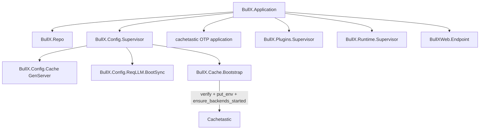

# Cache

BullX uses [`cachetastic`](https://github.com/gskolber/cachetastic) as the
single in-application caching layer. The default backend is local ETS so a
single-node deployment works without external dependencies. Setting
`BULLX_CACHE_REDIS_URL` is the only switch operators flip to move to Redis
for multi-instance deployments that need a shared cache; absence of that
variable means ETS. Configuration flows through `BullX.Config` declarations
bound exclusively to `BullX.Config.SystemBinding`; restart is the switching
mechanism. Cachetastic runs as a normal OTP application; `BullX.Config.Supervisor`
owns only BullX's cache bootstrap child, which publishes cachetastic's
application env before downstream BullX subsystems use the cache.

## Goals

- Provide one cache façade that every BullX subsystem and plugin uses for
  application-level caching, in place of ad-hoc ETS or process-dict caches.
- Default to ETS so local development and single-instance installs require no
  external services.
- Let an operator switch to Redis without code changes by setting
  `BULLX_CACHE_REDIS_URL` (plus optional tuning variables). Backend selection
  is implicit: URL set means Redis, URL absent means ETS.
- Preserve uniform call sites across both backends: callers depend on
  `BullX.Cache`, not on `Cachetastic.Backend.ETS` or `Cachetastic.Backend.Redis`.
- Keep cache configuration outside the database so cache availability cannot
  depend on a working `app_configs` read path.

## Non-Goals

- Database-configurable cache settings. Cache parameters use
  `BullX.Config.SystemBinding` only; runtime overrides through `app_configs`
  are deliberately disallowed. Mixed binding pipelines reintroduce the
  bootstrap-vs-runtime ordering hazard that the [Configuration](Configuration.md)
  design avoids.
- Cache UI, control-plane API, or per-key inspection tooling.
- Migration of `BullX.Config.Cache` (the configuration ETS cache). It remains a
  bootstrap dependency and must not call `BullX.Cache`, because the application
  cache is configured by `BullX.Config.CacheSettings` during config startup.
- `Cachetastic.Ecto` automatic query caching. Repo-level caching has different
  invalidation contracts and is not part of this introduction.
- Multiple BullX-defined named caches (`:sessions`, `:llm`, etc.). The layer
  exposes a single `:default` cache; callers prefix keys themselves.
- Cross-node invalidation for ETS mode. ETS mode is for local development and
  single-node deployments. Operators who need a shared multi-instance cache use
  Redis mode.
- Redis features not supported by cachetastic 1.0.0's `RedisPool` backend,
  including authentication, TLS, and selecting a Redis database from the URL.

## Existing System

- [`BullX.Config`](../../lib/bullx/config.ex) declares runtime settings; the
  macro defaults bind through `DatabaseBinding`, `SystemBinding`, then
  `ApplicationBinding`. `secret: true` and `binding_order:` overrides are
  already supported; `BullX.Config.Secrets.secret_base!/0` is the precedent for
  a `SystemBinding`-only declaration.
- [`BullX.Config.Supervisor`](../../lib/bullx/config/supervisor.ex) currently
  supervises `BullX.Config.Cache` and `BullX.Config.ReqLLM.BootSync`. The new
  cache bootstrap child slots in here.
- [`BullX.Application`](../../lib/bullx/application.ex) starts
  `BullX.Config.Supervisor` after `BullX.Repo` and before plugin and runtime
  supervisors, so any child added inside the config supervisor is available to
  every subsystem that follows.
- `BullX.Config.ReqLLM.BootSync` is the existing pattern for "read
  `BullX.Config` values at boot, push them into a third-party library's
  application env." The cache integration follows the same pattern.
- Cachetastic starts a registry, backend supervisor, lock process, and stats
  process as its own OTP application. BullX configures cachetastic before any
  BullX subsystem should call the cache facade.

## Design

### Public façade

`BullX.Cache` is a thin module that delegates to `Cachetastic`. It exposes the
operations BullX subsystems actually need and pins the cache name to
`:default`:

- `BullX.Cache.get/1`
- `BullX.Cache.put/2`, `BullX.Cache.put/3` (the third argument is TTL in
  seconds)
- `BullX.Cache.fetch/2`, `BullX.Cache.fetch/3` (the third argument is options;
  TTL is passed as `ttl: seconds`)
- `BullX.Cache.delete/1`
- `BullX.Cache.clear/0`

Callers never reference `Cachetastic` directly. Plugin authors and BullX core
share the same façade, so the abstraction stays consistent and the dependency
can be replaced later without touching call sites.

`Cachetastic.delete_pattern/1` is intentionally not re-exported. ETS does not
support pattern deletion, so a façade method that worked on Redis but raised
on ETS would break the "one façade for both backends" invariant.

### Current consumers

`BullX.LLM.Catalog.Cache` uses `BullX.Cache` for the runtime provider
catalog instead of owning a private ETS table. PostgreSQL remains the durable
truth for `llm_providers`; the cache stores the sorted provider list under a
single domain-prefixed key (`"llm:providers"`). Startup and writer refreshes
reload the list from PostgreSQL and overwrite that key.

The LLM catalog deliberately caches the list as one value rather than one key
per provider. `BullX.Cache` does not expose pattern deletion, and a per-provider
layout would otherwise need Redis-only invalidation behavior to avoid stale
deleted providers. Rebuilding the list keeps the invalidation contract identical
in ETS and Redis mode.

### Configuration declarations

A new module `BullX.Config.CacheSettings` holds the runtime declarations. The
name is distinct from the existing `BullX.Config.Cache` GenServer that owns
the configuration ETS table. Each declaration sets
`binding_order: [BullX.Config.SystemBinding]` and `binding_skip: [:system, :config]`,
matching `BullX.Config.Secrets.secret_base!/0`.

| Accessor | OS env | Type | Default | Notes |
| --- | --- | --- | --- | --- |
| `redis_url/0` | `BULLX_CACHE_REDIS_URL` | `:binary` | `nil` | Presence is the backend selector: set means Redis, unset means ETS. Shape: `redis://host[:port]`. |
| `default_ttl_seconds/0` | `BULLX_CACHE_DEFAULT_TTL_SECONDS` | `:integer` | `600` | Backend-level fallback TTL when callers do not specify one. `Zoi.integer(gte: 1)`. |
| `redis_pool_size/0` | `BULLX_CACHE_REDIS_POOL_SIZE` | `:integer` | `10` | Only consulted in Redis mode. `Zoi.integer(gte: 1)`. |

Backend selection has no dedicated env var: there is exactly one signal,
`BULLX_CACHE_REDIS_URL`. The URL is the source of truth for `host` and the
optional port. Cachetastic 1.0.0's `RedisPool` backend does not support
passwords, TLS, or database selection, so URLs with userinfo, `rediss://`, or a
non-empty path are rejected instead of being partially honored.

Invalid numeric env values follow the normal `BullX.Config` runtime rule: that
source is ignored and the default is used. A malformed Redis URL is different:
once `BULLX_CACHE_REDIS_URL` selects Redis mode, BullX must be able to translate
the URL into cachetastic's supported Redis options.

### Cachetastic application env

Cachetastic reads its configuration from `:cachetastic` application env and
starts its backend processes lazily on cache use. A new module
`BullX.Cache.Bootstrap` translates `BullX.Config.CacheSettings` values into the
shape cachetastic expects, calls `Application.put_env(:cachetastic, ...)`, and
then verifies the selected backend. ETS mode uses
`Cachetastic.ensure_backends_started(:default)`; Redis mode first opens a
short-lived Redix connection and sends `PING` so an explicitly selected Redis
backend cannot silently boot into local ETS. Its `start_link/1` returns
`:ignore` and its child spec uses `restart: :transient`, mirroring
[`BullX.Config.ReqLLM.BootSync`](../../lib/bullx/config/req_llm/boot_sync.ex).

When `redis_url()` returns `nil` (ETS mode):

```elixir
Application.put_env(:cachetastic, :backends,
  primary: :ets,
  ets: [ttl: default_ttl_seconds!()]
)
Application.put_env(:cachetastic, :serializer, Cachetastic.Serializers.ErlangTerm)
Application.put_env(:cachetastic, :key_prefix, "bullx")
```

When `redis_url()` returns a binary (Redis mode):

```elixir
%URI{host: host, port: port} =
  URI.parse(redis_url())

Application.put_env(:cachetastic, :backends,
  primary: :redis_pool,
  redis_pool: [
    host: host,
    port: port || 6379,
    pool_size: redis_pool_size!(),
    ttl: default_ttl_seconds!()
  ],
  ets: [ttl: default_ttl_seconds!()],
  fault_tolerance: [primary: :redis_pool, backup: :ets]
)
Application.put_env(:cachetastic, :serializer, Cachetastic.Serializers.ErlangTerm)
Application.put_env(:cachetastic, :key_prefix, "bullx")
```

Translation lives in one module so the URL parser, default handling, and
fault-tolerance pairing are all in a single place that is easy to test and
audit. The `:key_prefix` is fixed to `"bullx"` and not exposed to operators,
since the only reason to change it is when a Redis instance is shared with
non-BullX workloads, and that case is intentionally not supported by this
design.

### Supervision



`BullX.Cache.Bootstrap` is appended to `BullX.Config.Supervisor`'s child list
after `BullX.Config.ReqLLM.BootSync`. The order matters only insofar as
configuration values must be reachable when the bootstrap runs; because cache
settings resolve through `SystemBinding`, they do not require
`BullX.Config.Cache` (the GenServer) to be up. Keeping `Cache.Bootstrap`
inside the config supervisor still expresses the intent: cache is part of the
configuration boot phase.

`mix.exs` lists `:cachetastic` in `extra_applications`, not
`included_applications`. Cachetastic's own application starts normally, but its
backend selection is read lazily from application env. The bootstrap publishes
that env before plugin, runtime, and endpoint children start. If the selected
backend cannot be started, the bootstrap raises and the supervisor crashes;
restart strategy `:one_for_one` ensures the supervisor re-runs the bootstrap on
retry without taking the rest of the application down.

### Invalidation behavior

- ETS mode (no `BULLX_CACHE_REDIS_URL`): cache entries are local to the current
  BEAM node. `delete/1` and `clear/0` affect only the local cache. Multi-node
  deployments that need shared cache state use Redis mode.
- Redis mode (`BULLX_CACHE_REDIS_URL` set): Redis itself is the shared
  store. `fault_tolerance` is configured to fall back to ETS during Redis
  outages. No PubSub channel is configured; on recovery, ETS entries
  written during the outage are not promoted to Redis or invalidated
  automatically, so cache hits on those keys return stale values until
  their TTL expires. This is the accepted tradeoff for keeping the cache
  available during a Redis outage; see
  [Risks And Tradeoffs](#risks-and-tradeoffs).

### Failure model

| Failure | Observed behavior |
| --- | --- |
| `BULLX_CACHE_REDIS_URL` is unset. | ETS mode. No error. |
| `BULLX_CACHE_REDIS_URL` is set but malformed or uses unsupported Redis URL features such as userinfo, a non-empty path, or `rediss://`. | Bootstrap raises with the parse error. ETS fallback is **not** taken because an explicit Redis backend was selected. |
| `BULLX_CACHE_REDIS_POOL_SIZE` or `BULLX_CACHE_DEFAULT_TTL_SECONDS` fails Zoi validation. | The invalid source is ignored by `BullX.Config`; the declaration default is used. |
| Redis is unreachable on boot in Redis mode. | Bootstrap fails while verifying the selected backend. ETS fallback is not used for boot-time Redis connection failure. |
| Redis becomes unreachable mid-run after the Redis backend has started. | Cachetastic fault tolerance falls back to local ETS for operations that return backend errors. Writes during the outage are not cluster-visible. |

`BullX.Cache.fetch/3` propagates fallback exceptions to the caller; the cache
layer does not swallow domain errors. `Cachetastic.Lock` provides per-key
thundering-herd protection on `fetch/3`.

## Alternatives Considered

### Build a thin ETS wrapper, defer Redis until needed

The simplest alternative is to keep ad-hoc ETS caches per subsystem and only
introduce a generic layer when a multi-instance deployment lands. This was
rejected because subsystems are already growing private caches (the LLM
catalog ETS table is one example), and each new private cache makes the
eventual Redis switch more invasive. Introducing the façade now keeps
migration cost bounded.

### Use Nebulex instead of Cachetastic

Nebulex is the canonical Elixir caching abstraction and supports more
adapters. Cachetastic was chosen because it ships ETS + Redis + fault
tolerance + thundering-herd protection + telemetry in a single package with a
minimal API surface, which matches the BullX scope. Nebulex's adapter system
is more flexible but requires defining cache modules, picking adapter
packages, and writing more glue code. If Cachetastic proves insufficient for
a future need (multi-layer with explicit L1/L2 contracts, distributed atomics,
or custom adapters), revisiting Nebulex is on the table; the façade insulates
call sites from that decision.

### Database-configurable cache settings

`BullX.Config`'s default binding pipeline (`Database → System → Application`)
would let operators flip cache backends with a `BullX.Config.put/2` write.
Rejected because the cache is needed before `app_configs` is fully usable in
some failure scenarios (for example, a Postgres outage), and the cache layer
should never depend on its own consumer chain. Restart-based switching
through env vars is cheap operationally for a config change that already
implies a topology change.

### Multiple named caches owned by BullX core

Pre-declaring `:sessions`, `:llm`, etc., would let each domain choose
independent TTLs and limits. Rejected for the initial introduction because
the call sites that need caching today do not have differentiated
requirements, and the façade can grow named caches later by adding optional
arguments without breaking existing callers.

### Cross-node ETS invalidation with `Cachetastic.PubSub.PG`

`Cachetastic.PubSub.PG` can broadcast invalidation events over `:pg`, but
cachetastic 1.0.0 does not wire PubSub into `put`, `delete`, or `clear`, nor
does it start a PubSub child from its application supervisor. BullX could wrap
that behavior in `BullX.Cache`, but doing so would add a distributed invalidation
contract to an otherwise local ETS mode. Rejected for the initial introduction:
ETS is single-node, Redis is the multi-instance path.

## Data And Persistence

Cache contents are ephemeral by definition. No new database tables,
migrations, or schemas are introduced. Existing `BullX.Config.AppConfig`
storage is untouched; the cache configuration does not persist to `app_configs`
because the binding order excludes `DatabaseBinding`.

## Runtime And Operations

- `BullX.Config.Supervisor` gains one child, `BullX.Cache.Bootstrap`, which
  publishes cachetastic config and verifies the selected default backend.
- `mix.exs` lists `{:cachetastic, "~> 1.0"}` and `{:redix, "~> 1.5"}` in
  `core_deps`, with `:cachetastic` added to the application's
  `extra_applications`. Redix is a direct dependency because
  `BullX.Cache.Bootstrap` uses it for boot-time Redis verification.
- Telemetry: cachetastic emits `[:cachetastic, :*]` events through
  `Cachetastic.Telemetry`. `BullXWeb.Telemetry` does not need to add poller
  metrics, but operators wiring dashboards should attach to those events.
- Logging: `BullX.Cache.Bootstrap` logs the resolved backend and key prefix
  at info level on boot. Connection errors from cachetastic flow through its
  own logging.
- Operator recovery: changing cache configuration requires updating env vars
  and restarting the application. There is no hot-reload path.

## Error And Failure Behavior

- Invalid numeric cache env values follow `BullX.Config` fallback rules. A Redis
  URL that selects unsupported cachetastic options raises during
  `BullX.Cache.Bootstrap.start_link/1`.
- Cache reads and writes return cachetastic's `{:ok, _}` / `{:error, _}`
  shapes unchanged. Callers decide whether a cache miss or error should fall
  back to the source of truth.
- `BullX.Cache.fetch/3` propagates the fallback function's exit/raise. The
  cache layer never silently substitutes default values for application
  errors.
- Decryption is not part of this layer; if a future caller needs to cache
  secret material, it is the caller's responsibility to encrypt before
  `put/2` and decrypt after `get/1`. The cache treats values as opaque Elixir
  terms and configures cachetastic's Erlang external term serializer so ETS and
  Redis mode accept the same value shapes.

## Security, Privacy, Governance

- Cache values are not encrypted at rest. Callers must not store decrypted
  secrets in the cache. The cache layer treats process memory and Redis
  memory as inside the trust boundary, consistent with the existing
  [Configuration](Configuration.md) decision for `:bullx_config_db`.
- Redis credentials and TLS are not supported by this v1 integration because
  cachetastic 1.0.0's `RedisPool` backend accepts only host, port, TTL, pool
  size, and process name. Deployments that require authenticated or TLS Redis
  need a follow-up that either extends cachetastic usage or changes the backend
  adapter.

## Implementation Handoff

### Goal

Introduce `BullX.Cache` as the single application cache façade, declare its
configuration through `BullX.Config.SystemBinding`-only accessors in
`BullX.Config.CacheSettings`, and supervise cachetastic under
`BullX.Config.Supervisor` with cachetastic running as a normal OTP application.

### Context Pointers

- [`docs/design-docs/Configuration.md`](Configuration.md) — binding pipeline,
  `secret_base!/0` precedent for `SystemBinding`-only declarations.
- [`lib/bullx/config.ex`](../../lib/bullx/config.ex) — `bullx_env` macro,
  `binding_order` option.
- [`lib/bullx/config/secrets.ex`](../../lib/bullx/config/secrets.ex) — model
  for a SystemBinding-only declaration with Zoi validation.
- [`lib/bullx/config/req_llm/boot_sync.ex`](../../lib/bullx/config/req_llm/boot_sync.ex) —
  template for a `:ignore`-returning bootstrap child that writes another
  library's application env.
- [`lib/bullx/config/supervisor.ex`](../../lib/bullx/config/supervisor.ex) —
  insertion point for the bootstrap child.
- [`mix.exs`](../../mix.exs) — dependency list and `application/0` callback.
- Cachetastic docs: https://hexdocs.pm/cachetastic/Cachetastic.html

### Constraints

- Cache settings resolve through `BullX.Config.SystemBinding` only. Do not
  add `DatabaseBinding` or `ApplicationBinding` to `binding_order`.
- Do not expose `Cachetastic.delete_pattern/1` or `cache_name`-aware
  signatures through `BullX.Cache`. The façade pins the cache name and the
  feature surface to what both backends support uniformly.
- Do not use `included_applications` for cachetastic. Let cachetastic's own OTP
  application start normally, and keep BullX-specific configuration in
  `BullX.Cache.Bootstrap`.
- Do not introduce a second public ETS table or wrap cachetastic's own ETS
  table from outside the library.
- Do not generate UUIDs or secrets from inside this layer.
- BullX runs on Elixir 1.19; do not require 1.20-only syntax.

### Tasks

1. **Task:** Add `cachetastic` dependency.
   - **Owns:** [`mix.exs`](../../mix.exs).
   - **Depends on:** None.
   - **Acceptance:** `{:cachetastic, "~> 1.0"}` listed in `core_deps`,
     `{:redix, "~> 1.5"}` listed as a direct dependency for boot-time Redis
     verification, and `:cachetastic` listed in `application/0` under
     `extra_applications`. `mix deps.get` succeeds.
   - **Verify:** `mix deps.compile cachetastic`.

2. **Task:** Declare cache configuration accessors.
   - **Owns:** new file `lib/bullx/config/cache_settings.ex`.
   - **Depends on:** Task 1.
   - **Acceptance:** Module declares `redis_url`, `default_ttl_seconds`,
     and `redis_pool_size` per the table in
     [Design](#configuration-declarations). Each declaration uses
     `binding_order: [BullX.Config.SystemBinding]` and
     `binding_skip: [:system, :config]`. No `backend` accessor exists; backend selection is
     derived from `redis_url/0` returning a binary versus `nil`.
   - **Verify:** New unit test
     `test/bullx/config/cache_settings_test.exs` exercises each accessor
     with env values set and unset, plus invalid pool-size and TTL values.

3. **Task:** Implement the cachetastic bootstrap.
   - **Owns:** new file `lib/bullx/cache/bootstrap.ex`.
   - **Depends on:** Task 2.
   - **Acceptance:** Module exposes `child_spec/1` with
     `restart: :transient` and `start_link/1` that returns `:ignore` after
     successfully publishing the cachetastic application env (see
     [Cachetastic application env](#cachetastic-application-env)) and verifying
     the selected backend. ETS mode calls
     `Cachetastic.ensure_backends_started(:default)`; Redis mode verifies a
     Redix `PING` before publishing the cachetastic env. The bootstrap selects
     ETS mode when `BullX.Config.CacheSettings.redis_url/0` returns `nil` and
     Redis mode otherwise. URL parsing handles missing port (defaults to 6379).
     It rejects userinfo, path/database, TLS scheme, malformed explicit ports,
     out-of-range ports, and other unsupported URL shapes with a descriptive
     message.
   - **Verify:** New unit test
     `test/bullx/cache/bootstrap_test.exs` covers ETS path (URL unset),
     Redis path with a full URL and the malformed or unsupported URL failure
     modes. Tests assert `Application.get_env(:cachetastic, :backends)` after
     the bootstrap runs; tests that call `ensure_backends_started/1` may use ETS
     mode or mock the backend start.

4. **Task:** Implement the public façade.
   - **Owns:** new file `lib/bullx/cache.ex`.
   - **Depends on:** Task 3.
   - **Acceptance:** Module exposes `get/1`, `put/2`, `put/3`, `fetch/2`,
     `fetch/3`, `delete/1`, and `clear/0`. Each delegates to
     `Cachetastic.<fun>(:default, ...)`. Module documentation states that
     only this façade is to be used inside BullX, and that
     `Cachetastic.delete_pattern/1` is intentionally absent. No
     `cache_name` argument is exposed. The module docs state that values are
     arbitrary Elixir terms serialized with `Cachetastic.Serializers.ErlangTerm`
     in Redis mode.
   - **Verify:** New unit test `test/bullx/cache_test.exs` exercises the
     happy path against the ETS backend in test mode and asserts cross-call
     visibility (`put` then `get`) and TTL respect.

5. **Task:** Wire the bootstrap into the config supervisor.
   - **Owns:** [`lib/bullx/config/supervisor.ex`](../../lib/bullx/config/supervisor.ex).
   - **Depends on:** Task 3.
   - **Acceptance:** `BullX.Cache.Bootstrap` is the last child in the
     supervisor's child list. No other supervisor or `Application` callback
     references cachetastic.
   - **Verify:** Run the full test suite. Manually inspect that
     `Application.started_applications/0` includes `:cachetastic` after boot
     in `iex -S mix`.

6. **Task:** Document the env vars and remove ad-hoc caches as they are
   migrated.
   - **Owns:** the `Existing System` and `Boundaries And Non-Goals` sections
     of [Configuration.md](Configuration.md) (add a cross-link to this doc);
     a new row in the runtime declarations table is not needed because cache
     settings live in their own module.
   - **Depends on:** Tasks 2–5.
   - **Acceptance:** [Configuration.md](Configuration.md) links to
     [Cache.md](Cache.md) under the section that lists subsystems consuming
     `BullX.Config`. `BullX.LLM.Catalog.Cache` no longer owns a private
     ETS table; it stores its reconstructible provider list through
     `BullX.Cache`. `BullX.Config.Cache` keeps its subsystem-owned ETS table
     because it is part of the configuration bootstrap path.
   - **Verify:** `bun precommit`.

### Done When

- `mix deps.get` resolves cachetastic.
- `iex -S mix` boots with no cache env vars set and
  `BullX.Cache.put("k", "v")` then `BullX.Cache.get("k")` returns `{:ok, "v"}`
  through ETS.
- Setting `BULLX_CACHE_REDIS_URL=redis://localhost:6379/0` against a running
  Redis fails with an unsupported database/path message. Setting
  `BULLX_CACHE_REDIS_URL=redis://localhost:6379` against a running Redis
  produces the same behavior through the Redis backend.
- Setting `BULLX_CACHE_REDIS_URL=not-a-url` causes the application to fail to
  boot with a message that names the variable and the parse error.
- `bun precommit` passes.
- Stop and ask before continuing if any of the following is unclear:
  whether to expose a TTL accessor on the façade, or whether a future caller
  needs `delete_pattern/1`.

## Acceptance Criteria

- `BullX.Cache` is the only module BullX core, tests, and plugins call for
  application caching. `Cachetastic.*` is referenced only from
  `BullX.Cache.Bootstrap` and `BullX.Cache`.
- Cache configuration resolves through `BullX.Config.SystemBinding` only.
  Writing `bullx.cache.redis_url` (or any other cache key) through
  `BullX.Config.put/2` does not change the running cache backend.
- The cache layer functions identically against ETS and Redis from the
  caller's perspective, including TTL behavior and thundering-herd
  protection through `fetch/3`.
- Multi-instance deployments switch to shared caching by setting a single
  env var (`BULLX_CACHE_REDIS_URL`) and restarting.

## Risks And Tradeoffs

- **Stale ETS values during Redis outage.** With `fault_tolerance` enabled,
  a node can serve or write local ETS values if Redis becomes unavailable after
  the Redis backend has started. On recovery, those values are not promoted to
  Redis, and ETS values may shadow newer Redis values until their TTL expires.
  The accepted mitigation is short TTLs for cache entries that must remain
  coherent across nodes; callers that cannot tolerate stale reads should not
  cache the value.
- **ETS mode is node-local.** In ETS mode, every node has its own cache view.
  This is the design choice paired with "single-node ETS is the default";
  operators who want shared cache state switch to Redis.
- **No `delete_pattern/1` on the façade.** Callers that need to invalidate
  groups of keys must do so by explicit `delete/1` on a known key set or by
  picking a TTL. Adding pattern delete would break backend symmetry.
- **Cachetastic starts before BullX publishes backend env.** Cachetastic's OTP
  application starts before `BullX.Application`, but its backend processes read
  configuration lazily. `BullX.Cache.Bootstrap` must run before any BullX cache
  call so the first backend start sees the BullX-selected configuration.
- **Single global cache for all subsystems.** Domains with very different
  TTLs or hit-rate profiles share a backend and a key prefix. If profiling
  later shows that one domain dominates eviction pressure, splitting into
  named caches is straightforward but is a follow-up.
