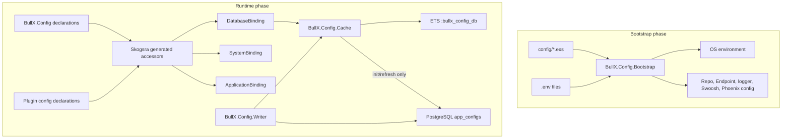
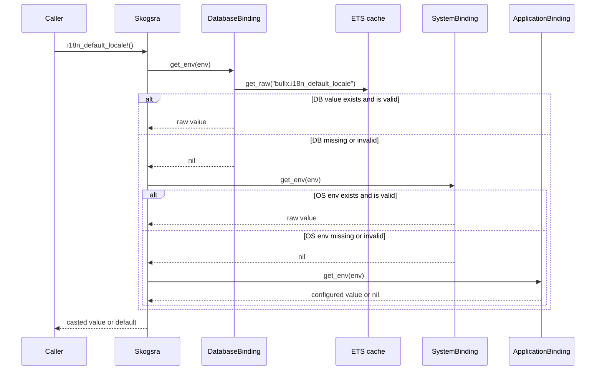

# Configuration

BullX has one configuration model with two execution phases:

- Bootstrap configuration, which runs from `config/*.exs` before `BullX.Repo`
  and the runtime cache are available.
- Runtime dynamic configuration, which is declared through `BullX.Config` and
  can resolve persisted overrides after the application has started.

Bootstrap owns the dotenv convention and fail-fast typed parsing helpers.
Runtime declarations use Skogsra types plus optional Zoi schemas across
PostgreSQL overrides, OS environment values, application config, and code
defaults. Only the runtime phase can read from PostgreSQL. Settings needed to
start the database connection, Phoenix endpoint, or encryption root secret stay
in the bootstrap phase. Plugin settings use the same runtime configuration
layer; plugins declare config modules that BullX discovers before enabled plugin
children start.

## Goals

- Keep bootstrap configuration explicit in the existing Phoenix/Mix config
  files while removing duplicated environment parsing.
- Provide a root-level runtime configuration API usable from BullX core and
  web subsystems without placing configuration under `BullX.Runtime` or
  `BullXWeb`.
- Resolve runtime settings in a deterministic order: PostgreSQL override from
  ETS, OS environment, application config, then code default.
- Let invalid runtime source values fall through to the next source instead of
  becoming terminal failures.
- Store persisted secret config values encrypted at rest while keeping all
  runtime reads uniform.
- Let discovered plugins contribute runtime config declarations and secret keys
  without adding a separate plugin configuration store.

## Design Tradeoffs

The design keeps Phoenix/Mix bootstrap configuration separate from runtime
dynamic configuration because PostgreSQL and the runtime cache are unavailable
while the repository, endpoint, and root secret are being configured. A single
runtime abstraction for both phases would either hide startup ordering or require
database behavior before the database connection exists.

Runtime reads use an ETS cache instead of direct PostgreSQL reads so generated
Skogsra accessors stay cheap and deterministic. The cost is local-node
coherence: another node does not observe a persisted write until that node
refreshes its cache or restarts.

Persisted values are validated on read, not on write. This lets an operator
store arbitrary raw strings and recover by changing higher-precedence sources,
but it also means invalid database values remain durable facts until deleted or
overwritten.

Secret rows are encrypted in PostgreSQL and decrypted into ETS. This protects
stored rows at rest, but it does not create a process-memory secrecy boundary
inside the BEAM.

Plugin configuration reuses the same runtime model instead of adding a separate
configuration store. Plugin-specific enablement semantics belong to the plugin
system design.

## System Shape

`BullX.Application` starts configuration after the repository and before
subsystems that consume runtime config. The ordering invariant is
`BullX.Repo` before `BullX.Config.Supervisor`, then config consumers. The plugin
host starts after configuration and before subsystems that may consume plugin
extension declarations, such as `BullX.Runtime.Supervisor` and
`BullXWeb.Endpoint`.

`BullX.Config.Cache` owns no durable truth. If the cache restarts, it recreates
its ETS table and reloads rows from PostgreSQL.

## Bootstrap Configuration

`config/config.exs`, `config/dev.exs`, `config/test.exs`, `config/prod.exs`,
and `config/runtime.exs` all require `config/support/bootstrap.exs`. Environment
reads in those files go through `BullX.Config.Bootstrap` for dotenv loading,
typed env reads, required env reads, and Zoi validation.

Bootstrap parsing is fail-fast. Missing required variables, malformed integers
or booleans, and Zoi-invalid values raise during config evaluation.

Dotenv files are read from the repository root. The profile name is
`Atom.to_string(config_env)`. The file order is:

| Environment | Files |
| --- | --- |
| `:dev` | `.env`, `.env.dev`, `.env.local` |
| `:test` | `.env`, `.env.test` |
| `:prod` | `.env`, `.env.prod` |
| Other envs | `.env`, `.env.<env>` |

Later dotenv files override earlier dotenv files. Values already present in the
OS environment are not overwritten by file values. `.env.local` is only loaded
for `:dev`. The implementation uses `Dotenvy.source!/2` with
`require_files: false`; there is also a minimal `KEY=value` fallback parser for
the plain case if Dotenvy is unavailable while the helper is being evaluated.

Bootstrap owns only values required before runtime configuration can run:
repository startup such as `DATABASE_URL`, endpoint startup such as `PORT` and
`PHX_SERVER`, and root secrets such as `BULLX_SECRET_BASE`. `BULLX_SECRET_BASE`
is constrained to at least 64 characters before endpoint key derivation.

Static compile-time configuration remains in `config/*.exs` when it is not
deployment-derived.

## Runtime Declaration API

Runtime settings are declared by modules that `use BullX.Config` and call
`bullx_env/2`. The macro wraps Skogsra with BullX's binding order: database
override from ETS, OS environment, application config, then Skogsra default. It
also disables Skogsra caching so BullX can own cache behavior explicitly.

Core modules and plugin modules use the same declaration API. A plugin exposes
its config declaration modules through the plugin contract described in
`docs/design-docs/Plugins.md`.

Skogsra still generates the normal accessor functions such as `name/0`,
`name!/0`, and `reload_name/0`. Generated `put_name/1` is not the persisted
write path; persisted writes go through `BullX.Config.put/2`.

The default database key is `bullx.<key>`. For list keys, atoms are joined with
dots: `key: [:i18n, :locales_dir]` maps to `bullx.i18n.locales_dir`. The DSL
contract is `key: atom()` or `key: [atom(), ...]`; string keys and mixed key
paths are unsupported because database key generation uses `Atom.to_string/1`
during macro expansion.

`bullx_env/2` adds these BullX-specific options to ordinary Skogsra options:

- `key:` changes the application config path and database key path.
- `zoi:` provides a Zoi schema or zero-arity function returning a schema.
- `secret: true` records the database key in the secret-key registry.
- `type: :generated_secret` expands to `BullX.Config.GeneratedSecret`.

Current in-tree runtime declarations are:

| Module | Accessor | DB key | OS env | Application config | Default |
| --- | --- | --- | --- | --- | --- |
| `BullX.Config.Secrets` | `secret_base!/0` | none | `BULLX_SECRET_BASE` | none | required |
| `BullX.Config.I18n` | `i18n_default_locale!/0` | `bullx.i18n_default_locale` | `BULLX_I18N_DEFAULT_LOCALE` | `:i18n_default_locale` | `"en-US"` |
| `BullX.Config.I18n` | `i18n_locales_dir!/0` | `bullx.i18n.locales_dir` | `BULLX_I18N_LOCALES_DIR` | `[:i18n, :locales_dir]` | `"priv/locales"` |

`BullX.Config.Secrets.secret_base!/0` overrides the default binding order and
uses only `BullX.Config.SystemBinding`. It is required and constrained with
`Zoi.string() |> Zoi.min(64)`, matching the bootstrap validation in
`config/runtime.exs`. It is used by runtime config encryption and is not
database-configurable.

The I18n declarations are consumed by `BullX.I18n.Catalog`. The default locale
is re-read by `BullX.I18n.reload/0`. The locales directory is read when the
catalog process initializes; `reload_locales!/0` reloads that already configured
directory.

## Runtime Resolution

Runtime accessors resolve values through Skogsra. Each BullX binding either
returns a candidate value or `nil`; `nil` means "try the next source".

`DatabaseBinding` does not query PostgreSQL directly. It reads raw plaintext
from `BullX.Config.Cache.get_raw/1`.

`SystemBinding` uses Skogsra naming; the normal no-namespace case yields names
like `BULLX_I18N_DEFAULT_LOCALE`. `ApplicationBinding` follows the declared key
path through `Application.fetch_env/2`, nested keyword lists, and nested maps.

Skogsra performs the authoritative cast after a binding returns. When a
declaration has a `zoi:` schema, `BullX.Config.Validation.validate_runtime_raw/2`
does a provisional Skogsra cast first so Zoi can validate the typed value
without returning the typed value to Skogsra. If casting or Zoi validation fails,
resolution continues to the next source. These provisional failures are not
logged or emitted as telemetry by the BullX binding layer. Without `zoi:`, cast
failures are handled by Skogsra's binding cast step, which logs a warning and
also continues to the next source.

Defaults are returned by Skogsra after all bindings miss. Defaults are not
passed through Zoi validation by BullX, so declaration authors must keep defaults
inside their declared constraints.

## Persistence And Cache

Persisted overrides are stored in `app_configs`:

| Column | Type | Notes |
| --- | --- | --- |
| `key` | `text` | Primary key |
| `value` | `text` | Raw string or encrypted ciphertext |
| `type` | PostgreSQL enum `app_config_type` | `plain` or `secret`, default `plain` |
| `inserted_at` | `utc_datetime` | Ecto timestamp |
| `updated_at` | `utc_datetime` | Ecto timestamp |

`BullX.Config.Cache` owns the named `:protected` ETS table
`:bullx_config_db`. `get_raw/1` returns `{:ok, value}` or `:error`; reads during
a cache restart degrade to absence by rescuing `ArgumentError`. Refresh APIs are
explicit `GenServer.call/2` operations.

On init, the cache queries all `app_configs` rows and inserts plaintext values
into ETS. If the query fails, for example before migrations have run, the cache
logs a warning and starts with an empty table. During `refresh_all/0`, the table
is cleared only after the PostgreSQL query succeeds. During `refresh/1`, a
missing row deletes the ETS entry. A PostgreSQL exception during refresh is
logged and leaves the existing ETS value unchanged.

There is no PostgreSQL `LISTEN/NOTIFY`. Cache refresh is explicit and local to
the current node.

## Write Path

`put/2` accepts only binary keys and binary values. It checks
`BullX.Config.SecretKeys.secret?/1` before writing:

- Plain keys store the value as-is with `type: :plain`.
- Secret keys encrypt the value first and store `type: :secret`.

The database write is an upsert on the primary key and replaces `value`, `type`,
and `updated_at` on conflict. After a successful write, the writer refreshes
that key in ETS. `delete/1` deletes matching rows and refreshes the key, which
removes it from ETS.

The writer does not validate values against Skogsra types or Zoi schemas, and it
does not generate values for generated-secret declarations. Invalid persisted
strings are allowed in the database and ignored by runtime reads when the
binding pipeline cannot cast or validate them.

Write path failures split into pre-write secret encryption, database writes, and
post-write cache refresh. Secret encryption failure returns `{:error, reason}`
before any database write. Database write exceptions are not wrapped by the
writer. A database exception during refresh is logged by
`BullX.Config.Cache` and leaves the existing ETS value unchanged while the
writer still returns `:ok`. If the cache process is unavailable when the
post-write refresh runs, the database operation may already have succeeded, the
caller may exit from `GenServer.call/2`, and ETS remains stale until an explicit
refresh or cache restart reloads rows from PostgreSQL.

## Secret Storage

`secret: true` is declaration metadata. It is collected by
`BullX.Config.__before_compile__/1` into `__bullx_secret_keys__/0` and read by
`BullX.Config.SecretKeys`.

`SecretKeys` builds a `MapSet` from loaded core config modules, modules listed
in the `:bullx` application metadata, and config modules declared by discovered
plugins. Any module that exports `__bullx_secret_keys__/0` may contribute keys
after it has been accepted by the core or plugin discovery path. The set is
cached in `:persistent_term`; tests can clear it with `SecretKeys.reset/0`.
After the first lookup, newly loaded declaration modules do not contribute keys
until `SecretKeys.reset/0` or an application restart rebuilds the set.

Plugin secret keys are collected for all discovered plugins, not only enabled
plugins. This lets `BullX.Config.put/2` encrypt secret plugin settings before
the operator enables the plugin.

`BullX.Config.Crypto` encrypts and decrypts secret rows:

- It derives a per-key encryption key with `BullX.Ext.derive_key/3`.
- The seed is `BullX.Config.Secrets.secret_base!/0`.
- The sub-key id is `"app_configs/" <> config_key`.
- The extra context is `"value"`.
- The AEAD implementation is the BullX Rust NIF for XChaCha20-Poly1305-IETF.

`app_configs` stores ciphertext for secret rows, but ETS stores plaintext after
successful decryption. The ETS table is `:protected`, so the cache process owns
writes but other BEAM processes can read named-table entries. The configuration
layer treats process memory as inside the trust boundary.

If decryption fails during cache load or refresh, the key is not inserted into
ETS; refresh of a single key also deletes the old ETS entry on decrypt failure.
Changing `BULLX_SECRET_BASE` makes existing secret rows undecryptable unless an
operator restores the old root secret or overwrites the affected rows.

## Generated Secrets

`type: :generated_secret` is a BullX alias for
`BullX.Config.GeneratedSecret`, a Skogsra type and generation helper for secrets
created by BullX.

`GeneratedSecret.generate/1`:

- Uses at least 256 bits of entropy by default.
- Rejects `entropy_bits` below 256.
- Generates cryptographic random bytes and encodes them as unpadded URL-safe
  Base64.

`GeneratedSecret.cast/1` accepts only binaries that are at least 43 characters
long and match `[A-Za-z0-9_-]+`. It rejects `nil`, empty strings, short strings,
and malformed strings. Casting never creates a replacement value.

Generation and secrecy are separate:

- `type: :generated_secret` controls casting and generation semantics.
- `secret: true` controls encrypted persistence through the writer.

## Boundaries And Non-Goals

The current implementation deliberately does not include:

- A configuration UI or control-plane payload format.
- Write-time schema validation for persisted values, including declared keys.
- PostgreSQL `LISTEN/NOTIFY`.
- Cross-node cache invalidation.
- Direct database reads on runtime accessor calls.
- Skogsra `:persistent_term` caching for BullX runtime variables.
- Root secret rotation or automatic re-encryption of existing secret rows.
- Public redaction or UI payloads for secret values.

Runtime dynamic configuration is local-node coherent after explicit writes and
refreshes. In a multi-node deployment, another node will continue serving its
own ETS value until it is explicitly refreshed or restarted.

## Test Boundary

Tests that write `app_configs` must allow `BullX.Config.Cache` into the SQL
sandbox. ETS is not rolled back by the database sandbox, so tests refresh or
delete cache entries during cleanup.
