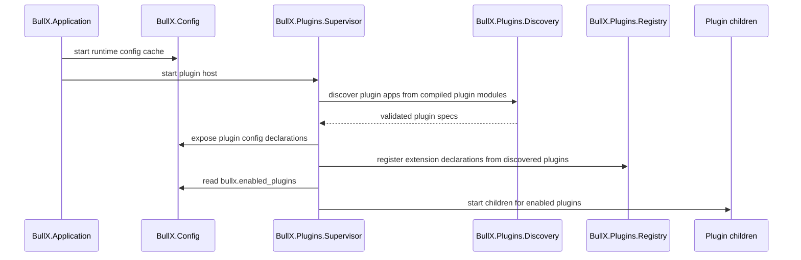

# Plugins

BullX plugins are trusted, compile-time Elixir extensions discovered from
`plugins/*` and activated from runtime configuration. A plugin contributes
typed extension-point declarations, runtime configuration declarations, and
optional supervised children. BullX does not install or compile plugins at
runtime; changing the enabled plugin list requires an application restart.

## Scope

This design covers the host-side plugin system:

- automatic discovery of in-repository plugin Mix projects;
- the plugin metadata and API-version contract;
- extension-point registration and lookup;
- plugin runtime configuration and secret declarations;
- startup behavior for enabled plugin children.

This design sits below `docs/Architecture.md`. It defines the host mechanics
that subsystem docs use when a Catch source adapter, Node Executor, AuthN
provider, Capability provider, or other integration needs plugin-provided
implementation. It does not define a specific product plugin, Workflow graph
semantics, Catch correlation semantics, Node contracts, AuthN provider models,
or Capability/Governance policy.

## Goals

- Let BullX add integrations without changing core modules for each
  integration.
- Keep plugins simple: local source code, compile-time dependencies, trusted
  BEAM modules, and restart-required activation.
- Keep enablement in `app_configs` instead of adding plugin-specific tables.
- Let plugins declare `BullX.Config` settings, including secret settings, using
  the same resolution and encryption behavior as core settings.
- Make invalid plugin contracts fail close to startup instead of producing
  partially registered hooks.
- Make Catch source adapters, Node Executor implementations, and Capability
  providers normal extension-point consumers without making the plugin host own
  Workflow execution semantics.
- Keep the plugin host as a registry and supervisor, not a general event
  pipeline.

## Non-goals

- BullX does not download, install, compile, unload, or upgrade plugins at
  runtime.
- BullX does not support hot enabling or hot disabling plugins. Operators write
  the new enabled list and restart the application.
- BullX does not provide a sandbox for plugin code. Plugins are Installation
  administrator trusted code.
- BullX does not implement hook priority, dependency graphs, plugin start/stop
  state machines, or runtime module generation.
- BullX does not create a plugin marketplace, plugin UI, or plugin package
  publishing workflow in this design.

## Existing system

BullX currently has a root `BullX.Config` runtime configuration layer backed by
`app_configs`, an ETS cache, and typed Skogsra declarations. `BullX.Application`
starts `BullX.Repo`, then `BullX.Config.Supervisor`, then runtime consumers.
`BullX.Runtime.Supervisor` is intentionally empty and should not become the
plugin host.

The `packages/*` directory holds reusable libraries whose semantics do not
depend on BullX. The new `plugins/*` directory is different: every immediate
child Mix project under `plugins/` is a BullX plugin and may depend on BullX
extension-point contracts.

The draft referenced
[MishkaInstaller](https://github.com/mishka-group/mishka_installer) as prior art.
BullX borrows the idea that plugin authors implement a regular hook contract.
BullX does not reuse MishkaInstaller's runtime installer, Mnesia storage,
priority pipeline, runtime module generation, or plugin lifecycle state machine.

## Design

`BullX.Plugins` owns plugin discovery, validation, registration, and startup.
The host treats plugin state as reconstructible process-local state. PostgreSQL
stores only the runtime configuration values, including the list of enabled
plugin ids.

The startup flow is:



`BullX.Application` starts `BullX.Plugins.Supervisor` after
`BullX.Config.Supervisor` and before `BullX.Runtime.Supervisor` and
`BullXWeb.Endpoint`. If plugins need `BullX.PubSub`, the application starts
`Phoenix.PubSub` before the plugin supervisor. This changes startup ordering but
does not make plugin processes part of `BullX.Runtime`.

### Compile-time discovery

The root Mix project discovers plugin dependencies by scanning immediate
children of `plugins/` for `mix.exs`. Each plugin directory name must match the
plugin Mix `app` name. For example, `plugins/feishu/mix.exs` must declare
`app: :feishu`.

The root project adds each discovered plugin's `lib` directory to BullX's
compile paths. Plugin modules compile as part of the BullX application, so they
can use `BullX.Plugins.Plugin`, `BullX.Config`, and other host contracts without
creating a circular Mix dependency. The plugin Mix project remains the source
boundary and dependency declaration boundary; the plugin app itself is not
started as an OTP application by Mix.

The root project reads each plugin Mix project for additional dependencies and
merges those dependencies into BullX's dependency list. A plugin must not depend
on `:bullx`; plugin code is compiled inside BullX instead.

The host discovers plugin entry modules from BullX's compiled application
modules. For each plugin id from `plugins/*`, `BullX.Plugins.Discovery` finds
modules that export `__bullx_plugin__/0` and whose declared id matches that
plugin id. Exactly one module must export that matching marker. Zero matching
marker modules or more than one matching marker module is a startup error.

### Plugin contract

A plugin entry module implements `BullX.Plugins.Plugin`. The behaviour exposes a
small declaration surface:

| Callback | Responsibility |
| --- | --- |
| `__bullx_plugin__/0` | Return plugin metadata, including id and API version. |
| `extensions/0` | Return typed extension-point declarations. |
| `config_modules/0` | Return modules that use `BullX.Config`. |
| `children/1` | Return child specs for enabled plugin runtime processes. |

`use BullX.Plugins.Plugin` may generate `__bullx_plugin__/0` from compile-time
options, but the runtime contract stays the same. When plugin source lives under
`plugins/<id>/`, the macro infers the plugin app id from that path. Tests and
unusual layouts may pass `app:` explicitly. The plugin id is the app atom
rendered as a string unless the behaviour later allows a stricter explicit id.
The host supports plugin API version `1` exactly. Unsupported versions fail
startup.

Plugin metadata is descriptive and deterministic. It must not read external
services, mutate process state, or perform registration side effects. The host
owns registration.

### Extension-point registry

An extension point is a typed contract owned by a BullX subsystem. The plugin
host stores declarations and provides lookup APIs, but it does not define the
call semantics for every extension point.

Typical extension-point consumers include implementations that a Workflow design
uses during Signal admission and Catch matching, Node Executor implementations,
and Capability providers. A plugin can therefore contribute entry-point
adapters, Node executors, or Capability providers, but the registry only records
declarations. The owning Workflow or subsystem design decides how each
declaration is invoked, authorized, audited, streamed, retried, or recovered.

Each extension declaration contains:

- `point`, an atom or string naming the subsystem-owned extension point;
- `id`, a unique contribution id within that point;
- `module`, the implementation module;
- `opts`, declaration metadata for the owning subsystem.

The registry rejects duplicate `{point, id}` pairs. The registry does not apply
priority. If a subsystem needs ordering or first-match behavior, that subsystem
must define the behavior in its own design doc and extension-point contract.

The registry includes declarations from all discovered plugins, not only enabled
plugins. Subsystems that execute extension code must check whether the owning
plugin is enabled or ask `BullX.Plugins.Registry` for enabled entries only. This
keeps discovery deterministic while preserving the restart-required enabled
state.

### Enabled plugin configuration

Enabled plugins are stored in `app_configs` through the normal configuration
writer. The key is `bullx.enabled_plugins`. The stored value is a JSON array of
plugin ids, for example:

```json
["feishu", "github"]
```

`BullX.Config.Plugins` declares the accessor:

| Accessor | DB key | OS env | Application config | Default |
| --- | --- | --- | --- | --- |
| `enabled_plugins!/0` | `bullx.enabled_plugins` | `BULLX_ENABLED_PLUGINS` | `:enabled_plugins` | `[]` |

The config type accepts a native list of strings from application config and a
JSON array string from PostgreSQL or the OS environment. Invalid values follow
the normal `BullX.Config` rule: the invalid source is ignored and resolution
continues to the next source.

Changing `bullx.enabled_plugins` changes the durable configuration value but
does not change running plugin children or registry entries. The operator must
restart BullX for the new enabled list to affect runtime startup.

### Plugin configuration declarations

Plugins declare runtime configuration by returning modules from
`config_modules/0`. Those modules use `BullX.Config` and must namespace plugin
keys under `[:plugins, plugin_id, ...]`, which maps to database keys like
`bullx.plugins.feishu.app_secret`.

Plugin config declarations are collected for all discovered plugins, including
disabled plugins. This is required for secret handling: `BullX.Config.Writer`
must know whether a key is secret before the plugin is enabled.

`BullX.Config.SecretKeys` expands beyond the current `BullX.Config.*` module
prefix. It builds the secret-key set from core declaration modules and
plugin-declared config modules discovered by `BullX.Plugins.Discovery`.

### Runtime supervision

`BullX.Plugins.Supervisor` owns a child supervisor per enabled plugin or an
equivalent dynamic supervision structure with the same failure boundary. A plugin
failure restarts that plugin's children according to ordinary OTP child specs.
The plugin registry is reconstructible. If the plugin supervisor restarts, it
rediscovers plugins, rebuilds registry entries, rereads `enabled_plugins`, and
starts enabled children again.

Plugin children are optional. A plugin can contribute only extension declarations
and no processes.

## Error and failure behavior

The plugin host fails startup for contract errors:

- a plugin app has no `__bullx_plugin__/0` module;
- a plugin app has multiple marker modules;
- plugin API version is unsupported;
- plugin id does not match the discovered app id;
- extension declarations contain duplicate `{point, id}` pairs;
- plugin config modules do not load or do not expose valid `BullX.Config`
  declarations.

External provider failures inside enabled plugin children are not plugin-host
contract failures. The child process handles reconnect, retry, or terminal
failure according to its own subsystem design and OTP child spec.

Invalid `bullx.enabled_plugins` values follow the configuration fallback rules.
Unknown plugin ids in the resolved enabled list fail startup because they
represent an operator configuration error.

## Security and governance

Plugins are trusted code inside the Installation. BullX does not try to prevent a
malicious plugin from bypassing host APIs, reading process memory, or calling
external services directly.

Subsystem extension-point contracts remain responsible for authorization,
auditing, risky outbound effects, and Governance. The plugin host does not
decide whether an incoming Signal can match a Catch and start a Segment, whether
a Node can execute, whether a Capability call is authorized, or whether a
Throw-bearing Node with external side effects has passed the required policy or
approval gates.

Secret plugin configuration uses `BullX.Config` secret persistence. PostgreSQL
stores ciphertext, ETS stores plaintext inside the BEAM trust boundary, and
changing `BULLX_SECRET_BASE` makes existing secret rows undecryptable until an
operator restores the old root secret or overwrites the affected rows.

## Alternatives considered

| Alternative | Decision |
| --- | --- |
| Use MishkaInstaller directly | Rejected. It includes runtime installation, Mnesia state, priority pipelines, runtime module generation, and lifecycle features BullX does not need. |
| Add plugin-specific tables | Rejected for v1. `app_configs` with `bullx.enabled_plugins` is enough for restart-required enablement. |
| Require an explicit plugin manifest | Rejected. The `plugins/` directory is already the boundary; a Mix project in that directory is a plugin. |
| Hot enable and disable plugins | Rejected. Restart-required activation is simpler and keeps supervision behavior understandable. |
| Global hook pipeline with priority | Rejected. BullX extension points are typed contracts owned by subsystems. The host should not invent cross-subsystem ordering semantics. |
| Treat disabled plugins as undiscovered | Rejected. Secret config declarations must be known before enablement so writes can encrypt secret keys correctly. |

## Implementation handoff

### Goal

Implement the plugin host, compile-time plugin discovery, runtime enablement via
`BullX.Config`, and documentation-aligned startup behavior.

### Context pointers

- `mix.exs`
- `lib/bullx/application.ex`
- `lib/bullx/config.ex`
- `lib/bullx/config/secret_keys.ex`
- `docs/Architecture.md`
- `docs/design-docs/Configuration.md`
- `internals/design-docs/drafts/Plugins.md`
- MishkaInstaller reference: `lib/event/hook.ex`, `lib/event/event.ex`,
  `lib/event/module_state_compiler.ex`, and `lib/installer/installer.ex`

### Constraints

- Do not add a new persistence table for plugin enablement.
- Do not start plugin OTP applications before `BullX.Plugins.Supervisor` reads
  `enabled_plugins`.
- Do not add runtime installation, runtime compilation, hot unload, priority, or
  dependency graph behavior.
- Keep plugin registry state reconstructible from compiled modules and
  `app_configs`.
- Use `BullX.Config` for plugin configuration and secrets.

### Tasks

1. Add plugin dependency discovery.
   Owns: `mix.exs`.
   Depends on: None.
   Acceptance: immediate child Mix projects under `plugins/` contribute their
   `lib` directories to BullX compile paths and their non-`:bullx` dependencies
   to BullX deps.
   Verify: `mix deps` or `mix compile`.

2. Add the plugin behaviour and spec validation.
   Owns: `lib/bullx/plugins.ex`, `lib/bullx/plugins/plugin.ex`,
   `lib/bullx/plugins/discovery.ex`.
   Depends on: Task 1.
   Acceptance: discovery returns one validated plugin spec per plugin app and
   fails on missing or duplicate marker modules.
   Verify: focused unit tests for discovery.

3. Add the registry and supervisor.
   Owns: `lib/bullx/plugins/registry.ex`,
   `lib/bullx/plugins/supervisor.ex`, `lib/bullx/application.ex`.
   Depends on: Task 2.
   Acceptance: registry contains discovered extension declarations, enabled
   plugin children start under the plugin supervisor, and duplicate extension ids
   fail startup.
   Verify: supervisor and registry tests.

4. Extend `BullX.Config` for plugin declarations.
   Owns: `lib/bullx/config/plugins.ex`, JSON string-list type,
   `lib/bullx/config/secret_keys.ex`.
   Depends on: Task 2.
   Acceptance: `enabled_plugins!/0` resolves a JSON array from `app_configs`,
   and plugin-declared secret keys are encrypted even when the plugin is
   disabled.
   Verify: config and secret-key tests.

### Done when

- `docs/design-docs/Plugins.md` and `docs/design-docs/Configuration.md` match
  implemented behavior.
- Plugin discovery, enabled plugin startup, duplicate extension rejection,
  unsupported API versions, unknown enabled ids, and plugin config secret
  handling have tests.
- `bun precommit` passes.

Implementation should stop and ask if a concrete extension point needs ordering,
cross-plugin dependency semantics, runtime enablement, or persistence beyond
`app_configs`.
