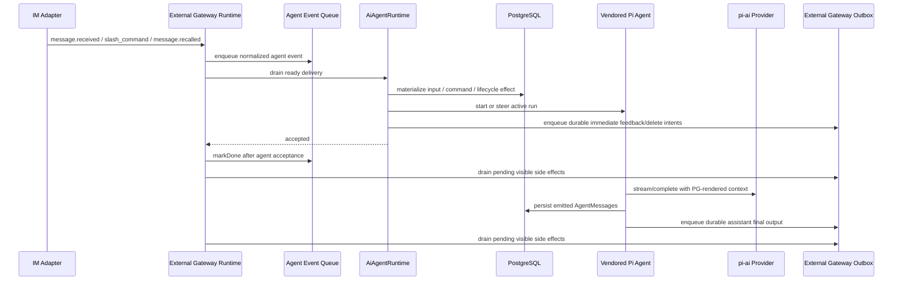

# AIAgent pi-ai 多轮纯文本对话实施计划

## 实施结论

本计划用于落地 BullX Agent 的第一版 AIAgent 运行时：多轮纯文本对话、conversation/session reset、压缩、撤回、may-intervene、基础 slash commands、LLM 轨迹审计，以及 External Gateway 到 AIAgent 的 durable acceptance 边界。

实施方向固定为：

1. BullX Agent 直接引入 `@earendil-works/pi-ai` 作为 LLM provider bridge。
2. BullX Agent 在 `app/src/ai-agent/core/` 本地 fork `@earendil-works/pi-agent-core` 的 Agent loop、Agent state、message/event 类型、steering/follow-up queue、tool lifecycle hooks、compaction helpers。
3. BullX 的 PostgreSQL conversation/messages 替代 Pi 的 JSONL session storage。只有 JSONL session 明确被替换；skills、tool-call 生命周期、filesystem 操作扩展面先保留，v1 不打通闭环。
4. External Gateway 和 AIAgent 一起调整：Gateway 继续负责 IM 投影、输入窗口和 outbox side effect；AIAgent 负责 conversation、transcript、generation lease、Pi Agent run。不要复制 Elixir MailBox，也不要让 Gateway 拥有 assistant turn。

第一版必须直接进入这个目标模型，不再实现“mock handler 后面接 `pi-ai complete()`”的过渡方案。那个形状会错误绑定 Gateway 和 assistant turn，后续 `/steer`、压缩、撤回、retry、stop、skills 都会返工。

## V1 实施范围

第一版必须跑通：

- addressed 文本输入的多轮纯文本对话。
- `may_intervene` ambient 输入的基础支持。
- 上下文压缩，包括 manual `/compress` 和 provider context overflow 后压缩重试。
- IM `message.recalled` / `message.deleted` 的撤回语义。
- slash commands：`/new`、`/compress`、`/retry`、`/steer`、`/stop`。
- command feedback IM 可见，但不进入 transcript。
- conversation reset 与 Elixir 版对齐；Daily Reset 保留 Elixir close-old/keep-history/active-generation-retry 行为，但 freshness 按 OpenClaw `sessionStartedAt` 语义实现。
- final `post` outbound intent、`/compress` progress 需要的 `edit` outbound intent，以及 `/retry`、`/stop`、IM recall/delete 需要的 `delete` outbound intent。

第一版暂不闭环：

- skills 执行闭环。
- filesystem/FUSE-backed 文件系统。
- soul / persona / mission。
- 可见 streaming output。
- IM edit revision。

明确不支持：

- `/undo` 命令。用户撤回只走 IM recall/delete lifecycle。

这里的“暂不闭环”不是删除接口。Pi core fork 里应保留 skills/tool 的形状。Future filesystem/FUSE v1 完全不设计、不实现；只避免把 Pi core fork 改成未来无法接文件系统的死结构。

## 实施依据

### pi-ai

`@earendil-works/pi-ai` 是 provider abstraction，不是 session store。它提供：

- `getModel(provider, modelId)`。
- `stream(model, context, options)`。
- `complete(model, context, options)` / simple completion wrapper。
- 标准 `Context = { systemPrompt?, messages, tools? }`。
- 标准 `Message`：`user`、`assistant`、`toolResult` 等。
- `AssistantMessage.stopReason = stop | length | toolUse | error | aborted`。
- `StreamOptions.signal` 支持 abort。
- `sessionId` 是 provider cache/session affinity，不是 BullX conversation id。
- `registerFauxProvider()` 可用于 Bun 测试。
- `isContextOverflow()` 已经内置 provider context overflow 判断，应直接使用。
- JSON parsing helper 如 `parseJsonWithRepair()` 可用于 ambient recognizer。

BullX 要持久化的是自己的 conversation/transcript；`pi-ai Context` 每次从 PG transcript 重建。

### pi-agent-core

`@earendil-works/pi-agent-core` 的关键不是 JSONL，而是 Agent loop：

```text
AgentMessage[] -> transformContext() -> convertToLlm() -> pi-ai Message[] -> streamSimple()
```

值得本地 fork 的部分：

- `Agent` state wrapper。
- `agent-loop.ts`。
- `AgentMessage`、`AgentEvent`、`AgentTool`、`AgentLoopConfig` 等类型。
- `steeringQueue`、`followUpQueue`、`abort()`、`continue()`。
- `beforeToolCall` / `afterToolCall` / `prepareNextTurn` / `shouldStopAfterTurn` hooks。
- compaction helpers：`estimateTokens`、`estimateContextTokens`、`shouldCompact`、`findCutPoint`、`prepareCompaction`、`compact`、`generateSummary`。
- `harness/messages.ts` 中的 compaction summary message 形状。
- skills loader / formatting 相关扩展形状，v1 可不启用。

明确替换的部分：

- JSONL session repo/storage。
- Pi CLI 的 session selector、branch navigation、TUI/RPC UI。
- coding-agent 里与本地 CLI UI 绑定的 renderer。

不能误删的部分：

- skills 概念。后面要用。
- tool-call 生命周期。后面 skills/tools 要用。
- filesystem 操作扩展面。v1 完全不设计 filesystem/FUSE，只保留 Pi core 未来接入 tools/filesystem 的可能性，不在本计划里定义 PG-backed file contract。
- compaction 中的 file operation details 只按 Pi helper 的兼容字段保留；v1 不赋予 filesystem 业务语义。

### Pi / Hermes steer 语义

Pi 的 `/steer` 语义是 queue steering message：

- active run 中调用 `Agent.steer(message)`。
- steering message 会在当前 assistant turn 结束并完成 tool calls 后、下一次 LLM call 前注入。
- 当前 assistant message 的 tool calls 不会被跳过。
- `QueueMode` 支持 `all` 和 `one-at-a-time`，默认 one-at-a-time。
- `abort()` 是独立语义，不等于 steer。

这说明 Pi 可以提供 steer queue 这个实现基底，但 BullX 的产品语义采用 Hermes：

- active run 中，`/steer` 不 interrupt 当前 tool call。
- steer text 被暂存，下一次 tool result 产生时，以明确 out-of-band user marker 追加到最后一个 tool result，保持 role alternation。
- 多个 steer 在 drain 前用换行拼接。
- 如果没有 active run、agent 还没启动、agent 不支持 steer，或 run 结束前没有 tool boundary 可注入，fallback 成下一轮普通用户输入，不丢。

v1 是纯文本、没有 tool calls，所以 active provider call 期间收到 `/steer` 时，不能强行制造一个额外 assistant turn；应 durable queue 为 next-turn user input，并保留 control-origin metadata。未来 tools 接入后，再在 tool result boundary 按 Hermes marker 注入。

### Elixir BullX

Elixir 版提供几个必须继承的事实：

- profile 里有三档模型：`main_llm`、`compression_llm`、`heavy_llm`。`main_llm` 必填；`compression_llm` 缺省时继承 main 并把 reasoning effort 降到 low；`heavy_llm` 缺省时继承 main 并把 reasoning effort 升到 high。
- runner 的普通生成使用 `main_llm`；compression 和 ambient recognizer 使用 `compression_llm`；`heavy_llm` 在旧版里已经是 profile contract 的一部分，即使第一版纯文本主链路暂时不自动路由到 heavy，也必须在配置、校验、解析和 runtime profile 中实现。
- `/new` 关闭 active conversation，保留旧 messages，不改变 MailBoxSession/Gateway session identity。
- Daily Reset 关闭 stale active conversations，不删除 messages，不改变 session identity；active generation 时只写 retry metadata。当前 Elixir freshness 代码以最后 complete message / conversation updated_at 作为 activity，设计取舍见下文 Daily Reset。
- `/compress` 有 IM 可见 progress feedback，summary row 才是 durable conversation fact。
- `/retry` 找上一轮 generation trigger，标记 trigger 后 suffix 为 superseded，撤回旧 assistant 输出，再从原 trigger 重跑。
- `/stop` cancel active generation，interrupt generating assistant rows，撤回已发送输出；若无可撤回输出则发 visible control notice。
- `/steer` 是 lease-scoped ephemeral control input；命令本身不写 conversation message。Elixir 在 tool boundary 消费后把 steering note 附在 tool result 上，保证消费后的上下文可恢复。
- IM recall/delete 通过 provider refs 找 active conversation 中仍可渲染的 target message；压缩前或已结束 conversation 的 target 忽略。
- 最新且已经有/正在有输出的 addressed turn 被 recall/delete 时，标记从用户消息开始的 suffix，并撤回对应 assistant 输出。
- 历史但仍在 rendered transcript 里的消息被 recall/delete 时，只追加 introspection，不撤回旧输出。

### OpenClaw Session Reset

OpenClaw 的 session 文档和 `initSessionState()` 给 Daily Reset 提供了一个更准确的模型：

- `sessionKey` 是 room/channel/DM routing bucket。
- `sessionId` 是这个 bucket 当前使用的 transcript id。
- `/new`、`/reset`、daily reset、idle reset 都是在同一个 `sessionKey` 下 rotate 出新的 `sessionId`。
- Daily freshness 看 `sessionStartedAt`，不是 `updatedAt`，也不是后续 metadata writes。
- Idle freshness 才看 `lastInteractionAt`，且只由真实用户/频道交互推进；heartbeat、cron、exec 这类 system event 不延长 session freshness。
- rollover 时会清理旧 session 的 runtime queued notices，避免旧 session 的后台通知污染新 session 第一个 prompt。

映射到 BullX Agent：`conversation_key` 对应 OpenClaw 的 `sessionKey`，active
`ai_agent_conversations.id` 对应当前 `sessionId`。Daily Reset 的本质不是“清理历史”，而是为同一个 room/session bucket 创建新的 active conversation。

### Hermes Gateway / Session 启发

Hermes 的故事更接近 OpenClaw：一个 personal assistant 面向多个 IM 来源。它对 BullX 有参考价值，但单用户助理模型不能直接复制。

可参考的事实：

- `SessionSource` / `SessionContext` 把 platform、chat、thread、user、message id 和 session key/id 放进每次运行的上下文，用来决定回发位置和 prompt routing。
- `SessionEntry` 明确是 `session_key -> current session_id` 的映射；`reset_session()` 在同一个 `session_key` 下换新 `session_id`，旧 SQLite session 只写 ended reason。
- `gateway/session_context.py` 用 `ContextVar` 替代 `os.environ` 这种 process-global routing state，避免并发消息互相覆盖回发目标。
- `state.db` 是 transcript canonical store；`messages.active = 0` 支持 rewind/undo-style soft delete，`compression_locks` 防止并发压缩产生 session fork。
- compression 会 end old session、创建 child session，并由 Gateway 检测 `agent.session_id` 变化后更新 `SessionEntry`。
- Gateway 里有 process-local agent cache、pending message queue、running registry、shutdown resume flag。这些能降低成本和改善 UX，但不是可靠存储。

BullX 的取舍：

- 接受 `stable key -> current session id`。这和 OpenClaw、Elixir 都一致。
- 不接受 Hermes 的 `agent:main:*` key。BullX 是一个 installation/tenant 里的多个 AI coworker，同一个 Feishu/Slack room 里可能有多个 agent；`conversation_key` 必须包含 `agent_uid`、binding/realm、room bucket。
- 不把 addressed 和 ambient 拆成两个 conversation。ambient normal 不直接进入 LLM 普通对话，但一次 may-intervene 主动输出之后，用户在同一房间继续接话必须能看到这次介入。
- 不复制 Hermes 的 compression session split。BullX v1 的 compression 是同一 conversation 内的 summary row；旧消息保留但被 rendered transcript cut point 覆盖。并发压缩用 conversation row lock / generation lease 约束，不新建 `compression_locks` 表。
- 不使用 process-global routing context。Gateway event 到 AIAgent run 的 route facts 必须作为 immutable envelope 传入，并把恢复需要的最小事实写入 PG metadata/outbox。
- 不把 process-local agent cache、pending queue 当作 durability。Bun 进程没了以后，active run 可以丢，accepted input、pending control、assistant final 和 outbound intent 不能丢。
- Hermes 的 daily reset 用 `updated_at` 判断；BullX 明确不复制这一点。Daily Reset 看 `conversation.created_at`，即 OpenClaw 的 `sessionStartedAt`。

## 不可妥协原则

1. PostgreSQL 是 BullX conversation/session truth。Pi JSONL session 不进入运行时。
2. `pi-agent-core` 高度本地集成，不作为黑盒依赖；fork 后按 BullX 边界修改。
3. skills/tool/filesystem 扩展面保留，v1 不闭环。
4. command feedback 必须 IM 可见，但不进入 transcript。
5. `/undo` 不支持。撤回语义只来自 IM recall/delete lifecycle。
6. Daily Reset 是业务需求，不能删除、不能弱化成“未来再做”；它是 per-room session rollover，不是 transcript cleanup。
7. `ai_agent_ambient_batches` 不建表。may-intervene batch 是弱 operational state，不是 transcript truth。
8. model profile 必须有三档：`primary_model`、`light_model`、`heavy_model`，分别对应 Elixir `main_llm`、`compression_llm`、`heavy_llm`。
9. 不复制 Elixir MailBox；也不把 Gateway 固定成不可改。Gateway 和 Agent 要一起形成 Bun/PG 风格 runtime。
10. BullX 是同一 installation/tenant 内多个 agent coworker，不是单用户 personal assistant。任何 conversation/session identity 都不能省略 `agent_uid` 和 binding/realm scope。
11. 如果 Bun 进程崩溃但 PG、Redis 仍在，已经 accepted 的输入、pending control、assistant final、pending outbound 不能丢。若 PG 或 Redis 自身崩溃，Gateway input window、outbox pending、ambient wake 这类恢复窗口丢失是可预期的。
12. 只有 Gateway 投影事实表和 AIAgent conversation/message/LLM turn 表是长期持久事实；Gateway input window、outbox、tombstone、ambient wake 都是 Bun crash 恢复用的 operational state。
13. LLM 轨迹必须完整落 PG：每一次 provider call 的模型、profile、reasoning、输入引用、输出、usage、stop reason 和 provider metadata 都要可审计。

## Kill List

应该停止存在的概念：

- `/undo` command。
- `ai_agent_ambient_batches` PG 表。
- “`pi-agent-core` 只参考纯函数，不引入主循环”的路线。
- “command feedback 不写 projection/outbox”的说法。
- “AIAgent handler 必须等 provider call 完成才 mark Gateway event done”的隐性假设。
- 自写 provider overflow regex。
- 自写一套与 Pi 近似但不相同的 compaction algorithm。
- 把 skills、tools、filesystem 说成 coding-agent 专属而删除。
- 把 BullX 的 conversation key 写成 Hermes/OpenClaw 单助理式 `agent:main`。
- 让 accepted inbound、pending steering、generation lease 或 pending outbound 只存在 process memory。
- 把 Redis 当 transcript truth 或 outbox truth。

## 目标运行模型



关键变化：

- `ExternalGatewayAgentEvents` 仍是输入窗口。
- `markDone()` 表示 Agent 已接受并持久化输入；active generation 期间的新 addressed input 必须先进入 PG-backed `generation.pending_followups[]`，不能只交给 process-local Pi queue。
- command feedback/delete intents 必须在 `markDone()` 前写入 `external_gateway_outbox` pending row；provider send 可以在 `markDone()` 后异步 drain。
- Provider output 失败归 outbox，不把 inbound event 标 failed。
- Generation 由 `AiAgentRuntime` 后台 run 管理，不阻塞 Gateway drain。
- command/lifecycle event 可以在 active generation 期间被处理，从而支持 `/steer`、`/stop` 和 IM recall cancel。

## 代码落点

当前模块：

```text
app/src/ai-agent/
  config.ts
  runtime.ts
  run-registry.ts
  conversation-service.ts
  context-renderer.ts
  commands.ts
  lifecycle-revisions.ts
  compression.ts
  daily-reset.ts
  ambient.ts
  core/
    agent.ts
    agent-loop.ts
    types.ts
    compaction/
    messages.ts
    skills.ts
    README.md / NOTICE.md
```

`core/` 是 app-local fork。保留 MIT attribution 和 upstream commit，例如：

```text
Forked from earendil-works/pi packages/agent @ 89a92207...
```

`@earendil-works/pi-ai` 是 app dependency。升级或替换该依赖时必须用 Bun 做 import smoke test：

```sh
cd app
bun -e "import('@earendil-works/pi-ai').then(m => console.log(Object.keys(m).length))"
```

如果 Bun/Node engine 出现不兼容，先修依赖策略，不要降级成手写 provider bridge。

## External Gateway 调整

当前 TS Gateway 已经承载生产入口需要的 Gateway-Agent 边界：

- `ExternalGatewayAgentEvents` 是 unlogged input window。
- `markDone()` 注释已经说它标记 agent-accepted input。
- `ExternalGatewayOutbox` 是 provider-visible side effect owner。
- `message.recalled` / `message.deleted` 会 tombstone pending receive，若 original receive 已 delivered 则 enqueue lifecycle event。
- `ExternalGatewayAgentExecutor` 是 acceptance 边界，不再假设 agent handler 同步产出 final output。
- `/new /compress /retry /steer /stop` 会进入 typed command event；`/undo` 是普通文本。
- production startup 默认把 `AiAgentRuntime` 作为 executor 注入，mock executor 只保留为 Gateway 测试夹具。

恢复语义边界：

- `ExternalGatewayAgentEvents`、`external_gateway_outbox`、tombstones 是 operational recovery window，不是长期产品事实。
- 如果 Bun 进程崩溃但 PG/Redis 未崩，Gateway 不能丢已进入 input window 的事件，也不能丢 pending outbox；AIAgent 的 Redis ambient wake 也必须能在 restart/recover 时继续触发。
- 如果 PG 或 Redis 自身崩溃，input window、pending outbox、ambient wake timer 丢失是可预期的，不为此再复制一套 durable queue。这是尽力而为的 operational recovery，不是长期审计事实。
- 长期事实只有 Gateway 的两张外部投影事实表，以及 AIAgent 的 conversations/messages/llm_turns。

### Gateway-Agent 联合运行模型

这不是 “External Gateway 不动，AIAgent 作为黑盒 handler 接进去”。更合适的 Bun/PG 模型是：

- `ExternalGatewayRuntime` 继续拥有 adapter lifecycle、projection、input window claim、outbox adapter dispatch。
- `AiAgentRuntime` 作为 Gateway runtime 的 agent executor dependency 安装进去，拥有 conversation/messages/generation lease/Pi Agent run。
- 两者通过一个窄的 `acceptExternalGatewayDelivery()` 边界协作，但这个边界可以改 Gateway 代码和 schema；不要被当前 mock handler 接口束缚。

目标接口：

```ts
interface ExternalGatewayAgentExecutor {
  acceptExternalGatewayDelivery(
    delivery: ExternalGatewayAgentDelivery,
    context: ExternalGatewayAgentExecutionContext
  ): Promise<ExternalGatewayAgentAcceptance>
}

interface ExternalGatewayAgentExecutionContext {
  agent: AgentResult
  agentUid: string
  bindingName: string
  providerRealmId?: string
  adapter: ExternalGatewayAdapter
  outbox: ExternalGatewayOutboxScheduler
  projection: ExternalGatewayProjectionSink
  scheduleOutboxDrain(availableAt?: Date): void
}

interface ExternalGatewayAgentAcceptance {
  status: 'accepted'
}
```

`ExternalGatewayOutboxScheduler` 不是新队列，它是对现有 `external_gateway_outbox` 的拆分接口：

```ts
interface ExternalGatewayOutboxScheduler {
  enqueuePending(intent: ExternalGatewayOutboundIntent): Promise<void>
  enqueuePendingMany(intents: readonly ExternalGatewayOutboundIntent[]): Promise<void>
  dispatchPendingForBinding(agentUid: string, bindingName: string): Promise<void>
}
```

acceptance 边界：

1. Gateway claim ready rows。
2. AIAgent 在同一业务流程内完成 durable acceptance：
   - receive -> append `ai_agent_messages` user/im_ambient row；若是 active generation 期间的新 addressed input，则写 `generation.pending_followups[]`，等 Pi follow-up drain 后再 materialize user row。
   - command -> 写 command 的 durable effect；若需要 visible feedback，先 `enqueuePending()`。
   - lifecycle -> 写 transcript revision/introspection；若需要撤回 assistant output，先 `enqueuePending(delete)`。
3. AIAgent 返回 `accepted`。
4. Gateway `markDone()`。
5. Gateway 调 `dispatchPendingForBinding()`，但 dispatch 失败只更新 outbox，不回滚 input done。

这保留了 Elixir “Gateway/MailBox/AIAgent 分工”里的正确 ownership，但实现形态是 Bun 里的一个协作 runtime，而不是复制 MailBox 或把 Gateway 冻住。

### OpenClaw Gateway / Outbound 启发

DeepWiki 的 OpenClaw 概览可作为导航，但设计判断要以源码为准。对 BullX Agent v1 真正有价值的是两个轴：

1. 稳定 route bucket 和当前 session 分离。

OpenClaw 的 `buildAgentPeerSessionKey()` / `resolveAgentRoute()` 把 channel、account、peer、agent 归一成 `sessionKey`，同时 route result 里保留 `agentId`、`sessionKey`、`mainSessionKey`、`lastRoutePolicy`。这支持 BullX Agent 的判断：External Gateway 的 provider room/thread projection 不应该随 Daily Reset 改变；`conversation_key` 才是稳定 route bucket，`ai_agent_conversations.id` 才是当前 session。

不要照搬 OpenClaw 完整 binding engine。它有 guild/team/roles/identityLinks/cache tier 等复杂度；BullX Agent v1 只需要从现有 binding/runtime event 计算一个稳定 `conversation_key`，并让 AIAgent 用这个 key 做 active conversation lookup。

2. Outbound delivery 要先落 durable intent，再尝试 provider send。

OpenClaw 的 `enqueueDelivery()` 先持久化 replayable outbound send intent；`markDeliveryPlatformSendAttemptStarted()` / `markDeliveryPlatformOutcomeUnknown()` 区分“还没开始发”和“可能已经发到平台”；recovery 用 claim、backoff、max retries、unknown-send reconciliation，且在无法 reconcile 时拒绝盲目重放。

BullX Agent 不需要新建 OpenClaw-style delivery queue；现有 `external_gateway_outbox` 就是 Bun-crash recovery 用的 side effect window。但它需要补齐这些能力：

- `enqueuePending(intent)`：后台 generation 可以只创建 pending outbox，不要求当前 Gateway drain 同步发送。
- `dispatchPendingForBinding(agentUid, bindingName)`：startup、adapter reconnect、handler/generation 完成后都能 drain pending rows。
- retry metadata：至少 `retry_count`、`last_attempt_at`、`last_error`。
- send-attempt metadata：至少 `platform_send_started_at` 和 `recovery_state`，用于区分 pending-before-send 与 unknown-after-send。
- unknown-after-send 策略：adapter 若没有 reconciliation/idempotency capability，不要盲目 replay，默认进入 `failed` terminal state，并用 `recovery_state = 'unknown_after_send'` 解释原因，避免重复 assistant 输出。

OpenClaw 的 foreground reply fence 也有参考价值：当同一 session/channel 有更新的 visible reply，旧 foreground delivery 会被抑制。BullX v1 不需要搬这个内存 fence；对应语义由 `conversation.generation` lease、`/retry` suffix supersede、IM recall/delete cancel 来保证。

OpenClaw follow-up queue 的 dedupe/drop/summarize/collect 策略不应照搬。BullX v1 只需要 PG-backed pending follow-up：active generation 期间新的 addressed input 先作为 accepted input 存在 `generation.pending_followups[]`，由 Pi loop 的 `getFollowUpMessages` drain 后再 materialize 成 transcript row。不要提前引入一套 Gateway follow-up queue，也不要让 process-local Pi queue 成为唯一状态。

需要改：

1. 在 Gateway -> AIAgent event 边界显式携带稳定 `conversationKey`。

`conversationKey` 来源于 agent uid、binding name、provider realm、provider room/thread 或现有 normalized room identity。Daily Reset、`/new`、compression、retry 都不能改变这个 key；它们只改变 active `conversation.id`。

同一个外部 tenant / room 下多个 agent 是 BullX 的基本形态，所以 `agent_uid` 和 binding/realm scope 必须进入 key。只用 provider room id 会把多个 AI coworker 的 transcript 串在一起。

2. `ExternalGatewaySlashCommandName` 是：

```ts
type ExternalGatewaySlashCommandName = 'new' | 'compress' | 'retry' | 'steer' | 'stop'
```

3. `commandFromMessage()` 只识别这些命令，不识别 `/undo`。
4. Gateway 使用 `ExternalGatewayAgentExecutor` / `ExternalGatewayAgentAcceptance`，不假设 executor 完成 LLM 输出：

```ts
type ExternalGatewayAgentAcceptance = {
  status: 'accepted'
}
```

5. Runtime 给 AIAgent 注入 outbox scheduler 和 adapter/projection context：

```ts
interface ExternalGatewayAgentRuntimeContext {
  agent: AgentResult
  agentUid: string
  bindingName: string
  providerRealmId?: string
  adapter: ExternalGatewayAdapter
  outbox: ExternalGatewayOutboxScheduler
  projection: ExternalGatewayProjectionSink
  scheduleOutboxDrain(availableAt?: Date): void
}
```

6. `deliverAgentEvents()` 调用 executor；executor 完成 durable acceptance 和 pending outbox enqueue 后返回 accepted；Gateway `markDone()`；随后 drain pending outbox。后台 generation 的 final output 由 `AiAgentRuntime` 通过同一个 outbox scheduler 发出。
7. Outbox 仍是唯一 side effect table。若后台 generation 需要先落 pending outbox 再异步 dispatch，在现有 outbox 上补 `enqueuePending` / `dispatchPendingForBinding` / retry metadata / send-attempt metadata，不要新建 agent outbox。

## AIAgent Runtime

`AiAgentRuntime` 是本次真正的 owner：

- 管 active conversation lookup。
- 管 PG generation lease。
- 管 process-local active `Agent` instance。
- 管 `/steer`、follow-up、abort。
- 管后台 run 的 heartbeat/recovery。
- 管 final assistant output 的 outbox dispatch。

核心形状：

```ts
interface ActiveAiAgentRun {
  conversationId: string
  leaseId: string
  triggerMessageId: string
  agent: Agent
  abortController: AbortController
  startedAt: Date
}
```

`run-registry.ts` process-local，不作为 durable truth。durable truth 是：

- `ai_agent_conversations.generation` 中的 lease。
- `ai_agent_conversations.generation.pending_followups` 中 active generation 期间已 accepted、等待被 Pi loop 消费的 addressed input。
- `ai_agent_conversations.generation.pending_steering` 中尚未被 Pi loop 消费的 steering notes。
- `ai_agent_messages` 中已 materialized 的 user/assistant/summary/introspection rows。
- `ai_agent_llm_turns` 中所有 provider call 的审计轨迹。
- `external_gateway_outbox` 中 pending/sent/failed side effects。

Redis 的角色：

- 可以做 run wakeup、short-lived lock notification、pending ambient batch wake timer。
- 可以缓存 active run registry 的补充信息。
- 必须用 sorted set 承载 AIAgent 内部 may-intervene batch 的 due time/wake timer；batch 内容从 PG 最近 ambient rows 重建。
- 不能作为 transcript truth。
- 不能作为 outbox truth。
- 不能是唯一的 accepted input 存储。Bun 重启时必须可以靠 PG scan 找回需要继续的 generation/outbox。

Crash recovery guarantee：

- Gateway 只能在 AIAgent 把 receive/command/lifecycle 的 durable effect 写入 PG 后 `markDone()`。
- addressed/ambient receive 的 durable effect 是 `ai_agent_messages` row；但 active generation 期间的新 addressed input 先写入 `generation.pending_followups[]`，由 Pi loop drain 后再 materialize 成 user row，避免它在 transcript 中排到当前 assistant final 前面。
- `/steer` 的 durable effect 是 `generation.pending_steering[]` entry；被 Pi loop drain 后才转成 `user introspection` row 并从 pending queue 移除。
- `/stop` 的 durable effect 是 generation cancellation metadata。
- `/compress` 这类长命令要么在 durable summary/noop/failure 写完后再 `markDone()`，要么先持久化 recoverable command job。v1 选前者，避免新增 command job 表。
- assistant final text 必须先通过 lease fencing，再写 `ai_agent_messages` complete row，再写 pending outbox row，再尝试 provider send。
- 每一次 `pi-ai` provider call 都必须写 `ai_agent_llm_turns`：普通生成、retry、compression、overflow retry、ambient recognizer 都一样；即使 recognizer 输出 `intervene=false`，也必须有 LLM turn 记录。
- process-local `Agent` instance 丢失后，只损失 provider cache 和正在 stream 的 partial，不损失 accepted transcript 或 pending final output。

进程重启恢复：

- 扫描 `generation.expires_at < now` 的 conversation。
- 若 trigger 后没有 complete assistant，清理 stale lease 并重新 start generation。
- 若 `pending_followups` 非空，恢复 run 时通过 Pi follow-up callback 继续消费这些 user inputs。
- 若 `pending_steering` 非空，恢复 run 时重新注入这些 steering notes。
- 若 assistant 已 complete 但 outbox row 缺失或未 terminal，重建同一 outboundKey 并调 outbox dispatch。
- 若 lease 被 cancel，则 interrupt unfinished rows，不自动重跑。

不要新增 `ai_agent_generation_attempts` 表，除非实现时证明 `conversation.generation` 无法承载恢复。当前最小真约束只需要 conversation row 上的 active lease。

## 数据模型

新增 `app/src/common/db-schema/ai-agent.ts`。

### `ai_agent_conversations`

- `id uuid primary key`，用 `genUUIDv7()`。
- `agent_uid text not null references agents(uid) on delete restrict`。
- `conversation_key text not null`。
- `ended_at timestamptz null`。
- `generation jsonb not null default '{}'`。
- `metadata jsonb not null default '{}'`。
- `created_at`, `updated_at`。
- partial unique index：`(agent_uid, conversation_key) where ended_at is null`。

`created_at` 是这条 active conversation 的 `sessionStartedAt`。Daily Reset 只能用它和 reset boundary 判断是否 rollover；不能用 `updated_at` 或最新 message time 代替，否则 metadata write、heartbeat、command feedback 这类非用户交互会错误延长 session。

`conversation_key`：

```text
ai_agent_conversation:v1:agent:<agent_uid>:binding:<binding_name>:realm:<provider_realm_id>:room:<normalized_room_id>
```

如果现有 Gateway 已经有 normalized room/session identity，可以把它作为 `<normalized_room_id>` 的来源，但不能直接把整个 external session id 当 conversation key。key 必须保留 BullX 的多 agent / 多 binding scope：

```text
agent_uid + binding_name + provider_realm_id + provider_room_id
```

`provider_thread_id` 不纳入 `conversation_key`。从用户故事看，BullX 是同一个 room 里的 AI 同事；Feishu/Slack thread 更像消息展示和 reply anchor，不是新的 agent 工作上下文。把 thread 纳入 session truth 会导致同一个房间里用户在不同 thread 继续同一个工作时上下文断裂。

thread 只参与 outbound routing：

- reply/edit/delete 要保留原 provider thread/root/parent anchor。
- `external_gateway_projection` 仍记录 provider thread facts。
- AIAgent transcript lookup 不按 thread 分裂。

`conversation_key` 不包含 addressed/ambient lane。lane 是 message/run metadata，不是 session identity。否则同一个房间里 AI 主动介入后，用户下一句 addressed 回复会落到另一个 transcript，业务上就是上下文断裂。

`generation` 最小字段：

```json
{
  "lease_id": "...",
  "trigger_message_id": "...",
  "trigger_event_id": "...",
  "started_at": "...",
  "heartbeat_at": "...",
  "expires_at": "...",
  "max_expires_at": "...",
  "cancelled_at": null,
  "cancellation_reason": null,
  "cancelled_by_event_id": null,
  "pending_followups": [
    {
      "event_source": "...",
      "event_id": "...",
      "provider_refs": { "message_ids": ["..."] },
      "actor": { "type": "human", "id": "..." },
      "text": "...",
      "created_at": "..."
    }
  ],
  "pending_steering": [
    {
      "command_event_id": "...",
      "text": "...",
      "created_at": "..."
    }
  ]
}
```

### `ai_agent_messages`

- `id uuid primary key`。
- `agent_uid text not null`。
- `conversation_id uuid not null references ai_agent_conversations(id)`。
- `role text not null check role in ('user', 'assistant', 'tool', 'im_ambient')`。
- `kind text not null check kind in ('normal', 'summary', 'introspection', 'error')`。
- `status text not null check status in ('generating', 'complete') default 'complete'`。
- `content jsonb not null default '[]'`，BullX-normalized blocks。
- `agent_message jsonb`，保存 vendored Pi `AgentMessage` 或 pi-ai 标准 message。
- `covers_range jsonb`，summary row 使用。
- `event_source text`。
- `event_id text`。
- `metadata jsonb not null default '{}'`。
- `created_at`, `updated_at`。

关键 indexes：

- inbound idempotency：
  `(conversation_id, event_source, event_id)` unique partial for `role in ('user','im_ambient') and kind = 'normal'`。
- rendered transcript：
  `(conversation_id, created_at, id)` partial where no `metadata.transcript_effect`。
- assistant recovery：
  expression index on `metadata->'generation'->>'trigger_message_id'` where `role = 'assistant' and kind in ('normal','error')`。
- summary lookup：
  `(conversation_id, created_at, id)` where `kind = 'summary' and status = 'complete'`。
- provider refs：
  GIN/expression index on `metadata->'provider_refs'->'message_ids'` for IM recall/delete lookup。

`agent_message` 是精确 replay/convertToLlm 的输入。`content` 是 BullX UI/outbound 的解释层。不要用 raw provider payload 代替这两个字段。

### `ai_agent_llm_turns`

这是 AIAgent 内部 LLM 轨迹表，不是 generation lease/attempt 协调表。它只回答“模型实际看到了什么、用了哪个模型、产生了什么结果”，不参与 claim/retry 调度。

- `id uuid primary key`。
- `agent_uid text not null`。
- `conversation_id uuid not null references ai_agent_conversations(id)`。
- `kind text not null check kind in ('generation', 'retry_generation', 'compression', 'ambient_recognizer', 'overflow_retry')`。
- `status text not null check status in ('started', 'succeeded', 'failed', 'cancelled')`。
- `profile text not null check profile in ('primary', 'light', 'heavy')`。
- `provider text not null`。
- `model text not null`。
- `reasoning text null`。
- `temperature numeric null`。
- `max_tokens integer null`。
- `cache_retention text null`。
- `trigger_message_id uuid null`。
- `trigger_event_id text null`。
- `input_message_ids jsonb not null default '[]'`。
- `input_summary_message_id uuid null`。
- `request_context jsonb not null default '{}'`，保存发给 `pi-ai` 的 normalized context 摘要、system prompt hash、tool schema hash；不要存 API key。
- `response jsonb not null default '{}'`，保存 normalized assistant/tool/recognizer/compression output、stop reason、error kind。
- `usage jsonb not null default '{}'`。
- `provider_metadata jsonb not null default '{}'`，保存 provider request id、response id、cache metadata、latency 等必要审计字段。
- `started_at timestamptz not null`。
- `completed_at timestamptz null`。
- `created_at`, `updated_at`。

对应的 transcript row 要反向引用 `llm_turn_id`：

- assistant final/error row：`metadata.llm_turn_id`。
- summary row：`metadata.llm_turn_id`。
- ambient recognizer `intervene=true` 产生的 introspection row：`metadata.llm_turn_id`。
- ambient recognizer `intervene=false` 不产生 transcript row，但 `ai_agent_llm_turns` 仍保留完整记录。

`agent_message` 仍保存在 `ai_agent_messages`，用于重建对话。`ai_agent_llm_turns.request_context` 记录“当时发给模型的上下文引用和模型配置”，用于审计，不替代 transcript。

### 现有 `external_gateway_outbox` 扩展

不新建 agent outbox，也不复制 OpenClaw 的 SQLite queue。直接扩展现有 `external_gateway_outbox`：

- `operation text not null default 'post' check in ('post', 'reply', 'edit', 'delete')`。
- `provider_message_id text null`，`edit/delete` 时必填或能从 `metadata.target_outbound_key` 解析。
- `idempotency_key text null`，对支持去重的 adapter 使用稳定 key；Feishu/Lark 用 outboundKey 派生 `uuid`。
- `retry_count integer not null default 0`。
- `last_attempt_at timestamptz null`。
- `last_error text null`。
- `platform_send_started_at timestamptz null`。
- `recovery_state text not null default 'not_started' check in ('not_started', 'send_attempt_started', 'unknown_after_send')`。
- index：`(agent_uid, binding_name, status, created_at)`，用于 `dispatchPendingForBinding()`。

dispatch 规则：

1. `enqueuePending()` 只 upsert `status = 'pending'` / `recovery_state = 'not_started'`，不调用 adapter。
2. `dispatchPendingForBinding()` 只 claim `status = 'pending'` 的 rows，按 `retry_count` + `last_attempt_at` 做短 backoff。
3. adapter 调用前先写 `platform_send_started_at` 和 `recovery_state = 'send_attempt_started'`。
4. adapter 成功后写 `status = 'sent'`、`provider_message_id`，再 project visible outbound。
5. unsupported capability 仍写 `status = 'unsupported'`。
6. 发送前可确定的 retryable failure 保持 `status = 'pending'`，递增 `retry_count`，写 `last_error`。
7. 发送已开始后若进程崩溃或 adapter 报 unknown outcome，且 adapter 没有 reconciliation/idempotency capability，写 `status = 'failed'`、`recovery_state = 'unknown_after_send'`。不要自动 replay。
8. 若 adapter 支持 idempotency，重试必须使用同一个 `idempotency_key`，不能每次生成新 key。

这比 OpenClaw 弱，但足够 v1：它防止重复 assistant output，并保留后续为具体 adapter 加 reconciliation 的位置。

Feishu/Lark adapter 具体策略：

- `post/reply` 使用 outboundKey 派生 Feishu/Lark `uuid`。官方发送/回复消息 API 的 `uuid` 用于请求去重，同一 uuid 在 1 小时内至多成功一次。
- 成功响应拿到 `message_id` 后写回 `provider_message_id`。
- 如果 HTTP outcome unknown 且仍在 1 小时去重窗口内，可以用同一 `uuid` retry；平台应避免重复发送。若重试仍无法确认，进入 `failed + unknown_after_send`。
- 如果已有 `provider_message_id`，可用获取指定消息 API reconciliation，确认消息存在/是否 deleted 后 ack sent 或处理 delete/edit。
- 超出 uuid 去重窗口且没有 `provider_message_id` 时，不盲目 replay，进入 failed；这比重复 assistant 输出更可接受。

### 不建 `ai_agent_ambient_batches`

may-intervene batch 不建 PG 表。

原因：

- ambient normal facts 已经写入 `ai_agent_messages`。
- batch 属于 AIAgent，不属于 External Gateway；Gateway 只负责把 ambient event 规范化投递给 Agent。
- batch 只是短窗口 recognizer 的 operational debounce，不是 conversation truth。
- 丢失一次 pending ambient batch 最坏只是少一次主动介入，不是 transcript 数据丢失，不应该为此引入表、恢复协议和 stale cleanup。

实现：

```ts
class AmbientWeakBatcher {
  private batches = new Map<string, AmbientBatch>()
}
```

`batchKey = agentUid + conversationId + providerRoomId`。AIAgent 在接收 ambient fact 后：

1. append `im_ambient normal` row。
2. 更新 process-local batch map。
3. 用 Redis sorted set 写 `ai-agent:ambient-wake`，score 为 due time，member 为 batchKey。
4. due 时从 PG 最近 ambient rows 重建 batch 内容，再调用 recognizer。

如果 Bun 崩溃但 Redis/PG 没崩，worker 可从 Redis sorted set 恢复 wake，并从 PG rows 重建 batch。如果 Redis 或 PG 崩溃导致 wake 丢失，这是可预期的 operational loss；ambient batch 不是长期事实，不建 PG batch 表。

## Context Rendering

`AiAgentContextRenderer` 从 PG rows 生成 vendored Pi `AgentMessage[]`，再由 forked `transformContext` / `convertToLlm` 转成 `pi-ai Message[]`。

渲染规则：

- 使用最新 compatible summary row。
- summary row 转成 `compactionSummary` custom AgentMessage，`convertToLlm` 再转为 provider 可读 user/assistant summary message。
- `first_kept_message_id` 之后仍可见的 rows 按 `created_at, id` 追加。
- `assistant` `stopReason = error | aborted` 不进入 LLM context。
- command feedback 不进入 context。
- `im_ambient normal` 保存在同一个 room conversation 中，但不进入普通 LLM dialogue。
- `im_ambient introspection` 作为 user-like message 进入 context。
- historical recall/delete 生成的 `user introspection` 会在下一次 normal user input 前合并或直接进入 context，保留 Elixir “修正后续上下文，不撤回旧输出”的语义。

v1 system prompt 使用极短 code-owned 默认值，只约束纯文本输出，不引入 soul/mission/persona。

## Generation Flow

addressed receive：

1. 找到 room active conversation。
2. 若没有 active run，对 delivery 内每个 event append inbound user row once，针对最后一个 user row acquire generation lease 并启动 `Agent.prompt()`。
3. 若已有 active run，把新 addressed input 用 `event_source + event_id` 幂等写入 `generation.pending_followups[]`，不要立刻 append 普通 user transcript row。
4. active Pi loop 的 `getFollowUpMessages` 从 PG drain `pending_followups`，同一事务 append user row 并从 pending queue 移除；process-local `Agent.followUp()` 只能作为 wake/latency 优化，不能是唯一状态。
5. executor 完成 durable acceptance 后返回 `accepted`，Gateway markDone。

generation run：

1. 从 PG rendered transcript 重建 `Agent.state.messages`。
2. 创建 `ai_agent_llm_turns` started row，记录 `profile = primary`、provider/model/reasoning、input message ids、summary id、trigger refs。
3. `Agent` 使用 vendored Pi loop 和 `pi-ai streamSimple`，普通对话模型使用 `primary_model`。
4. `message_start/message_update/message_end` 事件由 `AiAgentRuntime` 监听。
5. v1 可以不做 visible streaming，但仍监听 partial 以便 stop/abort 状态正确。
6. provider call 完成后更新 `ai_agent_llm_turns` response/usage/provider metadata/stop reason。
7. assistant final message complete 后，先锁 conversation 做 lease fencing：`generation.lease_id` 必须等于当前 run，且 conversation 未 ended、lease 未 cancelled。
8. 从 text blocks 提取 visible final text，并预分配 `assistant_message_id`。
9. 生成 outbox intent：

```text
outboundKey = ai-agent-final:<assistant_message_id>
```

10. 同一事务写 assistant `ai_agent_messages` complete row、`metadata.llm_turn_id`、`enqueuePending()` 写 `external_gateway_outbox`、clear generation lease。
11. best-effort 调 `dispatchPendingForBinding()`；发送成功/失败/unknown outcome 都由 outbox terminal 或 retry state 记录。

如果 lease fencing 失败，说明 `/stop`、`/new`、`/retry`、IM recall/delete 或 stale recovery 已经改变了用户故事。这个 run 的 provider output 必须丢弃或只记录 interrupted diagnostic，绝不能 enqueue visible final output。

如果 stopReason：

- `stop | length` 且 text 非空：发送 final post。
- `toolUse`：v1 不执行 tool，写 assistant error `tool_use_unsupported`；保留 tool hooks 以后接。
- `error | aborted`：写 assistant error；不进入后续 LLM context；根据原因决定 visible diagnostic。

## `/steer`

`/steer <text>` 按 Hermes 语义处理：能注入当前 run 的 tool boundary 就注入；不能注入时 fallback 为下一轮用户输入，不能丢。

流程：

1. command handler 校验 args。
2. 查 active conversation。
3. 若存在 active lease 且当前 run 有 tool boundary 或未来可等待 tool boundary：
   - `FOR UPDATE` 锁 conversation，把 command 写入 `generation.pending_steering[]`，用 `command_event_id` 幂等。
   - registry 中有 active `Agent` 时 best-effort 调用 `agent.steer(steeringMessage)`；registry 缺失时保留 PG pending steering 并 schedule generation recovery。
   - 返回 IM 可见 feedback：`Steering note queued.`。
4. 若不存在 active lease，或 v1 纯文本 run 没有 tool boundary 可注入：
   - 去掉 `/steer` 前缀，把 payload 作为 next-turn user input 写入 `generation.pending_followups[]` 或直接 append user row，取决于是否还有 active run。
   - metadata 标记 `control.origin = 'steer_fallback'`。
   - 返回 IM 可见 feedback：`No tool boundary to steer; queued as next turn.`。
5. command 本身不写 transcript row。

`steeringMessage`：

```ts
{
  role: 'user',
  content: [{ type: 'text', text: `<human_steering_note command_event_id="${event.id}">${args}</human_steering_note>` }],
  timestamp: Date.now()
}
```

当 Pi loop 实际 drain 这条 steering message 时，AIAgent 把它持久化为：

- `role = 'user'`
- `kind = 'introspection'`
- `metadata.control.type = 'steering'`
- `metadata.control.source_command_event_id = event.id`

这样 command receipt 不是 transcript truth，但已被模型消费的 steering note 可恢复。

持久化顺序：

- receipt 时先写 `generation.pending_steering[]`，再 best-effort 调用 process-local `agent.steer()` 或 schedule recovery，再 `markDone()`。
- drain 时同一事务 append introspection row，并从 `pending_steering` 删除对应 `command_event_id`。
- 如果 Bun 在 receipt 后、drain 前崩溃，generation recovery 重新注入 pending steering。
- 如果 Bun 在 drain 后、删除 pending 前崩溃，恢复逻辑先查同 `source_command_event_id` introspection row，避免重复注入。

如果 active lease 存在但进程 registry 没有 run，仍然接受 `/steer`，因为 PG pending steering / fallback follow-up 才是真状态；feedback 可以写成 `Steering note queued; generation will resume.`。只有 payload 为空或 fallback materialization 失败时才返回 diagnostic。

## Commands

所有 command feedback 都走 IM outbox，可见但不进入 `ai_agent_messages`。

feedback outboxKey：

```text
ai-agent-command-feedback:<command_event_id>:<phase>
```

### `/new`

语义：

- 关闭 active conversation。
- 保留旧 messages。
- 不改变 External Gateway session id。
- 新输入命中同一个 `conversation_key` 的新 active conversation。

流程：

1. `FOR UPDATE` 锁 active conversation。
2. 若有 active generation，cancel lease 并 best-effort abort process run。
3. `ended_at = now`，`metadata.end_reason = 'new_session'`。
4. 创建新的 active conversation。
5. 发送 IM feedback：`New conversation started.`。

旧 generation 若之后才返回 provider output，必须因 conversation ended 或 lease cancelled 被 fencing 掉，不能发到 IM。

### `/compress`

语义：

- manual compression。
- 不删除原始 messages。
- summary row 是 durable fact。
- progress feedback IM 可见，且必须像 Elixir 一样 edit 同一条 progress message。

流程：

1. 若 active generation 存在，返回 busy/no active diagnostic。
2. 发送 visible progress feedback，并保存 progress outbox/provider message id。
3. 调用 Pi compaction helpers 生成 summary。
4. append `assistant summary` row。
5. 用 `edit` operation 更新同一条 progress message 为 completion/noop/failure。
6. 因为 v1 不建 recoverable command job，Gateway event 只能在 summary/noop/failure 和 feedback outbox durable 后 `markDone()`。

External Gateway v1 必须给 outbox 增加 `edit` operation。若某 adapter 不支持 edit，`/compress` 对该 adapter 返回 unsupported/edit-not-supported feedback，而不是退化成两条 progress/completion message。

### `/retry`

语义：

- 重跑上一轮 generation。
- 不开新 conversation。
- 标记旧 suffix 为 superseded。
- 撤回旧 assistant 输出，如果有 provider-visible message。

流程：

1. active generation 存在则 busy diagnostic。
2. 从 rendered transcript 找 retry target：
   - tail 是 assistant normal/error：读取 `metadata.generation.trigger_message_id`。
   - tail 是 user/introspection 且尚未有 assistant：直接用 tail。
3. target 后 suffix 写 `metadata.transcript_effect.state = 'superseded'`。
4. 为 suffix 中 sent assistant output 生成 delete intents。
5. 从 target acquire 新 generation lease。
6. start `Agent.continue()` 或 `Agent.prompt()`，取决于 target 在 Pi context 中的位置。
7. 若旧输出不可撤回，先发送 visible feedback：`Retrying the last exchange.`。

旧 run 如果还在进程里，必须 best-effort abort；即使 abort 失败，旧 run 写 final/outbox 前也会因为 lease mismatch 被 fencing 掉。

### `/stop`

语义：

- cancel active generation。
- interrupt unfinished assistant rows。
- 撤回已发送 final output；v1 没有可见 streaming，未来若开启 visible streaming，再把已发送 chunks 纳入同一 delete/edit policy。
- 若没有可撤回输出，发送 visible control notice。

流程：

1. active generation 存在则 cancel lease。
2. best-effort 调用 `agent.abort()`；如果 process registry 缺失，PG cancellation 仍是 authoritative。
3. generating assistant rows 标记 `kind = error` / interrupted。
4. sent output 生成 delete intents。
5. 同一 command event 重复处理保持幂等。

后台 run 即使没有及时 abort，也必须在 assistant final 写入前被 lease fencing 拦住，不能在 `/stop` 后继续发出旧回答。

### 不支持 `/undo`

用户撤回消息只通过 IM `message.recalled` / `message.deleted` lifecycle 处理。不要再把 `/undo` 放进 Gateway command stub。

## IM Recall/Delete

target lookup：

- 只用 `metadata.provider_refs.message_ids`。
- 只查 active conversation。
- materialized rows 中 role 限定 `user | im_ambient`。
- materialized rows 中 kind 限定 `normal`。
- 同时查 `generation.pending_followups[]` 中的 provider refs；pending follow-up 还不是 transcript row，但已经是 accepted input。
- 排除已有 `metadata.transcript_effect` 的 rows。
- event_source 匹配时必须参与过滤。

eligibility：

- target 不在当前 rendered transcript 中，忽略。
- target 已被最新 summary 覆盖，忽略。
- target 属于已 ended conversation，忽略。

分支：

1. 最新 addressed trigger，且已有 assistant output 或 active generation：
   - cancel active generation。
   - 从 target 到 tail 标记 `recalled` / `deleted`。
   - 对 sent assistant output 发 delete intents。
2. pending addressed follow-up，尚未被 Pi loop materialize：
   - 从 `generation.pending_followups[]` 删除对应 event。
   - 如果 process-local Pi queue 里已经有同一 follow-up，drain 时用 PG pending queue/idempotency 判空，不再 materialize。
   - 不撤回旧 assistant output，因为这个 input 还没有影响 transcript。
3. 历史 addressed message 但仍在 rendered transcript：
   - 给 target 加 stable ref marker。
   - append `user introspection`：某 ref message 已被撤回/删除。
   - 不撤回旧 assistant output。
4. pending ambient normal，尚未产生 introspection：
   - 隐藏 ambient row。
   - 从 process-local ambient batch 移除。
5. 已影响过 may-intervene 的 ambient normal：
   - append ambient/user introspection。
   - 不撤回旧 output。

这个分支是防多轮幻觉的关键。历史输出曾经是当时上下文下的回答；多轮之后再撤回旧 assistant output，会让用户看到后续对话引用一个外部已经消失的回答，反而更不一致。

## Compression

压缩直接基于 vendored Pi compaction helpers 改造，不自写一套。

压缩和压缩前的 summary generation 使用 `light_model`，不使用 `primary_model`。这对应 Elixir 的 `compression_llm`，也避免高成本主模型被短摘要/分类任务占用。

PG 侧把 `ai_agent_messages` 临时投影成 Pi `SessionTreeEntry[]`：

- normal user/assistant/tool rows -> `message` entry。
- summary row -> `compaction` entry。
- `im_ambient normal` 不参与压缩输入；`im_ambient introspection` 按 user-like message 参与，因为它代表已经影响或即将影响对话的场景事实。
- `id` 使用 message id。
- `timestamp` 使用 message createdAt。
- `firstKeptEntryId` 映射 `metadata.compression.first_kept_message_id`。

触发：

- manual `/compress`。
- provider 返回 context overflow，使用 `isContextOverflow()` 判断后自动压缩并 retry。
- 可选 threshold preflight：`shouldCompact(contextTokens, model.contextWindow, settings)`。

每次 compression LLM call 都写 `ai_agent_llm_turns`，`profile = light`，`kind = compression | overflow_retry`，summary row 写 `metadata.llm_turn_id`。

settings 默认沿用 Pi：

```ts
{
  enabled: true,
  reserveTokens: 16384,
  keepRecentTokens: 20000
}
```

若模型 context window 小于默认值，按模型窗口降级，不允许阈值为负。

summary row metadata：

```json
{
  "compression": {
    "source": "pi_core_fork",
    "trigger": "manual_command|provider_context_overflow|threshold",
    "first_kept_message_id": "...",
    "tokens_before": 12345,
    "previous_summary_message_id": "...",
    "split_turn": false,
    "upstream_commit": "89a92207..."
  }
}
```

重复压缩使用 previous summary 增量更新，不从 session start 重新总结。

自动 overflow retry：

- 第一次 provider call 因 context overflow 失败时，不把失败 assistant 当普通历史喂回模型。
- append summary。
- 重建 context。
- retry provider call。
- 超过 attempt 上限才写 visible error。

## May-Intervene Ambient

External Gateway 已有 `group_message_mode = may_intervene`：

- 非 addressed group message 被投影。
- deliveryMode = `ambient` 时送到 Agent。

AIAgent v1：

1. 使用同一个 room active conversation，不创建 ambient lane conversation。
2. append `im_ambient normal` row once；它是场景事实，不直接进入普通 LLM dialogue。
3. 放入 AIAgent process-local weak batch，并把 due time 写入 Redis sorted set。
4. due 后 recognizer 从 PG 最近 ambient rows 重建 batch facts，并读取少量 scene context。
5. recognizer 使用 `light_model` + `pi-ai`，输出 JSON：`{ "intervene": boolean, "reason_summary": string }`。
6. JSON parse 使用 `parseJsonWithRepair()`。
7. 每次 recognizer call 都写 `ai_agent_llm_turns`，记录 light model、reasoning、input refs、JSON output 和 parse result。
8. `intervene=false`：不写 introspection，不发 output。
9. `intervene=true`：在同一个 room conversation append `im_ambient introspection` row，并以这条 row 触发 addressed-style generation。

ambient normal 不直接进主 dialogue。真正让模型开口的是 introspection trigger。这样 AI 主动介入后，用户下一条 addressed 回复仍在同一个 conversation 中，能看到这次介入和它的原因。

## Daily Reset

Daily Reset 必须实现，不可删。

准确模型：

- `conversation_key` 是 room/session bucket。
- active `conversation.id` 是当前 session instance。
- Daily Reset 在同一个 `conversation_key` 下创建新的 active conversation。
- 旧 conversation 只写 `ended_at` / `metadata.end_reason = 'daily_reset'`，messages 原样保留。
- Gateway session id、external room projection、outbox projection 都不变。

这与 OpenClaw 的 `sessionKey -> current sessionId` 模型一致，也与 Elixir 的“关闭 active conversation，不清历史”一致。

freshness 判断采用 OpenClaw 的 `sessionStartedAt` 语义：BullX 用 `ai_agent_conversations.created_at` 作为 session start。这里是有意不同于当前 Elixir 的 last-activity 实现；原因是用户对 Daily Reset 的产品定义是“为 room 创建新的 conversation/session”，不是“空闲超时”。如果用 latest message 或 conversation `updated_at`，真实用户跨天第一条输入之前的 metadata write、heartbeat、command feedback、outbox retry 都可能错误延长 session。

触发方式：

- correctness path：在每次真实用户/频道输入进入 AIAgent、准备 durable accept 前调用 `ensureFreshConversation()`。如果当前 active conversation 的 `created_at` 早于当前 reset boundary，就先 rollover，再把这条输入写入新 conversation。
- maintenance path：可以有轻量 worker 预先关闭已过期且无 active generation 的 active conversations；遇到 active generation 时只写 pending rollover/retry metadata，不后台硬切。但不能依赖 worker 才保证第一条跨日输入进入新 session。

规则：

- 默认 enabled。
- 默认 timezone `Etc/UTC`。
- 默认 hour `04:00`。
- 默认 active generation retry minutes `30`。
- 不删除 messages。
- 不改变 Gateway session id。
- 不用 latest message `updated_at` 判断 Daily Reset freshness。
- 不用 conversation `updated_at` 判断 Daily Reset freshness。
- system/ambient housekeeping、command feedback、outbox retry、metadata writes 不能延长 Daily Reset freshness。
- maintenance 遇到 active generation 时不硬切：写 `metadata.daily_reset_retry_after` / `metadata.pending_daily_rollover_at`，等 run idle 后再 rollover。
- correctness path 遇到 stale active generation 且已有真实新输入时，不能把新输入作为 old session follow-up；应 cancel/fence old lease、写 pending rollover/retry metadata、rollover 到新 conversation，再接受这条新输入。

boundary：

- 按配置 timezone + `HH:mm` 计算最近一次 daily reset boundary。
- 如果 `conversation.created_at < boundary`，该 active conversation 已 stale。
- 新 conversation 的 `created_at = now`，自然成为新的 `sessionStartedAt`。

rollover：

```ts
rolloverConversation(conversationKey, 'daily_reset')
```

`/new` 和 Daily Reset 复用同一个 rollover path，只是 reason 不同。`/new` 是显式 command；Daily Reset 是 implicit session freshness policy。

旧 session 的 runtime notices：

- process-local ambient weak batches、steering/follow-up queues、pending housekeeping notices 如果绑定旧 conversation id，rollover 时直接丢弃。
- 已经 materialized 到旧 `ai_agent_messages` 的事实不删除。
- 已经进入 outbox 的 provider side effect 仍由 outbox terminal status 决定，不因 rollover 回滚。

## 配置

新增 installation-level AIAgent model profile config。命名按 BullX Agent 新约定，不沿用 Elixir 字段名：

```text
Elixir main_llm        -> BullX Agent primary_model
Elixir compression_llm -> BullX Agent light_model
Elixir heavy_llm       -> BullX Agent heavy_model
```

`primary_model` 必填，默认 reasoning 为 `medium`。`light_model` / `heavy_model` 可以省略输入，但 config loader 必须 materialize 成完整 resolved profile：

- `light_model` 缺省：继承 `primary_model` 的 provider/model/apiKey/cache 配置，reasoning 默认降为 `low`。
- `heavy_model` 缺省：继承 `primary_model` 的 provider/model/apiKey/cache 配置，reasoning 默认升为 `high`。
- 如果用户显式提供 `light_model` 或 `heavy_model`，必须像 `primary_model` 一样完整校验并解析。

schema：

```ts
{
  primary_model: AiAgentModelProfile
  light_model?: AiAgentModelProfile
  heavy_model?: AiAgentModelProfile
  compression?: {
    enabled?: boolean
    reserveTokens?: number
    keepRecentTokens?: number
    maxOverflowRetries?: number
  }
  ambient?: {
    batchWindowMs?: number
    freshnessMs?: number
  }
  dailyReset?: {
    enabled?: boolean
    timezone?: string
    hour?: string
    retryMinutes?: number
  }
}
```

`AiAgentModelProfile`：

```ts
{
  provider: string
  model: string
  apiKey?: string
  temperature?: number
  maxTokens?: number
  reasoning?: 'off' | 'minimal' | 'low' | 'medium' | 'high' | 'xhigh'
  cacheRetention?: 'none' | 'short' | 'long'
}
```

runtime 使用规则：

- `primary_model`：普通 addressed generation、retry generation、steer/follow-up continuation。
- `light_model`：manual compression、overflow compression retry summary、ambient recognizer/brief。
- `heavy_model`：第一版必须完成配置、校验、解析和 runtime profile 暴露；纯文本主链路暂不自动切 heavy，但后续 skills/tools/heavy reasoning 不需要再改 profile contract。

本次不做每 agent 独立 LLM profile。`apiKey` 缺失时让 `pi-ai` 按 provider env 读取。配置解析后 `AiAgentRuntimeProfile` 中必须始终有 `primaryModel`、`lightModel`、`heavyModel` 三个 resolved `pi-ai Model` + options。

配置放在 `app/src/ai-agent/config.ts`，使用现有 app config service。不要塞进 `common/*`。

## 用户故事闭环审计

从用户视角，v1 必须闭合这些故事：

1. 普通多轮对话
   - 用户在 IM 里 addressed agent。
   - IM 中最终只看到一条 assistant final output；v1 不承诺 visible streaming。
   - PG 中写入 user row、assistant complete row、pending/sent outbox row。
   - 用户下一轮 addressed 输入时，LLM context 能看到上一轮 user 和 assistant。

2. AI 正在回答时用户补充一句
   - 用户补充的消息已经在 IM 原始聊天里可见，AIAgent durable accept 后 Gateway 可以 mark done。
   - PG 中先写 `generation.pending_followups[]`，不立刻把它排进 rendered transcript。
   - 当前 assistant final 结束后，Pi follow-up drain 再把这条补充 materialize 成 user row 并继续下一轮。
   - Bun 崩溃后，pending follow-up 仍能恢复；不会出现“用户补充丢了”或“补充排在 assistant 回答前面”的错序。

3. AI 主动介入 may-intervene
   - 普通 ambient 消息只保存为 scene fact，不让 LLM 每轮都吃群聊噪音。
   - recognizer 判断不介入时，用户看不到任何输出。
   - recognizer 判断介入时，同一个 room conversation 写入 `im_ambient introspection` 并发出 assistant output。
   - 用户之后在同一房间 addressed 回复时，context 能看到这次主动介入，而不是进入另一个 ambient transcript。

4. 用户撤回 IM 消息
   - 撤回压缩前或 ended conversation 的消息，系统忽略。
   - 撤回 latest addressed turn 且 assistant 正在/已经输出时，系统 cancel/fence 当前 run，标记 suffix，并撤回对应 assistant output。
   - 撤回 historical 但仍可渲染的消息时，只追加 introspection，不撤回旧 assistant output，避免后续多轮引用悬空。
   - 撤回 pending follow-up 时，从 `generation.pending_followups[]` 删除，不产生新 transcript row，也不撤回旧输出。

5. 用户执行 command
   - `/new`：IM 可见 feedback；旧 conversation 保留并结束；同一 room key 下新建 active conversation；旧 run 输出被 fencing。
   - `/compress`：IM 中同一条 progress message 被 edit 成 completion/noop/failure；PG 写 summary row 和 LLM turn record；旧消息不删；下一轮 context 使用 summary + recent messages。
   - `/retry`：撤回旧 assistant output，标记 suffix superseded，从原 trigger 重跑；旧 run 输出被 fencing。
   - `/steer`：有 tool boundary 时按 Hermes 注入；无 tool boundary 或无 active run 时 fallback 为下一轮用户输入；feedback 可见；payload 不丢。
   - `/stop`：cancel/fence active run；撤回已发送 final output或发 stopped feedback；不会在 stop 后冒出旧回答。

6. Daily Reset
   - 同一个 room bucket 每天 rollover 到新的 conversation instance。
   - 旧 messages 保留，Gateway room/session/outbox projection 不变。
   - metadata writes、command feedback、outbox retry 不延长 daily freshness。
   - 跨过 boundary 后第一条真实用户/频道输入一定进入新 conversation；若旧 active run 仍在，先 fence old run 再接受新输入。

7. Bun 进程崩溃但 PG/Redis 未崩
   - 已 accepted 的 user input、pending follow-up、pending steering、assistant final、pending outbound 不丢。
   - process-local Pi Agent、streaming partial、ambient weak batch 可以丢。
   - recovery 从 PG lease/messages/outbox 重建，不从 Redis 或 process memory 重建 transcript truth。
   - 如果 PG 或 Redis 自身崩溃，Gateway input window、outbox pending、ambient wake 丢失是预期 operational loss。

## 实施约束与复用边界

### 控制复杂度

已经主动删除或压低的复杂度：

- 不建 `ai_agent_ambient_batches` 表；ambient batch 是 weak operational state。
- 不建 `ai_agent_generation_attempts` 表；先用 `conversation.generation` lease 承载恢复。
- 不建 OpenClaw-style delivery queue；扩展现有 `external_gateway_outbox`。
- 不建 command job 表；`/compress` v1 在 durable result 后才 `markDone()`。
- 不复制 Elixir MailBox，不复制 OpenClaw binding engine，不复制 Hermes process-local queue/cache 作为 truth。
- 不支持 `/undo` command，只支持 IM recall/delete lifecycle。
- 不保留 mock-era `ExternalGatewayAgentHandler -> OutboundIntent[]` 接口；它是错误抽象，不是兼容契约。

保留的复杂度是当前需求已经要求的，不是未来幻想：

- `pending_followups`：没有它，active generation 期间用户补充输入会被排到当前 assistant final 前面，或者 Bun crash 后丢失。
- `pending_steering`：没有它，`/steer` accepted 后 Bun crash 会丢控制输入。
- outbox send-attempt metadata：没有它，provider send unknown 后会在“漏发”和“重复发”之间盲猜。
- `conversation_key -> active conversation.id`：Daily Reset、`/new`、多 agent room isolation 都依赖这个模型。
- Gateway-Agent acceptance 边界：没有它，command feedback、lifecycle delete、generation final output 会继续被同步 provider send 时延和失败绑架。

### 直接复用 Pi 的能力

不要自己实现：

- provider abstraction、`getModel()`、`stream()` / `complete()`、abort signal。
- context overflow 判断，使用 `isContextOverflow()`。
- JSON repair parse，供 ambient recognizer 使用。
- Agent loop、steering/follow-up queue、tool lifecycle hooks。
- compaction helpers 和 summary message shape。
- Faux provider 测试能力。
- skills/filesystem/tool extension shape。v1 不闭环，但 fork 时保留。

### 已确认决策

- may-intervene ambient 必须 batch；batch owner 是 AIAgent，不是 External Gateway。
- ambient wake 使用 Redis sorted set；不建 `ai_agent_ambient_batches` PG 表。
- `/compress` progress 必须 edit 同一条 IM message；outbox v1 必须支持 `edit`。
- `/steer` 按 Hermes 语义：tool boundary 可注入时注入；否则 fallback next-turn，不丢。
- unknown-after-send 默认宁可 failed，也不盲目重发；Feishu/Lark v1 实现 `uuid` 幂等发送和基于 `message_id` 的部分 reconciliation。
- Future filesystem/FUSE v1 完全不管，不设计 PG-backed file contract。
- provider thread 不纳入 `conversation_key`，只作为 outbound reply/edit/delete anchor。
- External Gateway event/outbox/tombstone 是 operational recovery window，不是长期产品事实；长期事实只包括 Gateway 两张投影事实表和 AIAgent conversation/message/llm_turn 表；PG/Redis crash 导致这些窗口丢失是预期内。

### 仍需实现时验证

- Feishu/Lark `uuid` 去重窗口是 1 小时；实现时要用真实 adapter 测一次 unknown outcome retry 的响应形态，确认重复 `uuid` 返回的是原 `message_id`、成功 no-op，还是特定错误码。
- Feishu/Lark edit/delete 权限和企业管理员可编辑/可撤回时限要在 setup/health check 中暴露为 adapter capability。

## 实现面

- `@earendil-works/pi-ai` 是 app dependency；`app/src/ai-agent/core/` 是 app-local fork，保留 NOTICE 和 upstream commit 记录。
- `app/src/common/db-schema/ai-agent.ts` 定义 `ai_agent_conversations`、`ai_agent_messages`、`ai_agent_llm_turns`。
- `app/src/ai-agent/config.ts` 解析 `primaryModel`、`lightModel`、`heavyModel`，compression 和 ambient recognizer 使用 light profile。
- `app/src/ai-agent/runtime.ts` 实现 Gateway executor、addressed/ambient/command/lifecycle dispatch、generation lease、restart recovery、outbox enqueue 和 pending follow-up/steering drain。
- `app/src/ai-agent/ambient.ts` 负责 AIAgent-owned weak batch：PG 保存 ambient facts，Redis sorted set 保存 wake time，runtime recovery 按 agent/binding drain due wake 并恢复后续 timer。
- `app/src/external-gateway/runtime.ts` 默认使用 `AiAgentRuntime`，并在 startup/reconnect 时 drain input window、pending outbox、stale generation 和 ambient wake。
- `plugin/lark-adapter` 声明真实支持的 Lark/Feishu chat capabilities：message receive/recall/reaction/action、post/reply/edit/delete、idempotency/reconciliation、reaction、divider、card。不声明未实现的 history fetch。

## 验证计划

优先用 `registerFauxProvider()` 做确定性测试。

核心测试：

- 两轮 addressed 纯文本：第二轮 prompt 包含第一轮 assistant。
- model profile：`primary_model` 必填；`light_model` 缺省继承 primary + low reasoning；`heavy_model` 缺省继承 primary + high reasoning；显式 light/heavy 配置会被独立 resolve。
- model routing：普通 generation 使用 `primary_model`；compression 和 ambient recognizer 使用 `light_model`；runtime profile 暴露 resolved `heavy_model`。
- LLM trajectory：generation、retry、compression、overflow retry、ambient recognizer 都写 `ai_agent_llm_turns`；记录 provider/model/profile/reasoning/input refs/output/usage/stop reason/provider metadata；ambient false 也有 turn record。
- reset `/new`：旧 messages 保留，新 conversation 不带旧 transcript。
- Daily Reset：跨过 reset boundary 后，下一条真实输入进入同一 `conversation_key` 下的新 conversation；旧 messages 保留；maintenance 碰到 active generation 只写 retry/pending rollover metadata；真实新输入碰到 stale active generation 时会 fence old run、rollover 后再接受输入。
- `/compress`：写 summary row；原 messages 不删；feedback IM 可见且 edit 同一条 progress message；adapter 不支持 edit 时返回 unsupported。
- provider context overflow：`isContextOverflow()` 触发 compression + retry，成功后不把 overflow error 喂回模型。
- `/retry`：suffix superseded，旧 sent assistant delete，新 answer 从原 trigger 生成。
- `/stop`：active run abort，generating assistant interrupted，已 sent output delete 或 visible stopped feedback。
- `/steer`：有 tool boundary 时写 `generation.pending_steering[]` 并 best-effort `Agent.steer()`；无 active run、agent pending、不支持 steer、v1 纯文本无 tool boundary 时 fallback next-turn；不丢 payload；feedback visible；drained steering 持久化为 introspection。
- active generation 期间 addressed message：写入 `generation.pending_followups[]`，不立即 append transcript user row；Pi follow-up drain 后 materialize user row；不启动第二个并发 generation。
- latest user recall：cancel active generation / mark suffix recalled / delete assistant output。
- historical user recall：只 append introspection，不 delete old output。
- recall target 已被 summary 覆盖：no-op。
- recall target 在 ended conversation：no-op。
- ambient may-intervene false：只保存 ambient normal 和 `ai_agent_llm_turns` recognizer record，无 output。
- ambient may-intervene true：append introspection 并触发 generation；同一 room 后续 addressed 对话能看到这次介入。
- ambient batch recovery：batch owner 是 AIAgent；due time 写 Redis sorted set；Bun crash 后 Redis/PG 未崩可恢复 wake；Redis/PG 崩溃丢 wake 为预期 operational loss。
- Gateway redelivery：同一 event 不重复 append message。
- Gateway command parsing：`/undo` 不再产生 command event；`/new /compress /retry /steer /stop` 会产生 typed command event，且 command visible message 仍投影。
- Gateway acceptance boundary：AIAgent durable effect 和 command feedback/delete pending outbox 已写入后才 `markDone()`；`dispatchPendingForBinding()` 失败不把 input 改回 failed。
- multi-agent tenant isolation：同一 binding/realm/room 下两个 agent 拥有不同 `conversation_key`，不会共享 transcript、generation lease 或 outbox key。
- thread key policy：provider thread 不纳入 `<normalized_room_id>`；同 room 不同 thread 共享 conversation，但 reply/edit/delete anchor 独立。
- route/session invariance：同一个 room 的 `conversation_key` 在 Daily Reset、`/new`、compression、retry 后不变；active `conversation.id` 按 reset/rollover 改变；`conversation_key` 不等于旧 `externalGatewaySessionId(agentUid, providerRoomId)`。
- outbox pending drain：后台 generation 只 enqueue pending outbox 后，startup/reconnect/handler drain 会发送并 project visible outbound。
- outbox unknown-after-send：没有 adapter reconciliation/idempotency 时不盲目 replay，避免重复 assistant 输出；Feishu/Lark 在 uuid 去重窗口内用同一 uuid safe retry，有 provider_message_id 时 get-message reconciliation。
- gateway recovery boundary：Bun crash + PG/Redis alive 不丢 input window/outbox/ambient wake；PG 或 Redis crash 后 operational window 丢失是预期行为，不要求额外恢复。
- process restart recovery：stale active generation 从 trigger 恢复；`pending_followups` / `pending_steering` 重新注入或 drain；assistant complete 但 outbox row missing/pending 时补建或重新 dispatch。
- crash point recovery：receive append 后崩溃不丢 user row；assistant complete 后、pending outbox 前崩溃能补建 outbox；pending outbox 后、provider send 前崩溃会重发；provider send started 后崩溃进入 unknown-after-send 策略。
- `/steer` crash recovery：receipt 后、Pi drain 前崩溃会恢复 pending steering；drain 后、pending 删除前崩溃不会重复注入。
- pending follow-up recovery：receipt 后、Pi drain 前崩溃会恢复 pending follow-up；drain 后、pending 删除前崩溃不会重复 materialize user row。

命令：

```sh
cd app
bun run type-check
bun test app/src/ai-agent
bun test app/src/external-gateway
```

schema：

```sh
cd app
bun run migrate:gen
bun run migrate:local
```

## 资料来源

- Pi packages/ai GitHub: `https://github.com/earendil-works/pi/tree/main/packages/ai`
- Pi DeepWiki: `http://deepwiki.com/earendil-works/pi`，仅作导航和结构交叉检查。
- OpenClaw session docs: `https://github.com/openclaw/openclaw/blob/d4b4a658094e50ce964a479bd3d117b9067681af/docs/concepts/session.md?plain=1#L69`
- OpenClaw DeepWiki: `https://deepwiki.com/openclaw/openclaw`，仅作导航和结构交叉检查。
- Feishu send message docs: `https://open.feishu.cn/document/server-docs/im-v1/message/create`
- Feishu reply message docs: `https://open.feishu.cn/document/server-docs/im-v1/message/reply?lang=zh-CN`
- Feishu get message docs: `https://open.feishu.cn/document/server-docs/im-v1/message/get?lang=zh-CN`
- Feishu message intro/update docs: `https://open.feishu.cn/document/server-docs/im-v1/introduction` / `https://open.feishu.cn/document/server-docs/im-v1/message/update?lang=zh-CN`
- Context7 `/websites/open_feishu_cn_document_server-docs` docs query for Feishu message id/reconciliation cross-check.
- `/tmp/pi-research` `earendil-works/pi@89a92207f1c9303d53d822fd9b0ac21578834cb4`
- OpenClaw session docs `docs/concepts/session.md` at `d4b4a658094e50ce964a479bd3d117b9067681af`
- OpenClaw `src/auto-reply/reply/session.ts` `initSessionState()`
- OpenClaw `src/config/sessions/reset-policy.ts`
- OpenClaw `src/config/sessions/types.ts`
- OpenClaw `src/routing/session-key.ts`
- OpenClaw `src/routing/resolve-route.ts`
- OpenClaw `src/infra/outbound/delivery-queue.ts`
- OpenClaw `src/infra/outbound/delivery-queue-storage.ts`
- OpenClaw `src/infra/outbound/delivery-queue-recovery.ts`
- OpenClaw `src/infra/outbound/outbound-send-service.ts`
- OpenClaw `src/auto-reply/dispatch.ts`
- OpenClaw `src/auto-reply/reply/queue/enqueue.ts`
- OpenClaw `src/auto-reply/reply/queue/drain.ts`
- OpenClaw `src/auto-reply/reply/commands-steer.ts`
- DeepWiki OpenClaw `Gateway` / `Session & State Management` / `Commands & Auto-Reply` / `Message Flow & Delivery` pages, used only as navigation and cross-check index.
- Hermes local `/Users/ding/Projects/hermes-agent/gateway/session.py`
- Hermes local `/Users/ding/Projects/hermes-agent/gateway/session_context.py`
- Hermes local `/Users/ding/Projects/hermes-agent/gateway/run.py`
- Hermes local `/Users/ding/Projects/hermes-agent/gateway/delivery.py`
- Hermes local `/Users/ding/Projects/hermes-agent/hermes_state.py`
- Hermes local `/Users/ding/Projects/hermes-agent/run_agent.py`
- Hermes local `/Users/ding/Projects/hermes-agent/agent/agent_runtime_helpers.py`
- Hermes local `/Users/ding/Projects/hermes-agent/agent/conversation_loop.py`
- Hermes local `/Users/ding/Projects/hermes-agent/tests/gateway/test_steer_command.py`
- Hermes local `/Users/ding/Projects/hermes-agent/tests/run_agent/test_steer.py`
- Hermes local `/Users/ding/Projects/hermes-agent/website/docs/user-guide/cli.md`
- Hermes local `/Users/ding/Projects/hermes-agent/agent/conversation_compression.py`
- Hermes local `/Users/ding/Projects/hermes-agent/agent/context_compressor.py`
- Context7 `/earendil-works/pi` docs query for package boundary cross-check.
- Pi `packages/agent/src/agent.ts`
- Pi `packages/agent/src/agent-loop.ts`
- Pi `packages/agent/src/types.ts`
- Pi `packages/agent/src/harness/agent-harness.ts`
- Pi `packages/agent/src/harness/compaction/compaction.ts`
- Pi `packages/agent/src/harness/messages.ts`
- Pi `packages/agent/src/harness/skills.ts`
- Pi `packages/coding-agent/src/core/tools/read.ts`
- Pi `packages/coding-agent/src/core/tools/write.ts`
- Pi `packages/ai/src/utils/overflow.ts`
- Pi `packages/ai/src/utils/json-parse.ts`
- Elixir BullX `lib/bullx/ai_agent/commands.ex`
- Elixir BullX `lib/bullx/ai_agent/profile.ex`
- Elixir BullX `lib/bullx/setup/ai_agents.ex`
- Elixir BullX `lib/bullx/ai_agent/steering.ex`
- Elixir BullX `lib/bullx/ai_agent/runner.ex`
- Elixir BullX `lib/bullx/ai_agent/compression.ex`
- Elixir BullX `lib/bullx/ai_agent/ambient_batch_processor.ex`
- Elixir BullX `lib/bullx/ai_agent/prompt_renderer.ex`
- Elixir BullX `lib/bullx/ai_agent/message_revisions.ex`
- Elixir BullX `lib/bullx/ai_agent/daily_reset.ex`
- Current TS `app/src/external-gateway/runtime.ts`
- Current TS `app/src/external-gateway/agent-events.ts`
- Current TS `app/src/external-gateway/outbox.ts`
- Current TS `app/src/external-gateway/handlers.ts`
- Current TS `app/src/common/db-schema/external-gateway.ts`
- Current TS `app/src/external-gateway/mock-im-integration.test.ts`
- Current doc `docs/design-docs/external-gateway.md`
