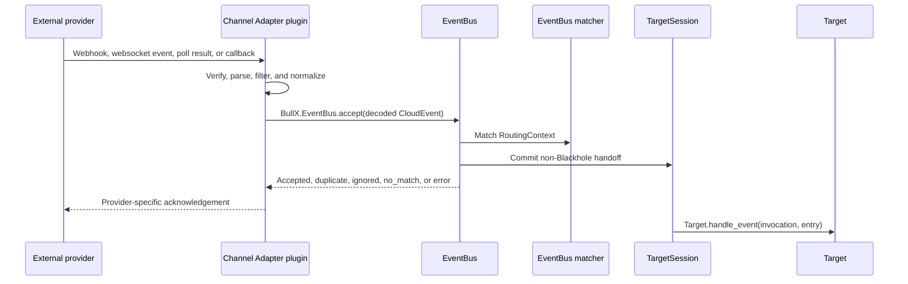

# Channel Adapter

A Channel Adapter is a trusted plugin-provided transport boundary. It connects
one external system to BullX, verifies and parses provider input, normalizes
provider occurrences into decoded CloudEvents JSON, calls
`BullX.EventBus.accept/2`, and optionally exposes provider delivery or live
stream transport. It does not evaluate Event Routing Rules, create
TargetSessions, append TargetSession side-channel entries, create Oban jobs,
invoke Targets, or persist business facts.

This document defines the common Channel Adapter contract used by
provider-specific plugins such as chat, webhook, SCM, CRM, approval, and
callback integrations. It specializes the plugin mechanics in
`docs/design-docs/Plugins.md` and the transport boundary named by
`docs/design-docs/eventbus/Core.md`.

## Scope

This design covers:

- the `:"bullx.event_bus.channel_adapter"` plugin extension point;
- the `BullX.EventBus.ChannelAdapter` behavior shape;
- inbound provider verification, parsing, filtering, normalization, and
  `EventBus.accept/2` handoff;
- IM source listen modes and the normalized addressed / ambient IM message
  Event types;
- CloudEvents identity, normalized payload, `routing_facts`, `reply_channel`,
  and `raw_ref` rules for adapters;
- provider acknowledgement timing and retry posture;
- optional outbound delivery and live stream transport consumption;
- telemetry, logging, security, privacy, and implementation handoff.

This design intentionally excludes:

- EventBus validation, route matching, TargetSession resolution, inbound
  side-channel append, dedupe internals, Oban job behavior, and Target dispatch.
- Event Routing Rule authoring, priority reorder, `RoutingContext` field
  projection, scope key encoding, and window policy.
- Concrete provider adapters, provider-specific source schemas, OAuth routes,
  webhook routes, provider command names, message rendering rules, or upload
  details.
- Principal matching rules, AuthZ policy, Governance, Capability authorization,
  business approval, Conversation persistence, Work persistence, and audit table
  schemas.
- Plugin source configuration schemas, connectivity checks, redacted setup UI
  projections, and provider-specific listener supervision.
- Runtime plugin installation, hot enablement, hook priority, plugin
  dependency graphs, or plugin-specific persistence tables.

## Goals

- Keep provider integrations outside BullX core modules.
- Give future adapter plugins one small, typed Channel Adapter contract.
- Keep Channel Adapters transport-only while still allowing provider-specific
  parsing, signature verification, acknowledgement timing, and outbound
  transport.
- Make provider redelivery idempotent by requiring stable CloudEvents
  `(source, id)` values before EventBus handoff.
- Keep raw provider payloads, credentials, tokens, and private user content out
  of logs, telemetry, public error details, and routing facts.
- Keep plugin-host behavior simple: compile-time trusted plugins, restart
  required enablement, reconstructible registry state, and ordinary OTP child
  supervision.

## Non-goals

- Do not create a second Event routing pipeline in the plugin host or adapter
  layer.
- Do not let adapters inspect or modify Event Routing Rules, TargetSession
  runtime rows, Target internals, AIAgent reasoning, Workflow state, Work,
  Conversation, ApprovalRequest, ChildRun, Brain, Budget, or Artifact records.
- Do not route on raw provider payloads, CloudEvents extension attributes,
  `subject`, or provider-specific nested carrier names.
- Do not persist raw provider payloads as EventBus runtime truth.
- Do not add adapter-specific tables unless a provider-specific design doc
  proves the need.
- Do not require every provider adapter to support outbound delivery, streaming,
  login, attachments, slash commands, or long-lived listener processes.
- Do not make EventBus defend against arbitrary malicious code inside an enabled
  plugin. Enabled plugins run inside the BullX trust boundary.

## Design

Channel Adapters are plugin contributions. EventBus owns the adapter extension
contract and Event acceptance semantics. The plugin host discovers adapter
declarations and the plugin runtime consumes enabled declarations for provider
listener supervision.



The adapter returns provider acknowledgements according to the provider
protocol. EventBus returns validation, matching, and runtime handoff results,
but EventBus does not decide whether a webhook HTTP response should be `200`, a
websocket offset should be committed, a provider retry should be requested, or a
callback should receive an immediate provider response.

## Plugin extension point

Provider plugins declare Channel Adapters through the typed extension point
`:"bullx.event_bus.channel_adapter"`.

Example plugin declaration:

```elixir
defmodule Feishu.Plugin do
  use BullX.Plugins.Plugin

  @impl BullX.Plugins.Plugin
  def extensions do
    [
      %{
        point: :"bullx.event_bus.channel_adapter",
        id: "feishu",
        module: Feishu.ChannelAdapter,
        opts: %{provider: "feishu"}
      }
    ]
  end

  @impl BullX.Plugins.Plugin
  def config_modules, do: [Feishu.Config]
end
```

The extension `id` is the adapter id. It must match
`data.channel.adapter` in normalized Events produced by that adapter. The
adapter id must be stable, lowercase, and safe for configuration keys,
telemetry metadata, Principal channel-actor references, and Event Routing Rule
matching.

Runtime code must use adapter modules only from enabled plugins. The plugin
registry may contain disabled plugin declarations, but disabled adapters must
not be invoked by EventBus-owned adapter lookup, provider callback wrappers,
delivery helpers, or stream consumers.

## Adapter behavior

`BullX.EventBus.ChannelAdapter` is the subsystem-owned behavior implemented by
adapter modules. The behavior should stay small enough for chat, webhook,
polling, SCM, CRM, approval, and callback providers to implement without
inheriting unrelated features.

Enabled adapter plugins are trusted code. EventBus validates the decoded
CloudEvent passed to `accept/2`; it does not sandbox adapter modules, police
their internal configuration model, or sanitize every provider-specific value
they choose to keep inside plugin-owned code.

The minimal callback shape is:

```elixir
@callback normalize_inbound(source :: map(), provider_input :: term()) ::
            {:ok, decoded_cloud_event :: map()}
            | :ignore
            | {:error, safe_error :: map()}
```

Optional transport callbacks are provider delivery surfaces. EventBus core does
not call them during Event acceptance.

```elixir
@callback deliver(source :: map(), reply_channel :: map(), outbound :: map(), opts :: keyword()) ::
            {:ok, map()} | {:error, safe_error :: map()}

@callback consume_stream(source :: map(), reply_channel :: map(), stream_id :: String.t(), opts :: keyword()) ::
            :ok | {:error, safe_error :: map()}

@callback capabilities() :: map()

@optional_callbacks capabilities: 0, deliver: 4, consume_stream: 4
```

An implementation may split these callbacks across internal modules, but the
extension module remains the public adapter contract. EventBus owns contract
validation and the `accept/2` boundary. Adapter-owned inbound wrappers call
`normalize_inbound/2` before handing decoded CloudEvents to `accept/2`; provider
listener supervision remains a plugin host or plugin runtime responsibility.

### Capabilities

`capabilities/0` is optional descriptive metadata. It may help setup UI,
diagnostics, or tests, but it does not grant permission to send messages or call
provider APIs.

Example shape:

```elixir
%{
  inbound_modes: [:webhook, :websocket],
  outbound_ops: [:send, :edit, :stream],
  content_kinds: [:text, :image, :audio, :video, :file],
  features: [:signature_verification, :reply, :threads],
  im_listen_modes: [:addressed_only, :all_messages]
}
```

Adapters may omit unsupported features. The absence of an outbound capability
must fail closed at the caller boundary rather than falling back to an unsafe
provider call.

### Source configuration

A source is a plugin-owned provider entry point inside one BullX Installation.
A source might represent one Feishu app, one Slack workspace bot, one GitHub
organization webhook, one CRM webhook endpoint, or one polling credential
profile.

The common configuration convention is:

```text
bullx.plugins.<plugin_id>.eventbus_sources
bullx.plugins.<plugin_id>.credentials
```

The exact source schema, credential references, connectivity checks, redacted
operator projection, and listener child specs are plugin responsibilities. The
Channel Adapter contract only requires that the runtime `source` value passed
to adapter callbacks contains enough plugin-defined data to normalize provider
input and delivery targets.

The source `id` should be the stable adapter-local source id. It becomes
`data.channel.id` in normalized Events and `channel_id` in Principal
channel-actor references. It is not a provider user id, chat id, thread id, bot
id, webhook secret id, OAuth client id, or display label.

Provider credentials live in secret plugin configuration, usually in
`bullx.plugins.<plugin_id>.credentials`. Adapter code may use plaintext
credentials inside the BEAM trust boundary. It must not copy credentials into
Events, CloudEvents, `routing_facts`, `reply_channel`, Oban job args, stream
metadata, or allowlisted telemetry/log metadata.

For IM-style sources, source configuration may choose how much of a shared
conversation the adapter listens to:

```text
im_listen_mode = addressed_only | all_messages
```

`addressed_only` means the source emits IM Events only when the provider
occurrence is explicitly addressed to the BullX Agent surface, such as a direct
message to the bot, an explicit bot mention in a group, or an equivalent
provider-native directed interaction. `all_messages` means the source also emits
ordinary group or channel messages that the bot can observe but that do not
mention it.

The listen mode is transport admission. It does not decide the Event Routing
Rule, TargetSession, AIAgent response policy, memory behavior, or whether a
message deserves a reply. Those decisions remain downstream of EventBus
acceptance.

### Source runtime supervision

Long-lived provider listeners are plugin children. A plugin may return a
supervisor from `children/1` that starts one supervised child per enabled
source, or it may return no children when the adapter only receives Phoenix
webhook calls or explicit poll invocations.

The plugin host supervises enabled plugin children. EventBus core does not
supervise provider websocket clients, webhook controllers, pollers, SDK
consumers, OAuth callbacks, command normalizers, or provider caches.

Source process state is reconstructible. If a listener restarts, the adapter
reloads source configuration, reconnects to the provider, rebuilds provider SDK
state, and continues from provider-supported retry, offset, or websocket resume
mechanisms. Adapter process state must not become business truth.

## Inbound normalization

`normalize_inbound/2` normalizes one provider occurrence into one decoded
CloudEvents JSON object, returns `:ignore`, or returns a safe error. Provider
batch requests must be split by adapter-owned code before calling
`normalize_inbound/2`, or handled by provider-specific wrapper code that calls
`EventBus.accept/2` once per occurrence.

The adapter must verify provider authenticity before accepting provider data as
trusted input. For HTTP webhooks, signature verification may require the raw
request body; the adapter must verify before lossy parsing or mutation. For
websocket and polling providers, the adapter must authenticate the connection or
request according to the provider protocol before publishing Events.

Adapters must produce a decoded string-keyed JSON-neutral map accepted by
`BullX.EventBus.accept/2`. They must not pass binary JSON, atom-keyed maps,
structs, `DateTime` structs, tuples, functions, provider SDK structs, or
arbitrary Elixir terms into EventBus.

### CloudEvents attributes

Adapters produce CloudEvents structured JSON with these rules:

- `specversion` is `"1.0"`.
- `id` is the stable provider occurrence id inside the adapter `source`.
- `source` is a stable URI-like string that includes the adapter id and source
  id with enough provider context to make `(source, id)` unique inside the
  Installation.
- `type` is the normalized BullX Event type, such as
  `bullx.im.message.addressed`, `bullx.im.message.ambient`,
  `bullx.message.edited`, `bullx.action.submitted`, `bullx.command.invoked`,
  `bullx.trigger.fired`, or `bullx.childrun.completed`.
- `time` is the provider occurrence time when the provider supplies a trusted
  timestamp. Otherwise, `time` is the adapter receive time.
- `datacontenttype` is `"application/json"`.
- `data` is the BullX normalized payload defined by
  `docs/design-docs/eventbus/Core.md`.

The adapter must generate the same `(source, id)` for provider redelivery of
the same occurrence. It must not use a random UUID, current timestamp, receive
attempt count, or EventBus-generated id as the CloudEvents `id`. Provider edit
or callback events that represent distinct occurrences should include a stable
provider edit timestamp, version, callback id, or action id in `id`.

`subject` is optional display/debug text. Adapters must not depend on `subject`
for machine routing. Any provider detail needed for matching belongs in
`data.routing_facts` or another explicit normalized field exposed by
`RoutingContext`.

CloudEvents extension attributes may carry JSON-neutral and NUL-free diagnostic
or trace values, but EventBus does not expose extension attributes to the
matcher. If an extension value affects routing, the adapter must copy the
normalized value into `data.routing_facts` or another explicit normalized
field.

### Normalized payload

Adapters fill the EventBus normalized payload fields from provider data:

| Field | Adapter responsibility |
| --- | --- |
| `data.content` | Produce at least one content block. Machine-only Events may synthesize a short text block. |
| `data.channel.adapter` | Set to the adapter id from the extension declaration. |
| `data.channel.id` | Set to the configured source id. |
| `data.scope.id` | Set to the provider conversation, room, repository, object, or callback scope. |
| `data.scope.thread_id` | Set only when the provider has a separate thread dimension under `scope.id`; otherwise `null`. |
| `data.actor` | Normalize the external actor as evidence, not permission. |
| `data.refs` | Record stable provider object references needed for later lookup or audit context. |
| `data.reply_channel` | Store transport hints for possible replies or callbacks. |
| `data.routing_facts` | Store normalized matching facts only. |
| `data.raw_ref` | Store a safe reference to provider raw data, or `null`; never inline raw payload. |

Adapters must keep provider ids as strings when JSON number precision could
change the value. Snowflakes, large integer ids, repository ids, issue ids, and
message ids should be JSON strings unless the provider contract proves that a
JSON number is safe.

`data.actor.principal_ref` is optional. An adapter may set it only from a
Principal subsystem result or another trusted BullX identity reference. An
adapter must not invent Principal ids from provider ids. When no Principal is
resolved, the adapter sets `principal_ref` to `null` and leaves downstream
Principal, AuthZ, Governance, Capability, Target, and business layers to decide
permission.

`data.reply_channel` is a transport hint, not authorization. It may include
provider channel ids, thread ids, reply target ids, source ids, or opaque reply
handles only when those values are safe to store in weak EventBus runtime state.
If a provider interaction token, callback URL, ephemeral response handle, or
reply handle acts as a bearer credential, adapters must store only a safe
reference or adapter-private handle, not the secret value itself. Secrets,
bearer tokens, OAuth codes, private keys, provider access tokens, callback URLs,
and ephemeral response credentials must not enter `reply_channel`,
`routing_facts`, CloudEvents, Oban args, stream metadata, telemetry, or logs.

Adapter-private `reply_channel` keys may be preserved for transport use, but
they are not matcher or scope fields unless `Core.md` and `Matcher.md` explicitly
define them. Provider data needed for routing belongs in `data.routing_facts` or
another explicit normalized field exposed by `RoutingContext`.

`data.routing_facts` is the only provider-specific matching surface. Keys should
use lower snake case or another CEL/path-safe convention. Values must be
JSON-neutral, NUL-free, and normalized. `routing_facts` must not include raw
payloads, credentials, unbounded message bodies, attachment bytes, or arbitrary
provider SDK maps.

Useful `routing_facts` examples include:

- `provider_event_type`
- `provider_event_name`
- `connected_realm_ref`
- `im_listen_mode`
- `content_kind`
- `command_name`
- `command_namespace`
- `command_surface`
- `command_args_kind`
- `provider_command_id`
- `attention_reason`
- `callback_kind`
- `repository_full_name`
- `approval_action`

EventBus rules may match these facts, but the adapter still does not choose the
Target or TargetSession.

### IM message Event types

IM adapters normalize message occurrences into two message Event types:

- `bullx.im.message.addressed`
- `bullx.im.message.ambient`

`bullx.im.message.addressed` is for IM messages explicitly addressed to BullX.
Direct messages to the bot and group messages that mention the bot both use this
type. The difference between a DM and a group mention belongs in
`data.channel`, `data.scope`, `data.reply_channel`, and safe routing facts, not
in a separate AIAgent runtime mode.

`bullx.im.message.ambient` is for ordinary group or channel messages received
because the source uses `im_listen_mode = all_messages`. It represents shared
conversation context, not a request for BullX to answer in the originating
conversation surface.

The adapter must not infer AIAgent behavior from ambient messages. It only
normalizes the Event. AIAgent-owned design decides whether an ambient IM Event
is stored as context, ignored, or used to trigger an internal intervention
check.

An IM adapter should ignore unaddressed group messages before EventBus handoff
when `im_listen_mode = addressed_only`. When `im_listen_mode = all_messages`,
the same provider occurrence should be normalized as
`bullx.im.message.ambient` unless the occurrence explicitly addresses the bot,
in which case it should be normalized as `bullx.im.message.addressed`.

Command-shaped inbound input has two distinct business surfaces:

- provider-explicit command input, where the upstream system already marks the
  occurrence as a slash command, application command, UI command, button
  callback, or interactive command;
- accepted text-command input, where the provider sends an ordinary message but
  the adapter's attention policy and command grammar classify a leading
  `/command` token as addressed to BullX.

Provider-explicit command input and accepted text-command input may both be
normalized as `type = "bullx.command.invoked"`. Ordinary text that happens to
contain `/` remains a message Event unless the provider command surface or the
adapter command grammar classifies it as a command. A file path, code snippet,
quoted sentence, or unaddressed group message must not become a command merely
because a slash appears in the text.

Channel adapters may also own adapter-local channel commands that are not
EventBus command Events. `/preauth` and `/web_auth` are the default examples:
they start at the provider channel boundary, may need to run before Principal
binding exists, and may rely on provider-private reply or interaction handles.
Adapters handle those commands through Principal/Auth services and safe provider
replies without choosing an EventBus Target. `/command` and `/status` are not
adapter-local commands; when accepted as commands they normalize to
`bullx.command.invoked` and route through EventBus system command routes.

For command Events, the adapter puts only routing-relevant command facts in
`data.routing_facts`, such as `command_name`, `command_namespace`,
`command_surface`, `command_args_kind`, `provider_command_id`, and
`attention_reason`. `command_name` is the normalized command name without the
leading slash or provider bot suffix. For commands with localized aliases,
`command_name` is the canonical English command name used by EventBus routing,
not the localized token. English canonical command names remain accepted in every
locale; localized aliases are accepted only when the adapter command grammar or
provider command surface maps them to the canonical command. For example,
Chinese `/状态` and English `/status` both become `command_name = "status"`.
`command_surface` distinguishes surfaces such as `provider_native`,
`slash_text`, `ui_command`, `button_callback`, or `interactive_command`. Command
argument content belongs in normalized content or safe command-specific fields
only when a command design defines that shape; routing facts should stay small
and matcher-oriented.

The adapter remains a transport boundary for EventBus command input. It does not
select a Command Target handler, inspect Event Routing Rules, or write Command
Target business facts. Adapter-local channel commands are limited to channel
activation/login flows such as `/preauth` and `/web_auth`; they must not become a
general command routing path. A provider adapter is not required to support
provider-native slash commands or text-command parsing. If a source lacks
command support, setup or UI should fail closed for that feature, or ordinary
provider messages may enter EventBus as normal message Events and follow ordinary
message routing rules.

Provider-native command redelivery must reuse the same stable CloudEvents
`(source, id)` for the same command occurrence. The adapter must not use a
random UUID, receive timestamp, retry count, or generated command-processing id
as the CloudEvents `id`.

### Filtering and ignore behavior

Adapters may ignore provider occurrences before calling EventBus when the
occurrence is provider noise, transport handshake traffic, a self-sent bot
message, an unsupported provider surface, a malformed non-retryable provider
payload, or an event that failed authenticity checks. Ignored occurrences should
emit safe adapter telemetry with an ignore reason when operationally useful.

Operator business routing preferences belong in Event Routing Rules. If a
provider occurrence is a valid BullX Event and the only question is which
Target should receive it, the adapter should normalize it and let EventBus match
a rule, including a possible Blackhole rule.

Adapters must avoid feedback loops. Messages, edits, or stream updates produced
by the same adapter must not re-enter EventBus as new user Events unless a
provider-specific design explicitly defines that loop and its idempotency.

## Acceptance handoff and acknowledgement

Adapters call:

```elixir
BullX.EventBus.accept(decoded_cloud_event, opts)
```

The adapter may add safe `opts` for diagnostics, source id, receive timestamp,
or test instrumentation when EventBus exposes such options. Event payload,
provider raw payload, credentials, tokens, or large content must not enter
`opts`.

For provider redelivery, the adapter relies on EventBus dedupe through the
CloudEvents `(source, id)` pair. Adapter-local dedupe is allowed only for
provider-side side effects that happen before EventBus handoff, such as direct
provider acknowledgement state, native interaction defer acknowledgements, or
provider SDK resume offsets.

Provider acknowledgement rules are adapter-owned:

- A provider occurrence that EventBus returns as `:accepted`, `:duplicate`, or
  `:accepted_ignored` can usually be acknowledged to the provider.
- An adapter-local `:ignore` can usually be acknowledged when retry would not
  produce a different Event.
- `InvalidEvent` and `:no_match` are terminal from EventBus's perspective, but
  the adapter decides whether the provider needs an acknowledgement, a safe
  failure response, or no response.
- `AppendFailed` and infrastructure exceptions may request provider retry when
  the provider supports retry and the error is transient.
- Provider protocols that require an immediate response may receive a safe
  response before Target execution because Target execution is outside the
  EventBus acceptance transaction.

Adapters must never wait for Target execution, output streaming, business
persistence, or TargetSession completion before acknowledging an inbound
provider event unless a provider-specific design deliberately accepts that
transport risk.

## Outbound delivery and stream transport

Adapters may expose outbound transport callbacks when the provider supports
sending, editing, reacting, callback replies, or stream-style updates. These
callbacks are transport capacity only. They do not approve the side effect.

A Target, Workflow, Capability, Governance-approved action, or business layer
must decide whether outbound delivery is allowed. When the adapter receives an
outbound request, it assumes upstream code has already performed Principal,
AuthZ, Budget, policy, approval, and business-record checks required by that
action.

Outbound delivery uses `reply_channel` or another upstream-selected transport
target. The adapter validates the provider target, renders content into
provider-supported shapes, applies provider rate-limit behavior, and returns a
safe result or safe error. Provider-specific limitations should fail closed or
degrade explicitly with warnings; adapters must not silently drop important
content.

If an adapter exposes live provider streaming, it consumes the stream APIs
defined in `docs/design-docs/eventbus/StreamingOutput.md`. The adapter reads
buffered chunks, follows pointer notifications, emits provider-specific live
updates, and treats client or provider connection disconnect as a transport
consumer disconnect. It must not inspect Target internals, create stream
chunks, write Conversation transcripts, or infer business completion from
stream status.

## Error mapping

Adapter errors are provider-owned safe values. The common shape may be a
string-keyed JSON-neutral map with a short `kind`, an operator-facing `message`,
and optional `details`, but EventBus does not define a global adapter error
taxonomy. Provider-specific designs may add their own kinds when they need
operator precision.

Adapters must not invent EventBus core errors such as
`%BullX.EventBus.InvalidEvent{}` or `%BullX.EventBus.AppendFailed{}`. They may
return those structs only when `BullX.EventBus.accept/2` returned them.

## Telemetry and logging

Adapter telemetry uses a small Channel Adapter namespace:

- `[:bullx, :event_bus, :adapter, :source, :started]`
- `[:bullx, :event_bus, :adapter, :source, :stopped]`
- `[:bullx, :event_bus, :adapter, :event, :received]`
- `[:bullx, :event_bus, :adapter, :event, :ignored]`
- `[:bullx, :event_bus, :adapter, :event, :normalized]`
- `[:bullx, :event_bus, :adapter, :event, :accept, :start]`
- `[:bullx, :event_bus, :adapter, :event, :accept, :stop]`
- `[:bullx, :event_bus, :adapter, :event, :accept, :exception]`
- `[:bullx, :event_bus, :adapter, :delivery, :start]`
- `[:bullx, :event_bus, :adapter, :delivery, :stop]`
- `[:bullx, :event_bus, :adapter, :delivery, :exception]`
- `[:bullx, :event_bus, :adapter, :stream, :start]`
- `[:bullx, :event_bus, :adapter, :stream, :stop]`
- `[:bullx, :event_bus, :adapter, :stream, :exception]`

Telemetry and logs are built from an allowlist. Useful metadata includes adapter
id, plugin id, source id, provider event type, normalized Event type, hashed
Event source, hashed Event id, scope id, thread id, actor external id hash,
provider request id, ignore reason, EventBus acceptance status, rule id,
TargetSession id, stream id, offset, diagnostic code, retry delay, and provider
status code.

Runtime code must construct telemetry from those fields directly. It must not
pass Event payloads, raw provider payloads, credentials, tokens, full
`reply_channel`, attachment bytes, or stream chunks into telemetry metadata.

Provider-specific modules may emit additional namespaced telemetry under the
same prefix when provider operations need more detail. Extra telemetry must use
the same allowlist rule.

## Security, privacy, and governance

Enabled adapter plugins are trusted code selected by the operator. EventBus
does not sandbox them or provide unlimited guardrails around bad plugin
behavior. Plugin authors and system administrators are responsible for provider
credential handling, provider protocol correctness, and plugin-specific
security posture.

Adapters treat external identity as evidence. They do not grant permission,
create authorization, approve side effects, or decide business success.

Provider authenticity checks fail closed. A webhook signature failure, invalid
provider challenge, rejected token, mismatched app id, expired callback token,
or unsupported provider handshake must not call `EventBus.accept/2`.

Provider secrets use `BullX.Config` secret storage. Plaintext credentials may
exist in the BEAM trust boundary while a source runs. Adapter code must not
place credentials into Events, `routing_facts`, `reply_channel`, Oban args,
stream metadata, or allowlisted telemetry/log metadata.

Adapters may call `BullX.Principals` APIs for channel-actor activation,
channel-auth login, or trusted identity resolution when a provider-specific
design defines that behavior. Principal resolution does not make the adapter an
authorization authority; downstream Principal, AuthZ, Governance, Capability,
Target, and business layers still decide permissions and side effects.

Provider raw payload retention is plugin-specific. The default adapter contract
keeps only normalized CloudEvents and safe references in EventBus runtime state.
If a provider-specific design stores raw payloads, it owns retention, redaction,
and access control outside EventBus core.

## Risks and tradeoffs

The adapter contract favors one typed extension point over a generic hook
pipeline. This keeps routing and execution semantics inside EventBus and
TargetSession, but each provider plugin still owns provider-specific runtime
shape, SDK usage, and configuration validation.

Plugin-owned source configuration avoids a central adapter source table and a
large common adapter behavior. The tradeoff is that setup UI and operator
tooling use provider-specific contracts instead of one universal source schema.

Adapter edge filtering is useful for provider noise and self-loop prevention,
but it can hide Events before Event Routing Rules see them. Provider-specific
designs should keep edge filters limited to transport admission and push
operator business routing choices into Event Routing Rules.

Outbound callbacks live beside inbound callbacks because provider transports
often share credentials, source ids, reply targets, and SDK clients. This does
not make EventBus a business side-effect authority. Authorization and durable
business records remain upstream of adapter delivery.

## Implementation handoff

### Goal

Implement the common Channel Adapter contract so provider plugins can register
trusted transport adapters, normalize provider input into CloudEvents, call
`BullX.EventBus.accept/2`, expose optional transport delivery, and stay outside
routing, TargetSession, Target, and business truth.

### Context pointers

- `AGENTS.md` defines repository rules, design-doc hygiene, plugin-first
  extension expectations, and verification expectations.
- `docs/Architecture.md` defines Installation, Connected Realm, EventBus,
  Event Routing Rule, TargetSession, Target, Principal, Capability, and Adapter
  boundaries.
- `docs/design-docs/Plugins.md` defines plugin discovery, enabled plugin
  configuration, extension declarations, plugin config modules, and plugin
  supervision.
- `docs/design-docs/Configuration.md` defines the `BullX.Config` runtime
  configuration and secret storage layer used by plugin-owned source and
  credential configuration.
- `docs/design-docs/eventbus/Core.md` defines `BullX.EventBus.accept/2`,
  CloudEvents validation, normalized payload shape, adapter boundary, and fake
  adapter boundary tests.
- `docs/design-docs/eventbus/Matcher.md` defines `RoutingContext`,
  `routing_facts`, priority, Blackhole, and scope/window policy.
- `docs/design-docs/eventbus/Persistence.md` defines EventBus runtime state and
  confirms that side-channel rows are weak runtime state.
- `docs/design-docs/eventbus/StreamingOutput.md` defines stream buffer APIs that
  transport adapters may consume.
- `docs/design-docs/Principal.md` defines channel-actor evidence and
  Principal-owned matching.

### Constraints

- Use the plugin extension point `:"bullx.event_bus.channel_adapter"`.
- Execute adapter modules only for enabled plugins.
- Treat enabled adapter plugins as trusted code inside the BullX runtime.
- Keep source and credential configuration plugin-owned.
- Keep provider credentials in secret config storage and out of Events,
  `routing_facts`, `reply_channel`, Oban args, stream metadata, and allowlisted
  telemetry/log metadata.
- Accept only decoded string-keyed JSON-neutral CloudEvents maps at the
  EventBus boundary.
- Use stable CloudEvents `(source, id)` values for provider redelivery
  idempotency.
- Normalize provider-specific matching data into `data.routing_facts`; do not
  route on raw provider payloads, `subject`, CloudEvents extensions, or nested
  carrier names.
- Treat provider acknowledgements as adapter-owned transport behavior.
- Treat outbound delivery and stream transport as optional provider capacity,
  not authorization.
- Do not add dependencies unless a provider-specific adapter design explicitly
  requires and justifies them.

### Tasks

1. Add the adapter behavior and extension lookup.
   - Owns: `lib/bullx/event_bus/channel_adapter.ex` and adapter registry
     helpers.
   - Depends on: Plugin host implementation.
   - Acceptance: EventBus can list enabled `:"bullx.event_bus.channel_adapter"`
     declarations, validate the required inbound callback, reject duplicate
     adapter ids through plugin registry behavior, and ignore disabled adapters
     at runtime.

2. Add a fake Channel Adapter.
   - Owns: test support modules.
   - Depends on: Task 1.
   - Acceptance: the fake adapter registers through the plugin extension point,
     normalizes a provider input into a decoded CloudEvent, calls
     `BullX.EventBus.accept/2`, and proves the adapter does not route, create
     TargetSessions, append side-channel entries, or create Oban jobs.

3. Add inbound normalization helpers when useful.
   - Owns: adapter support modules and tests.
   - Depends on: EventBus Core validation modules.
   - Acceptance: helpers build CloudEvents with stable `source` and `id`,
     string-keyed JSON-neutral payloads, normalized `content`, `channel`,
     `scope`, `actor`, `refs`, `reply_channel`, `routing_facts`, and `raw_ref`.
     IM helpers normalize direct messages, bot mentions, and equivalent
     provider-directed interactions as `bullx.im.message.addressed`, and
     normalize unmentioned group or channel messages as
     `bullx.im.message.ambient` only when the source uses
     `im_listen_mode = all_messages`.
     Command-shaped inputs normalize to `bullx.command.invoked` only when the
     provider command surface or adapter command grammar classifies them as
     EventBus commands; `/preauth` and `/web_auth` may be handled as
     adapter-local channel activation/login commands; ordinary text that merely
     contains `/` remains a message Event.

4. Add acknowledgement and error handling tests.
   - Owns: fake adapter tests and provider-agnostic adapter tests.
   - Depends on: Task 2.
   - Acceptance: accepted, duplicate, accepted_ignored, invalid, no_match,
     append_failed, adapter ignore, provider retry, and provider terminal
     acknowledgement paths are covered without waiting for Target execution.

5. Add optional outbound delivery and stream-consumer contracts.
   - Owns: behavior optional callbacks, fake adapter tests, and stream transport
     tests when stream APIs exist.
   - Depends on: Task 1 and `StreamingOutput.md` implementation.
   - Acceptance: outbound callbacks are optional provider capacity, assume
     upstream authorization, and stream consumers use EventBus stream APIs
     without inspecting Target internals or writing transcripts.

6. Add telemetry and log-safety tests.
   - Owns: telemetry assertions and redaction tests.
   - Depends on: Tasks 2 through 5.
   - Acceptance: adapter telemetry uses the namespaced events in this document,
     and metadata is constructed from the allowlisted fields.

### Stop and ask

Implementation should stop and ask when any of these questions appears:

- A provider needs routing on a fact that cannot be normalized into
  `routing_facts` or another explicit `RoutingContext` field.
- A provider requires raw payload persistence rather than a safe `raw_ref`.
- A provider acknowledgement must wait for Target execution or business
  persistence.
- A provider source needs durable offset, subscription, or listener state that
  cannot be reconstructed from provider APIs and plugin configuration.
- An outbound delivery path needs authorization, approval, or business-record
  decisions inside the adapter.
- A plugin needs runtime enablement, hot unload, extension priority, untrusted
  plugin sandboxing, or plugin-specific persistence tables.

### Done when

Implementation is complete when tests cover:

- plugin extension registration for enabled and disabled adapters;
- adapter behavior callback validation for the required inbound callback;
- inbound authenticity failure, adapter ignore, safe error, and normalization;
- stable CloudEvents `(source, id)` for provider redelivery;
- decoded string-keyed JSON-neutral Event handoff through
  `BullX.EventBus.accept/2`;
- normalized `content`, `channel`, `scope`, `actor`, `refs`, `reply_channel`,
  `routing_facts`, and `raw_ref` behavior;
- IM `im_listen_mode = addressed_only` ignores unmentioned group/channel
  messages before EventBus handoff, while `im_listen_mode = all_messages`
  emits them as `bullx.im.message.ambient`;
- direct messages, group mentions, and equivalent provider-directed IM
  interactions normalize to `bullx.im.message.addressed`;
- provider-native commands and accepted slash-text commands normalize to
  `bullx.command.invoked`, while ordinary text, paths, code snippets, and
  unaddressed slash text remain message Events or are ignored by transport
  admission;
- adapter-local channel activation/login commands such as `/preauth` and
  `/web_auth` do not enter EventBus command routing;
- no adapter-owned EventBus routing, TargetSession creation, side-channel
  append, Oban job creation, or Target invocation; business persistence in the
  adapter is limited to explicit channel activation/login command flows;
- provider acknowledgement behavior for accepted, duplicate, accepted_ignored,
  invalid, no_match, append_failed, and ignored occurrences;
- optional outbound delivery and stream transport boundaries when supported;
- allowlisted adapter telemetry and logs.

Verification commands:

```bash
mix format --check-formatted
# focused tests for plugin registration, adapter normalization, fake adapter
# boundary, acknowledgement behavior, outbound transport, streaming transport,
# and telemetry when those modules exist
MIX_ENV=test mix compile --warnings-as-errors
bun precommit
```
