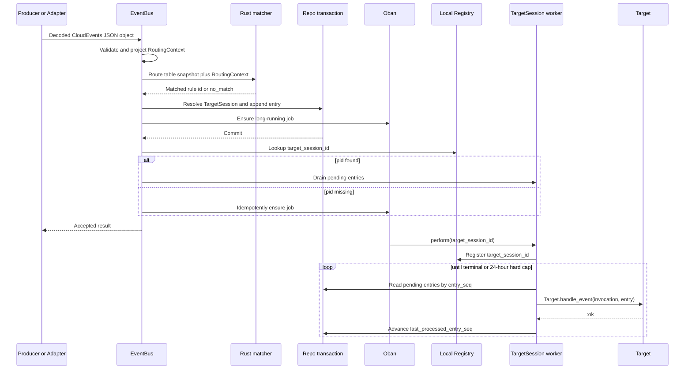

# EventBus core

EventBus core is the CloudEvents-to-TargetSession handoff boundary for BullX.
It accepts decoded string-keyed JSON-neutral CloudEvents, validates the BullX
normalized payload, projects a matcher-only `RoutingContext`, matches the first
Event Routing Rule by globally unique priority, and commits non-Blackhole Events
into a TargetSession side channel. Every non-Blackhole TargetSession is carried
by one alive long-running Oban job. Blackhole accepts the Event without creating
a TargetSession.

EventBus core owns delivery and execution-window runtime state, not business
truth. Event Routing Rules are durable configuration. TargetSession records and
inbound side-channel entries are weak PostgreSQL runtime state. Conversations,
Work, ApprovalRequest, ChildRun, Brain, Budget, Artifact, audit records, and
other domain records own committed business facts.

TargetSession output streaming is split into
`docs/design-docs/eventbus/StreamingOutput.md`. This document may name that
boundary, but it does not define Redis stream buffers, stream resume/follow APIs,
or Gateway stream transport consumption.

Matcher details are split into `docs/design-docs/eventbus/Matcher.md`.
Persistence details are split into `docs/design-docs/eventbus/Persistence.md`.
This document links to those contracts instead of repeating their full schemas
and algorithms.

## Scope

This document defines the current intended design for EventBus core:

- Event acceptance and the decoded CloudEvents input contract.
- The BullX normalized payload shape required before routing.
- `RoutingContext`, `RoutingTable`, Event Routing Rule, scope, and window
  contracts as linked matcher details.
- TargetSession identity and reuse.
- The acceptance transaction, weak dedupe, side-channel append, and progress
  cursor.
- The alive-session Oban TargetSession loop.
- Target invocation, close, fail, and row-level serialization.
- Public EventBus API result shapes.
- PostgreSQL persistence and runtime cleanup as linked persistence details.
- Gateway acceptance boundary, telemetry, security, privacy, and implementation
  handoff.

This document intentionally excludes:

- TargetSession output stream buffer storage, resume/follow behavior, producer
  lease behavior, stream API details, and stream transport consumption.
- AIAgent prompts, Agentic Loop internals, LLM calls, compression, tool loops,
  and Brain ingestion.
- Workflow Node contracts, Wait Node behavior, approval-node behavior,
  parallelism, and Workflow storage.
- Gateway outbound delivery, provider adapter inventory, login, signature
  verification details, uploads, and provider commands.
- Conversation, Work, ApprovalRequest, ChildRun, Brain, Budget, Artifact, audit,
  and domain table schemas.
- Route fan-out. If one Event must drive multiple business paths, the matched
  Target expresses that fan-out explicitly.
- A durable inbound Event log, a durable dedupe ledger, a complex policy
  language, or an operator UI.
- Arbitrary window expressions, fixed bucket windows, and batch Target
  invocation.

## Execution model

The non-Blackhole path is a transactional handoff from a decoded CloudEvent to a
TargetSession side-channel entry.

```text
BullX.EventBus.accept/2
  -> validate CloudEvents shape and BullX normalized payload
  -> project RoutingContext
  -> match the combined route-table snapshot with the Rust matcher by priority ASC
  -> resolve the first matched non-Blackhole rule
  -> create or reuse a TargetSession runtime row
  -> append a target_session_entries row
  -> ensure the long-running TargetSession Oban job exists
  -> commit the transaction
  -> optionally nudge the local alive TargetSession process
  -> return the accepted result
```

Acceptance happens at transaction commit. Validation, projection, and rule match
are not acceptance. Target execution, output streaming, business persistence, and
delivery of a local nudge are not part of the acceptance transaction.

The post-commit local nudge is only a latency optimization. An alive
TargetSession job periodically checks for pending entries while idle. If the
local Registry does not contain a process for the `target_session_id`, EventBus
may idempotently ensure or enqueue the associated TargetSession Oban job.
Correctness must not depend on local nudge delivery, cross-node nudge delivery,
Redis, or an inbound broker.

Blackhole is the terminal drop path. If the first matched rule targets
Blackhole, EventBus returns `accepted_ignored`, does not create a TargetSession,
does not append a side-channel entry, does not create an Oban job, and does not
continue to fallback or lower-priority rules.

The route-table snapshot is the ordered combination of code-owned built-in
routes and active PostgreSQL `event_routing_rules`. Built-in system command
routes use reserved negative priorities and are not persisted in PostgreSQL.
Database-owned rules keep positive priorities and are managed by the Event
Routing Rule writer.



The diagram shows one accepted Event becoming one side-channel entry. It does
not show business persistence because the Target and business layers own
business facts.

## Event acceptance

`BullX.EventBus.accept/2` receives an already decoded JSON-neutral map. Every
object key must be a string. JSON-neutral values are strings, numbers, booleans,
`null`, lists, and string-keyed objects.

`accept/2` does not receive binary JSON, atom-keyed maps, structs, `DateTime`
structs, tuples, functions, or arbitrary Elixir terms. If BullX later needs a
binary JSON helper, that helper must be a separate public contract, such as
`accept_json/2`; it must not weaken the `accept/2` contract.

Gateway and adapters own HTTP body decoding and provider-protocol parsing. When
an Event arrives through CloudEvents structured mode, the HTTP `Content-Type`
should be `application/cloudevents+json`. The CloudEvents
`datacontenttype` attribute is still `application/json` because BullX `data` is
JSON.

The accepted Event must satisfy this CloudEvents contract:

- `specversion` is `"1.0"`.
- `id`, `source`, `type`, and `specversion` are present and are non-empty
  strings.
- `datacontenttype` is `"application/json"`.
- `time` is present, is a string RFC3339 timestamp, and is the Event occurrence
  time.
- `data` is a BullX normalized JSON object.

Accepted CloudEvents are written to PostgreSQL `jsonb`. EventBus validation
rejects non-JSON-neutral values and string values containing NUL (`\u0000`)
before handoff. Adapters must not pass provider values into EventBus when
PostgreSQL `jsonb` cannot represent those values.

The CloudEvents top-level `type` is the normalized Event type used for routing
and observability. EventBus does not route on nested carrier fields such as
`data.event`, `data.event.name`, `data.event.version`, `event_name`,
`event_kind`, or `event_version`.

The minimal normalized payload shape is:

```json
{
  "specversion": "1.0",
  "id": "external-stable-event-id",
  "source": "feishu://connected-realm/default",
  "type": "bullx.im.message.addressed",
  "subject": "optional-human-readable-debug-subject",
  "time": "2026-05-17T10:00:00Z",
  "datacontenttype": "application/json",
  "data": {
    "content": [
      {
        "kind": "text",
        "body": {
          "text": "..."
        }
      }
    ],
    "channel": {
      "adapter": "feishu",
      "id": "default"
    },
    "scope": {
      "id": "chat_or_room_or_domain_scope",
      "thread_id": null
    },
    "actor": {
      "id": "external_actor_id",
      "display": "Alice",
      "bot": false,
      "principal_ref": null
    },
    "refs": [],
    "reply_channel": {
      "adapter": "feishu",
      "channel_id": "default",
      "scope_id": "chat_or_room_or_domain_scope",
      "thread_id": null,
      "reply_to_external_id": "optional"
    },
    "routing_facts": {},
    "raw_ref": null
  }
}
```

The validator enforces this minimum payload contract:

- `data.channel`, `data.scope`, `data.actor`, `data.refs`,
  `data.reply_channel`, `data.routing_facts`, and `data.raw_ref` are required.
  Nested fields may use `null`, empty arrays, or empty objects where this
  section allows those values.
- `data.content` is a required non-empty list. Each block is an object with a
  non-empty string `kind` and a JSON object `body`. Machine-only Events may
  synthesize a text block so `content` remains non-empty.
- `data.channel.adapter` and `data.channel.id` are non-empty strings.
- `data.scope.id` is a non-empty string. `data.scope.thread_id` is a string or
  `null`.
- `data.actor.id` is a non-empty string. `data.actor.display` is a string or
  `null`. `data.actor.bot` is a boolean. `data.actor.principal_ref` is a string
  or `null`.
- `data.refs` is a list. Each reference object contains at least non-empty
  string `kind` and non-empty string `id`. Optional stable fields, such as
  `url` and `external_id`, may exist when they are JSON-neutral and NUL-free.
- `data.reply_channel` is `null` or an object. When it is an object, it may
  contain `adapter`, `channel_id`, `scope_id`, `thread_id`, and
  `reply_to_external_id`. EventBus stores these transport hints but does not
  send replies.
- `data.routing_facts` is an object. Keys are strings. Values are JSON-neutral
  and NUL-free. The field carries normalized matching facts only.
  `routing_facts` keys used by `match_expr` or `scope_fields` should use
  CEL/path-safe names, such as lower snake_case. Provider-specific arbitrary
  keys must be normalized before routing.
- `data.raw_ref` is `null` or a JSON-neutral reference. It must not inline the
  raw provider payload.

`subject` is only for display and debugging. Event Routing Rules must not parse
`subject` for machine routing, and `RoutingContext` does not expose `subject`.
If provider-specific detail affects routing, the adapter must normalize that
detail into `data.routing_facts` or another explicit BullX normalized field.

CloudEvents extension attributes may stay in the accepted `cloud_event` JSON
when their values are JSON-neutral and NUL-free. EventBus does not expose
extension attributes to `RoutingContext`, and the matcher does not route on
extension attributes. If an extension value affects routing, the adapter must
copy the normalized value into `data.routing_facts` or another explicit BullX
normalized field.

Normalized `type` examples include:

- `bullx.im.message.addressed`
- `bullx.im.message.ambient`
- `bullx.message.edited`
- `bullx.message.recalled`
- `bullx.reaction.changed`
- `bullx.action.submitted`
- `bullx.command.invoked`
- `bullx.trigger.fired`
- `bullx.time.fired`
- `bullx.childrun.completed`
- `bullx.ui.action.submitted`

This list is not a closed enum. `bullx.command.invoked` is the normalized
command Event type, but EventBus does not enumerate concrete command names.
Concrete names such as `command`, `status`, `diagnose`, or `new` are determined
by adapter normalization, routing facts, Event Routing Rules, and the Target
registry that receives the matched Event. EventBus validates CloudEvents shape
and the BullX payload shape; it does not enumerate every provider-specific Event
domain. Channel-adapter commands such as `/preauth` and `/web_auth` may be
handled at the adapter boundary and do not have to become EventBus command
Events.

## Matcher and route policy

`RoutingContext` projection, `RoutingTable` snapshots, Rust matcher behavior,
Event Routing Rule priority, Blackhole rule semantics, and scope/window key
policy are defined in [EventBus matcher](./Matcher.md).

Command routing rules usually have higher priority than generic AIAgent message
rules when provider-native command Events should not enter an AIAgent model
loop. First matched rule remains terminal: EventBus does not fan out one command
Event to multiple Targets. If a command needs multiple business paths, the
matched Command Target explicitly calls a service, writes a follow-up Event,
creates Work, invokes a Capability, or records another business fact.

## TargetSession identity and reuse

`target_sessions.id` is TargetSession identity. `scope_key` and `window_key` are
reuse keys, not identity.

The reuse key is:

- `event_routing_rule_id`
- `target_type`
- `target_ref`
- `scope_key`
- `window_key`

Only `active` TargetSessions can be reused. `closed`, `expired`, and `failed`
TargetSessions are never reopened. If a later Event computes the same
`scope_key` and `window_key` after the existing TargetSession is terminal,
EventBus creates a new `target_sessions.id` and keeps the same reuse-key values.

Different Event Routing Rules that point to the same Target form different
TargetSessions by default because `event_routing_rule_id` is part of the reuse
key.

`target_sessions.status` expresses only TargetSession lifecycle: `active`,
`closed`, `failed`, or `expired`. Whether the TargetSession job is currently
processing an entry is ephemeral diagnostics visible through telemetry, the
local Registry, Oban executing state, or runtime diagnostics; it is not written
into `target_sessions.status`.

A single TargetSession has a hard max lifetime of 24 hours. The deadline is
computed as `inserted_at + 24 hours`. When `rolling_ttl` refreshes
`expires_at`, the refresh clamps to `inserted_at + 24 hours`. At the hard cap,
the TargetSession becomes terminal, usually `expired`, unless it already became
`closed` or `failed`.

CloudEvents `time` is Event occurrence time and may be used by a Target or
observability. TargetSession window calculation uses the BullX acceptance time
generated during `EventBus.accept/2`. `rolling_ttl`, `expires_at`, `inserted_at`,
`appended_at`, and the 24-hour hard cap use BullX runtime time.

TargetSession resolution happens inside the acceptance transaction:

1. Compute `scope_key` and `window_key`.
2. `SELECT ... FOR UPDATE` active `target_sessions` rows with the same reuse
   key.
3. Mark active candidates as `expired` when `expires_at` has passed or
   `inserted_at + 24 hours` has passed.
4. Reuse a remaining active, non-expired candidate when one exists.
5. Otherwise insert a new `active` TargetSession.
6. Rely on a partial unique index where `status = 'active'` as final concurrency
   protection.
7. If a unique conflict occurs, read the row again with `FOR UPDATE` and retry
   resolver once.

EventBus append/reuse and TargetSession close/fail transitions serialize on the
same `target_sessions` row lock.

Scope and window key computation are defined in
[EventBus matcher](./Matcher.md#scope-and-window-policy).

Command Target rules normally use one-shot scope and window policy, such as
`new_per_event`, so a `/command` or `/status` Event does not keep a TargetSession
idle until the 24-hour hard cap. A command design may deliberately share a
runtime window when the command needs it, but the default one-shot handler
requests `BullX.EventBus.TargetSession.close/1` after processing the entry.

## Acceptance boundary and dedupe

Acceptance means the EventBus transaction has committed runtime handoff.

For non-Blackhole Events, handoff includes:

- TargetSession create or reuse.
- Side-channel entry append.
- Idempotent ensure/enqueue of the long-running TargetSession Oban job when
  needed.

The handoff transaction excludes:

- Target execution.
- TargetSession output streaming.
- Business persistence.
- A guarantee that the local nudge was delivered.

Event identity is the CloudEvents `(source, id)` pair. EventBus computes an
internal `dedupe_hash` from that pair and uses the `dedupe_hash` unique key to
detect duplicate appends.

`dedupe_hash` is a BullX.Ext.generic_hash lowercase hex string over fixed length-prefixed UTF-8
encoding:

```text
"cloudevents:" <> byte_size(source) <> ":" <> source <> ":" <> byte_size(id) <> ":" <> id
```

`byte_size(...)` is encoded as decimal ASCII digits and measures UTF-8 bytes.
Golden tests must cover the byte encoding. Implementations must not persist a
NUL-separated composite key in PostgreSQL `text` or `jsonb`, and must not return
such a key through any public API.

`dedupe_hash` is an internal acceptance and idempotency field. It does not enter
`RoutingContext`, and it is not a business routing fact.

Duplicate detection must not leave a newly created TargetSession or Oban job.
After validation and `dedupe_hash` calculation, EventBus may check for an
existing `target_session_entries` row before route matching or TargetSession
resolution. If a duplicate row exists, EventBus returns `status: :duplicate`
without creating a new TargetSession. If a race causes
`UNIQUE(dedupe_hash)` to conflict during append, the transaction must roll back
any newly created TargetSession and job association, read the original entry by
`dedupe_hash`, and return either duplicate or `:dedupe_hash_collision`.

The `target_session_entries` table has `UNIQUE(dedupe_hash)`. On conflict,
EventBus reads the original row by `dedupe_hash`:

- If the original row has the same `event_source` and `event_id` as the incoming
  Event, EventBus returns `status: :duplicate`, does not append a second entry,
  and returns the original side-channel entry and TargetSession identifiers when
  available. After commit, EventBus follows the same optional local nudge or job
  ensure rule.
- If the original row has a different `event_source` or `event_id`, EventBus
  returns `%BullX.EventBus.AppendFailed{code: :dedupe_hash_collision}` and emits
  telemetry using the allowlisted fields in this document.

Blackhole does not write side-channel entries and does not use EventBus dedupe.

## Inbound side channel and progress

The inbound side channel is the runtime path by which an accepted Event reaches
a TargetSession. `target_session_entries` is a weak PostgreSQL runtime mailbox
backing store for crash replay and progress recovery. It is not a live
queue/broker, not a durable inbound Event log, not a route-decision log, not
business truth, and not backed by Redis.

`target_session_entries.entry_seq` is a global `bigserial` or equivalent
`bigint` ordering column. A TargetSession job reads pending entries in stable
order:

```sql
SELECT *
FROM target_session_entries
WHERE target_session_id = $1
  AND entry_seq > $2
ORDER BY entry_seq ASC
LIMIT 1;
```

An implementation may fetch multiple pending rows in one query, but Target
invocation still happens one entry at a time. This design does not define batch Target
invocation. One `perform/1` lifetime may process multiple entries, and entries
within the same TargetSession are processed serially.

`target_sessions.last_processed_entry_seq` stores progress. Progress advances
only after `Target.handle_event/2` returns success. If the job crashes before
progress advances, Oban retry restarts the same TargetSession session loop and
the same entry may be delivered again. EventBus provides at-least-once delivery
to Target, not exactly-once Target execution. Target, Capability, and business
layers must make important side effects idempotent.

## Oban TargetSession worker

Every non-Blackhole TargetSession has one associated long-running Oban job. That
job is the alive TargetSession session loop, not a short one-entry worker.

Ensuring the TargetSession job exists is idempotent. For one
`target_session_id`, the system may have at most one non-terminal Oban job.
Implementation must use Oban unique job configuration for insertion-time
duplicate prevention and `target_sessions.oban_job_id` plus row locking as the
runtime association and source of truth. Oban uniqueness alone is not enough to
express execution-time association. Concurrent `EventBus.accept/2` calls that
hit the same TargetSession must converge on the same job association.

TargetSession jobs run on a dedicated queue, such as `:target_sessions`. Queue
concurrency limits how many TargetSessions can be active at the same time. The
TargetSession loop enforces the 24-hour hard max internally. If the worker
defines `timeout/1`, the timeout must be compatible with the hard max or be
omitted. A shorter timeout must not silently kill active sessions.

If the current application dependency set does not already include Oban, this
design explicitly allows adding Oban for TargetSession runtime.

Oban job args are session-scoped runtime association data. They contain only:

- `target_session_id`
- minimal diagnostics metadata when needed

Accepted CloudEvents, per-event `RoutingContext`, and entry metadata live in
`target_session_entries`, not in Oban job args.

`perform/1` keeps running while the TargetSession is `active`. It returns only
when the TargetSession is `closed`, `expired`, `failed`, orphaned, or the job
reaches the 24-hour hard max. A single `perform/1` lifetime may process multiple
entries.

On startup, the TargetSession job registers itself in a local Registry keyed by
`target_session_id`. The Registry serves only optional local nudge. Correctness
must not depend on that Registry. After `EventBus.accept/2` commits, EventBus
may send a process message such as `:drain_pending_entries` if the local process
exists. If the local process is missing, EventBus may idempotently ensure or
enqueue the associated Oban job.

Cross-node live nudge is out of scope. An alive job periodically checks for
pending entries while idle, so a lost local nudge does not lose an accepted
Event. The job must not hold a database transaction or checked-out database
connection while waiting idle. It may use a receive loop, timer, or equivalent
internal wait mechanism until pending entries, a close signal, an expiry check,
a failure, or the hard max wakes it.

Conceptual loop:

```text
perform(job):
  register target_session_id in local Registry
  loop until terminal or 24-hour hard cap:
    drain pending entries in entry_seq order
    if no entries:
      wait for local nudge, close signal, internal idle tick, expiry check, or hard cap
  return only when terminal
```

Worker failure is infrastructure failure. EventBus does not convert a Target
exception into an ApprovalRequest rejection, Work failure, Conversation message
state, or another business outcome.

## Target invocation

Target invocation processes one side-channel entry at a time. This design does not define
batch handling.

The minimal callback shape is:

```elixir
Target.handle_event(invocation, side_channel_entry) ::
  :ok | {:error, term()}
```

Targets end a session through TargetSession helpers instead of extending the
`Target.handle_event/2` return shape:

```elixir
BullX.EventBus.TargetSession.close(target_session_id)
BullX.EventBus.TargetSession.fail(target_session_id, reason)
```

`close/1` means the Target considers the TargetSession normally complete.
`fail/2` means the Target explicitly marks the TargetSession failed and records
safe diagnostics. One-shot Targets, such as a webhook classifier or UI action,
should call `close/1` after successfully processing their entry so the session
does not idle until the 24-hour hard cap.

If a Target calls `close/1` or `fail/2` after successfully handling the current
entry, `Target.handle_event/2` should still return `:ok` so progress can
advance. `{:error, term()}` represents infrastructure failure or Target
execution failure and follows retry plus at-least-once delivery semantics.

`closed` means no accepted pending entries need more processing. Unless the
TargetSession explicitly becomes `failed`, it must not close while pending
entries remain.

Close transition runs at a safe point in the TargetSession session loop. If the
close request comes from processing the current entry, the loop first advances
progress after `Target.handle_event/2` returns `:ok`, then attempts close:

- Lock the `target_sessions` row.
- Check whether any pending entry has `entry_seq > last_processed_entry_seq`.
- Keep the session `active` and continue draining if pending entries remain.
- Set `status = 'closed'` if no pending entries remain.

Fail transition also holds the same row lock. `fail/2` may immediately set
`status = 'failed'` and stop normal drain. It records safe terminal diagnostics
so operators can distinguish TargetSession failure from normal close.

`target_sessions.terminal_reason` stores only a short diagnostic code or
operator-facing summary. It is not a place to copy Event payloads, stream
chunks, credentials, or raw provider payloads.

`invocation` includes:

- `target_session_id`
- `event_routing_rule_id`
- `target_type`
- `target_ref`
- `scope_key`
- `window_key`
- principal or actor evidence needed by downstream governance
- close/fail helpers and output helpers when applicable

`side_channel_entry` includes the accepted CloudEvent JSON, `RoutingContext`,
Event identity, and entry metadata.

`Target.handle_event/2` success only means EventBus and TargetSession progress
can advance. The Target owns whether a business failure is recorded. EventBus
dispatch must use stable `target_type` and code-owned registries or modules; it
must not derive arbitrary Elixir module names from database strings.

## Command Target

`command` is a v1-supported Target type. `target_type = "command"` means the
matched TargetSession invokes the Command Target implementation. Command Target
handles normalized command Events such as `bullx.command.invoked`.

`target_ref` for a Command Target points to a stable code-owned command handler
id, command namespace, or command router id. Examples:

- `bullx.system.command_list`
- `bullx.system.status`
- `bullx.command_router.default`

EventBus dispatch still uses the stable `target_type` value and a code-owned
Target registry. It must not concatenate database strings into Elixir module
names or dynamically resolve arbitrary modules from `target_ref`.

Command Target uses the same callback shape as every other Target:

```elixir
Target.handle_event(invocation, side_channel_entry) ::
  :ok | {:error, term()}
```

For one-shot commands, the handler should call
`BullX.EventBus.TargetSession.close/1` after successfully handling the current
entry, then return `:ok` so TargetSession progress advances normally. A command
business failure should be recorded by the command handler as a business,
diagnostic, or audit record and then return `:ok`. Only infrastructure failure
or retryable Target execution failure returns `{:error, reason}`.

EventBus does not understand command semantics. It does not decide whether
`/command`, `/status`, `/new`, or any other command is allowed. It does not
parse slash command text from `data.content`, does not choose visible reply
content, and does not send outbound replies. `/preauth` and `/web_auth` are
channel-adapter activation/login commands by default; when handled at the
adapter boundary they are outside EventBus routing.

## Public API

The EventBus public acceptance API is:

```elixir
BullX.EventBus.accept(event_json, opts \\ [])
```

`event_json` must be a decoded string-keyed JSON-neutral map that satisfies the
Event acceptance contract.

Non-duplicate accepted result:

```elixir
{:ok,
 %BullX.EventBus.Accepted{
   status: :accepted,
   event_source: "...",
   event_id: "...",
   rule_id: "...",
   target_session_id: "...",
   side_channel_entry_id: "..."
 }}
```

Duplicate result:

```elixir
{:ok,
 %BullX.EventBus.Accepted{
   status: :duplicate,
   event_source: "...",
   event_id: "...",
   rule_id: "...",
   target_session_id: "...",
   side_channel_entry_id: "..."
 }}
```

Blackhole result:

```elixir
{:ok,
 %BullX.EventBus.Accepted{
   status: :accepted_ignored,
   event_source: "...",
   event_id: "...",
   rule_id: "..."
 }}
```

Error results:

```elixir
{:error, %BullX.EventBus.InvalidEvent{}}
{:error, :no_match}
{:error, %BullX.EventBus.AppendFailed{}}
```

`InvalidEvent` means EventBus rejected the Event shape before matching.
`:no_match` means no active rule matched. `AppendFailed` means a non-Blackhole
rule matched, but EventBus could not commit runtime handoff.

Minimum `InvalidEvent` shape:

```elixir
%BullX.EventBus.InvalidEvent{
  code: atom(),
  path: [String.t() | integer()],
  message: String.t(),
  details: map()
}
```

Recommended `InvalidEvent` codes include:

- `:missing_required_attribute`
- `:invalid_specversion`
- `:invalid_datacontenttype`
- `:invalid_payload_shape`
- `:not_json_neutral`
- `:nul_string`
- `:too_large`

Minimum `AppendFailed` shape:

```elixir
%BullX.EventBus.AppendFailed{
  code: atom(),
  message: String.t(),
  details: map()
}
```

Recommended `AppendFailed` codes include:

- `:target_session_resolution_failed`
- `:scope_resolution_failed`
- `:side_channel_append_failed`
- `:job_ensure_failed`
- `:dedupe_hash_collision`
- `:repo_error`

All error `details` must be safe to log. They must not contain content, raw
payload, credentials, full CloudEvent JSON, or stream chunks.

The repair hook is:

```elixir
BullX.EventBus.ensure_active_target_session_jobs()
```

`ensure_active_target_session_jobs/0` is an operator or boot repair hook. It is
not a hot-path wake mechanism and not an operator UI.

## Persistence and runtime cleanup

PostgreSQL enum and table definitions, indexes, `UNLOGGED` runtime posture,
TargetSession job association storage, repair behavior, and runtime cleanup are
defined in [EventBus persistence](./Persistence.md).

## Gateway and adapter boundary

Gateway and adapters are transport-only at the EventBus core boundary. They own:

- Provider webhook, websocket, or input parsing.
- Signature verification.
- Normalization into decoded CloudEvents structured JSON.
- Calling `BullX.EventBus.accept/2`.
- Provider acknowledgement timing.
- Outbound transport.

Gateway and adapters do not:

- Evaluate Event Routing Rules.
- Create TargetSessions.
- Append side-channel entries.
- Create Oban TargetSession jobs.
- Check Target internals.
- Own AIAgent or Workflow runtime.
- Interpret Workflow state, AIAgent reasoning, or business semantics.

Gateway decides provider acknowledgement timing according to the provider
protocol. EventBus returns validation, matching, and handoff results; it does
not own provider acknowledgement semantics.

If Gateway exposes live stream transport, that behavior consumes the streaming
output API defined by `docs/design-docs/eventbus/StreamingOutput.md`, not this
core design.

## Telemetry and logging

Telemetry is minimal and built from explicit metadata allowlists. EventBus
runtime code must construct telemetry metadata directly from allowed scalar
fields instead of passing whole Events, payloads, errors, structs, or provider
objects into logger or telemetry helpers.

Core telemetry uses namespaced event names:

- `[:bullx, :event_bus, :accept, :start]`
- `[:bullx, :event_bus, :accept, :stop]`
- `[:bullx, :event_bus, :accept, :exception]`
- `[:bullx, :event_bus, :rule_matched]`
- `[:bullx, :event_bus, :accepted]`
- `[:bullx, :event_bus, :duplicate]`
- `[:bullx, :event_bus, :accepted_ignored]`
- `[:bullx, :event_bus, :append_failed]`
- `[:bullx, :event_bus, :target_session, :worker, :started]`
- `[:bullx, :event_bus, :target_session, :worker, :completed_entry]`
- `[:bullx, :event_bus, :target_session, :worker, :failed]`

Allowed metadata includes rule id, TargetSession id, TargetSession entry id,
target type, status, `dedupe_hash`, source hash, event type, and diagnostic
code.

Measurements stay short. Implementation may record durations for accept, route
matching, and `Target.handle_event/2`; core does not need a large measurement
taxonomy.

## Security, privacy, and governance

EventBus treats external actor identity as evidence, not permission. Principal
resolution, authorization, budget enforcement, policy checks, and high-risk
action approval belong to downstream Principal, AuthZ, Governance, Capability,
Target, or business layers.

EventBus passes principal and actor evidence into Target invocation so
downstream layers can make policy decisions. EventBus does not grant execution
power and does not approve side effects.

Event payloads may contain private messages, external account IDs, customer
names, file references, or domain-sensitive facts. PostgreSQL runtime tables may
hold accepted CloudEvent JSON for bounded runtime use. Retention and cleanup
must match the weak runtime posture. Business facts that need audit durability
must be written by the Target or business layer.

## Risks and tradeoffs

Weak runtime state is deliberate. TargetSession runtime records and side-channel
entries support handoff, retry, and progress, but they are not audit truth or a
durable inbound Event log. PostgreSQL crash repair may lose runtime rows, and
the business layer must persist facts that matter after that boundary.

Dedupe is an EventBus handoff guarantee, not a global business idempotency
guarantee. `UNIQUE(dedupe_hash)` prevents duplicate side-channel entries while
the runtime table exists. Target and business layers still own idempotency for
side effects because Event delivery to Target is at least once.

The alive-session Oban model spends worker capacity on active TargetSessions.
That cost is the chosen guarantee: the job owns the active execution window and
serially drains pending entries until terminal or the 24-hour hard cap. The
design avoids per-entry jobs and avoids placing Event payloads into Oban args.

The local nudge path optimizes latency but is outside the correctness path. Idle
jobs periodically check pending entries, and repair hooks can ensure active
TargetSession jobs after restart or missed local process lookup.

The matcher boundary keeps route evaluation deterministic and centralized in
Rust. Route table compilation failures block activation or boot acceptance,
while per-rule evaluation errors only make that rule non-matching for the
current Event and emit safe diagnostics.

## Implementation handoff

### Goal

Implement EventBus core as the CloudEvents-to-TargetSession handoff boundary:
validation, `RoutingContext` projection, route matching, weak PostgreSQL
side-channel runtime state, alive long-running Oban TargetSession session loop,
Target invocation, repair, cleanup, Gateway acceptance boundary, and safe
telemetry.

### Context pointers

- `AGENTS.md` defines repository rules, design-doc hygiene, UUIDv7 expectations,
  PostgreSQL type preferences, and verification expectations.
- `docs/Architecture.md` defines top-level vocabulary and invariants.
- `docs/design-docs/eventbus/Matcher.md` owns route matching, rule, and
  scope/window policy details.
- `docs/design-docs/eventbus/Persistence.md` owns EventBus schema, index,
  repair, and runtime cleanup details.
- `docs/design-docs/eventbus/CommandTarget.md` owns the first-class Command
  Target contract.
- `docs/design-docs/eventbus/SystemCommands.md` owns the concrete current system
  command catalog.
- `docs/design-docs/eventbus/StreamingOutput.md` owns TargetSession output
  streaming.
- `docs/design-docs/Configuration.md` owns runtime configuration and secret
  storage contracts when EventBus work touches configuration.
- `lib/bullx/ecto/uuid_v7.ex` defines the UUIDv7 primary-key pattern.
- `lib/bullx/runtime.ex` and `lib/bullx/runtime/supervisor.ex` are the current
  Runtime shell.
- Existing migrations show the BullX-side UUID primary-key and native enum
  style.

### Constraints

- `accept/2` accepts only decoded string-keyed JSON-neutral maps.
- Event validation rejects binary JSON, atom-keyed maps, structs, `DateTime`
  structs, tuples, functions, arbitrary Elixir terms, non-JSON-neutral values,
  and NUL-containing strings.
- CloudEvents structured mode, BullX normalized payload, `subject`, raw payload,
  dedupe, and extension-attribute boundaries follow this document.
- `RoutingContext` projection, route table behavior, Event Routing Rule
  semantics, and scope/window policy follow
  `docs/design-docs/eventbus/Matcher.md`.
- Route matching uses the Rust-owned matcher NIF and
  `BullX.EventBus.RoutingTable` snapshots.
- Rule evaluation uses globally unique `priority ASC` and short-circuits on the
  first match.
- Code-owned built-in system command routes use reserved negative priorities and
  are merged with positive-priority PostgreSQL rules in the runtime
  `RoutingTable` snapshot.
- EventBus does not perform route fan-out.
- PostgreSQL schema, indexes, runtime retention, and cleanup follow
  `docs/design-docs/eventbus/Persistence.md`.
- `dedupe_hash` is internal BullX.Ext.generic_hash lowercase hex over fixed length-prefixed
  UTF-8 encoding. On `dedupe_hash` conflict, implementation verifies the
  original row's `event_source` and `event_id`, and duplicate handling must not
  leave a newly created TargetSession or Oban job.
- The TargetSession hard cap is computed as `inserted_at + 24 hours`.
- Scope key encoding and scope resolution behavior follow
  `docs/design-docs/eventbus/Matcher.md`.
- TargetSession resolver locks same-reuse-key active rows in the acceptance
  transaction, expires stale rows, then reuses or creates a TargetSession.
- Append/reuse and close/fail transitions serialize on the `target_sessions` row
  lock.
- TargetSession worker uses the alive-session model. `perform/1` does not return
  while the session is active, runs for at most 24 hours, periodically checks
  pending entries while idle, and treats local nudge only as a latency
  optimization.
- Target invocation handles one entry per callback. Session end uses close/fail
  helpers. Business semantics belong to the Target.
- `target_type = "command"` dispatches through the code-owned Target registry
  and Command Target registry. EventBus does not parse slash text, decide
  command authorization, choose command replies, or bypass the Channel Adapter
  outbound boundary.
- Gateway and adapters remain transport-only.
- Do not add dependencies except Oban if the current dependency set does not
  already include it.
- Do not change supervision boundaries unless a real failure boundary changes.

### Tasks

1. Define Event validation and `RoutingContext` projection.
   - Owns: EventBus validation and projection modules plus tests.
   - Depends on: None.
   - Acceptance: `accept/2` input validation, CloudEvents required attributes
     as non-empty strings, string RFC3339 `time`, `datacontenttype`,
     JSON-neutral checks, NUL rejection, BullX normalized payload checks,
     `routing_facts` key normalization, extension handling, `RoutingContext`
     fields, and `subject` omission match Core and Matcher contracts.

2. Add EventBus enums, migrations, schemas, and changesets.
   - Owns: Ecto migrations, schemas, and changesets.
   - Depends on: Task 1 for payload and schema constraints.
   - Acceptance: Enums, tables, indexes, constraints, `UNLOGGED` posture,
     UUIDv7 primary keys, priority uniqueness, Blackhole constraints, neutral
     Blackhole scope/window defaults, window constraints, `scope_fields text[]`,
     `terminal_reason`, and `UNIQUE(dedupe_hash)` match the Persistence
     contract.

3. Implement `BullX.EventBus.RoutingTable` and the Rust matcher NIF boundary.
   - Owns: RoutingTable module, route matcher NIF, Elixir wrapper, and matcher
     tests.
   - Depends on: Task 2 for rule schema.
   - Acceptance: Boot merges code-owned built-in system command routes with
     active PostgreSQL rules by `priority ASC` and compiles a snapshot;
     `accept/2` uses the most recent successfully compiled snapshot; writer
     changes refresh or rebuild the snapshot; invalid active route table fails
     fast or rejects acceptance; per-rule CEL evaluation errors make only that
     rule non-matching; raw payload never reaches Rust; behavior matches the
     Matcher contract.

4. Implement the Event Routing Rule writer and priority reorder.
   - Owns: Rule writer modules and tests.
   - Depends on: Tasks 2 and 3.
   - Acceptance: Drag-sort reorder transactionally updates priorities without
     violating global uniqueness; invalid `match_expr` cannot be saved or
     activated; writer refreshes `RoutingTable`; direct SQL edits require
     explicit refresh or restart; behavior matches the Matcher contract.

5. Implement `BullX.EventBus.accept/2`.
   - Owns: EventBus API modules and tests.
   - Depends on: Tasks 1 through 4.
   - Acceptance: Return structs, `InvalidEvent`, `AppendFailed`, invalid shape,
     no match, Blackhole, accepted, duplicate, append failure, post-commit local
     nudge, and job ensure paths match this document.

6. Implement TargetSession resolution.
   - Owns: TargetSession resolver, schemas, and tests.
   - Depends on: Tasks 2 and 5.
   - Acceptance: Reuse key, active-only reuse, terminal-session non-reopen,
     resolver row locking, stale active expiry, create/reuse behavior, partial
     unique conflict retry, acceptance-time window calculation, and
     `inserted_at + 24 hours` hard cap match this document.

7. Implement scope and window policies.
   - Owns: Scope fields validator, scope key encoder, window resolver, and
     tests.
   - Depends on: Task 6.
   - Acceptance: Allowed paths, `routing_facts.<key>` handling, scope
     resolution errors for missing paths, objects, and lists, canonical JSON
     array `scope_key`, `new_per_event`, `rolling_ttl`, and rolling refresh
     clamp match the Matcher contract.

8. Implement side-channel append and weak dedupe.
   - Owns: Side-channel storage, acceptance transaction, and tests.
   - Depends on: Tasks 5 through 7.
   - Acceptance: BullX.Ext.generic_hash lowercase hex `dedupe_hash`, fixed length-prefixed
     UTF-8 encoding, golden tests, pre-resolution duplicate checks when used,
     append, duplicate result, no empty TargetSession or Oban job on duplicate,
     hash collision handling, job ensure, and post-commit local nudge match this
     document.

9. Implement the long-running Oban TargetSession job.
   - Owns: Worker module, job ensure path, target invocation wrapper, and tests.
   - Depends on: Tasks 6 and 8.
   - Acceptance: Oban dependency, job uniqueness, Oban unique configuration,
     `target_sessions.oban_job_id` row locking, dedicated queue, timeout
     compatibility, alive `perform/1` lifecycle, Registry registration, idle
     tick, stable drain, progress, redelivery, terminal exit, and missing-pid
     ensure behavior match this document.

10. Implement Target invocation dispatch.
    - Owns: Target dispatch modules and tests.
    - Depends on: Task 9.
    - Acceptance: One-entry callback, close/fail helpers, row-level
      serialization, close safe point, safe `terminal_reason`, one-shot Target
      close behavior, stable target dispatch, and no EventBus-owned business
      failure records match this document.

11. Add repair hooks, boot repair, and runtime cleanup.
    - Owns: Repair module, cleanup module, boot hook, and repair tests.
    - Depends on: Tasks 2, 6, and 9.
    - Acceptance: `ensure_active_target_session_jobs/0` idempotently ensures
      jobs for active sessions; orphan Oban jobs after runtime row loss complete
      or discard safely; terminal runtime rows respect retention; active rows
      over the hard cap become `expired`; behavior matches the Persistence
      contract.

12. Add fake Gateway adapter boundary tests.
    - Owns: Fake adapter tests.
    - Depends on: Task 5.
    - Acceptance: The adapter performs transport-owned work and hands off a
      decoded CloudEvent through `EventBus.accept/2`; it does not route, create
      sessions, append side-channel entries, or create workers.

13. Add telemetry tests.
    - Owns: Telemetry assertions where practical.
    - Depends on: Tasks 5, 8, 9, and 10.
    - Acceptance: Namespaced telemetry events, basic duration measurements, and
      allowlisted metadata match this document.

### Stop and ask

Implementation should stop and ask when any of these questions appears:

- A provider needs routing on data that cannot be normalized into
  `routing_facts` or another explicit normalized field.
- A target type needs a `target_ref` that cannot be represented as a stable text
  registry reference.
- A rule needs route fan-out, fixed bucket windows, arbitrary window
  expressions, or batch Target invocation.
- A business layer wants EventBus runtime rows to become audit truth or replay
  truth.
- A Target asks EventBus to decide business success, policy approval, or user
  visible outcome.

### Done when

Implementation is complete when tests cover:

- Event validation and projection: `accept/2` input type, CloudEvents required
  attributes as non-empty strings, string RFC3339 `time`, structured-mode
  expectation, JSON-neutral validation, NUL rejection, BullX payload minimum
  fields, `routing_facts` key normalization, extension handling,
  `RoutingContext` fields, and `subject` omission.
- Matcher and routing: RoutingTable snapshot, Rust NIF boundary, boot compile
  failure, writer refresh, `no_match`, CEL evaluation error, first-match
  priority, priority uniqueness, and Blackhole `accepted_ignored`.
- Rule schema: Blackhole neutral defaults, `scope_fields text[]`, priority
  uniqueness, target constraints, and window constraints.
- TargetSession reuse: scope/window create and reuse, resolver row locking,
  scope resolution failure, stale active row expiry, unique conflict retry,
  terminal session non-reopen, same reuse key with new session id after
  terminal, acceptance-time window calculation, and `inserted_at + 24 hours`
  hard cap.
- Acceptance and dedupe: transactional append, BullX.Ext.generic_hash length-prefixed
  `dedupe_hash` golden tests, `UNIQUE(dedupe_hash)`, duplicate handling, hash
  collision behavior, no empty TargetSession or Oban job on duplicate, NUL-free
  persistence, duplicate identifiers, and post-commit nudge.
- Oban alive session: non-Blackhole session job creation, job uniqueness, Oban
  unique configuration, `target_sessions.oban_job_id` row locking, dedicated
  queue, timeout compatibility, `perform/1` active-session liveness, multi-entry
  lifetime, local Registry, missing-pid ensure, lost nudge repair, stable drain,
  per-entry callback, success-only progress, crash redelivery, and terminal
  exit.
- Target invocation: close/fail helpers, append/reuse and close/fail row-level
  serialization, close safe point, safe `terminal_reason`, one-shot Target close
  after successful entry handling, and no EventBus-owned business records for
  Target failure.
- Repair and cleanup: `UNLOGGED` runtime table crash behavior, orphan job
  handling, `ensure_active_target_session_jobs/0`, terminal runtime retention,
  and active over-hard-cap expiry.
- Gateway boundary: fake adapter submits decoded CloudEvents and does not take
  over routing, session creation, side-channel append, worker creation, or Target
  runtime.
- Telemetry: core event names, basic duration measurements, and allowlisted
  metadata.

Verification commands:

```bash
mix format --check-formatted
# focused tests for EventBus, TargetSession, matcher, worker, fake Gateway boundary, and telemetry
MIX_ENV=test mix compile --warnings-as-errors
bun precommit
```
